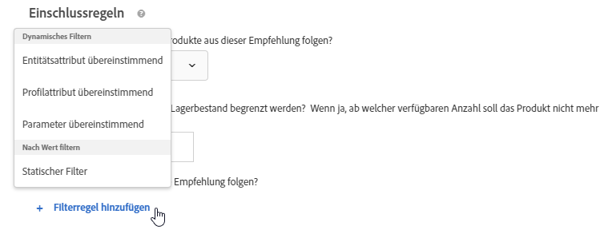
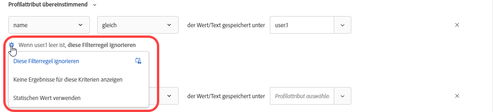
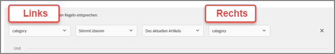

#  Verwenden dynamischer und statischer Einschlussregeln

Informationen zum Erstellen von Einschlussregeln für Kriterien und Promotions in [!DNL Adobe Target] und zum Hinzufügen dynamischer oder statischer Filterregeln, um bessere Ergebnisse für Ihre Empfehlungen zu erzielen.

Der Prozess zum Erstellen und Verwenden von Einschlussregeln für Kriterien und Promotions ist ähnlich, genauso wie die Anwendungsfälle und Beispiele. In diesem Abschnitt werden sowohl Kriterien als auch Promotions und die Verwendung von Inklusionsregeln behandelt.

## Hinzufügen von Filterregeln zu Kriterien {#section_CD0D74B8D3BE4A75A78C36CF24A8C57F}

Klicken Sie beim [Erstellen von Kriterien](/help/c-recommendations/c-algorithms/create-new-algorithm.md#task_8A9CB465F28D44899F69F38AD27352FE) auf **[!UICONTROL Filterregel hinzufügen]** unter **[!UICONTROL Einschlussregeln]**.

Die verfügbaren Optionen variieren je nach vertikalem Markt und Empfehlungsschlüssel.

## Hinzufügen von Filterregeln zu Promotions   {#section_D59AFB62E2EE423086281CF5D18B1076}

Wählen Sie beim [Erstellen einer Promotion](/help/c-recommendations/t-create-recs-activity/adding-promotions.md#task_CC5BD28C364742218C1ACAF0D45E0E14) die Option **[!UICONTROL Hervorheben nach Attribut]** aus und klicken Sie dann auf **[!UICONTROL Filterregel hinzufügen]**.

## Filtertypen {#section_0125F1ED10A84C0EB45325122460EBCD}

In den folgenden Abschnitten werden die Filteroptionen für [!UICONTROL Dynamische Filter] und [!UICONTROL Nach Wert] für Kriterien und Promotions Liste:

### Dynamische Filterung

Dynamische Inklusionsregeln sind leistungsfähiger als statische Inklusionsregeln und bieten bessere Ergebnisse und Interaktionen. Beachten Sie Folgendes:

* Dynamische Inklusionsregeln liefern Empfehlungen, indem sie einem Attribut im Profil-Parameter eines Benutzers oder in einem Mbox-Aufruf entsprechen.

   Sie können beispielsweise eine Empfehlung &quot;Bevorzugte Kriterien&quot;erstellen. Aus dem Satz der zurückgegebenen Empfehlungen können Sie alle Empfehlungen (in Echtzeit) nach einem Attribut filtern, das beim Zugriff des Benutzers auf eine Seite, auf der die Empfehlungen angezeigt werden, übergeben wird.

* Verwenden Sie statische Regeln, um zu begrenzen, welche Artikel in der Empfehlung enthalten sind (anstatt Sammlungen zu verwenden).

* Sie können so viele dynamische Einschlussregeln wie nötig erstellen. Die Einschlussregeln werden mit einem Operator vom Typ „AND“ verbunden. Alle Regeln müssen erfüllt sein, damit ein Artikel in den Empfehlungen berücksichtigt wird.

Die folgenden Optionen stehen für die dynamische Filterung zur Verfügung:

| Dynamische Filteroption | Details |
| --- | --- |
| [Entitätsattributübereinstimmung](/help/c-recommendations/c-algorithms/entity-attribute-matching.md) | Sie können dynamisch filtern, indem Sie einen Pool potenzieller Empfehlungselemente mit einem bestimmten Element vergleichen, mit dem die Benutzer interagiert haben. Verwenden Sie  [!UICONTROL Entitätsattribut-] Übereinstimmung, wenn Sie Empfehlungen anzeigen möchten, die am ehesten für den Besucher geeignet sind, z. B. die Lieblingsmarke des Besuchers. |
| [Profilattributübereinstimmung](/help/c-recommendations/c-algorithms/profile-attribute-matching.md) | Sie können Elemente (Entitäten) dynamisch mit einem Wert im Profil des Benutzers vergleichen. Verwenden Sie  [!UICONTROL Profil Attribute ] Matchingings, wenn Sie Empfehlungen anzeigen möchten, die mit einem im Profil des Besuchers gespeicherten Wert übereinstimmen, z. B. Größe oder Lieblingsmarke. |
| [Parameterübereinstimmung](/help/c-recommendations/c-algorithms/parameter-matching.md) | Dynamisches Filtern durch Vergleich von Elementen (Entitäten) mit einem Wert in der Anforderung (API oder mbox). Verwenden Sie  [!UICONTROL Parameter ] Matchinging, um Inhalte zu empfehlen, die mit den Seitenparametern oder den Parametern des Besuchers übereinstimmen, z. B. Geräteabmessungen oder Geo-Position. |

### Nach Wert filtern

Die folgende Option ist zum Filtern nach Wert verfügbar:

| Filtern nach Wert, Option | Details |
| --- | --- |
| [Statischer Filter](/help/c-recommendations/c-algorithms/static-value.md) | Geben Sie manuell einen oder mehrere statische Werte zum Filtern ein. |

## Verfügbare Operatoren {#operators}

Dynamische Kriterien und Promotions sind viel leistungsfähiger als statische Kriterien und Promotions und liefern bessere Ergebnisse und Interaktionen.

Die folgenden Beispiele bieten allgemeine Ideen, wie Sie dynamische Promotions und Ausschlüsse in Ihren Marketingbemühungen verwenden können:

| Operator | Beispiele |
| --- | --- |
| Entspricht (Verfügbar mit Entitäts-Attributübereinstimmung, Profil-Attributübereinstimmung, Parameterübereinstimmung und statischem Filter.) | Wenn ein Besucher einen Artikel auf Ihrer Website (z. B. ein Produkt, einen Artikel oder Film) anzeigt, können Sie mit dem Operator &quot;Gleich&quot;in dynamischen Promotions andere Artikel bewerben aus:<ul><li>Dieselbe Marke</li><li>Die gleiche Kategorie</li><li>Die gleiche Kategorie UND von der Hausmarke</li><li>Derselbe Store</li></ul> |
| Ist nicht gleich (verfügbar mit Entitätsattributübereinstimmung, Profil-Attributübereinstimmung, Parameterübereinstimmung und statischem Filter.) | Wenn ein Besucher einen Artikel auf Ihrer Website (z. B. ein Produkt, einen Artikel oder einen Film) anzeigt, können Sie mit dem Operator &quot;ist nicht gleich&quot;in dynamischen Promotions andere Artikel bewerben aus:<ul><li>Eine andere Fernsehserie</li><li>Ein anderes Genre</li><li>Eine andere Produktreihe</li><li>Eine andere Stil-ID</li></ul> |
| Enthält Unterzeichenfolge (Verfügbar mit Entitäts-Attributübereinstimmung, Profil-Attributübereinstimmung, Parameterübereinstimmung und statischem Filter.) | Wenn ein Besucher einen Artikel auf Ihrer Website (z. B. ein Produkt) anzeigt, können Sie mit dem Operator &quot;contains substring&quot;andere Artikel bewerben, die:<ul><li></li></ul> |  |
| Enthält keine Unterzeichenfolge (Verfügbar mit Entitätsattribut-Übereinstimmung, Profil-Attributübereinstimmung, Parameterübereinstimmung und statischem Filter.) | Mit dem Operator &quot;enthält keine Unterzeichenfolge&quot;können Sie andere Artikel, die Folgendes bewirken, fördern, wenn ein Besucher ein Element auf Ihrer Website anzeigt (z. B. ein Produkt):<ul><li></li></ul> |
| Beginn mit (verfügbar mit Entitätsattributübereinstimmung, Profil-Attributübereinstimmung, Parameterübereinstimmung und statischem Filter.) | Wenn ein Besucher einen Artikel auf Ihrer Website (z. B. ein Produkt) anzeigt, können Sie mit dem Operator &quot;Beginn mit&quot;andere Artikel bewerben, die:<ul><li></li></ul> |
| Endet mit (verfügbar mit Entitätsattributübereinstimmung, Profil-Attributübereinstimmung, Parameterübereinstimmung und statischem Filter.) | Wenn ein Besucher einen Artikel auf Ihrer Website (z. B. ein Produkt) anzeigt, können Sie mit dem Operator &quot;endet mit&quot;andere Artikel bewerben, die:<ul><li></li></ul> |
| ist größer oder gleich (verfügbar mit Entitätsattributübereinstimmung, Profil-Attributübereinstimmung, Parameterübereinstimmung und statischem Filter.) | Wenn ein Besucher einen Artikel auf Ihrer Website (z. B. ein Produkt) anzeigt, können Sie mit dem Operator &quot;ist größer oder gleich&quot;andere Artikel bewerben, die:<ul><li>Kosten gleich oder teurer</li></ul> |
| kleiner oder gleich (verfügbar mit Entitätsattributübereinstimmung, Profil-Attributübereinstimmung, Parameterübereinstimmung und statischem Filter.) | Wenn ein Besucher einen Artikel auf Ihrer Website (z. B. ein Produkt) anzeigt, können Sie mit dem Operator &quot;ist kleiner oder gleich&quot;andere Artikel bewerben, die:<ul><li>Kosten gleich oder billiger</li><li>Kostenpflichtige Artikel ausschließen</li></ul> |
| Liegt zwischen (verfügbar mit Entitätsattributübereinstimmung, Profil-Attributübereinstimmung und Parameterübereinstimmung.) | Wenn ein Besucher einen Artikel auf Ihrer Website (z. B. ein Produkt, einen Artikel oder einen Film) mit dem Operator &quot;ist zwischen&quot;in dynamischen Promotions anzeigt, können Sie andere Artikel bewerben, die Folgendes sind:<ul><li>teurer</li><li>Weniger teuer</li><li>Kosten plus oder minus 30 %</li><li>Spätere Episoden in derselben Saison</li><li>Vorherige Bücher in einer Reihe</li></ul> |
| Ist in Liste (verfügbar mit Profil Attribute Match und Parameter Match.) | Wenn ein Besucher einen Artikel auf Ihrer Website (z. B. ein Profil, einen Artikel oder einen Film) anzeigt, können Sie mithilfe des Operators &quot;ist in der Liste enthalten&quot;bei der Attributzuordnung folgende Artikel bewerben:<ul><li>Verfügbar in der geografischen Lage des Besuchers</li></ul>**Beispiel**: Sie möchten nur Artikel empfehlen, die im geografischen Gebiet eines Besuchers verfügbar sind. Ihre Filterregel könnte wie folgt aussehen: `availableGeographies list contains an item in user.currentGeography` **Hinweis**: Bei Verwendung dieses Operators wird eine Liste auf der  [rechten ](#caveats) Seite der Regel erwartet. |
| Ist nicht in Liste (verfügbar mit Profil-Attributübereinstimmung und Parameterübereinstimmung.) | Wenn ein Besucher ein Element auf Ihrer Website (z. B. ein Profil, einen Artikel oder einen Film) anzeigt, können Sie mithilfe des Operators &quot;ist nicht in der Liste enthalten&quot;andere Elemente ausschließen, die:<ul><li>In Liste der letzten zehn Artikel, die der Besucher angezeigt hat</li></ul></ul>**Beispiel**: Sie möchten keine Artikel bewerben, die der Besucher vor Kurzem gesehen hat und an denen er kein Interesse gezeigt hat. Ihre Filterregel könnte wie folgt aussehen: `id is not contained in list user.lastViewedItems` **Hinweis**: Bei Verwendung dieses Operators wird eine Liste auf der  [rechten ](#caveats) Seite der Regel erwartet. |
| Liste enthält ein Element in (verfügbar mit Entitätsattributübereinstimmung, Profil-Attributübereinstimmung und Parameterübereinstimmung.) | Mit dem Operator &quot;Liste enthält Artikel in&quot; bei der Zuordnung von Profil-Attributen können Sie andere Artikel bewerben, die Folgendes sind:<ul><li>Verbunden mit einem der Lieblingsteams des Besuchers</li></ul>**Beispiel**: Sie möchten Spiele empfehlen, die einem der Lieblingsteams des Besuchers zugeordnet sind. Ihre Filterregel könnte wie folgt aussehen: ` teamsPlaying list contains an item in user.favoriteTeams` **Hinweis**: Bei Verwendung dieses Operators wird eine Liste auf  [beiden ](#caveats) Regelseiten erwartet. |
| Die Liste enthält kein Element in (verfügbar mit Entitätsattribut-Übereinstimmung, Profil-Attributübereinstimmung und Parameterübereinstimmung.) | Mit dem Operator &quot;Liste enthält kein Element in&quot;bei der Parameterattributzuordnung können Sie andere Elemente ausschließen, wenn ein Besucher ein Element auf Ihrer Website anzeigt (z. B. ein Produkt, einen Artikel oder einen Film):<ul><li>In einer Liste verbotener Typen enthalten</li></ul>**Beispiel**: Sie möchten Artikel ausschließen, die Erwachsenen zur Verfügung stehen, wie Tabak und Alkohol. Ihre Filterregel könnte wie folgt aussehen: `itemType is not contained in list mbox.prohibitedTypes` **Hinweis**: Bei Verwendung dieses Operators wird eine Liste auf  [beiden ](#caveats) Regelseiten erwartet. |
| Liste enthält alle Elemente in (verfügbar mit Entitätsattributübereinstimmung, Profil-Attributübereinstimmung und Parameterübereinstimmung.) | Mit dem Operator &quot;Liste enthält alle Elemente in&quot; bei der Zuordnung von Profil-Attributen können Sie andere Artikel bewerben, wenn ein Besucher einen Artikel auf Ihrer Website anzeigt (z. B. ein Posten oder Rezept):<ul><li>Eine Reihe von Fähigkeiten einschließen</li><li>Eine Reihe von erforderlichen Zutaten einschließen</li></ul>**Beispiel 1**: Angenommen, ein Besucher verfügt über eine Reihe von Fähigkeiten (Java, C++ und HTML). Die Artikel im Katalog sind Aufträge mit den erforderlichen Fähigkeiten (Java und HTML). Sie möchten sicherstellen, dass das Profil des Besuchers alle erforderlichen Fähigkeiten enthält, bevor Sie den Job dem Besucher empfehlen. Ihre Filterregel könnte wie folgt aussehen: `profile.jobSeekerSkills contains all items in entity.requiredSkills` **Beispiel 2**: Angenommen, ein Benutzer hat eine Liste mit Inhaltsstoffen aus dem Bereich des Fensters. Das Rezept hat eine Liste der erforderlichen Zutaten. Sie sollten sicherstellen, dass das Profil des Besuchers alle erforderlichen Zutaten enthält, bevor Sie dem Besucher das Rezept empfehlen. Ihre Filterregel könnte wie folgt aussehen: `profile.ingredientsInPantry contains all items in recipe.ingredientsRequired` **Hinweis**: Bei Verwendung dieses Operators wird eine Liste auf  [beiden ](#caveats) Regelseiten erwartet. |
| Die Liste enthält nicht alle Elemente in (verfügbar mit Entitätsattribut-Übereinstimmung, Profil-Attributübereinstimmung und Parameterübereinstimmung.) | Mit dem Operator &quot;Liste enthält nicht alle Elemente in&quot;bei der Zuordnung von Entitätsattributen können Sie andere Artikel bewerben, die Folgendes bewirken, wenn ein Besucher einen Artikel auf Ihrer Website anzeigt (z. B. sportliches Ereignis oder Konzert):<ul><li>Keine Gruppe von Teams einschließen</li></ul>**Beispiel**: Angenommen, ein sportliches Ereignis besteht aus zwei Teams: die Houston Astros und die Milwaukee-Brauer. Das Profil des Besuchers weist darauf hin, dass dieser Besucher keine Ansichten für diese Teams durchführen möchte. Sie möchten sicherstellen, dass Sie kein Spiel empfehlen, wenn diese Teams spielen. Ihre Filterregel könnte wie folgt aussehen: `profile.leastfavoriteTeams does not contain all items in entity.teamsPlaying` **Hinweis**: Bei Verwendung dieses Operators wird eine Liste auf  [beiden ](#caveats) Regelseiten erwartet. |

## Handhabung leerer Werte beim Filtern nach Entitäts-Attributübereinstimmung, Profil-Attributübereinstimmung und Parameterübereinstimmung {#section_7D30E04116DB47BEA6FF840A3424A4C8}

Sie können mehrere Optionen auswählen, um leere Werte beim Filtern nach [!UICONTROL Entitätsattribut-Übereinstimmung], [!UICONTROL Profil-Attributzuordnung] und [!UICONTROL Parameterzuordnung] für Ausstiegskriterien und Promotions zu verarbeiten.

Zuvor wurden bei einem leeren Wert keine Ergebnisse zurückgegeben. In der Dropdownliste „Wenn *x* leer ist“ können Sie die entsprechende Aktion auswählen, die ausgeführt werden solle, wenn die Kriterien leere Werte enthalten, wie in der folgenden Abbildung dargestellt:

Um die gewünschte Aktion auszuwählen, bewegen Sie den Mauszeiger über das Zahnradsymbol () und wählen Sie dann die gewünschte Aktion aus:

| Aktion | Verfügbar für | Details |
|--- |--- |--- |
| [!UICONTROL Diese Filterregel ignorieren] | [!UICONTROL Profil-] Attributübereinstimmung und  [!UICONTROL Parameterübereinstimmung] | Diese Aktion ist die Standardaktion für [!UICONTROL Profil-Attributzuordnung] und [!UICONTROL Parameterzuordnung]. Diese Option gibt an, dass die Regel ignoriert wird. Wenn beispielsweise drei Filterregeln vorhanden sind und die dritte Regel keine Werte übergibt, können Sie die dritte Regel mit den leeren Werten einfach ignorieren, statt gar keine Ergebnisse zurückzugeben. |
| [!UICONTROL Keine Ergebnisse für dieses Kriterium]  anzeigen (nur Kriterien) | [!UICONTROL Entitätsattributübereinstimmung],  [!UICONTROL Profil-Attributübereinstimmung] und  [!UICONTROL Parameterübereinstimmung] | Diese Aktion ist die Standardaktion für [!UICONTROL Entitätsattribut-Übereinstimmung]. Diese Aktion  [!DNL Target] behandelt leere Werte vor dem Hinzufügen dieser Option: Für dieses Kriterium werden keine Ergebnisse angezeigt. |
| [!UICONTROL Keine Artikel  bewerben (nur Promotions)] | [!UICONTROL Entitätsattributübereinstimmung],  [!UICONTROL Profil-Attributübereinstimmung] und  [!UICONTROL Parameterübereinstimmung] | Diese Aktion ist die Standardaktion für [!UICONTROL Entitätsattribut-Übereinstimmung]. Diese Aktion  [!DNL Target] behandelt leere Werte vor dem Hinzufügen dieser Option: Für dieses Kriterium werden keine Ergebnisse angezeigt. |
| [!UICONTROL Statischen Wert verwenden] | [!UICONTROL Entitätsattributübereinstimmung],  [!UICONTROL Profil-Attributübereinstimmung] und  [!UICONTROL Parameterübereinstimmung] | Wenn ein Wert leer ist, können Sie die Verwendung eines statischen Werts festlegen. |

## Einschränkungen {#caveats}

>[!IMPORTANT]
>
>Verschiedene Datentypattribute sind möglicherweise nicht mit dynamischen Kriterien oder Promotions kompatibel, während sie zur Laufzeit mit den Operatoren „ist gleich“ und „ist nicht gleich“ verwendet werden. Verwenden Sie die Werte [!UICONTROL Value], [!UICONTROL Margin], [!UICONTROL Inventory] und [!UICONTROL Umgebung] genau auf der rechten Seite, wenn die linke Seite über vordefinierte Attribute oder benutzerdefinierte Attribute verfügt.

Die folgende Tabelle enthält wirksame Regeln und Regeln, die während der Laufzeit möglicherweise nicht kompatibel sind:

| Kompatible Regeln | Potenziell inkompatible Regeln |
|--- |--- |
| value - ist zwischen - 90 % und 110 % des aktuellen Elements - salesValue | salesValue - ist zwischen - 90 % und 110 % des aktuellen Elements - value |
| value - ist zwischen - 90 % und 110 % des aktuellen Elements - value | clearancePrice - ist zwischen - 90 % und 110 % des aktuellen Elements - margin |
| margin - ist zwischen - 90 % und 110 % des aktuellen Elements - margin | storeInventory - gleich - dem aktuellen Element - inventory |
| inventory - gleich - dem aktuellen Element - inventory |  |
