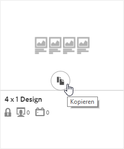
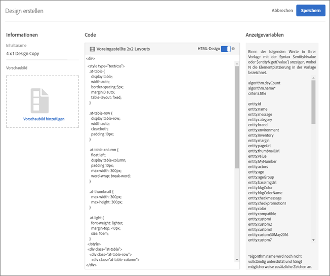
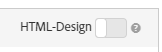

#  Erstellen eines Designs{#create-a-design}

Mit einem Entwurf wird festgelegt, wie Empfehlungen auf einer Seite dargestellt werden.

Sie können einen [!UICONTROL Recommendations]-Entwurf erstellen, indem ein Standardentwurf oder ein benutzerdefinierter Entwurf verwendet wird. Im Bildschirm **[!UICONTROL Recommendations > Entwürfe]** werden sowohl Standarddesignkarten als auch alle Entwürfe angezeigt, die in Ihrem Konto erstellt wurden.

Beachten Sie beim Arbeiten mit Entwürfen die folgenden Informationen:

* Sie können einen Empfehlungsentwurf mit einem Standardentwurf erstellen oder einen benutzerdefinierten Entwurf erstellen.
* Standardentwürfe können nicht bearbeitet oder gelöscht werden.
* Sie können einen benutzerdefinierten Entwurf bearbeiten, kopieren oder löschen.
* Um einen auf einem Standardentwurf basierenden Entwurf zu erstellen, müssen Sie zunächst den Entwurf kopieren und dann die Kopie bearbeiten.

Diese Abbildung zeigt das Standarddesign 1 x 4:


Diese Abbildung zeigt einen benutzerdefinierten Entwurf:


Sie können einen Entwurf während der Erstellung von Aktivitäten aus dem Visual Experience Composer (VEC) oder aus der Designbibliothek außerhalb der Erstellung von Aktivitäten erstellen. In den folgenden Abschnitten wird davon ausgegangen, dass Sie Entwürfe aus der Bibliothek erstellen, die Schritte sind jedoch ähnlich.

## Entwürfe erstellen

Sie können einen Entwurf auf der Grundlage eines Standardentwurfs erstellen oder einen benutzerdefinierten Entwurf erstellen.

### Entwurf auf der Grundlage eines Standardentwurfs erstellen

1. Klicken Sie auf **[!UICONTROL Recommendations]** > **[!UICONTROL Entwürfe]** , um die [!UICONTROL Designbibliothek] anzuzeigen.

   

1. Bewegen Sie den Mauszeiger über die Karte für den Entwurf, den Sie erstellen möchten, und klicken Sie dann auf das Symbol **[!UICONTROL Kopieren]** .

   

   Das Dialogfeld &quot;Entwurf [!UICONTROL erstellen] &quot;wird angezeigt.

   

1. Fügen Sie im **[!UICONTROL Informationsbedienfeld]** ein Bild für den **[!UICONTROL Inhaltsnamen]** und eine optionale Vorschau hinzu, die auf der Designkarte angezeigt werden sollen.

   When you use a default design, the design name and &quot;Copy&quot; appears in the **[!UICONTROL Content Name]** field. Sie können den Namen bearbeiten. Sie können auch ein Bild auswählen, das auf der Designkarte angezeigt werden soll.

1. (Bedingt) Bearbeiten Sie den **[!UICONTROL Code]** des Entwurfs nach Bedarf.

   Empfehlungsentwürfe verwenden die Open Source-Entwurfssprache Velocity. Informationen zu Velocity finden Sie unter [https://velocity.apache.org](https://velocity.apache.org) und in [Anpassen eines Entwurfs mit Velocity](/help/c-recommendations/c-design-overview/customizing-a-template.md).

   Der Entwurf kann ein HTML- oder ein Nicht-HTML-Entwurf sein. Standardmäßig werden HTML-Entwürfe mit einem `<div>` Tag umschlossen, um Clicktracking in einer Webumgebung zuzulassen. Nicht-HTML-Entwürfe eignen sich für Nicht-Webumgebungen, in denen ein Klick-Tracking nicht möglich ist. Schieben Sie den [!UICONTROL HTML-Design] -Umschalter an die &quot;Aus&quot;-Position, um Nicht-HTML-Code zu verwenden.

   >[!NOTE]
   >
   >Die maximale Anzahl von Entitäten, auf die in einem Entwurf verwiesen werden kann (fest codiert oder in Schleifen), beträgt 99.

1. Klicken Sie auf **[!UICONTROL Speichern]**.

### Erstellen eines benutzerdefinierten Entwurfs

1. Klicken Sie auf **[!UICONTROL Recommendations]** > **[!UICONTROL Entwürfe]** , um die [!UICONTROL Designbibliothek] anzuzeigen.

1. Klicken Sie auf Entwurf **[!UICONTROL erstellen]**.

   Wenn Sie Ihren neuen benutzerdefinierten Entwurf auf einem vorhandenen Entwurf basieren möchten, bewegen Sie den Mauszeiger über den gewünschten Entwurf und klicken Sie dann auf das Symbol &quot; [!UICONTROL Kopieren] &quot;. Anschließend können Sie die Kopie bearbeiten, um einen neuen benutzerdefinierten Entwurf zu erstellen.

1. hinzufügen eines **[!UICONTROL Inhaltsnamens]** und eines optionalen Vorschau-Bildes.

1. (Bedingt) Bearbeiten Sie den **[!UICONTROL Code]** des Entwurfs nach Bedarf.

   Weitere Informationen finden Sie unter Schritt 4.

1. Klicken Sie auf **[!UICONTROL Speichern]**.

## Bearbeiten, Kopieren oder Löschen eines Entwurfs

Beachten Sie, dass Sie einen Standardentwurf weder bearbeiten noch kopieren können. Sie können nur Standardentwürfe kopieren.

Bewegen Sie den Mauszeiger über den gewünschten Entwurf in der [!UICONTROL Design] -Bibliothek und klicken Sie dann auf das entsprechende Symbol: bearbeiten, kopieren oder löschen.


Sie können einen vorhandenen Entwurf kopieren, um einen Duplikat-Entwurf zu erstellen, den Sie dann ändern können. Auf diese Weise können Sie ein ähnliches Design mit geringerem Aufwand erstellen.

Beachten Sie, dass Entwürfe für das gesamte Konto verfügbar sind. Achten Sie darauf, dies zu berücksichtigen, bevor Sie einen Entwurf löschen. Gelöschte Entwürfe können nicht wiederhergestellt werden.

## JSON-Beispiel {#section_75BFB2537CFF4FBD9B560F59EB32C8DD}

Das folgende Beispiel zeigt, wie JSON-Antworten zurückgegeben werden können, wenn eine Aktivität über den formularbasierten Editor konfiguriert wird.

1. Erstellen Sie einen Entwurf aus der Designbibliothek oder im formularbasierten Workflow. Wenn Sie dies innerhalb des Visual Experience Composer (VEC)-Arbeitsablaufs versuchen, können Sie nichts anderes als ein HTML-Design erstellen, das umschlossen ist von einem  `<div>` für das Klick-Tracking.

1. Achten Sie darauf, dass die Option „HTML-Design“ ausgeschaltet ist:

   

1. Der folgende Code ist ein Beispiel dafür, was Sie in Ihren Entwurf einfügen können:

   ```javascript
       #* 
       * "Return a simple list of recommended entity ids"   
       *#
   
       {   
         "notes":{   
         "purpose": "Return a simple list of recommended entity ids",   
         "use-case": "Use this approach if you prefer to do a real-time lookup of entity attribute details (such as inventory, price, rating) from another system (such as a CMS, PIM or ecommerce platform)",   
         "version": "01"   
         },   
         "recommendedItems": {   
           "key": "$key.id",   
           "slot-01": "$entity1.id",   
           "slot-02": "$entity2.id",   
           "slot-03": "$entity3.id",   
           "slot-04": "$entity4.id",   
           "slot-05": "$entity5.id",   
           "slot-06": "$entity6.id",   
           "slot-07": "$entity7.id",   
           "slot-08": "$entity8.id",   
           "slot-09": "$entity9.id",   
           "slot-10": "$entity10.id"   
         }   
       }  
   ```

1. Set up a form-based [!DNL Recommendations] activity that uses this design.

   1. Navigate to the **[!UICONTROL Activities]** page.
   1. Klicken Sie auf **[!UICONTROL Aktivität erstellen]** > **[!UICONTROL Empfehlungen]**.
   1. Wählen Sie unter &quot;Experience Composer **[!UICONTROL auswählen]**&quot;die Option **[!UICONTROL Formular]** und klicken Sie dann auf **[!UICONTROL Weiter]**.
   1. Geben Sie unter Speicherort den Text „Sample_Recs_Response“ ein.
   1. Klicken Sie unter **[!UICONTROL Standard-Content]** auf den Pfeil nach unten und dann auf **[!UICONTROL Empfehlung hinzufügen]**.
   1. Wählen Sie einen Seitentyp aus. Das legt fest, welches Bild Sie als nächstes sehen.
   1. Wählen Sie eine Kriterienkarte aus und klicken Sie dann auf **[!UICONTROL Nächste]**.
   1. Select the design you created in the previous step, then click **[!UICONTROL Next]**.
   1. Schließen Sie den Setup-Vorgang ab.
   1. Klicken Sie auf den Pfeil neben **[!UICONTROL Inaktiv]** und wählen Sie dann **[!UICONTROL Aktivieren]**.

1. Nachdem Ihre Aktivität eingerichtet und aktiviert wurde, können Sie eine Musteranforderung einrichten, um die korrekte JSON-Antwort zurückzubekommen.

   From the time that you save your activity, [!DNL Target] will need to build a model to support the selected criteria configuration. Abhängig von einer Reihe von Faktoren kann dies einige Zeit in Anspruch nehmen. Die Ergebnisse werden angezeigt, sobald das Modell aufgebaut wurde.

   Beispiel:

   ```
   https://[YOUR_CLIENT_CODE].tt.omtrdc.net/m2/YOUR_CLIENT_CODE/ubox/raw?mbox=[YOUR_MBOX_NAME]&mboxContentType=text/html&mboxXDomain=disabled&entity.id=[ENTITY_ID]&mboxHost=rawbox_sample&at_property=[AT_PROPERTY_TOKEN]&mboxNoRedirect=true&mboxPC=1234-4321&mboxSession=9876-7000
   ```

   wo

   | Parameter | Wert |
   |--- |--- |
   | `[YOUR_CLIENT_CODE]` | Zielgruppe Client-Code (verfügbar unter /help/target/products.html#recsEinstellungen > Recommendations API-Token > Client-Code). |
   | `[YOUR_MBOX_NAME]` | Der Name, den Sie im Abschnitt &quot;Speicherorte&quot;des formularbasierten Recommendations ausgewählt haben, in diesem Fall Sample_Recs_Response. |
   | `[ENTITY_ID` | Die `entity.id` eines Artikels in Ihrem Katalog |
   | `[AT_PROPERTY_TOKEN]` | (Optional) Fügen Sie dies hinzu, wenn Sie bei der Einrichtung Ihrer Aktivität eine Eigenschaft (Teil der Unternehmensberechtigungen) ausgewählt haben. |

Nachdem Ihr Algorithmus ausgeführt wurde und Sie Ergebnisse erhalten haben, sollte Ihre Antwort ungefähr so aussehen:

{width=&quot;575px&quot;}

## Additional JSON object tips and tricks {#section_C305673C68944749969DB239E3221DC2}

Sie können auch einfach eine durch Kommas getrennte Liste von Elementen zurücksenden, indem Sie ein Design mit folgender Syntax erstellen:

```
entity1.id, $entity2.id, $entity3.id, $entity4.id, $entity5.id, 
```

Außerdem können Sie mit der Antwort zusätzliche Informationen senden. Die folgende Codedatei ist ein komplexeres Beispiel, das viel mehr zurücksendet als die Entity-IDs mit den zugehörigen Slots (Bestellung). This design example also returns activity details, Target Profile details (as applicable), and other `entity.attributes` associated with the items returned.

```javascript
    {   
     "adobeRecommendations": {   
      "notes": {   
       "purpose": "Return a list of entity ids with their associated entity.attributes",   
       "use-case": "Use this approach to avoid looking up attribute details after receiving a response from Target",   
       "version": "01"   
      },   
      "recommendedItems": {   
       "slot-01": "$entity1.id",   
       "slot-02": "$entity2.id",   
       "slot-03": "$entity3.id",   
       "slot-04": "$entity4.id",   
       "slot-05": "$entity5.id",   
       "slot-06": "$entity6.id",   
       "slot-07": "$entity7.id",   
       "slot-08": "$entity8.id",   
       "slot-09": "$entity9.id",   
       "slot-10": "$entity10.id"   
      },   
      "activityDetails": {   
       "mbox.name": "email-mbox",   
       "campaign.name": "\${campaign.name}",   
       "campaign.id": "\${campaign.id}",   
       "campaign.recipe.name": "\${campaign.recipe.name}",   
       "campaign.recipe.id": "\${campaign.recipe.id}",   
       "offer.name": "\${offer.name}",   
       "offer.id": "\${offer.id}",   
       "criteria.title": "$criteria.title",   
       "algorithm.name": "$algorithm.name",   
       "algorithm.dayCount": "$algorithm.dayCount"   
      },   
      "visitorProfile": {   
       "profile.favorite-category": "\${profile.favorite-category}",   
       "profile.test": "\${profile.test}",   
       "user.endpoint.lastPurchasedEntity": "\${user.endpoint.lastPurchasedEntity}",   
       "user.endpoint.lastViewedEntity": "\${user.endpoint.lastViewedEntity}",   
       "user.endpoint.mostViewedEntity": "\${user.endpoint.mostViewedEntity}",   
       "user.endpoint.categoryAffinity": "\${user.endpoint.categoryAffinity}",   
       "profile.geolocation.city": "\${profile.geolocation.city}",   
       "profile.geolocation.dma": "\${profile.geolocation.dma}",   
       "profile.geolocation.state": "\${profile.geolocation.state}",   
       "profile.geolocation.country": "\${profile.geolocation.country}",   
       "profile.sessionCount": "\${profile.sessionCount}",   
       "profile.averageDaysBetweenVisits": "\${profile.averageDaysBetweenVisits}",   
       "profile.browserTime": "\${profile.browserTime}",   
       "user.activeActivities": "\${user.activeActivities}",   
       "user.pcId": "\${user.pcId}",   
       "user.isFirstSession": "\${user.isFirstSession}",   
       "user.isNewSession": "\${user.isNewSession}",   
       "user.header": "\${user.header}",   
       "user.parameter": "\${user.parameter}"   
      },   
      "recKey": {   
       "recKeyDetails": {   
        "id": "$key.id",   
        "name": "$key.name",   
        "category": "$key.category",   
        "pageUrl": "$key.pageUrl",   
        "thumbnailUrl": "$key.thumbnailUrl"   
       }   
      },   
      "recDetailedResults": {   
       "recEntity1Details": {   
        "id": "$entity1.id",   
        "name": "$entity1.name",   
        "category": "$entity1.category",   
        "pageUrl": "$entity1.pageUrl",   
        "thumbnailUrl": "$entity1.thumbnailUrl"   
       },   
       "recEntity2Details": {   
        "id": "$entity2.id",   
        "name": "$entity2.name",   
        "category": "$entity2.category",   
        "pageUrl": "$entity2.pageUrl",   
        "thumbnailUrl": "$entity2.thumbnailUrl"   
       },   
       "recEntity3Details": {   
        "id": "$entity3.id",   
        "name": "$entity3.name",   
        "category": "$entity3.category",   
        "pageUrl": "$entity3.pageUrl",   
        "thumbnailUrl": "$entity3.thumbnailUrl"   
       },   
       "recEntity4Details": {   
        "id": "$entity4.id",   
        "name": "$entity4.name",   
        "category": "$entity4.category",   
        "pageUrl": "$entity4.pageUrl",   
        "thumbnailUrl": "$entity4.thumbnailUrl"   
       },   
       "recEntity5Details": {   
        "id": "$entity5.id",   
        "name": "$entity5.name",   
        "category": "$entity5.category",   
        "pageUrl": "$entity5.pageUrl",   
        "thumbnailUrl": "$entity5.thumbnailUrl"   
       },   
       "recEntity6Details": {   
        "id": "$entity6.id",   
        "name": "$entity6.name",   
        "category": "$entity6.category",   
        "pageUrl": "$entity6.pageUrl",   
        "thumbnailUrl": "$entity6.thumbnailUrl"   
       },   
       "recEntity7Details": {   
        "id": "$entity7.id",   
        "name": "$entity7.name",   
        "category": "$entity7.category",   
        "pageUrl": "$entity7.pageUrl",   
        "thumbnailUrl": "$entity7.thumbnailUrl"   
       },   
       "recEntity8Details": {   
        "id": "$entity8.id",   
        "name": "$entity8.name",   
        "category": "$entity8.category",   
        "pageUrl": "$entity8.pageUrl",   
        "thumbnailUrl": "$entity8.thumbnailUrl"   
       },   
       "recEntity9Details": {   
        "id": "$entity9.id",   
        "name": "$entity9.name",   
        "category": "$entity9.category",   
        "pageUrl": "$entity9.pageUrl",   
        "thumbnailUrl": "$entity9.thumbnailUrl"   
       },   
       "recEntity10Details": {   
        "id": "$entity10.id",   
        "name": "$entity10.name",   
        "category": "$entity10.category",   
        "pageUrl": "$entity10.pageUrl",   
        "thumbnailUrl": "$entity10.thumbnailUrl"   
       }   
      }   
     }   
    }  
```

## Training video: Create custom designs in Recommendations (3:20) 

Dieses Video enthält die folgenden Informationen:

* Erstellen eines benutzerdefinierten Entwurfs
* Informationen zur Referenzierung von Anzeigevariablen in Entwürfen

>[!VIDEO](https://video.tv.adobe.com/v/27687)
