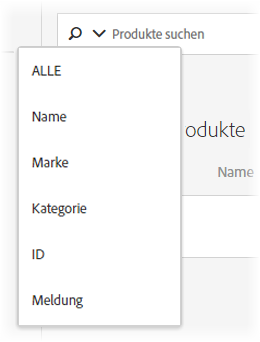

#  Katalogsuche {#catalog-search}

Auf der Seite [!UICONTROL Katalogsuche] können Sie die Produkte oder Inhalte in Ihrem Katalog suchen.

Kataloge beziehen sich auf den gesamten Produktsatz (Entitäten). Ihr Katalog kann viele Sammlungen enthalten - eine Möglichkeit, Ihre Produkte in logischen Behältern zu organisieren.

Um die Seite [!UICONTROL Katalogsuche] aufzurufen, klicken Sie auf **[!UICONTROL Recommendations]** > **[!UICONTROL Katalogsuche]**.

Die grundlegendste Aufgabe, die Sie auf dieser Seite ausführen können, ist die Suche nach einem Element. Darüber hinaus können Sie die Umgebung ändern. Suchergebnisse in Sammlungen oder Ausschlüssen speichern; Hinzufügen, Entfernen oder Neuanordnen von Tabellenspalten und Hinzufügen neuer Suchfacetten zum Bedienfeld [!UICONTROL Filter].

## Nach einem Element suchen

Sie können eine einfache oder eine erweiterte Suche verwenden, um Elemente in Ihrem Katalog zu finden.

### Durchführen einer einfachen Suche

1. Geben Sie einen Suchbegriff in das Feld **[!UICONTROL Produkte suchen]** ein.

1. (Optional) Sie können die Suche verfeinern, indem Sie eine Suchoption aus dem Menü &quot;Optionen&quot;auswählen, das angezeigt wird, wenn Sie im Suchfeld auf den Pfeil nach unten klicken.

   

   Zu den Suchoptionen zählen:

   * ALLE - Durchsucht alle anderen Suchkriterien mithilfe der OR-Logik.
   * Name
   * Marke
   * Kategorie
   * ID
   * Nachricht

1. Sie können nun durch die Elemente in den Suchergebnissen blättern, um Miniaturansichten und andere Produktinformationen zur Ansicht anzuzeigen.

   Die folgende Abbildung zeigt die Ergebnisse für &quot;bike&quot; mit der Option Alle.

   

   Die neben „Produkte“ angezeigte Nummer ist die Anzahl der Produkte, die von den insgesamt in der angegebenen Umgebung verfügbaren Produkten dem Suchbegriff entsprechen.

   Beachten Sie, dass Sie die Funktion für die automatische Vervollständigung der Suche verwenden können. In der folgenden Abbildung werden bei Eingabe von &quot;bik&quot;alle Produkte zurückgegeben, die das Wort &quot;bike&quot;enthalten.

   

   >[!NOTE]
   >
   >Wenn Sie eine Katalogsuche für ein benutzerdefiniertes Attribut mit einem numerischen Wert durchführen, wird das benutzerdefinierte Attribut als String-Typ und nicht als numerischer Wert betrachtet.
   >
   >Derzeit gibt es keine Funktion, mit der Kunden den Attributtyp ändern können. Um eine Änderung vorzunehmen, öffnen Sie ein Kundenproblem[, das auf die Attribute verweist, bei denen der Typ von der Zeichenfolge in numerisch geändert werden muss.](/help/cmp-resources-and-contact-information.md#reference_ACA3391A00EF467B87930A450050077C)

1. Sie können auch Filter verwenden, um das gewünschte Produkt zu finden. Im folgenden Beispiel werden alle Fahrradwerkzeuge in Ihrem Katalog angezeigt, indem Sie die Facette [!UICONTROL Kollektionen] erweitern und &quot;Fahrradwerkzeuge&quot;auswählen.

   

1. Sie können in der Liste der Ergebnisse weiter suchen, indem Sie einen Suchbegriff eingeben, z. B. &quot;Kette&quot;.

   

### Durchführen einer erweiterten Suche {#advanced-search}

Sie können [!UICONTROL Erweiterte Suche] verwenden, um Ihre Suchergebnisse weiter zu verfeinern oder Ihre Suchergebnisse als [Sammlung](/help/c-recommendations/c-products/collections.md) oder [Ausschluss](/help/c-recommendations/c-products/exclusions.md) zu speichern.

1. Klicken Sie auf den Link **[!UICONTROL Erweiterte Suche]**.

   

1. Verwenden Sie die Dropdown-Listen, um den Parameter, den Operator und die Werte für die Suche anzugeben.

1. (Optional) Klicken Sie auf **[!UICONTROL Hinzufügen Regel]**, um eine zusätzliche Suchregel hinzuzufügen.

   Jede zusätzliche Suchregel wird mit dem UND-Operator verknüpft.

1. Klicken Sie auf **[!UICONTROL Suchen]**.

1. (Optional) Klicken Sie auf **[!UICONTROL Speichern unter]** und dann auf **[!UICONTROL Sammlung]** oder **[!UICONTROL Ausschluss]**.

   

   Weitere Informationen finden Sie unter [Erstellen einer Sammlung oder eines Ausschlusses basierend auf der erweiterten Suche](#save-as) weiter unten.

## Ansicht der Details eines Artikels

Sie können die Details eines einzelnen Elements, einschließlich ID, Name, Nachricht, Kategorie usw., durch Ansicht der Details des jeweiligen Elements anzeigen.

1. Klicken Sie auf ein Element in den Suchergebnissen, um dessen Details Ansicht.

   

## Entfernen eines Elements aus dem Katalog

1. Klicken Sie auf ein Element in den Suchergebnissen, um dessen Details Ansicht.

1. Klicken Sie auf **[!UICONTROL Aus Katalog entfernen]**.

1. Bestätigen Sie, dass Sie das Element entfernen möchten.

Alle Informationen zu diesem Element werden aus dem Katalogindex entfernt. Das Element wird nur dann in Ihren Katalog aufgenommen, wenn es erneut in einem Datenfeed hinzugefügt wird. Ein gelöschtes Element muss getrennt von Feeds gelöscht werden.

## Katalog aktualisieren

Der Index Ihres Katalogs wird automatisch erstellt, wenn Sie den ersten Feed hochladen, und gemäß dem festgelegten Zeitplan [aktualisiert.](/help/c-recommendations/c-products/feeds.md#steps)

Der Katalog wird automatisch aktualisiert, wenn Updates über Feed-Dateien, API- oder Mbox-Updates empfangen werden. Aktualisierungen sind normalerweise in einer Stunde abgeschlossen. Wenn Aktualisierungen ausgeführt werden, wird der Zeitpunkt angezeigt, zu dem das letzte Update gestartet wurde. Wenn keine Aktualisierungen ausgeführt werden, wird der Zeitpunkt angezeigt, zu dem das letzte Update gestartet und abgeschlossen wurde.

## Erstellen einer Sammlung oder eines Ausschlusses basierend auf der erweiterten Suche  {#save-as}

Sie können [Sammlungen](/help/c-recommendations/c-products/collections.md) oder [Ausschlüsse](/help/c-recommendations/c-products/exclusions.md) mithilfe der erweiterten Suche auf der Seite „Katalogsuche“ ([!UICONTROL Empfehlungen] > [!UICONTROL Katalogsuche] > [!UICONTROL Erweiterte Suche]) erstellen.

1. Führen Sie eine [erweiterte Suche](#advanced-search) durch.

1. Klicken Sie auf **[!UICONTROL Speichern unter]** und dann auf **[!UICONTROL Sammlung]** oder **[!UICONTROL Ausschluss]**.

   

   >[!IMPORTANT]
   >
   >Die Funktion [!UICONTROL Erweiterte Suche] unterscheidet nicht zwischen Groß- und Kleinschreibung; Die zum Zeitpunkt des Versands zurückgegebenen Produkte basieren jedoch auf der Suche nach Groß- und Kleinschreibung. Diese Diskrepanz kann zu Verwirrung führen. Achten Sie darauf, dass beim Erstellen von Sammlungen oder Ausschlüssen anhand der Ergebnisse mit der Funktion [!UICONTROL Erweiterte Suche] die Groß-/Kleinschreibung beachtet wird. Wenn Sie z. B. nach „Urlaub“ suchen, werden bei der ersten Suche die Ergebnisse mit „Urlaub“ und „urlaub“ aufgelistet. Wenn Sie dann einen Katalog mit der Absicht erstellen, Produkte mit dem Zusatz „urlaub“ auszugeben, werden nur Produkte mit dem Zusatz „urlaub“ ausgegeben. Produkte, die „Urlaub“ enthalten, werden nicht angezeigt. Ausschlüsse werden in ähnlicher Weise gehandhabt.

## Umgebung ändern

[Mit ](/help/administrating-target/environments.md) Umgebungen können Sie Ihre Standorte und Umgebung vor der Produktion für einfache Verwaltung und separaten Berichte organisieren.

1. Klicken Sie auf den Link Umgebung.

   

1. Wählen Sie die gewünschte Umgebung aus.

## Seite &quot;Katalogsuche&quot;ändern (Filter und Spalten)

Sie können die verfügbaren Filter und Spalten auf der Seite [!UICONTROL Katalogsuche] für die aktuelle Sitzung vorübergehend ändern.

### Filter ändern

Sie können der Seite [!UICONTROL Katalogsuche] weitere Filterfacetten hinzufügen.

1. Klicken Sie im Bedienfeld **[!UICONTROL Filter]** auf **[!UICONTROL Ändern]**.

   

1. Wählen Sie die gewünschten Suchfelder aus (ID, Name, Nachricht usw.).

   

Beachten Sie, dass die zusätzlichen Filter-Facetten nur in der aktuellen Sitzung verfügbar sind.

### Spalten ändern

Sie können die aktiven Spalten auf der Seite [!UICONTROL Katalogsuche] vorübergehend ändern.

1. Klicken Sie auf den Link **[!UICONTROL Spalten]**.

   

1. (Bedingt) Um die Reihenfolge der aktiven Spalten neu anzuordnen, ziehen Sie die Spalten in die gewünschte Reihenfolge und legen Sie sie im Abschnitt **[!UICONTROL Aktive Spalten]** ab.

1. (Bedingt) Ziehen Sie Elemente aus dem Ordner **[!UICONTROL Aktive Spalten]** nach Bedarf in das Feld **[!UICONTROL Inaktive Spalten]** (und umgekehrt).

   Sie können auch auf das Löschen-Symbol ( x) neben der Spalte klicken, die Sie vom aktiven zum inaktiven Abschnitt verschieben möchten.

Denken Sie daran, dass alle Änderungen, die Sie vornehmen, nur für die aktuelle Sitzung gelten.

