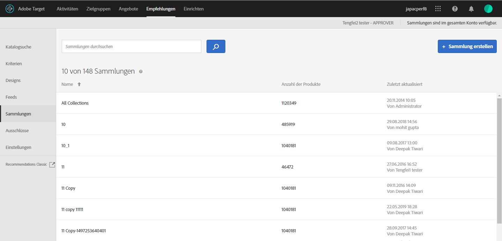

#  Sammlungen {#collections}

Eine Sammlung ist ein Satz von Produkten oder Artikeln, die für die Empfehlung infrage kommen. Eine Sammlung wird definiert, indem die Bedingungen angegeben werden, die von Elementen erfüllt werden müssen, die Teil der Sammlung sein müssen.

Im Allgemeinen ist eine Sammlung ein Satz von ähnlichen oder verwandten Artikeln, wie zum Beispiel eine Sammlung eines einzigen Produkts. Sie können jedoch alle Artikel in einer für Ihr Unternehmen sinnvollen Kategorie gruppieren, z. B. Produkte in einem bestimmten Preisbereich oder in einer bestimmten Farbe oder Artikel, die in einem bestimmten geografischen Gebiet wahrscheinlich interessant sind.

Verwenden Sie Sammlungen, um Ihre Produkte in logischen Behältern zu organisieren. Wenn zum Beispiel einige Elemente in einem Bereich, aber nicht in einem anderen verfügbar sind, können Sie eine Sammlung erstellen, die Elemente ausschließt, die im Bereich des Besuchers nicht verfügbar sind. Sie können Sammlungen auch verwenden, um Saisonartikel oder beliebige andere organisatorische Parameter, die für Ihr Geschäft relevant sind, zu organisieren.

Die für jedes Kriterium innerhalb der Empfehlung erzeugte [Reserveempfehlung](/help/c-recommendations/c-algorithms/backup-recs.md) verwendet ebenfalls die Sammlung, sodass nur Artikel aus der Sammlung in die Reserveempfehlung aufgenommen werden. Mit Sammlungen können Sie sicherstellen, dass nur Produkte an einem Ort angezeigt werden, für die dies Sinn macht.

Sammlungen werden stets neu erstellt oder aktualisiert, wenn die einzelnen Kriterien ausgeführt werden.

Sie können Ihre Artikel in Katalogen gruppieren und dann separate Empfehlungen für jede Sammlung erstellen.

Inklusionskriterien ermöglichen Ihnen etwas Ähnliches wie eine Sammlung, sie müssen jedoch jedes Mal eingerichtet werden, wenn Sie eine Aktivität erstellen. Sammlungen ermöglichen Ihnen, einen Satz von Artikeln auf einmal zu erstellen und diesen dann zu jeder passenden Gelegenheit zu verwenden, ohne dass Sie diesen erneut einrichten müssen.

Wenn Sie eine [!DNL Recommendations]-Aktivität erstellen oder bearbeiten, erscheint der Sammlungsname neben der Bezeichnung [!UICONTROL Kriterien] auf dem Aktivitätendiagramm.

>[!NOTE]
>
>Sammlungen werden nicht angewendet, wenn der Empfehlungsschlüssel [!UICONTROL Zuletzt aufgerufene Artikel] verwendet wird.

## Sammlung erstellen {#task_1256DFF6842141FCAADD9E1428EF7F08}

Erstellen Sie eine Sammlung, um die Produkte oder Inhalte zu organisieren, die Sie in Ihren Empfehlungen anzeigen möchten.

1. Klicken Sie auf **[!UICONTROL Recommendations]** > **[!UICONTROL Sammlungen]**, um die Liste vorhandener Sammlungen anzuzeigen.

   

   Auf der Seite &quot; [!UICONTROL Sammlungen] &quot;wird eine Liste der vorhandenen Sammlungen angezeigt. Neue Sammlungen erstellen Sie, indem Sie auf die Schaltfläche &quot;Sammlung [!UICONTROL erstellen&quot;klicken] . Sie können vorhandene Sammlungen auch bearbeiten, kopieren und löschen, indem Sie den Mauszeiger über die gewünschte Sammlung bewegen und auf das gewünschte Symbol klicken.

   

   Die für jede Sammlung in der [!UICONTROL Sammlungslistenansicht] gemeldete „Anzahl an Elementen“ ist die Anzahl der Produkte, die mit den Regeln für diese Sammlung in der konfigurierten Standard-Umgebungs-[Hostgruppe](/help/administrating-target/hosts.md) (Umgebung) übereinstimmen. Siehe [Einstellungen](../../c-recommendations/plan-implement.md#concept_C1E1E2351413468692D6C21145EF0B84) zum Ändern der Standardhostgruppe.

1. Klicken Sie auf **[!UICONTROL Sammlung erstellen]**.

1. (Bedingt) Wählen Sie eine Umgebung aus dem **[!UICONTROL Umgebungs-]** Filter, während Sie eine Sammlung erstellen (oder aktualisieren), um eine Vorschau der Inhalte der Sammlung in dieser Umgebung anzuzeigen. Standardmäßig werden Ergebnisse aus der Standardhostgruppe angezeigt.

   

1. Geben Sie einen **[!UICONTROL Namen]** für die Sammlung ein.

   Sie können je nach Wunsch auch eine **[!UICONTROL Beschreibung eingeben]**.

1. Legen Sie die Regeln fest, die für den Aufbau der Sammlung verwendet werden.

   Ihre Sammlung kann beispielsweise auf einer Produkt-ID oder Kategorie, Marge oder einem anderen Parameter in der Liste basieren.

   Sie können Regeln hinzufügen, um eine Sammlung durch mehrere Parameter zu definieren. Mehrere Regeln werden mit einem UND-Operator verknüpft. Alle angegebenen Regeln müssen eingehalten werden, damit die Sammlung angewendet wird.

1. Klicken Sie auf **[!UICONTROL Speichern]**.

## Erstellen einer Sammlung mit der erweiterten Suche

Sie können Sammlungen auch über „Erweiterte Suche“ auf der Seite [Katalogsuche](/help/c-recommendations/c-products/catalog-search.md#save-as) erstellen ([!UICONTROL Empfehlungen] > [!UICONTROL Katalogsuche] > [!UICONTROL Erweiterte Suche]).

Nachdem Sie eine Suche mit &quot;id > contains&quot; erstellt haben, können Sie z. B. auf [!UICONTROL Speichern unter] > [!UICONTROL Sammlung] klicken.

>[!IMPORTANT]
>
>Bei der Funktion „Erweiterte Suche“ wird nicht zwischen Groß- und Kleinschreibung unterschieden. Die zum Zeitpunkt der Auslieferung zurückgegebenen Produkte basieren jedoch auf der Suche mit Unterscheidung zwischen Groß- und Kleinschreibung. Diese Diskrepanz kann zu Verwirrung führen. Achten Sie darauf, die Groß- und Kleinschreibung zu berücksichtigen, wenn Sie Kollektionen auf der Grundlage von Ergebnissen mithilfe der erweiterten Suche erstellen. Wenn Sie z. B. nach „Urlaub“ suchen, werden bei der ersten Suche die Ergebnisse mit „Urlaub“ und „urlaub“ aufgelistet. Wenn Sie dann einen Katalog mit der Absicht erstellen, Produkte mit dem Zusatz „urlaub“ auszugeben, werden nur Produkte mit dem Zusatz „urlaub“ ausgegeben. Produkte, die „Urlaub“ enthalten, werden nicht angezeigt.

## Bearbeiten, Kopieren oder Löschen einer Sammlung

Bewegen Sie den Mauszeiger über die gewünschte Sammlung in der Liste und klicken Sie dann auf das entsprechende Symbol: bearbeiten, kopieren oder löschen.

Sie können eine vorhandene Sammlung kopieren, um eine Duplikat-Sammlung zu erstellen, die Sie dann ändern können. Auf diese Weise können Sie einen ähnlichen Ausschluss mit geringerem Aufwand erstellen.

Beachten Sie, dass Sammlungen für das gesamte Konto verfügbar sind. Achten Sie darauf, dies zu berücksichtigen, bevor Sie eine Sammlung löschen. Gelöschte Sammlungen können nicht wiederhergestellt werden.

## Verwenden einer Sammlung in einer Recommendations-Aktivität

1. Erstellen Sie eine Sammlung mit einer der oben genannten Methoden.

1. Klicken Sie auf **[!UICONTROL Aktivitäten]** und [erstellen Sie eine neue Recommendations](/help/c-recommendations/t-create-recs-activity/create-recs-activity.md) -Aktivität oder bearbeiten Sie eine vorhandene Aktivität.

1. Nachdem Sie ein Kriterium und einen Entwurf ausgewählt haben, wird die Seite &quot; [!UICONTROL Optionen] &quot;angezeigt, auf der Sie die gewünschte Sammlung auswählen.

   

1. (Bedingt) Wenn Sie eine vorhandene Sammlungseinstellung ändern möchten, klicken Sie auf der Seite &quot; **[!UICONTROL Erlebnisse]** &quot;(Schritt 2 des geleiteten dreiteiligen Workflows) auf den Ort, an dem Sie Empfehlungen platziert haben, und klicken Sie auf Sammlung **[!UICONTROL ändern]**, und wählen Sie dann die gewünschte Sammlung aus.

   

## Training video: Create collections and exclusions in Recommendations (7:05) 

Dieses Video enthält die folgenden Informationen:

* Eine Sammlung erstellen
* Einen Ausschluss erstellen

>[!VIDEO](https://video.tv.adobe.com/v/27689)