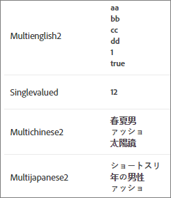

#  Personalisierte Entitätsattribute

Verwenden Sie in [!DNL Adobe Target Recommendations] benutzerdefinierte Entitätsattribute mit einzelnen und mehreren Werten, um zusätzliche Informationen zu Artikeln in Ihrem Katalog zu definieren.

## Beschränkungen {#limits}

Sie können bis zu 100 benutzerdefinierte Entitätsattribute festlegen, um weitere Informationen zu Artikeln in Ihrem Katalog bereitzustellen. Möglicherweise möchten Sie ein benutzerdefiniertes Attribut mit dem Namen `entity.genre` erstellen, um damit ein Buch oder einen Film zu kategorisieren. Alternativ kann ein Ticketverkäufer Attribute zum Veranstaltungsort einrichten, um über einen zusätzlichen Auftritt, z. B. ein weiteres Team, das bei einer Sportveranstaltung mitwirkt, oder die Vorgruppe bei einem Konzert, zu informieren.

Die maximale Länge von benutzerdefinierten Attributen für Einzelwert-Entitäten beträgt 15.000 Zeichen (für 1- und 2-Byte-UTF-8-kodierte Sprachen wie Englisch und andere lateinische Skriptbuchstaben) oder 10.000 Zeichen (für 3-Byte-UTF-8-kodierte Sprachen wie Chinesisch, Japanisch und Koreanisch).

Benutzerdefinierte Attribute mit mehreren Werten dürfen maximal 500 Werte enthalten. Jeder einzelne Wert ist auf 100 Zeichen begrenzt. Die Gesamtanzahl der Zeichen für alle Werte muss den Beschränkungen für die maximale Länge von benutzerdefinierten Attributen für Einzelwertentitäten entsprechen (siehe oben).

## Benutzerdefinierte Entitätsattributwerte {#section_313331A9F8194A89B5EDD89363018651}

Benutzerdefinierte Entitätsattribute können einen oder mehrere Werte umfassen. Die Werte der Entitätsattribute werden in der Produktansicht dargestellt.



Ein benutzerdefinierter Entitätswert mit einem einzelnen Wert ist genauso aufgebaut wie ein vordefiniertes Entitätsattribut mit nur einem Wert:

`entity.genre=genre1`

Ein benutzerdefiniertes Entitätsattribut mit mehreren Werten muss als gültiges JSON-Array festgelegt werden:

`entity.genre=[“genre1”, “genre2”]`

Beispiele für gültige JSON-Arrays, die von [!DNL Recommendations] unterstützt werden:

* `["AB","BC"]` alle Werte sind Zeichenfolgen
* `[1,2]` alle Werte sind numerisch

>[!NOTE]
>
>[!DNL Recommendations] unterstützt keine gemischten Werttypen in Attributen mit mehreren Werten `["AB",1,true, [1,2,3]]` ist beispielsweise ein gültiges JSON-Array, wird jedoch [!DNL Recommendations] nicht unterstützt, da es gemischte Werttypen enthält (Zeichenfolge, numerisch, boolesches Objekt, Objekt)

Wurde ein benutzerdefiniertes Attribut als gültiges JSON-Array übermittelt, wird das Attribut für alle Produkte im Katalog als Attribut mit mehreren Werten behandelt.

>[!NOTE]
>
>Um ein Attribut aus mehreren Werten zu einem einzelnen Wert zu ändern, müssen Sie Ihren Katalog löschen und die Produktdaten hochladen. Wird der Katalog gelöscht, bleiben die historischen Daten Ihrer Produkt-IDs jedoch erhalten. Weitere Informationen finden Sie unter [Löschen aller Artikel aus dem System](/help/assets/adobe-recommendations-classic.pdf) in der Dokumentation von *Adobe Recommendations Classic*.

**Einschränkungen**:

* Sie können keine voreingestellten Entitätsattributnamen für benutzerdefinierte Entitätsattribute verwenden. (Siehe [Entitätsattribute](/help/c-recommendations/c-products/entity-attributes.md#reference_3BCC1383FB3F44F4A2120BB36270387F).)
* Das Attribut `entity.environment` ist vom System reserviert und kann nicht für benutzerdefinierte Entitätsattribute verwendet werden. Versuche, `entity.environment` mit `targetPageParams`, Feeds oder APIs zu übermitteln, werden ignoriert.
* Arrays müssen einen einzigen Werttyp enthalten. Arrays mit gemischten Werten (`["AB",1,true]`) werden nicht unterstützt.
* Ein Attribut mit mehreren Werten, das ein verschachteltes JSON-Array (`[10,12,[1,2,3]]`) enthält, wird als Attribut mit einem Wert behandelt.

## Implementieren von Attributen mit mehreren Werten {#section_80FEFE49E8AF415D99B739AA3CBA2A14}

Benutzerdefinierte Entitätsattribute mit mehreren Werten werden unterstützt, wenn Feeds (CSV), `targetPageParams` und die Bereitstellungs-API zum Hochladen von Produkten verwendet werden. Alte Werte werden durch neue Werte ersetzt, nicht ergänzt. Leere Arrays ([]) werden wie Arrays ohne Werte behandelt.

Doppelte Anführungszeichen müssen mit Escapezeichen angegeben werden. Zum Beispiel ist `"[""test"", ""value""]"` ein gültiges JSON-Array, das in CSV verwendet werden kann.

Sie können bis zu 500 Werte in einem Attribut mit mehreren Werten einbeziehen.

### Verwenden von targetPageParams

Das folgende Beispiel zeigt, wie Sie Folgendes verwenden:   `targetPageParams`

```javascript
function targetPageParams() { 
  return { 
    'entity.id':                   '123', 
    'entity.categoryId':            '["A", "A:B", "A:B:C", "A:B:C:D"]',        
    'entity.MultiValueAttribute':   '["X", "Y", "Z"]', 
    'entity.event.detailsOnly':     'true', 
    'excludedIds":                  '[123, 3232, 2323, 4344]', 
    'orderId":                      '123456', 
    'orderTotal":                   '195.32', 
    'productPurchaseId":            '[001,002,003]' 
  }; 
}
```

### Verwenden von CSV-Dateien

Sie können Ihre CSV-Dateien im Rohformat verwalten, indem Sie einen Texteditor verwenden oder stattdessen mit einem Tabellenkalkulationsprogramm arbeiten.

Eine CSV-Datei im Rohformat sieht wie folgt aus:


Der gleiche Katalog sieht im Tabellenformat so aus:


Wird eine Tabelle in das .csv-Format konvertiert, werden vom Programm automatisch doppelte Anführungzeichen um Zelleninhalte gelegt, damit Kommata in den Zellenwerten nicht als Spaltentrennzeichen interpretiert werden. Außerdem werden doppelte Anführungszeichen um JSON-Zeichenfolgenwerte gelegt, die in benutzerdefinierten Attributen mit mehreren Werten enthalten sind. Die Arbeit mit der Rohdatei erschwert sich hierdurch etwas. Beispiel:

* Tabelle: `["1","2","3"]`
* Rohformat: `"[""1"",""2"",""3""]"`

Gehen Sie bei der direkten Bearbeitung einer CSV-Katalogdatei im Rohformat vorsichtig vor.

### Verwenden von APIs

Sie können Attribute mit mehreren Werten mithilfe der Bereitstellungs-API in einem Mbox-Parameter als Zeichenfolgenwert übergeben, der ein escaptes JSON-Array enthält.

```javascript
"execute": {
    "mboxes": [
      {
        "index": 0,
        "name": "first-mbox",
        "parameters": {
          "entity.id": "32323",
          "entity.categoryId": "My Category",
          "entity.MultiValueAttribute": "[\"X\", \"Y\", \"Z\"]"
        }
      }
    ]
  }
```

Informationen zur Verwendung der APIs für die Bereitstellung und Speicherung von Entitäten finden Sie in der [Adobe Recommendations API-Dokumentation](https://developers.adobetarget.com/api/recommendations) .

## Verwenden von Operatoren mit Attributen mit mehreren Werten {#section_83C2288A805242D9A02EBC4F07DEE945}

Wenden Sie Operatoren nur für benutzerdefinierte Attribute mit mehreren Werten in Algorithmuseinschlussregeln, Katalogregeln und Ausschlussregeln an, lautet das Ergebnis *true* (wahr), wenn mindestens ein Wert in der Liste die Operation (Boolesches *or*) erfolgreich durchläuft.

Im folgenden Beispiel lautet die Regel:  `message contains abc`.

* 1. Fall: `entity.genre = ["ab", "bc", "de"]`. Das Ergebnis lautet „false“ (falsch), da keiner der Werte `abc`.
* 2. Fall: `entity.genre = ["abcde","de","ef"]`. Das Ergebnis lautet „true“ (wahr), da einer der Werte `abc`.

Im Falle negativer Operatoren müssen alle Attributwerte die Operation (Boolesches *and*) erfolgreich durchlaufen. Lautet der Operator beispielsweise  `notEquals`, lautet das Ergebnis *false* (falsch), wenn nur ein beliebiger Wert die Operation erfüllt.

In den folgenden Abschnitten finden Sie Informationen zum Benutzerverhalten in Algorithmuseinschlussregeln, Katalogregeln und Ausschlussregeln.

### Gleich

Entspricht ein beliebiger Attributwert dem eingegebenen Wert, lautet das Ergebnis true (wahr).

Beispiel: `genre equals abc`

* 1. Fall: `entity.genre = ["ab", "bc", "de"]`. Das Ergebnis lautet „false“ (falsch), da keiner der Werte `abc`.
* 2. Fall: `entity.genre = ["abc", "de", "ef"]`. Das Ergebnis lautet „true“ (wahr), da einer der Werte `abc`.
* 3. Fall: `entity.genre = ["abcde", "de", "ef"]`. Das Ergebnis lautet „false“ (falsch), da `abc` keinem Element in der Liste entspricht.

### Ist nicht gleich

Entspricht keiner der Attributwerte dem eingegebenen Wert, lautet das Ergebnis true (wahr).

Beispiel: `genre not equals abc`

* 1. Fall: `entity.genre = ["ab", "bc", "de"]`. Das Ergebnis lautet „true“ (wahr), da keiner der Werte `abc`.
* 2. Fall: `entity.genre = ["abc", "de", "ef"]`. Das Ergebnis lautet „false“ (falsch), da einer der Werte `abc`.
* 3. Fall: `entity.genre = ["abcde", "de", "ef"]`. Das Ergebnis lautet „true“ (wahr), da `abc` keinem Element in der Liste entspricht.

### Enthält

Enthält ein beliebiger Attributwert den eingegebenen Wert, lautet das Ergebnis true (wahr).

Beispiel: `genre contains abc`

* 1. Fall: `entity.genre = ["ab", "bc", "de"]`. Das Ergebnis lautet „false“ (falsch), da keiner der Werte `abc`.
* 2. Fall: `entity.genre = ["abcde", "de", "ef"]`. Das Ergebnis lautet „true“ (wahr), da einer der Werte `abc`.

### Enthält nicht

Enthält keiner der Attributwerte den eingegebenen Wert, lautet das Ergebnis true (wahr).

Beispiel: `genre does not contain abc`

* 1. Fall: `entity.genre = ["ab", "bc", "de"]`. Das Ergebnis lautet „true“ (wahr), da keiner der Werte `abc`.
* 2. Fall: `entity.genre = ["abcde", "de", "ef"]`. Das Ergebnis lautet „false“ (falsch), da einer der Werte`abc`.

### Beginnt mit

Beginnt ein beliebiger Attributwert mit dem eingegebenen Wert, lautet das Ergebnis true (wahr).

Beispiel: `genre starts with abc`

* 1. Fall: `entity.genre = ["ab", "bc", "de"]`. Das Ergebnis lautet „false“ (falsch), da keiner der Werte mit `abc`.
* 2. Fall: `entity.genre = ["abcde", "de", "ef"]`. Das Ergebnis lautet „true“ (wahr), da einer der Werte mit `abc`.
* 3. Fall: `entity.genre = ["ab", "de", "abc"]`. Das Ergebnis lautet „true“ (wahr), da ein Wert mit `abc` beginnt (nicht notwendigerweise das erste Element in der Liste).

### Endet mit

Endet ein beliebiger Attributwert mit dem eingegebenen Wert, lautet das Ergebnis true (wahr).

Beispiel: `genre ends with abc`

* 1. Fall: `entity.genre = ["ab", "bc", "de"]`. Das Ergebnis lautet „false“ (falsch), da keiner der Werte mit `abc`.
* 2. Fall: `entity.genre = ["deabc", "de", "ef"]`. Das Ergebnis lautet „true“ (wahr), da einer der Werte mit `abc`.

### Größer als oder gleich (ausschließlich numerische Werte)

Der Attributwert wird verdoppelt. Attribute, die nicht umgewandelt werden können, werden bei Ausführung der Regel übersprungen.

Nach der Verarbeitung lautet das Ergebnis true (wahr), wenn ein beliebiger Attributwert größer als die eingegebenen Werte oder gleich den eingegebenen Werten ist.

Beispiel: `price greater than or equal to 100`

* 1. Fall: `entity.price = ["10", "20", "45"]`. Das Ergebnis lautet „false“ (falsch), da keiner der Werte größer als oder gleich 100 ist. Der Wert `de` wurde übersprungen, weil er nicht verdoppelt werden kann.
* 2. Fall: `entity.price = ["100", "101", "90", "80"]`. Das Ergebnis lautet „true“ (wahr), da zwei Werte größer als oder gleich 100 sind.

### Kleiner als oder gleich (ausschließlich numerische Werte)

Der Attributwert wird verdoppelt. Attribute, die nicht umgewandelt werden können, werden bei Ausführung der Regel übersprungen.

Nach der Verarbeitung lautet das Ergebnis true (wahr), wenn ein beliebiger Attributwert kleiner als die eingegebenen Werte oder gleich den eingegebenen Werten ist.

Beispiel: `price less than or equal to 100`

* 1. Fall: `entity.price = ["101", "200", "141"]`. Das Ergebnis lautet „false“ (falsch), da keiner der Werte kleiner als oder gleich 100 ist. Der Wert `de` wurde übersprungen, weil er nicht verdoppelt werden kann.
* 2. Fall: `entity.price = ["100", "101", "90", "80"]`. Das Ergebnis lautet „true“ (wahr), da zwei Werte kleiner als oder gleich 100 sind.

### Dynamische Übereinstimmungen (nur für artikelbasierte Algorithmen verfügbar)

Entspricht ein beliebiger Attributwert dem eingegebenen Wert, lautet das Ergebnis true (wahr).

Beispiel: `genre matches abc`

* 1. Fall: `entity.genre = ["ab", "bc", "de"]`. Das Ergebnis lautet „false“ (falsch), da keiner der Werte `abc`.
* 2. Fall: `entity.genre = ["abc", "de", "ef"]`. Das Ergebnis lautet „true“ (wahr), da einer der Werte `abc`.

### Dynamische Nichtübereinstimmung (nur für artikelbasierte Algorithmen verfügbar)

Entspricht ein beliebiger Attributwert dem eingegebenen Wert, lautet das Ergebnis false (falsch).

Beispiel: `genre does not match abc`

* 1. Fall: `entity.genre = ["ab", "bc", "de"]`. Das Ergebnis lautet „true“ (wahr), da keiner der Werte `abc`.
* 2. Fall: `entity.genre = ["abc", "de", "ef"]`. Das Ergebnis lautet „false“ (falsch), da einer der Werte `abc`.

### Dynamische Bereiche (nur für artikelbasierte Algorithmen verfügbar, ausschließlich numerische Werte)

Liegt ein numerischer Attributwert innerhalb des angegebenen Bereichs, lautet das Ergebnis true (wahr).

Beispiel: `price dynamically ranges in 80% to 120% of 100`

* 1. Fall: `entity.price = ["101", "200", "125"]`. Das Ergebnis lautet „true“ (wahr), da `101` im Bereich von 80% bis 120% von 100 liegt. Der Wert `de` wurde übersprungen, weil er nicht verdoppelt werden kann.
* 2. Fall: `entity.price = ["130", "191", "60", "75"]`. Das Ergebnis lautet „false“ (falsch), da keiner der Werte im Bereich zwischen 80 und 120 % von 100 liegt.

>[!NOTE]
>
>*Double* ist ein Java-Datentyp. Bei Operatoren, für die numerische Werte erforderlich sind, werden bei der Verdoppelung alle Werte aus der Ergebnisberechnung ausgeschlossen, die nicht numerisch sind.

## Attribute mit mehreren Werten in Entwürfen {#section_F672E4F6E1D44B3196B7ADE89334ED4A}

Attribute mit mehreren Werten werden als kommagetrennte Liste angezeigt, wenn in einem Entwurf auf sie verwiesen wird.

Beispiel:

Wenn auf `entity.genre=["genre1","genre2"]` in einem Entwurf als `$entity<N>.genre` verwiesen wird, lautet das Ergebnis `genre1, genre2`.

## Verwandte Themen:

* [Entitätsattribute](/help/c-recommendations/c-products/entity-attributes.md#reference_3BCC1383FB3F44F4A2120BB36270387F)
