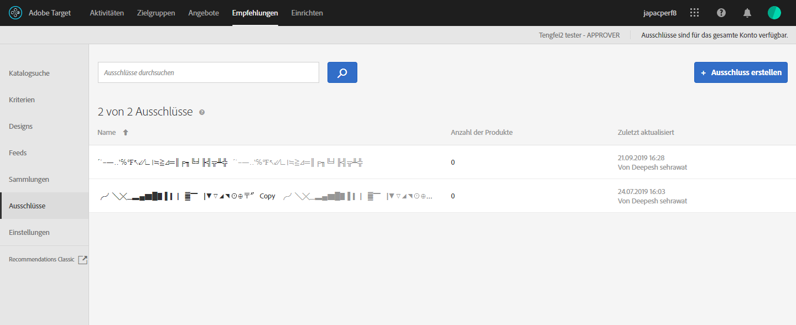

# Ausnahmen{#exclusions}

Erstellen Sie einen Ausschluss in [!DNL Adobe Target Recommendations], um zu verhindern, dass Produkte oder Inhalte für Besucher empfohlen werden. Ein Ausschluss ist eine Untergruppe von Produkten oder Inhalten, die den Besuchern nicht empfohlen werden sollten.

Ausnahmen sind für das gesamte Konto verfügbar. Im Gegensatz zu Sammlungen, bei denen Sie für jedes Erlebnis eine bestimmte Aktivität angeben, während Sie eine [!UICONTROL Recommendations] erstellen, gelten die Ausnahmen für alle Aktivitäten im Konto. Es gibt keine Option, während der Erstellung der Aktivität eine Ausschlussgruppe zuzuweisen.

Einige Beispiele für die Verwendung von Ausnahmen:

* Produkte, die eingestellt wurden
* Der Herbst/Winter Katalog ist jetzt der einzige Katalog, der online verfügbar sein sollte. Artikel aus dem Sommerkatalog stehen nicht mehr zum Kauf zur Verfügung.
* Artikel, die auf den meisten Seiten/Bildschirmen nicht empfohlen werden können (Produkte für Erwachsene, NC-17-Filme usw.)
* Produkte mit unvollständigen Metadatenfeldern (fehlende Miniaturansicht, Preis oder andere wichtige Metadaten)
* Produkte, die nie empfohlen werden sollten (im System gibt es möglicherweise eine SKU für etwas, aber es ist kein Artikel, oder es ist vielleicht eine falsche SKU für das QA-Team, einen Kauf zu simulieren, ohne tatsächlich etwas zu bestellen usw.)

>[!IMPORTANT]
>
>Statische und dynamische Ausschlussregeln sind leistungsstarke Funktionen, die Ihnen beim Marketing helfen können. Ausführliche Informationen, Beispiele und Anwendungsszenarios finden Sie unter [Verwenden dynamischer und statischer Einschlussregeln](/help/c-recommendations/c-algorithms/use-dynamic-and-static-inclusion-rules.md#concept_4CB5C0FA705D4E449BD0B37B3D987F9F).

## Einen Ausschluss erstellen

1. Klicken Sie auf **[!UICONTROL Recommendations]** > **[!UICONTROL Ausschlüsse]**, um die Liste vorhandener Ausschlüsse anzuzeigen. 

   

   Die „Anzahl der Elemente“, die für jeden Ausschluss in der [!UICONTROL Ausschluss]-Listenansicht gemeldet werden, entspricht der Anzahl der Produkte, die mit den Regeln für diesen Ausschluss in der konfigurierten Standard-Umgebungs-[Hostgruppe](/help/administrating-target/hosts.md) (Umgebung) übereinstimmen. Siehe [Einstellungen](/help/c-recommendations/plan-implement.md#concept_C1E1E2351413468692D6C21145EF0B84) zum Ändern der Standardhostgruppe.

1. Klicken Sie auf **[!UICONTROL Ausschluss erstellen]**.

1. (Bedingt) Wählen Sie eine Umgebung aus dem **[!UICONTROL Umgebungsfilter]**, während Sie einen Ausschluss erstellen (oder aktualisieren), um eine Vorschau des Ausschlusses in dieser Umgebung anzuzeigen. Standardmäßig werden Ergebnisse aus der Standardhostgruppe angezeigt.

   

1. Geben Sie einen **[!UICONTROL Namen]** für den Ausschluss ein und geben Sie eine optionale Beschreibung ein.

1. Verwenden Sie den Rule Builder, um Ihre Ausnahmen zu erstellen.

   Wählen Sie aus der Regelliste einen Parameter aus, wählen Sie einen Operator und geben Sie dann einen oder mehrere Werte ein, anhand derer die Produkte identifiziert werden sollen. Trennen Sie mehrere Werte durch Kommas.

1. Klicken Sie auf **[!UICONTROL Speichern]**.

## Erstellen eines Ausschlusses mit der erweiterten Suche

Sie können auch Ausschlüsse mit [!UICONTROL Erweiterte Suche] auf der Seite [Katalogsuche](/help/c-recommendations/c-products/catalog-search.md#save-as) ( [!UICONTROL Recommendations] > [!UICONTROL Katalogsuche] > [!UICONTROL Erweiterte Suche]) erstellen.

Nachdem Sie beispielsweise eine Suche mit „id“ > „contains“ erstellt haben, können Sie auf [!UICONTROL „Speichern unter“] > [!UICONTROL „Ausschluss“] klicken.

>[!IMPORTANT]
>
>Die Funktion [!UICONTROL Erweiterte Suche] unterscheidet nicht zwischen Groß- und Kleinschreibung; Die zum Zeitpunkt des Versands zurückgegebenen Produkte basieren jedoch auf der Suche nach Groß- und Kleinschreibung. Diese Diskrepanz kann zu Verwirrung führen. Achten Sie darauf, die Groß- und Kleinschreibung zu berücksichtigen, wenn Sie Ausschlüsse auf der Grundlage von Ergebnissen mithilfe der erweiterten Suche erstellen. Wenn Sie z. B. nach „Urlaub“ suchen, werden bei der ersten Suche die Ergebnisse mit „Urlaub“ und „urlaub“ aufgelistet. Wenn Sie dann einen Ausschluss mit der Absicht erstellen, Produkte mit dem Zusatz „urlaub“ auszuschließen, werden nur Produkte mit dem Zusatz „urlaub“ ausgeschlossen. Produkte, die „Urlaub“ enthalten, werden nicht ausgeschlossen.

## Bearbeiten, Kopieren oder Löschen eines Ausschlusses

Bewegen Sie den Mauszeiger über den gewünschten Ausschluss in der Liste und klicken Sie dann auf das entsprechende Symbol: bearbeiten, kopieren oder löschen.

Sie können einen vorhandenen Ausschluss kopieren, um einen Duplikat-Ausschluss zu erstellen, den Sie dann ändern können. Auf diese Weise können Sie einen ähnlichen Ausschluss mit geringerem Aufwand erstellen.

Beachten Sie, dass Ausschlüsse für das gesamte Konto verfügbar sind. Achten Sie darauf, dies zu berücksichtigen, bevor Sie einen Ausschluss löschen. Gelöschte Ausnahmen können nicht wiederhergestellt werden.

## Schulungsvideo: Erstellen von Sammlungen und Ausschlüssen in Recommendations (7:05) 

Dieses Video enthält die folgenden Informationen:

* Eine Sammlung erstellen
* Einen Ausschluss erstellen

>[!VIDEO](https://video.tv.adobe.com/v/27689)