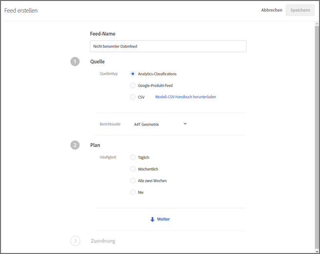
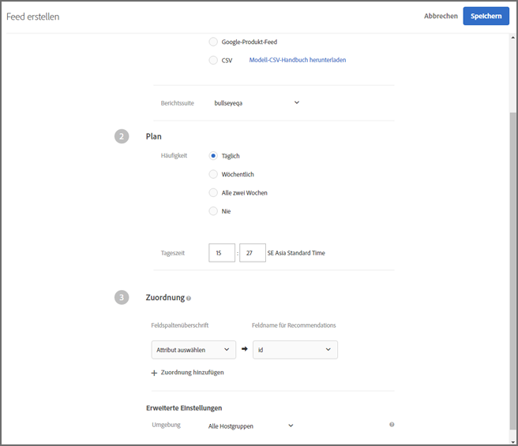

#  Feeds{#feeds}

Verwenden Sie Feeds, damit Entitäten in [!DNL Adobe Target Recommendations] importiert werden. Entitäten können mithilfe von CSV-Dateien, dem Google-Produktsuche-Feedformat und Adobe Analytics-Classifications gesendet werden.

## Feeds-Übersicht {#concept_D1E9C7347C5D4583AA69B02E79607890}

Feeds ermöglichen es Ihnen, [Entitäten](/help/c-recommendations/c-products/products.md) weiterzugeben oder Ihre Mbox-Daten mit Informationen zu ergänzen, die auf der Seite nicht verfügbar sind oder nicht sicher von der Seite gesendet werden können, wie z. B. Marge, COGS usw.

Mit Feeds können Sie detaillierte Artikelinformationen wie Produkt-ID, Kategorie, Name, Nachricht [!DNL Recommendations]und andere Attribute weiterleiten.

Sie können auswählen, welche Spalten aus Ihrer [!DNL Target]-Produkt-Classifications-Datei oder Google-Produktsuche-Datei Sie an den [!DNL Recommendations]-Server senden möchten.

Anhand dieser Daten zu jedem Element können Sie dann Folgendes tun:

* Werte in Entwürfen anzeigen
* Definieren von Regeln zur Einbeziehung von Kriterien
* Sortieren von Elementen in verschiedene Sammlungen
* Ausnahmen auf Empfehlungen anwenden

Elementbeschreibungen können [!DNL Target] mithilfe von Feeds oder Mboxes weitergeleitet werden. Wenn Daten von einem Entitäts-Feed und einer Mbox erfasst werden, haben die aktuellen Daten Priorität. In der Regel stammen die aktuellen Daten von einer mbox, da sie häufiger angezeigt wird. Für den seltenen Fall, dass die Entitäts-Feed-Daten und die Mbox-Daten gleich aktuell sind, werden die Mbox-Daten verwendet.

Die Liste [!UICONTROL Feeds] (**[!UICONTROL Recommendations]** > **[!UICONTROL Feeds]**) liefert Informationen zu den von Ihnen erstellten Feeds.


Die Feeds-Seite enthält die folgenden Spalten:

* **Name**: Der Name des beim Erstellen angegebenen Feeds. Um den Namen eines Feeds zu bearbeiten, müssen Sie den Feed bearbeiten. Wenn Sie diesen unter einem neuen Namen speichern, wird der Feed aktualisiert.
* **Typ**: Zu den Typen zählen [CSV](/help/c-recommendations/c-products/feeds.md#section_65CC1148C7DD448FB213FDF499D35FCA), [Google-Produkt-Feed](/help/c-recommendations/c-products/feeds.md#section_8EFA98B5BC064140B3F74534AA93AFFF) und [Analytics Classifications](/help/c-recommendations/c-products/feeds.md#section_79E430D2C75443BEBC9AA0916A337E0A).
* **Status**: Der aktuelle [Status des Feeds](/help/c-recommendations/c-products/feeds.md#concept_E475986720D1400999868B3DFD14A7A0).
* **Zeitplan**: Zeigt den Zeitplan für die Aktualisierung des Feeds an: täglich, wöchentlich, alle 2 Wochen oder nie.
* **Artikel**: Zeigt die Anzahl der Artikel im Feed an.
* **Zuletzt aktualisiert**: Zeigt das Datum und die Uhrzeit der letzten Aktualisierung des Feeds sowie den Namen der Person an, die den Feed aktualisiert hat. Wenn der [!UICONTROL zuletzt aktualisierte] Feed „nicht definiert“ lautet, kommt der Feed von [!DNL Recommendations Classic] und kann in [!DNL Target Premium Recommendations] nicht geändert werden.

>[!IMPORTANT]
>
>Hochgeladene Entitäten und Entitätsattribute laufen nach 61 Tagen ab. Das bedeutet:
>
>* Ihr Feed sollte mindestens monatlich ausgeführt werden, um sicherzustellen, dass Ihr Kataloginhalt nicht abläuft.
>* Wenn Sie ein Element aus Ihrer Feed-Datei entfernen, wird dieses Element nicht aus Ihrem Katalog entfernt. Um das Element aus dem Katalog zu entfernen, löschen Sie das Element manuell über die Benutzeroberfläche oder API der Zielgruppe. Sie können auch die Elementattribute (z. B. den Bestand) ändern, um sicherzustellen, dass der Artikel von der Berücksichtigung ausgeschlossen wird.


## Quelltypen

Entitäten können mithilfe von CSV-Dateien, dem Google-Produktsuche-Feedformat und Adobe Analytics-Classifications gesendet werden.

### CSV {#section_65CC1148C7DD448FB213FDF499D35FCA}

Sie können eine CSV-Datei mit dem proprietären Adobe-CSV-Upload-Format erstellen. Die Datei enthält Anzeigeinformationen über die reservierten und benutzerspezifischen Attribute für Ihre Produkte. Ersetzen Sie zum Hochladen von für Ihre Implementierung spezifischen Attributen `CustomN` in der Kopfzeile durch den Namen des gewünschten Attributs. Im folgenden Beispiel wurde `entity.Custom1` ersetzt durch: `entity.availability`. Sie können die Datei anschließend per Massenvorgang auf den [!DNL Recommendations]-Server hochladen.

Die Verwendung des CSV-Formats bietet die folgenden Vorteile im Vergleich zum Google-Feed-Format:

* Es sind keine Feldzuordnungen erforderlich.
* Das Format unterstützt Attribute mit mehreren Werten (siehe das Beispiel unten).
* Es unterstützt bis zu 100 benutzerspezifische Attribute. Wenn Sie mehr als 100 benutzerspezifische Attribute benötigen, können Sie eine zweite Feed-Datei erstellen, in dem ein anderer Satz an benutzerspezifischen Attributen angegeben wird.

Senden Sie per Massen-Upload Anzeigeinformationen, wenn keine Mboxes auf Ihrer Seite vorhanden sind oder Sie Ihre Anzeigeinformationen mit Artikeln ergänzen möchten, die nicht auf Ihrer Site verfügbar sind. So können Sie z. B. Lagerbestandsinformationen versenden, die auf der Site nicht zur Verfügung stehen.

Alle mit der CSV-Datei, dem Google-Produkt-Feed oder dem Analytics Classification Feed hochgeladenen Daten überschreiben den vorhandenen Wert des Entitätsattributs in unserer Datenbank. Wenn Sie Preisinformationen über Mbox-Anfragen und anschließend andere Preiswerte in einer Datei senden, überschreiben die Werte in der Datei die mittels Mbox-Anfrage festgelegten Werte. Eine Ausnahme bildet das Entitätsattribut `categoryId`, für das Kategoriewerte bis zu einer Längenbeschränkung von 250 Zeichen angehängt statt überschrieben werden.

>[!IMPORTANT]
>
>Verwenden Sie in Ihrer CSV-Datei keine Werte in doppelten Anführungszeichen (&quot;), sofern dies nicht beabsichtigt ist. Werte in doppelten Anführungszeichen müssen mit Escape-Zeichen angegeben werden, d. h., sie müssen von einem weiteren Satz doppelter Anführungszeichen eingeschlossen werden. Doppelte Anführungszeichen ohne Escape-Zeichen verhindern das ordnungsgemäße Laden des Recommendations-Feeds.

Die folgende Syntax ist falsch:

```
"Apples "Bananas" Grapes"",
```

Die folgenden Syntax ist richtig:

```
"Apples ""Bananas"" Grapes""",
```

>[!NOTE]
>
>Sie können einen vorhandenen Wert nicht mit einem leeren Wert überschreiben. Sie müssen stattdessen einen anderen Wert übergeben, um ihn zu überschreiben. Bei Verkaufspreisen ist es eine gängige Lösung, tatsächlich „NULL“ oder eine andere Meldung zu übermitteln. Sie können dann eine Vorlagenregel verfassen, um Artikel mit diesem Wert auszuschließen.

Das Produkt ist auf der Admin-Oberfläche ungefähr zwei Stunden nach dem erfolgreichen Upload seiner Entität verfügbar.

Im Folgenden finden Sie einen Beispielcode für eine CSV-Datei:

```
## RECSRecommendations Upload File 
## RECS''## RECS'' indicates a Recommendations pre-process header. Please do not remove these lines. 
## RECS 
## RECSUse this file to upload product display information to Recommendations. Each product has its own row. Each line must contain 19 values and if not all are filled a space should be left. 
## RECSThe last 100 columns (entity.custom1 - entity.custom100) are custom. The name 'customN' can be replaced with a custom name such as 'onSale' or 'brand'. 
## RECSIf the products already exist in Recommendations then changes uploaded here will override the data in Recommendations. Any new attributes entered here will be added to the product''s entry in Recommendations. 
## RECSentity.id,entity.name,entity.categoryId,entity.message,entity.thumbnailUrl,entity.value,entity.pageUrl,entity.inventory,entity.margin,entity.last_updated_by,entity.multi_english,entity.availability,entity.tax_country,entity.tax_region,entity.tax_rate,entity.product_type,entity.item_group_id,entity.color,entity.size,entity.brand,entity.gtin 
na3456,RipCurl Watch with Titanium Dial,Watches & Sport,Cutting edge titanium with round case,https://example.com/s7/na3456_Viewer,425,https://example.com/shop/en-us/na3456_RipCurl,24,0.25,csv,"[""New"",""Web"",""Sales"",""[1,2,34,5]""]",in stock,US,CA,9.25,Shop by Category > Watches,dz1,Titanium,44mm,RipCurl,"075380 01050 5" 
na3457,RipCurl Watch with Black Dial,Watches & Sport,Cutting edge matte black with round case,https://example.com/s7/na3457_Viewer,275,https://example.com/shop/en-us/na3457_RipCurl,24,0.27,csv,"[""New"",""Web"",""Sales"",""[1,2,34,5]""]",in stock,US,CA,9.25,Shop by Category > Watches,dz1,Black,44mm,RipCurl,"075340 01060 7"
```

### Google {#section_8EFA98B5BC064140B3F74534AA93AFFF}

Der Feed-Typ Google-Produktsuche verwendet das Google-Format. Dieses Format unterscheidet sich vom proprietären csv-Upload-Format von Adobe.

Wenn Sie über einen vorhandenen Google-Produkt-Feed verfügen, können Sie diesen als Ihre Importdatei verwenden.

>[!NOTE]
>
>Es müssen nicht Google-Daten verwendet werden. [!DNL Recommendations] verwendet lediglich dasselbe Format wie Google. Sie können mit dieser Methode alle Ihre Daten hochladen und dabei die verfügbaren Planungsfunktionen nutzen. Dennoch müssen Sie die von Google festgelegten und vordefinierten Attributnamen verwenden, wenn Sie die Datei einrichten.

Die meisten Händler laden Produkte in Google hoch, sodass diese angezeigt werden, wenn ein Besucher die Google-Produktsuche verwendet. [!DNL Recommendations] berücksichtigt für Entitäts-Feeds exakt die Spezifikationen von Google. Entitäts-Feeds können an [!DNL Recommendations] im Format .xml, .txt oder .tsv gesendet werden und die [von Google definierten Attribute](https://support.google.com/merchants/answer/188494?hl=en&amp;topic=2473824&amp;ctx=topic#US) verwenden. Die Ergebnisse können auf den [Google-Shopping-Seiten](https://www.google.com/prdhp) durchsucht werden.

>[!NOTE]
>
>Die POST-Methode muss auf dem Server zugelassen sein, der den Google-Feed-Inhalt hostet.

Da Benutzer von [!DNL Recommendations] bereits .xml- oder -txt-Feeds konfigurieren, um sie per URL oder FTP an Google zu senden, akzeptieren Entitäts-Feeds diese Produktdaten und erstellen mit ihnen den Recommendations-Katalog. Geben Sie an, wo sich dieser Feed befindet, und der Recommendations-server ruft die Daten ab.

Wenn Sie die Google Produktsuche für das Hochladen von Entitäts-Feeds verwenden, müssen Sie weiterhin eine Produktseiten-Mbox auf der Seite haben, wenn Sie dort Empfehlungen anzeigen möchten oder Produktansichten für Algorithmen, die auf Ansichten basieren, verfolgen möchten.

Google Feeds unterstützen nicht mehrere Werte für ein benutzerdefiniertes Attribut.

Der Feed wird ausgeführt, wenn Sie ihn speichern und aktivieren. Er wird ausgeführt, wenn Sie ihn speichern, und danach täglich eine Stunde später.

Nachfolgend finden Sie einen Beispielcode für eine Feed-XML-Datei für die Google-Produktsuche:

```
<?xml version="1.0" encoding="UTF-8" standalone="yes"?> 
<feed xmlns="https://www.w3.org/2005/Atom" xmlns:ns2="https://base.google.com/ns/1.0" xmlns:ns3="https://base.google.com/cns/1.0"> 
    <title>Product Feed</title> 
    <link href="https://example.com"/> 
    <updated>2017-12-13T08:45:04.918-08:00</updated> 
    <author> 
        <name>Product Feed Author</name> 
    </author> 
    <id>https://example.com</id> 
    <entry> 
        <title>RipCurl Watch with Titanium Dial</title> 
        <description>Cutting edge Titanium with Round case</description> 
        <ns2:id>na3452</ns2:id> 
        <ns2:link>https://example.com/shop/en-us/na3452_RipCurl</ns2:link> 
        <ns2:availability>in stock</ns2:availability> 
        <ns2:condition>NEW</ns2:condition> 
        <ns2:google_product_category>Watches &amp; Sport</ns2:google_product_category> 
        <ns2:gtin>075380 01050 5</ns2:gtin> 
        <ns2:image_link>https://example.com/s7/na3452_Viewer</ns2:image_link> 
        <ns2:mobile_link>https://m.example.com/s7/na3452_Viewer</ns2:mobile_link> 
        <ns2:mpn>71050</ns2:mpn> 
        <ns2:price>425</ns2:price> 
        <ns2:product_review_average>5.0</ns2:product_review_average> 
        <ns2:product_review_count>30</ns2:product_review_count> 
        <ns2:product_type>Shop by Category > Watches </ns2:product_type> 
        <ns2:brand>RipCurl</ns2:brand> 
        <ns2:sale_price>375</ns2:sale_price> 
        <ns2:tax> 
          <ns2:country>US</ns2:country> 
          <ns2:region>CA</ns2:region> 
          <ns2:rate>9.25</ns2:rate> 
          <ns2:tax_ship>y</ns2:tax_ship> 
        </ns2:tax> 
        <ns2:is_bundle>N</ns2:is_bundle> 
    </entry> 
    <entry> 
        <title>RipCurl Watch with Black Dial</title> 
        <description>Cutting edge matte black with Round case</description> 
        <ns2:id>na3453</ns2:id> 
        <ns2:link>https://example.com/shop/en-us/na3453_RipCurl</ns2:link> 
        <ns2:availability>in stock</ns2:availability> 
        <ns2:condition>NEW</ns2:condition> 
        <ns2:google_product_category>Watches &amp; Sport</ns2:google_product_category> 
        <ns2:gtin>075380 013450 5</ns2:gtin> 
        <ns2:image_link>https://example.com/s7/na3453_Viewer</ns2:image_link> 
        <ns2:mobile_link>https://m.example.com/s7/na3453_Viewer</ns2:mobile_link> 
        <ns2:mpn>71050</ns2:mpn> 
        <ns2:price>275</ns2:price> 
        <ns2:product_review_average>4.8</ns2:product_review_average> 
        <ns2:product_review_count>23</ns2:product_review_count> 
        <ns2:product_type>Shop by Category > Watches </ns2:product_type> 
        <ns2:brand>RipCurl</ns2:brand> 
        <ns2:sale_price>249</ns2:sale_price> 
        <ns2:tax> 
          <ns2:country>US</ns2:country> 
          <ns2:region>CA</ns2:region> 
          <ns2:rate>9.25</ns2:rate> 
          <ns2:tax_ship>y</ns2:tax_ship> 
        </ns2:tax> 
        <ns2:is_bundle>N</ns2:is_bundle> 
    </entry> 
</feed> 
```

Nachfolgend finden Sie einen Beispielcode für eine Feed-TSV-Datei für die Google-Produktsuche:

```
id    title    description    link    price    condition    availability    image_link    tax    shipping_weight    shipping    google_product_category    product_type    item_group_id    color    size    gender    age_group    pattern    brand    gtin    mpn 
na3454    RipCurl Watch with Titanium Dial    Cutting edge titanium with round case    https://example.com/shop/en-us/na3454_RipCurl    425    new    in stock    https://example.com/s7/na3452_Viewer    US:CA:9.25:y    1.5 oz    US:::0.00 USD    Watches & Sport    Shop by Category > Watches    dz1    Black    44mm    male    adult    Solid    RipCurl    075380 01050 5    DZ1437 
na3455    RipCurl Watch with Black Dial    Cutting edge matte black with round case    https://example.com/shop/en-us/na3455_RipCurl    275    new    in stock    https://example.com/s7/na3452_Viewer    US:CA:9.25:y    1.5 oz    US:::0.00 USD    Watches & Sport    Shop by Category > Watches    dz1    Black    44mm    male    adult    Solid    RipCurl    075340 01060 7    DZ1446
```

### Analytics-Classifications {#section_79E430D2C75443BEBC9AA0916A337E0A}

Die Analytics-Classification ist die einzige für Empfehlungen verfügbare Classification. For more information about this classification file, see [About classifications](https://docs.adobe.com/content/help/en/analytics/components/classifications/c-classifications.html) in the *Analytics Components* guide. Es ist möglich, dass nicht alle für Empfehlungen benötigten Informationen in Ihrer aktuellen Implementierung verfügbar sind. Befolgen Sie dieses Benutzerhandbuch, wenn Sie Informationen zu Ihrer Classification-Datei benötigen.

>[!IMPORTANT]
>
>Before importing entity data into [!DNL Recommendations] using Analytics product classifications, be aware that this is not the preferred method.
>
> Beachten Sie die folgenden Einschränkungen:
>
>* Aktualisierungen an den Entitätsattributen umfassen eine zusätzliche Verzögerung von bis zu 24 Stunden.
>* [!DNL Target] unterstützt nur Produktklassifizierungen. Die Analytics-Produkt-SKU muss derselben Ebene wie die [!DNL Recommendations]`entity.id` von zugeordnet sein. Die benutzerspezifischen Analytics-Classifications können mit Adobe Consulting Services entwickelt werden. Wenden Sie sich an Ihren Kundenbetreuer, wenn Sie Fragen haben.


## Feed erstellen {#steps}

Erstellen Sie einen Feed, um Informationen über Ihre Produkte oder Services in [!DNL Recommendations] einzufügen.

1. Klicken Sie in der Target-Benutzeroberfläche auf **[!UICONTROL Empfehlungen]** > **[!UICONTROL Feeds]** > **[!UICONTROL Feed erstellen]**.

   

1. Geben Sie einen beschreibenden Namen für Ihren Feed an.
1. Wählen Sie einen **[!UICONTROL Quelltyp]** aus.

   * CSV
   * Google-Produkt-Feed
   * Analytics-Classifications

   Informationen zu den Feed-Typen CSV und Google-Produkt-Feed finden Sie unter [Feeds-Übersicht](../../c-recommendations/c-products/feeds.md#concept_D1E9C7347C5D4583AA69B02E79607890). You can also [download a model CSV guide](https://recspm2.experiencecloud.adobe.com/content/mac/default/target/files/EntityFileUploadTemplate.csv) to help you format the feed correctly.

1. (Situationsbedingt) Wenn Sie **[!UICONTROL CSV]** oder **[!UICONTROL Google-Produkt-Feed]** ausgewählt haben, geben Sie an, wo auf den Feed zugegriffen werden kann.

   * **FTP**: Wenn Sie „FTP“ ausgewählt haben, geben Sie die FTP-Serverdaten, die Anmeldedaten, den Dateinamen und das FTP-Verzeichnis an. Sie haben die Möglichkeit, für ein sicheres Hochladen FTP mit SSL-Verschlüsselung (FTPS) zu verwenden.

      Unterstützte FTP-Servereinstellungen:

      * FTP und FTPS müssen für die Verwendung von passivem FTP eingestellt sein.
      * Konfigurieren Sie für FTPS den Server so, dass er explizite FTPS-Verbindungen akzeptiert.
      * SFTP wird nicht unterstützt.
      * Sie können manuell einen Port angeben, an dem die Verbindung initiiert werden soll (z. B.: `ftp://ftp.yoursite.com:2121`). Wenn Sie keinen Port angeben, wird der standardmäßige FTP- oder FTPS-Port verwendet.
   * **URL**: Wenn Sie „URL“ auswählen, geben Sie die URL an.


1. (Situationsbedingt) Wenn Sie **[!UICONTROL Analytics Classifications]** ausgewählt haben, wählen Sie die Report Suite aus der Dropdownliste aus.

1. Klicken Sie auf den **[!UICONTROL Weiter]**-Pfeil, um die [!UICONTROL Planungsoptionen] anzuzeigen.

   

1. Wählen Sie eine Aktualisierungsoption aus:

   * Täglich
   * Wöchentlich
   * Alle 2 Wochen
   * Nie: keine Aktualisierung planen. Wählen Sie diese Option aus, wenn Sie nicht möchten, dass dieser Feed ausgeführt wird.

1. Geben Sie die Zeit an, zu der Ihr Feed ausgeführt werden soll.

   Diese Option basiert auf der Zeitzone, die in Ihrem Browser verwendet wird. Wenn Sie einen Zeitpunkt in einer anderen Zeitzone verwenden möchten, müssen Sie diesen Zeitpunkt anhand Ihrer Zeitzone berechnen.

1. Klicken Sie auf den **[!UICONTROL Weiter]**-Pfeil, um die [!UICONTROL Zuordnungsoptionen] anzuzeigen, und geben Sie an, wie Sie Ihre Daten den [!DNL Target]-Definitionen zuordnen möchten.

   

1. (Optional) Wenn der Feed einer Umgebung (Hostgruppe) zugeordnet werden soll, wählen Sie die Hostgruppe aus.

   Standardmäßig gehört der Feed zu allen Hostgruppen. So wird sichergestellt, dass Artikel in diesem Feed in jeder Umgebung verfügbar sind. Weitere Informationen finden Sie unter [Hosts](../../administrating-target/hosts.md#concept_516BB01EBFBD4449AB03940D31AEB66E).

1. Klicken Sie auf **[!UICONTROL Speichern]**.

Nachdem Sie einen Feed erstellt oder bearbeitet haben, wird er sofort ausgeführt und anschließend anhand der von Ihnen festgelegten Parameter aktualisiert. Es dauert ein wenig, bis alle Informationen zur Verfügung stehen. Zunächst muss der Feed synchronisiert, dann bearbeitet und anschließend indexiert werden, bevor er veröffentlicht und verfügbar gemacht werden kann. Der aktuelle Status wird unter [Feed-Status](/help/c-recommendations/c-products/feeds.md#status) in der Liste „Feeds“ angezeigt. Sie können [!DNL Target] schließen, bevor der Prozess abgeschlossen ist, und der Prozess wird weiter ausgeführt.

Während der Indexierung erscheinen Produkte und Feed-Header vor der Indexierung von individuellen Werten. Dies ermöglicht Ihnen, Produkte zu suchen und anzusehen, sodass Sie Sammlungen, Ausnahmen, Entwürfe und Aktivitäten erstellen können, bevor die Indexierung abgeschlossen wurde.

Wenn als Status „Erfolg“ gemeldet wird, bedeutet dies, dass die Datei gefunden und korrekt analysiert wurde. Bis zum Abschluss der Indexierung, die abhängig von der Größe Ihrer Datei einige Zeit in Anspruch nehmen kann, steht die Information nicht zur Verwendung in [!DNL Recommendations] zur Verfügung. Wenn der Prozess fehlschlägt, bedeutet dies, dass die Datei nicht gefunden wurde (zum Beispiel, wenn Sie eine fehlerhafte URL oder fehlerhafte FTP-Daten verwendet haben) oder dass bei der Analyse Fehler aufgetreten sind.

## Feedstatus-Optionen und -Indikatoren {#concept_E475986720D1400999868B3DFD14A7A0}

Informationen über die möglichen Feedstatus-Optionen und deren Indikatoren.

### Feedstatus-Optionen {#status}

Folgende Statusoptionen stehen für Feeds zur Verfügung:

| Status | Beschreibung |
|--- |--- |
| Synchronisierung | Die Einrichtungsinformationen des Feeds werden in Target gespeichert. |
| Synchronisierung fehlgeschlagen | Feed-Setup-Details konnten nicht in Target gespeichert werden. Bitte versuchen Sie es erneut. |
| Kein Feed-Durchlauf | Sie haben einen Feed erstellt, aber nicht geplant (die Häufigkeit wurde auf „nie“ festgelegt). |
| Geplant am *Tag und Uhrzeit* | Der Feed wurde nicht ausgeführt, jedoch für eine bestimmte Uhrzeit an einem bestimmten Tag geplant. |
| Warten auf Download | Target bereitet das Herunterladen der Feed-Datei vor. |
| Herunterladen von Feed-Datei | Target lädt die Feed-Datei herunter. |
| Importieren von Elementen | Target importiert Elemente aus der Feed-Datei. |
| Feed erfolgreich importiert um *Zeit* | Target hat die Feed-Datei in das Inhaltsbereitstellungssystem importiert. Änderungen an Artikelattributen wurden im Inhaltsbereitstellungssystem vorgenommen und werden in Kürze in die bereitgestellten Empfehlungen übernommen. Wenn die erwarteten Änderungen nicht angezeigt werden, versuchen Sie es in Kürze erneut und aktualisieren Sie die Seite, die die Empfehlungen enthält.<br>Hinweise:<ul><li>Wenn Änderungen an den Attributen eines Artikels dazu führen, dass ein Artikel aus Empfehlungen ausgeschlossen wird, wird der Ausschluss sofort übernommen. Wenn ein Artikel neu hinzugefügt wird oder Änderungen an Attributen dazu führen, dass ein Artikel *nicht mehr* aus Empfehlungen ausgeschlossen wird, wird dies erst ab der nächsten Algorithmus-Aktualisierung angezeigt, die innerhalb von 24 Stunden durchgeführt wird.</li><li>Wenn dieser Status angezeigt wird, werden Aktualisierungen möglicherweise noch nicht in der Benutzeroberfläche der Katalogsuche angezeigt. In der Katalogsuche wird ein separater Status aufgeführt, der angibt, wann der Katalog zuletzt aktualisiert wurde.</li></ul> |
| Index konnte nicht verwendet werden | Die Index-Operation ist fehlgeschlagen. Bitte versuchen Sie es erneut. |
| Server nicht gefunden | FTP- oder URL-Speicherorte sind ungültig oder nicht erreichbar. |

Möchten Sie einen Feed aktualisieren (beispielsweise, um Änderungen an der Feedkonfigurierung oder -datei vorzunehmen), öffnen Sie den Feed, nehmen Sie die gewünschten Änderungen vor und klicken Sie auf **[!UICONTROL Speichern]**.

>[!IMPORTANT]
>
>Hochgeladene Entitäten laufen nach 61 Tagen ab. Das bedeutet, dass Ihre Feed-Datei mindestens alle 60 Tage hochgeladen werden sollte, um eine Unterbrechung Ihrer Empfehlungsaktivitäten zu vermeiden. If an item is not included in a feed file (or other entity update method) at least once every 60 days, [!DNL Adobe Target] infers the item is no longer relevant and removes it from the catalog.

### Feedstatus-Indikatoren {#section_3C8A236C5CB84C769A9E9E36B8BFABA4}

Die folgenden Feedstatus-Indikatoren werden in der Spalte [!UICONTROL Status] angezeigt:

| Statusindikator | Beschreibung |
|--- |--- |
| Grüner Statusindikator | Wenn die Indexierung eines Feeds erfolgreich abgeschlossen wurde, zeigt ein grüner Statuspunkt an, dass der Feed einen erfolgreichen Status hat. |
| Gelber Statusindikator | Wenn ein Feed oder Feed-Index um 25 % der Feed-Frequenz verzögert wird, wird ein gelber Punkt für den Status angezeigt. Ein gelber Punkt wird beispielsweise für einen Feed angezeigt, für den eine tägliche Ausführung festgelegt wurde, sofern der Index nicht innerhalb von sechs Stunden nach der geplanten Zeit abgeschlossen wurde.   Hinweis: Sobald der Feed-Status „Warten auf Indexwarteschlange“ lautet, sind die neu aktualisierten Werte in der Bereitstellung und Kriterienverarbeitung verfügbar. |
| Weißer Statusindikator | Wenn ein Feed nicht geplant ist, gibt ein weißer Punkt für den Status an, dass der Feed noch nicht ausgeführt wurde. |
| Roter Statusindikator | Wenn der Feed keine Daten auf den Server laden kann, wird ein roter Statusindikator angezeigt. |

Sehen Sie sich folgende Beispiele an:

**Beispiel 1:**

* Tag eins: Täglicher Feed wird um 9:00 Uhr verarbeitet
* Tag zwei: Es ist 15:30 Uhr und der Feed wurde seit gestern um 9:00 Uhr nicht ausgeführt

Der Status ist gelb, da der Index vor rund 6,5 Stunden erstellt werden sollte. 6,5 Stunden + 24 ergibt 127 % des Feed-Zeitfensters.

**Beispiel 2:**

* Am 1. Januar: Monatlicher Feed wird um 9:00 Uhr verarbeitet
* Am 3. Februar: Es ist 10:00 Uhr und der Feed wurde einen Monat, einen Tag und eine Stunde lang nicht ausgeführt

Der Status ist gelb, da der Index vor rund einem Tag und einer Stunde hätte ausgeführt werden müssen. Auch wenn dies nur (31 + (1 / 25)) / 30 = 1,03 % der Häufigkeitseinstellung ergibt, wurde der Höchstwert von einem Tag für die Verzögerung überschritten.

## Schulungsvideos

In den folgenden Videos erhalten Sie weitere Informationen zu den in diesem Artikel behandelten Konzepten.

### Informationen zu Feeds in Recommendations (3:01) 

Dieses Video enthält die folgenden Informationen:

* Den Zweck von Feeds verstehen
* Den Wert von Feeds verstehen

>[!VIDEO](https://video.tv.adobe.com/v/27695)

### Einen Feed erstellen (6:44) 

Dieses Video enthält die folgenden Informationen:

* Einen Feed einrichten
* Welchen Feed-Typ Sie verwenden sollten

>[!VIDEO](https://video.tv.adobe.com/v/27696)
