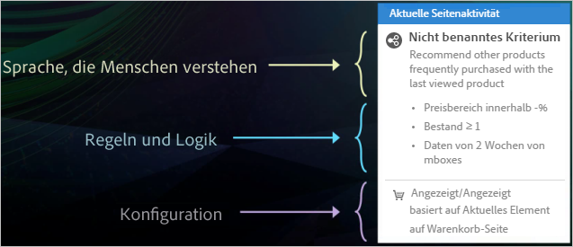
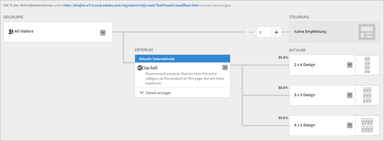
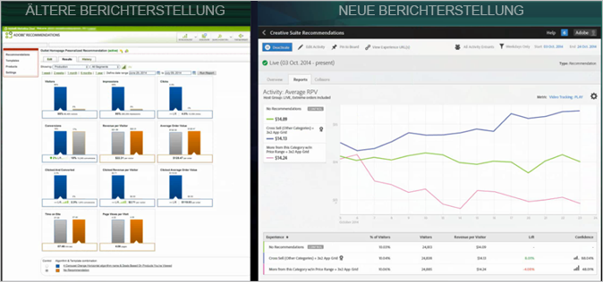

#  Recommendations Classic versus Empfehlungs-Aktivitäten in Target Premium{#recommendations-classic-versus-recommendations-activities-in-target-premium}

Informationen, die bei der Entscheidung zwischen Recommendations Classic und Recommendations-Aktivitäten in Target Premium helfen.

>[!NOTE]
>
>Empfehlungs-Aktivitäten sind als Teil der [!DNL Target Premium]-Lösung verfügbar. Sie sind in [!DNL Target Standard] nicht ohne [!DNL Target Premium]-Lizenz verfügbar.

Im klassischen [!DNL Recommendations]-Produkt wurden Empfehlungen durch Erstellen einer Datenerfassungs-Mbox auf einer Seite und anschließendes Hinzufügen einer Anzeige-Mbox an einem bestimmten Ort auf der Seite angezeigt. Die [!DNL Recommendations]-Aktivität in [!DNL Target Premium] ermöglicht es Ihnen, Besucherinformationen zu sammeln und Ihre Empfehlungen überall auf der Seite zu erstellen, ohne dass hierfür die Erstellung einer Mbox an jedem Ort, an dem Sie Produkte oder Inhalte empfehlen wollen, erforderlich ist. Ein einfacher JavaScript-Verweis im Header der Seite aktiviert Empfehlungen überall auf der Seite. Verwenden Sie diesen JavaScript-Verweis, um Schlüssel an die globale [!DNL Target]-Mbox zu übergeben, wie zum Beispiel die Schlüssel `entity.id` und `entity.categoryId`.

[!DNL Recommendations Classic] erscheint als eigene Karte in der [!DNL Experience Cloud]-Benutzeroberfläche. Eine [!DNL Recommendations]-Aktivität steht im [!DNL Target Premium]-Arbeitsablauf zur Verfügung.

[!DNL Recommendations Classic]-Benutzer können weiterhin ihre [!DNL Recommendations]-Mboxes in [!DNL Target Recommendations] verwenden. Sie können auch die klassische und die [!DNL Target]-Vorgehensweisen kombinieren, indem sie ihre Mboxes beibehalten und den JavaScript-Code im Header verwenden, um die [!DNL Recommendations]-Funktionalität für die anderen Elemente auf der Seite zu aktivieren. Um jedoch die volle [!DNL Target]-Funktionalität zu erhalten, sollten [!DNL Recommendations Classic]-Benutzer ihre alte Mbox löschen und sich allein auf [!DNL Target Recommendations] verlassen.

Die [!DNL Recommendations]-Aktivität in [!DNL Target] wird in [!DNL Recommendations Classic] in den folgenden Hauptbereichen verbessert:

## Empfehlungen als Angebot

Sie können Empfehlungen in [!UICONTROL A/B-Tests] (einschließlich [!UICONTROL Automatisierter Zuordnung] und [!UICONTROL Automatischem Targeting]) und [!UICONTROL Erlebnis-Targeting] (XT) einbeziehen.

Diese Funktion eröffnet völlig neue Funktionen wie z. B.:

* Testen und Targeting von Empfehlungen und Inhalt ohne Recommendations innerhalb derselben Aktivität.
* Experimentieren Sie einfach mit Empfehlungen auf der Seite, einschließlich der Reihenfolge mehrerer Empfehlungen.
* Traffic automatisch an die leistungsfähigsten Empfehlungserlebnisse mit [!UICONTROL Automatisierte Zuordnung] leiten.
* Dynamische Zuweisung von Besuchern zu angepassten Empfehlungserlebnissen basierend auf ihrem Profil mithilfe von [!UICONTROL automatischem Targeting].

Als erstes erstellen Sie eine [!UICONTROL A/B-Test]- oder [!UICONTROL Erlebnis-Targeting]-Aktivität mit dem [!UICONTROL Visual Experience Composer] und verwenden die Aktion [!UICONTROL Einfügen vor], [!UICONTROL Einfügen nach] oder [!UICONTROL Ersetzen mit], um einem Erlebnis Empfehlungen hinzuzufügen.

Weitere Informationen finden Sie unter [Recommendations als Angebot](/help/c-recommendations/recommendations-as-an-offer.md).

## Kriterien {#section_117709846DAA404580EBE879FFCBD9BA}

[!DNL Target Recommendations] umfasst eine Kriterienbibliothek, die vorab verpackte Sätze von Regeln und Konfigurationen enthält. In [!DNL Recommendations Classic] wurde jede Empfehlung manuell erstellt, wozu ein Formular ausgefüllt und eine Auswahl aus einer umfassenden Regelliste getroffen werden musste. Von nun an können Sie zur Erstellung einer [!DNL Recommendations]-Aktivität einfach einen vorkonfigurierten Kriteriensatz wählen. Sie können weiterhin benutzerdefinierte Empfehlungen erstellen, die Kriterienbibliothek enthält jedoch viele der gebräuchlichsten Konfigurationen - vorgefertigt, um den Prozess zu vereinfachen, und in einer allgemein verständlichen Sprache. Diese vorab verpackten Kriterien können wie vorhanden verwendet oder kopiert und bearbeitet werden, um Ihren spezifischen Bedürfnissen zu entsprechen.

Kriterien werden nach vertikalen Märkten, Seitentypen und Implementierung vorkonfiguriert. Zum Beispiel können Sie nach Kriterien suchen, die auf die Einzelhandelsbranche zutreffen, auf einer Produktseite verwendet werden und Produkte aus einer bestimmten Kategorie anzeigen (wie durch den Parameter `entity.categoryID` definiert).

Weitere Informationen zur Verwendung und Erstellung von Kriterien finden Sie unter [Kriterien](/help/c-recommendations/c-algorithms/algorithms.md).

## Arbeitsablauf{#section_76B4A26297BF422382DE2C79A2713D3C}

Der [!DNL Recommendations]-Arbeitsablauf wurde vereinfacht. Anstatt komplizierte Formulare auszufüllen, folgen Sie einem visuellen Arbeitsablauf, um:

1. die Kriterien auszuwählen,
1. einen vorkonfigurierten  [Entwurf](/help/c-recommendations/c-design-overview/create-design.md#task_CC5BD28C364742218C1ACAF0D45E0E14) auszuwählen,
1. die resultierenden Empfehlungen in der Vorschau zu betrachten.

## Visuelle Vorschau   {#section_639B9E38C9EC4093BF9023EE0F2A15AC}

Sie können Ihre Empfehlungen in einer Vorschau anzeigen, nachdem Sie diese eingerichtet haben, und alle notwendigen Änderungen vornehmen, ohne dass Sie diese auf der Seite erstellen und die Seite dann zum Testen verlassen müssen. Die Vorschau steht in [!DNL Target] zur Verfügung.

## Targeting {#section_93295EA0DBA14210B8518AF4802A459F}

In [!DNL Recommendations Classic] gab es sechs Targeting-Optionen. Recommendations-Aktivitäten verwenden die gesamte Bandbreite der Targeting-Optionen von Target. Definieren Sie eine Zielgruppe entweder mit [!DNL Target] oder anderen [!DNL Adobe Experience Cloud]-Zielgruppen (z. B. [!DNL Audience Manager] und [!DNL Analytics]), wählen Sie dann den Prozentsatz der Aktivitätsteilnehmer aus, die jeden Entwurf sehen, und den Prozentwerten, die das Steuerelement sehen.

## Berichterstellung {#section_25C2FCCE4BC1488496C517C0470B5CD6}

In [!DNL Target] bietet [!DNL Recommendations] eine verbesserte Berichterstellung, die auf die Möglichkeiten aufbaut, die [!DNL Target] und [!DNL Experience Cloud] bieten. Anstatt lediglich den Lift anzuzeigen, der durch [!DNL Recommendations] im Vergleich zu den Ergebnissen ohne erreicht wird, können Sie die vollständigen Informationen über Ihre [!DNL Recommendations]Recommendations-Aktivität anzeigen.

