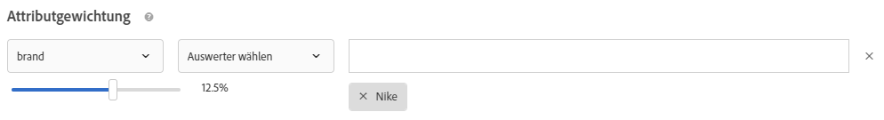

#  FAQ zu Recommendations{#recommendations-faq}

Liste häufig gestellter Fragen zu Adobe Target Recommendations-Aktivitäten.

## Warum zeigt die Katalogsuche nicht die richtigen Ergebnisse an, wenn ich nach einem benutzerdefinierten Attribut mit einem numerischen Wert suche?

Wenn Sie eine Katalogsuche für ein benutzerdefiniertes Attribut mit einem numerischen Wert durchführen, wird das benutzerdefinierte Attribut als String-Typ und nicht als numerischer Wert betrachtet.

Derzeit gibt es keine Funktion, mit der Kunden den Attributtyp ändern können. Um eine Änderung vorzunehmen, öffnen Sie ein Kundenproblem[, das auf die Attribute verweist, bei denen der Typ von der Zeichenfolge in numerisch geändert werden muss.](/help/cmp-resources-and-contact-information.md#reference_ACA3391A00EF467B87930A450050077C)

## Wie lange dauert es, bis Aktualisierungen an Elementen in meinem Katalog auf meiner Site erscheinen?

Nachdem Sie eine Feed-Datei importiert oder Entitätsaktualisierungen per API oder Mbox erhalten haben, werden die folgenden Änderungen in maximal 60 Minuten angezeigt:

* Elementattribute, die in der Designvorlage zurückgegeben werden.
* Elementattribute, die in globalen Ausschlussregeln verwendet werden, die verhindern, dass das Element in zurückgegebene Empfehlungen eingeschlossen wird.
* Elementattribute, die in Einschlussregeln innerhalb der Kriterien verwendet werden, die Auswirkungen darauf haben, ob das Element in zurückgegebenen Empfehlungen einbezogen oder ausgeschlossen wird.

Die folgenden Änderungen werden erst wirksam, wenn der nächste Algorithmus ausgeführt wird (innerhalb von 12 bis 24 Stunden):

* Elementattribute, die in den für die Aktivität verwendeten Sammlungsregeln verwendet werden.
* Elementattribute, die in einer Promotion basierend auf einem Attribut oder einer Sammlung verwendet werden, die mit der Aktivität verknüpft ist.
* Elementkategorie, in der das Element für eine „aktuelle Kategorie“ oder „Favoritenkategorie“ im Algorithmus „Topverkäufe“ oder „Am äftesten angesehen“ angezeigt wird.
* Rangordnung empfohlener Artikel, wenn das sich geänderte Attribut ein benutzerdefiniertes Attribut ist, das als benutzerdefinierter Schlüssel für einen Algorithmus verwendet wird.
* Rangordnung empfohlener Artikel basierend auf den geänderten Attributen, wenn die Empfehlungslogik „Artikel mit ähnlichen Attributen“ lautet, wenn die Gewichtungsfaktoren „ähnlicher Inhalt“ verwendet werden oder wenn die Faktoren „Attributgewichtung“ verwendet werden.

>[!NOTE]
>
>Eine Feed-Datei wird als importiert erachtet, wenn sich ihr Status von „Elemente werden importiert“ in „Aktualisierungen des Suchindex werden vorbereitet“ ändert. Es kann mehr als 60 Minuten dauern, bis Aktualisierungen in der Benutzeroberfläche der Katalogsuche angezeigt werden. Die Katalogsuche ist aktuell, wenn sich der Feed-Status in „Aktualisierungen abgeschlossen“ ändert. Selbst wenn die Katalogsuche noch nicht aktuell ist, zeigt Ihre Site Aktualisierungen in den oben aufgeführten Zeitrahmen an. Auf der Seite „Katalogsuche“ wird die aktuelle Indexaktualisierungszeit der Katalogsuche angezeigt.

## Was sollte ich tun, wenn mein Array durch Sonderzeichen umbrochen wird? {#section_D27214116EE443638A60887C7D1C534E}

Verwenden Sie Escape-Werte in JavaScript. Das Array kann durch Anführungszeichen (&quot;) umbrochen werden. Der folgende Codeausschnitt ist ein Beispiel für Escape-Werte:

```
#set($String='') 
#set($escaper=$String.class.forName('org.apache.commons.lang.StringEscapeUtils')) 
<script type="text/javascript"> 
console.log("$escaper.escapeJavaScript($entity1.name)") 
console.log("$escaper.escapeJavaScript($entity2.name)") 
console.log('$escaper.escapeJavaScript($entity3.name)') 
names.push("$escaper.escapeJavaScript($entity4.name)") 
</script>
```

## Warum stehen beim Erstellen einer Recommendations-Aktivität nicht alle Kriterien, einschließlich benutzerdefinierter Kriterien, zur Verfügung?   {#section_B2265AC8B8A94E0298D495A05C5D817F}

Die verfügbaren Kriterien basieren auf der aktuellen Kategorie. Beim Erstellen von Recommendations-Angeboten zeigt der Algorithmus-Wähler Kriterien auf Grundlage der Kategorie-ID an.

Wenn der Speicherort, auf den Sie diese Kriterien anwenden, die Kategorie-ID nicht enthält, sind im Algorithmus-Wähler bestimmte Kriterien nicht verfügbar.

Bei der Verwendung eines Speicherorts, unter dem die Kategorie-ID in der Mbox vorhanden ist, enthält der Kriterien-Wähler alle anwendbaren Kriterien.

Das Ziel verfügt über eine Einstellung zum [Filtern inkompatibler Kriterien](/help/c-recommendations/plan-implement.md#concept_C1E1E2351413468692D6C21145EF0B84), um die intelligente Filterung der Algorithmusauswahl zu steuern.

>[!NOTE]
>
>Diese Einstellung gilt nur für Aktivitäten, die im Visual Experience Composer (VEC) erstellt wurden. Sie gilt nicht für Aktivitäten, die im Formular-basierten Experience Composer erstellt wurden (Target verfügt über keinen Speicherortkontext).

Wenn Sie auf die Einstellung [!UICONTROL Inkompatible Kriterien filtern] zugreifen möchten, klicken Sie auf [!UICONTROL Recommendations] > [!UICONTROL Einstellungen]:


Wenn die Einstellung [!UICONTROL Inkompatible Kriterien filtern] NICHT aktiviert ist, filtert Target Algorithmen im Algorithmus-Wähler nicht, und es werden alle Algorithmen angezeigt.

Wenn die Einstellung [!UICONTROL Inkompatible Kriterien filtern] aktiviert ist, liest Target in VEC-Aktivitäten die entityId- und Kategorie-ID-Einträge aus dem gewählten Speicherort und zeigt dann Algorithmen basierend auf `currentItem|currentCategory` an (wenn für den jeweiligen Speicherort entsprechende Werte vorhanden sind). Daraufhin werden im Algorithmus-Wähler standardmäßig nur kompatible Algorithmen für den gewählten Speicherort angezeigt.

Bei aktivierter Einstellung [!UICONTROL Inkompatible Kriterien filtern] können Sie nichtkompatible Algorithmen trotzdem anzeigen, indem Sie beim Auswählen von Kriterien das Kontrollkästchen [!UICONTROL Kompatibel] deaktivieren.


Die folgende Liste enthält Sonderfälle, in denen das Kontrollkästchen [!UICONTROL Kompatibel] in Target nicht angezeigt wird:

* Der Speicherort enthält sowohl entityId- als auch Kategorie-ID-Einträge. In diesem Fall erfolgt keine Filterung.
* Sie verwenden [!DNL mbox.js] der Version 55 oder früher.
* Auf der Seite werden keine Mbox-Aufrufe ausgelöst (!config.isAutoCreateGlobalMbox &amp;&amp; !config.isRegionalmbox)
* Es sind keine Target-Parameter definiert.

## Was sollte ich tun, wenn eine Sammlung in Recommendations den Wert null (0) annimmt?   {#section_E2DB2FE67CF24EEC81412BFF3FA6385D}

Beachten Sie die folgenden Informationen, wenn eine Sammlung, die zuvor nicht null war, den Wert null annimmt:

* Sie können die Sammlung erneut speichern und prüfen, ob der Wert aktualisiert wird. Beachten Sie, dass durch das erneute Speichern die Sammlung alle Algorithmen erneut ausführt, die diese Sammlung verwenden.
* Befinden Sie sich in der richtigen Umgebung? Zu [!DNL /target/products.html#recsSettings] gehen, um gegenzuprüfen (wie unten dargestellt).

   

* Ist Ihr Index aktuell? Überprüfen Sie bei [!DNL /target/products.html#productSearch], wie viele Stunden der Index alt ist (z. B. „Vor 3 Stunden indiziert“). Sie können den Index bei Bedarf aktualisieren.
* Haben Sie Änderungen am Feed oder an der Datenebene vorgenommen, die dazu geführt haben, dass Ihre Entitäten nicht mehr mit den Sammlungsregeln übereinstimmen? Stellen Sie sicher, dass die Groß-/Kleinschreibung übereinstimmt (Beachtung der Groß-/Kleinschreibung).
* Wurde der Feed erfolgreich ausgeführt? Hat jemand Änderungen am FTP-Verzeichnis, Kennwort usw. vorgenommen?
* Target setzt Aktualisierungen an der Bereitstellung (auf der Seite/App des Kunden) schnellstmöglich um. Dennoch müssen für den Vermarkter auf der Benutzeroberfläche einige Darstellungen bereitgestellt werden. Bereitstellungsaktualisierungen werden nicht zwingend verzögert, um auf die Synchronisierung der Benutzeroberflächenaktualisierungen zu warten. Mithilfe von [mboxTrace](/help/c-activities/c-troubleshooting-activities/content-trouble.md) können Sie die Inhalte des Systems zu dem Zeitpunkt anzeigen, zu dem eine Anforderung eingeht.

## Worin besteht der Unterschied zwischen der allgemeinen und der Inhaltsähnlichkeits-spezifischen Attributgewichtung? {#section_FCD96598CBB44B16A4C6C084649928FF}

Die Attributgewichtung liegt in zwei Formen vor: „Standardattributgewichtung“ und „Inhaltsähnlichkeits-Attributgewichtung“.

Die „Standardattributgewichtung“ gilt für die meisten, wenn nicht gar für alle Kriterientypen (nicht nur „Inhaltsähnlichkeit“). Dieser Gewichtungstyp gewichtet bestimmte Attributwerte stärker. Im folgenden Beispiel werden Nike-Produkte in den Ausgabeempfehlungen angestoßen.



Die „Inhaltsähnlichkeits-Attributgewichtung“ gilt nur für Kriterien der Inhaltsähnlichkeit.

Dieser Gewichtungstyp ist dynamischer und basiert auf dem aktuellen „Empfehlungsschlüssel“ (dem derzeit angezeigten Element). Wenn im folgenden Beispiel (Marke x 16) ein Besucher Sneaker von Nike anzeigt, werden diesem Besucher mit höherer Wahrscheinlichkeit andere Nike-Produkte empfohlen (nicht nur Sneaker) als Sneaker von anderen Herstellern. Wenn ein Besucher Sneaker der Marke Adidas anzeigen würde, würden ihm wahrscheinlich Adidas-Produkte empfohlen.


## Warum ist Target manchmal nicht in der Lage, Empfehlungen anzuzeigen?   {#section_DB3F40673AED42228E407C05437D99E9}

Target kann manchmal keine Empfehlungen anzeigen, wenn zu wenig Empfehlungen verfügbar sind.

Die Anzahl der pro Kriterium generierten Werte ist die 3-fache Anzahl der im Design angegebenen Entitäten. Die Laufzeitfilterung (beispielsweise Inventar, Mbox-Attributabgleich) wird angewendet, nachdem die 3x-Werte generiert wurden. Daher ist es möglich, dass zur Bereitstellungszeit weniger als 3x-Werte vorhanden sind. Erhöhen Sie zum Abschwächen dieser Situation die Anzahl der Entitäten im Design, indem Sie zusätzliche Entitäten ausblenden.

Das folgende JavaScript kann zu Beginn des Designs verwendet werden, um die Anzahl der angeforderten Entitäten zu erhöhen. In diesem Beispiel würde die angeforderte Anzahl von Entitäten 30 (3 x 10) betragen.

```
#foreach($entity in $entities) 
 #if( $foreach.count > 10 ) 
  #break 
 #end 
 #set ($foo = $entity.id) 
#end 
```

## Welche Größenbeschränkung besteht für einen API-Aufruf beim Einfügen/Aktualisieren von Produkten? Kann ich 50.000 Produkte mit einem Aufruf aktualisieren, indem ich die API statt eines Feeds verwende?   {#section_434FE1F187B7436AA39B7C14C7895168}

Target begrenzt Posts auf Anwendungsebene auf 50 MB. Dies erfolgt jedoch nur, wenn der Content-Type-Header `application/x-www-form-urlencoded` übergeben wird.

Sie können sicherlich versuchen, 50.000 Produkte in einem einzigen Aufruf zu senden. Wenn das nicht funktioniert, teilen Sie die Produkte in Batches auf. Normalerweise wird empfohlen, dass Kunden Aufrufe in Batches mit jeweils 5.000 oder 10.000 Produkten aufteilen, um die Wahrscheinlichkeit einer Zeitüberschreitung aufgrund von hoher Systemauslastung zu reduzieren.

## Muss ich einen Mbox-Namen angeben, wenn ich Recommendations-Kriterien, -Promotions oder Vorlagentestregeln erstelle?   {#section_FFA42ABCC5954B48A46526E32A3A88A2}

Beim Erstellen von Recommendations-Kriterien, -Promotions oder Vorlagentestregeln, die auf einem basieren, erhalten Sie von `mboxParameter`mboxParameter keine Aufforderung mehr, `mboxName` einzugeben. Der Mbox-Name ist nun optional. Mit dieser Änderung können Sie Parameter aus mehreren Mboxes verwenden oder auf einen Parameter verweisen, der noch nicht am Rand aufgezeichnet wurde.

So wählen Sie den gewünschten Parameter aus:

* Wählen Sie beim Erstellen neuer Kriterien, Promotions oder Vorlagentestregeln einen Parameter aus der Liste aus oder geben Sie die ersten Buchstaben des Parameternamens bzw. den gesamten Namen des gewünschten Parameters ein.
* Wenn Sie den Mbox-, aber nicht den Parameternamen kennen, filtern Sie mithilfe des Kontrollkästchens nach der bekannten Mbox, die den gewünschten Parameter übergibt.

Bei keiner der Methoden gibt es eine Verbindung zwischen Mbox und Parameter. Die Kriterien, Promotions oder Vorlagentestregeln funktionieren basierend auf dem Parameter über alle Mboxes hinweg, die diesen Parameter übergeben.

Wenn Sie bestehende Kriterien, Promotions oder Vorlagentestregeln bearbeiten, werden die Filterkriterien mit dem Mbox-Namen angezeigt, der bei der Erstellung angegeben wurde.

## Warum kann ich meine alte Recommendations-Aktivität nicht speichern, nachdem ich eine neue Zielgruppe definiert habe?   {#section_1E47C40B1FE7479BAC3EE0F50CE7C2C4}

Stellen Sie sicher, dass die Zielgruppe einen eindeutigen Namen aufweist. Wenn Sie der Zielgruppe den Namen einer bereits vorhandenen Zielgruppe zugewiesen haben, können Sie die alte Recommendations-Aktivität, also Recommendations-Aktivitäten, die vor Oktober 2016 erstellt wurden, nicht speichern.

## Wie groß dürfen CSV-Dateien für den Feedupload maximal sein?   {#section_20F1AF4839A447B9889B246D6E873538}

Es gibt keine feste Grenze hinsichtlich der Zeilen oder Dateigröße für den Feedupload von CSV-Dateien. Als Best Practice empfehlen wir jedoch, die CSV-Datei auf 1 GB zu beschränken, um Fehler während des Uploadprozesses zu vermeiden. Wenn die Größe der Datei 1 GB übersteigt, teilen Sie sie am besten in mehrere Feeddateien auf. Die maximale Anzahl benutzerdefinierter Attributspalten ist 100 und benutzerdefinierte Attribute sind auf 4.096 Zeichen beschränkt. Zusätzliche Beschränkungen zur Länge der erforderlichen Spalten finden Sie auf der  [Seite mit Target-Beschränkungen](/help/r-troubleshooting-target/target-limits.md#reference_BEFE60C3AAA442FF94D4EBFB9D3CC9B1).

## Kann ich eine Entität dynamisch ausschließen?

In der Abfragezeichenfolge können Sie Entität-IDs für Entitäten übermitteln, die Sie von Ihren Empfehlungen ausschließen möchten. So kann es beispielsweise hilfreich sein, Artikel auszuschließen, die sich bereits im Warenkorb befinden.

Verwenden Sie den Mbox-Parameter `excludedIds`, um die Ausschlussfunktion zu aktivieren. Dieser Parameter verweist auf eine Liste kommagetrennter Entitäts-IDs. Zum Beispiel `mboxCreate(..., "excludedIds=1,2,3,4,5")`. Der Wert wird übermittelt, wenn Empfehlungen angefordert werden.

Der Ausschluss wird nur für den Aufruf der aktuellen Zielgruppe durchgeführt. Elemente werden bei nachfolgenden Aufrufen der Zielgruppe nur dann ausgeschlossen, wenn der Wert `excludedIds` erneut übergeben wird. Um Artikel im Warenkorb von Empfehlungen auf jeder Seite auszuschließen, setzen Sie den `excludedIds`-Wert auf jeder Seite fort.

>[!NOTE]
>
>Wenn zu viele Entitäten ausgeschlossen werden, verhalten sich die Empfehlungen so, als wären nicht ausreichend Entitäten zum Ausfüllen der Empfehlungsvorlage vorhanden.

Um `entityIds` auszuschließen, hängen Sie das Token `&excludes=${mbox.excludedIds}` an die Content-URL des Angebots an. Wenn die Inhalts-URL extrahiert wird, werden die erforderlichen Parameter mit aktuellen Mbox-Anforderungsparametern ersetzt.

Diese Funktion ist für neu erstellte Empfehlungen standardmäßig aktiviert. Bestehende Empfehlungen müssen gespeichert werden, um eine Unterstützung für dynamisch ausgeschlossene Entitäten zu gewährleisten.

## Was bedeutet die Antwort NO_CONTENT manchmal, die im Recommendations Content Trace zurückgegeben wird?

NO_CONTENT wird zurückgegeben, wenn für die angeforderte Algorithmus- und Schlüsselkombination keine Empfehlungen verfügbar sind. Im Allgemeinen tritt dies auf, wenn Backups für den Algorithmus deaktiviert sind und mindestens einer der folgenden Punkte ebenfalls zutrifft:

* Die Ergebnisse sind noch nicht bereit.

   Dies tritt in der Regel auf, wenn eine neu erstellte Aktivität zum ersten Mal gespeichert wird oder nachdem Konfigurationsänderungen an der Sammlung, den Kriterien oder den in der Aktivität verwendeten Promotions vorgenommen wurden.

* Die Ergebnisse sind für die angeforderte Algorithmus-/Schlüsselkombination bereit, jedoch noch nicht auf dem nächsten Edge-Server zwischengespeichert.

   Die soeben angeforderte Anforderung initiiert einen Zwischenspeicherungsvorgang, der nach einigen Seitenneuladungen und/oder einigen Minuten nach Ablauf gelöst werden sollte.

* Die Ergebnisse sind bereit, aber für den bereitgestellten Schlüsselwert nicht verfügbar.

   Dies tritt in der Regel auf, wenn Empfehlungen für ein Element angefordert werden, das nach der Ausführung des letzten Algorithmus zum Katalog hinzugefügt wurde, und sich nach der Ausführung des nächsten Algorithmus selbst auflösen.

* Die teilweise Vorlagenwiedergabe ist deaktiviert und es sind nicht genügend Ergebnisse zum Ausfüllen der Vorlage verfügbar.

   Dies tritt in der Regel auf, wenn Sie über eine dynamische Einschlussregel verfügen, mit der viele Elemente aus den möglichen Ergebnissen aggressiv Filter werden. Um dies zu vermeiden, aktivieren Sie Backups und wenden Sie die Einschlussregel nicht auf Backups an oder verwenden Sie die Kriterien in einer Sequenz mit einem weniger aggressiv gefilterten Kriterium.

