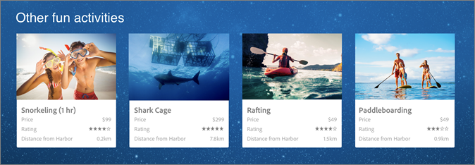

#  Recommendations{#recommendations}

[!DNL Adobe Target Recommendations] aktivitäten zeigen automatisch Produkte, Dienste oder Inhalte an, die ausgehend von früheren Aktivitäten, Voreinstellungen oder anderen Kriterien für Ihre Besucher von Interesse sein könnten. [!DNL Target Recommendations] hilft, Besucher zu relevanten Artikeln zu leiten, von denen sie sonst möglicherweise nichts wissen. [!DNL Recommendations] Sie können Ihren Besuchern relevante Inhalte zum richtigen Zeitpunkt und an der richtigen Stelle bereitstellen.

>[!NOTE]
>
>[!DNL Recommendations] Aktivitäten sind als Bestandteil der [Target Premium-Lösung](/help/c-intro/intro.md#premium) verfügbar. Sie sind in [!DNL Target Standard] nicht ohne [!DNL Target Premium]-Lizenz verfügbar.
>
>Falls Sie aktuell [!DNL Recommendations Classic] haben, finden Sie weitere Informationen zu den beiden Lösungen unter [Recommendations Classic versus Recommendations Activities in Target Premium](/help/c-recommendations/c-recommendations-faq/recommendations-classic-versus-recommendations-activities-target-premium.md#concept_A80223EF66634EA380580C2823A581C5).

[!DNL Recommendations] unterstützt Sie dabei, Echtzeitvorschläge über verschiedene Kanäle, Apps, Seiten, E-Mails und andere Bereitstellungsoptionen hinweg zu optimieren und zu personalisieren, um Interaktionen und Konversionen zu steigern, während gleichzeitig der Verwaltungsaufwand sinkt.

[!DNL Recommendations] hilft Ihnen bei Folgendem:

* Komplexe Kriterien (Regeln) zur Automatisierung von Empfehlungen erstellen
* Empfehlungen automatisch anzeigen, indem Sie einige wenige JavaScript-Snippets einsetzen
* Empfehlungskriterien und -entwürfe, die Empfehlungen anzeigen, testen und optimieren
* Berichte zu den Ergebnissen Ihrer Empfehlungsaktivitäten erstellen

Die folgende Illustration stellt Recommendations auf einer Webseite dar:

Eine Empfehlung bestimmt, wie ein Produkt einem Besucher je nach den Aktivitäten dieses Besuchers auf der Site vorgeschlagen wird. Beispiel:

| Wunschaktion | Empfehlung |
|--- |--- |
| Regen Sie Personen, die einen Rucksack kaufen, dazu an, Wanderschuhe und Wanderstöcke zu kaufen. | Erstellen Sie mithilfe des „Kunden, die diesen Artikel gekauft haben, haben auch folgende Artikel gekauft“-Kriteriums eine Empfehlung, die Artikel anzeigt, welche oft zusammen gekauft werden. |
| Steigern Sie die Zeit, die ein Besucher auf Ihrer Medienwebsite verbringt, indem Sie Videoinhalte empfehlen, die den gerade angesehenen Videos ähneln. | Erstellen Sie mithilfe des „Personen, die dies angesehen haben, sahen auch“-Kriteriums eine Empfehlung, die andere Videos vorschlägt. |
| Empfehlen Sie Kunden, die sich Informationen über Sparpläne bei Ihrer Bank angesehen haben, Informationen zu IRA-Konten. | Zeigen Sie mithilfe des „Personen, die diesen Artikel angesehen haben, kauften auch“-Kriteriums andere Produkte, die von Personen gekauft wurden, nachdem sie ein Produkt angesehen haben, ohne dabei das erste Produkt in den Empfehlungen anzuzeigen. |

Weitere Informationen zu diesen und anderen [!DNL Recommendations]-Kriterien finden Sie unter [Kriterien](/help/c-recommendations/c-algorithms/algorithms.md).

## Begriffe

Bevor Sie mit der Verwendung von [!DNL Recommendations] beginnen, sollten Sie sich mit einigen der in diesem Abschnitt verwendeten Begriffe vertraut machen. Machen Sie sich keine Gedanken, wenn Sie diese Begriffe noch nicht vollständig verstehen, werden Sie sich mit ihnen vertraut machen, wenn Sie Ihre [!DNL Recommendations]-Aktivitäten einrichten.

| Begriff | Definition |
| --- | --- |
| Aktivität | Mit den Aktivitäten in [!DNL Target] können Sie Inhalte an bestimmte Audiencen anpassen und Seitenentwürfe testen. [!DNL Recommendations] ist nur eine der vielen Aktivitäten in  [!DNL Target]. Weitere Informationen finden Sie unter [Aktivitäten der Zielgruppe](/help/c-activities/target-activities-guide.md). |
| Entitäten | Entitäten beziehen sich auf die Artikel, die Sie empfehlen möchten. Entitäten können alles sein, wie Produkte, Inhalte (Artikel, Diashows, Bilder, Filme und Fernsehsendungen), Stellenangebote, Restaurants usw. Weitere Informationen finden Sie unter [Entities](/help/c-recommendations/c-products/products.md). |
| Feeds | Feeds werden verwendet, um Entitäten nach [!DNL Recommendations] zu importieren. Entitäten können mithilfe von CSV-Dateien, dem Google-Produktsuche-Feedformat und Adobe Analytics-Classifications gesendet werden. Weitere Informationen finden Sie unter [Feeds](/help/c-recommendations/c-products/feeds.md). |
| Katalog | Kataloge beziehen sich auf den gesamten Produktsatz (Entitäten). Ihr Katalog kann viele Sammlungen enthalten - eine Möglichkeit, Ihre Produkte in logischen Behältern zu organisieren. |
| Erfassung | Sammlungen beziehen sich auf eine Reihe ähnlicher oder verwandter Elemente, z. B. eine einzelne Kategorie. Sie können jedoch beliebige Artikel in einer Kategorie gruppieren, wenn dies für Ihr Geschäft sinnvoll ist, wie zum Beispiel Produkte in einer bestimmten Preisspanne bzw. mit einer bestimmten Farbe, oder Artikel, die wahrscheinlich in einer bestimmten geografischen Region interessant sind. Weitere Informationen finden Sie unter [Sammlungen](/help/c-recommendations/c-products/collections.md). |
| Kriterien | Kriterien sind Regeln, die auf Basis vorab ermittelter Verhaltensweisen von Besuchern festlegen, welche Produkte empfohlen werden. Einige Beispiele für Kriterien sind: <ul><li>Personen, die das kauften, kauften dies</li><li>Personen, die das ansahen, sahen auch dies an</li><li>Artikel mit ähnlichen Attributen</li><li>Zuletzt gekaufter Artikel</li><li>Favoritenkategorie</li></ul>  Weitere Informationen finden Sie unter [Kritierien](/help/c-recommendations/c-algorithms/algorithms.md). |
| Entwürfe | Entwürfe definieren das Erscheinungsbild der Empfehlungen in einer [!DNL Recommendations]-Aktivität, z. B. in einer Zeile, Spalte, Tabelle oder einem Raster. Die Abbildung oben in diesem Artikel zeigt ein 4 x 1-Design. Weitere Informationen finden Sie unter [Erstellen eines Entwurfs](/help/c-recommendations/c-design-overview/create-design.md). |
| Orte | Positionen beziehen sich auf einen bestimmten Inhaltsbereich auf einer Webseite, mobilen App oder E-Mail, in dem Sie eine Aktivität zu Personalisierungs- und Optimierungszwecken ausführen. |
| Zielgruppen | Audiencen sind Gruppen von Anbietern ähnlicher Aktivität, denen eine zielgerichtete Aktivität angezeigt wird. Eine Zielgruppe ist eine Gruppe von Personen mit denselben Merkmalen, wie z. B. ein neuer Besucher, ein wiederkehrender Besucher oder wiederkehrende Besucher aus einer bestimmten Region. Mit der Zielgruppenfunktion können Sie verschiedene Inhalte und Erlebnisse auf spezifische Zielgruppen ausrichten, um Ihr Webmarketing zu optimieren, indem Sie geeignete Botschaften zum richtigen Zeitpunkt für die richtigen Personen anzeigen. Weitere Informationen finden Sie unter [Zielgruppen](/help/c-target/target.md). |
| Empfehlungen als Angebot | Eine Funktion, mit der Sie Empfehlungen in A/B-Aktivitäten (einschließlich automatisierter Zuordnung und automatischer Zielgruppe) und Erlebnis-Targeting (XT) einfügen können. Weitere Informationen finden Sie unter [Recommendations als Angebot](/help/c-recommendations/recommendations-as-an-offer.md). |

## Schulungsvideo: Aktivitäten-Typen 

In diesem Video werden die in [!DNL Target Standard/Premium] verfügbaren Aktivitätstypen erläutert. [!DNL Recommendations] wird ab 7:20 besprochen.

* Beschreiben der Aktivitätstypen in [!DNL Adobe Target]
* Auswählen des für Ihre Ziele geeigneten Aktivitätstyps
* Beschreibung des für alle Aktivitätstypen gültigen Arbeitsablaufs mit drei Schritten

>[!VIDEO](https://video.tv.adobe.com/v/17386)

## Adobe Target Basics-Webinar: Einführung in Recommendations  {#intro-to-recs}

Das Webinar *„Einführung in Recommendations“* beinhaltet eine ausführliche Untersuchung, wie der Wert von [!DNL Adobe Target Recommendations] wirksam eingesetzt werden kann. Erfahren Sie, wie diese [!DNL Target]-Aktivität automatisch Produkte oder Inhalte anzeigt, die für Ihre Kunden von Interesse sein könnten, indem sie Echtzeitvorschläge auf der Grundlage früherer Besuche optimiert. Außerdem können Sie in die [!DNL Target]-Benutzeroberfläche eintauchen, um eine schrittweise Übersicht über das Erstellen einer [!DNL Recommendations]-Aktivität zu erhalten.

[Einführung in Recommendations](https://adobecustomersuccess.adobeconnect.com/p8gt31drhs3e/?OWASP_CSRFTOKEN=4bd6cac5d0806167ee0a5449ba93d6300548d09c922bcb751c38973897a5703a)