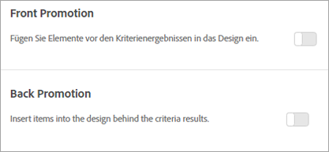

#  Promotions hinzufügen

Fügen Sie Promotionsartikel hinzu und steuern Sie deren Platzierung in Ihren Adobe Target-Recommendations-Designs. Sie können statische und dynamische Promotions hinzufügen.

>[!IMPORTANT]
>
>Statische und dynamische Ausschlussregeln sind leistungsstarke Funktionen, die Ihnen beim Marketing helfen können. Ausführliche Informationen, Beispiele und Anwendungsszenarios finden Sie unter [Verwenden dynamischer und statischer Einschlussregeln](/help/c-recommendations/c-algorithms/use-dynamic-and-static-inclusion-rules.md#concept_4CB5C0FA705D4E449BD0B37B3D987F9F).

Beim Erstellen einer [!DNL Recommendations]-Aktivität haben Sie die Möglichkeit, beworbene Artikel in Ihr [!DNL Recommendations]-Design einzufügen. Promotions nutzen verfügbare Slots in einem Design und haben Vorrang vor Kriterienergebnissen und Sicherungsempfehlungen. Wenn Ihr Design zum Beispiel über sechs Slots verfügt und Sie zwei davon für Promotions einsetzen, stehen vier Slots für Artikel zur Verfügung, die anhand von Kriterien empfohlen werden.

Promotions werden in Bezug auf Artikeln dedupliziert, die von den Kriterien für Ihre Aktivität empfohlen werden, sodass ein Artikel nicht doppelt in einer einzelnen Empfehlungsablage angezeigt wird.

Sie können einzelne Artikel bewerben, Artikel dynamisch bewerben, Artikel auf Grundlage von Attributen bewerben oder Sammlungen bewerben.

>[!NOTE]
>
>Durch die Verwendung von Promotions ändert sich die CSV-Struktur und -Ausgabe. Diese Änderungen können sich auf externe Prozesse auswirken, bei denen CSV involviert ist, wie zum Beispiel E-Mail.

1. Klicken Sie auf der Seite **[!UICONTROL Optionen]** auf die Schaltfläche **[!UICONTROL Vorwärts-Promotion]** oder **[!UICONTROL Rückwärts-Promotion]**.

   Die folgende Abbildung zeigt den Umschalter [!UICONTROL „Vorwärts-Promotion“] in der aktivierten Position.

   

   Sie können Promotions sowohl vor *als auch* nach Ihren Kriterienergebnissen einfügen.
1. Legen Sie die Anzahl der Design-Slots fest, die für beworbene Artikel verwendet werden sollen.

   Je nach [!DNL Recommendations]-Design können Sie bis zu 20 Slots verwenden. Jeder von Ihnen genutzte Slot steht nicht mehr für Empfehlungen, die auf Grundlage Ihrer Kriterien zurückgegeben werden, zur Verfügung.

1. Legen Sie ein Start- und Enddatum für Ihre beworbenen Artikel fest.

   Wenn Sie kein Startdatum festlegen, beginnt die Promotion sofort. Wenn Sie kein Enddatum festlegen, läuft die Promotion auf unbestimmte Zeit.

1. Wählen Sie einen **[!UICONTROL Promotion-Typ]** aus.

   * Wählen Sie **[!UICONTROL Liste der Artikel]** aus, und geben Sie die `entity.id`-Werte der einzelnen Artikel, die beworben werden sollen, durch Kommas getrennt ein.

   * Wählen Sie **[!UICONTROL Hervorheben nach Attribut]** aus und fügen Sie Regeln hinzu, um die Attribute der Artikel zu definieren, die beworben werden sollen.

      Wenn Sie „Hervorheben nach Attribut“ auswählen, können Sie dynamische Übereinstimmungen erstellen. Weitere Informationen finden Sie unter [Verwenden dynamischer und statischer Einschlussregeln](/help/c-recommendations/c-algorithms/use-dynamic-and-static-inclusion-rules.md#concept_4CB5C0FA705D4E449BD0B37B3D987F9F).

   * Wählen Sie **[!UICONTROL Sammlung hervorheben]** aus und wählen Sie eine Sammlung von Artikeln aus, die beworben werden soll.

      Sie können auch neue Sammlungen erstellen, die für Promotions verwendet werden sollen. Siehe [Erstellen einer Sammlung](/help/c-recommendations/c-products/collections.md#task_1256DFF6842141FCAADD9E1428EF7F08) für weitere Informationen.
   Wenn Sie die **[!UICONTROL Liste der Elemente]** als **[!UICONTROL Promotion-Typ]** auswählen, können Sie bei Bedarf das Kontrollkästchen &quot;Elementreihenfolge **** randomisieren&quot;aktivieren.

   Die standardmäßige Sortierreihenfolge für die [!UICONTROL Liste von Elementen] basiert auf der Reihenfolge, die Sie in der Benutzeroberfläche oder API der Zielgruppe eingegeben haben. If your list includes more items than the number of slots you set for promotions, the [!UICONTROL Randomize Item Order] option randomizes the promoted items that are displayed in your design. Choosing this option results in [!DNL Target] randomly selecting the items enabled for promotions in the template from the entire promotion set on each hit.

   Wenn Ihre Entitäten über kein `entity.value` Attribut verfügen (z. B. keine Produkte), können Sie einen numerischen Wert an das `entity.value` Attribut, z. B. das Veröffentlichungsdatum, übergeben. In diesem Fall können beworbene Artikel basierend auf dem neuesten Veröffentlichungsdatum in absteigender Reihenfolge beworben werden. Das `entity.value` Attribut ist vom Typ Dublette. es akzeptiert keine Zeichenfolgen.

   Wenn Sie die Option &quot; **[!UICONTROL Nach Attribut]** bewerben&quot;oder &quot;Sammlung **[!UICONTROL fördern]** &quot;ausgewählt haben, ist die Option zur Randomisierung der Bestellung nicht verfügbar.

   Wenn Sie bestimmte Elemente mithilfe der Optionen [!UICONTROL Nach Attribut] bewerben oder Sammlung [!UICONTROL bewerben] , basiert die Standardreihenfolge, in der Elemente angezeigt werden, auf dem `entity.value` Attribut in absteigender numerischer Reihenfolge.

   Die folgende Tabelle zeigt die Unterschiede zwischen diesen Optionen:

   | Promotion-Typ | Standardsortierung | Sicherungssortierung | Dynamische Filteroption |
   | --- | --- | --- | --- |
   | Liste der Elemente | In der Benutzeroberfläche/API der Zielgruppe eingegebene Reihenfolge | Zufällig (bei Auswahl über UI/API) | Nein |
   | Promote nach Attribut | `entity.value` (absteigende Reihenfolge) | Bei jeder Anforderung randomisiert (wenn kein `entity.value` Attribut vorhanden ist) | Ja |
   | Sammlung bewerben | `entity.value` (absteigende Reihenfolge) | Bei jeder Anforderung randomisiert (wenn kein `entity.value` Attribut vorhanden ist) | Nein |

1. Klicken Sie auf **[!UICONTROL Speichern]**.

Promotions gelten für alle Erlebnisse in der Aktivität.
