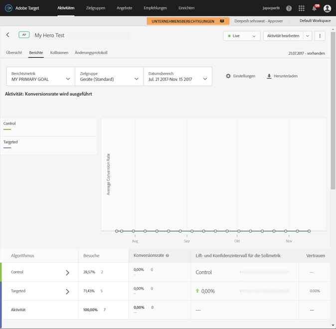

# AT (Automatisches Targeting)-Zusammenfassungsbericht{#auto-target-summary-report}

Informationen zur Interpretation des AT-Zusammenfassungsberichts.

Die folgende Abbildung zeigt das Aussehen eines typischen Zusammenfassungsberichts bei der Verwendung von „Automatisches Targeting“:

Im Folgenden finden Sie einige Tipps und Hinweise für das Interpretieren Ihrer Berichte vom Typ „Automatisches Targeting“:

* Die einzelnen Zeilen der Tabelle zeigen die Leistung der Aktivität.

   * In den obersten zwei Zeilen in der Tabelle auf der Berichtsseite werden die Ergebnisse eines A/B-Tests zwischen den der Kontrolle (d. h. einem zufällig bereitgestellten Erlebnis) zugewiesenen Besuchern und den dem Personalisierungsalgorithmus zugewiesenen Besuchern angezeigt. Anhand dieser Informationen kann die Leistung des Personalisierungsalgorithmus im Vergleich zur zufallsgestützten Kontrolle gemessen werden.
   * In den restlichen Zeilen werden Ergebnisse auf Erlebnisebene angezeigt. Für jedes Erlebnis gibt es einen Vergleich zwischen der durchschnittlichen Antwort der Besucher, denen dieses Erlebnis als eine zufallsgestützte Kontrolle angezeigt wird, und der durchschnittlichen Antwort der Besucher, denen das Erlebnis mit dem Personalisierungsalgorithmus angezeigt wird.

* Das grüne Häkchensymbol neben den einzelnen Erlebnissen im Bericht gibt an, dass für dieses Erlebnis ein Modell für das personalisierte maschinelle Lernen generiert wurde. Das Uhrensymbol gibt an, dass nicht genügend Traffic verarbeitet wurde, um das Modell zu erstellen.

   * Da das Modell pro Erlebnis erstellt wird, ist es möglich, dass ein Modell für einige Erlebnisse mit einem grünen Häkchen und andere mit einem Uhrensymbol angezeigt werden.
   * In diesem Fall wird den Erlebnissen mit nicht erstellten Modellen zusätzlicher Traffic gesendet, um die Geschwindigkeit der Aktivität zu erhöhen, für die für alle Erlebnisse Modelle erstellt sind.
   * Es müssen mindestens zwei Erlebnisse mit erstellten Modellen (grünes Häkchen) vorhanden sein, damit die Personalisierung beginnt.

* Ein Vergleich der Konversionsrate von Erlebnis A mit der von Erlebnis B ist beim automatischen Targeting kein passender Vergleich. Es stellt sich die Frage, ob Erlebnis A eine bessere Leistung erzielt, wenn es intelligent bereitgestellt wird, als wenn es auf zufällige Weise bereitgestellt wird (d. h. im Vergleich zur Kontrolle). Marketer sollten die Steigerungen einzelner Erlebnisse vorsichtig interpretieren, da der Personalisierungsalgorithmus versucht, die Optimierung für die Erfolgsmetrik über die gesamte Aktivität und nicht für jedes einzelne Erlebnis vorzunehmen.
* Für Erlebnisse mit der höchsten Steigerung kann davon ausgegangen werden, dass dort die höchste Differenzierung der Population vorliegt. Das heißt, dass der Algorithmus ein Segment gefunden hat, dem dieses Erlebnis am besten gefällt.

