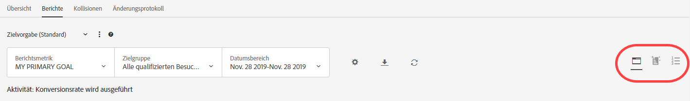
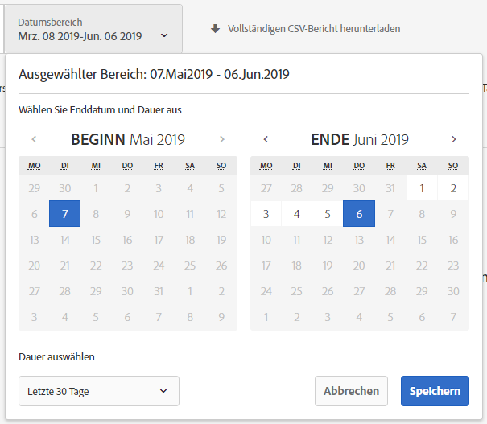
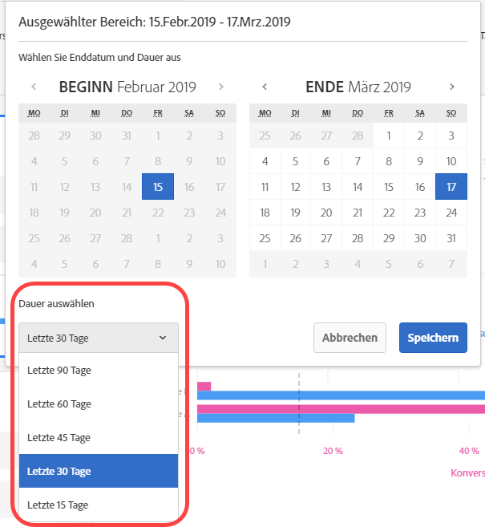
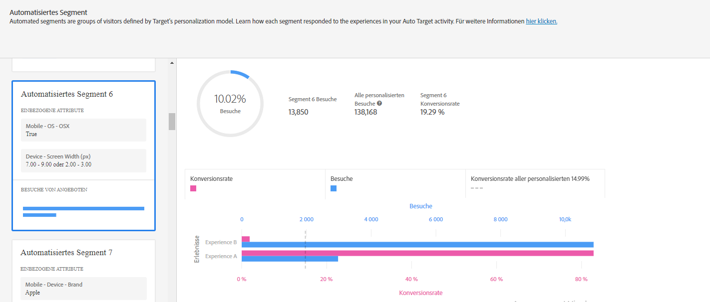
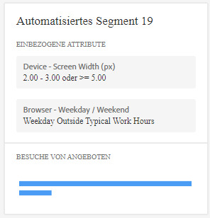
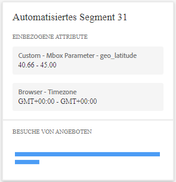

#  Bericht für automatisierte Segmente

Informationen zum Bericht „Automatisierte Segmente“, einem der beiden für Benutzer der AP (Automated Personalization)- und AT (Automatisches Targeting)-Aktivitäten verfügbaren speziellen Berichte.

>[!NOTE]
>
>Beachten Sie Folgendes, wenn Sie Personalization Insight-Berichte verwenden:
>
>* AP- und AT-Aktivitäten sind im Rahmen von [!DNL Target Premium] verfügbar. Sie sind nicht mit [!DNL Target Standard]ohne[!DNL Target Premium] Lizenz enthalten.
   >
   >
* [!UICONTROL Personalization Insights-Berichte sind nur für AP- und AT-Aktivitäten verfügbar, die ein Konversionsoptimierungsziel verwenden. ] Auch Aktivitäten, deren Optimierungsziel von Konversion zu Umsatz geändert wurde, nachdem die Aktivität bereits live war, werden nicht unterstützt.
   >
   >
* [!UICONTROL Personalization Insight-] Berichte stehen nur zur Verfügung, wenn die  [!UICONTROL Primär-] Zielvorgabe aus der Dropdown-Liste  [!UICONTROL Report ] Metriken ausgewählt wurde.
   >
   >
* Personalization Insights-Berichte werden nur in der [Standardumgebung](/help/administrating-target/hosts.md) unterstützt.
   >
   >
* [!UICONTROL Personalization Insight-] Berichte werden nur für Aktivitäten generiert, die sich im   Livestatus befinden und die mindestens 15 Tage lang aktiviert wurden und Traffic erhalten haben.

Verschiedene Besucher reagieren unterschiedlich auf die Angebote/Erlebnisse in Ihrer AP-/AT-Aktivität. Dieser Bericht zeigt, wie unterschiedliche automatisierte Segmente, die von den Target-Personalisierungsmodellen definiert werden, auf die Angebote/Erlebnisse in der Aktivität reagiert haben.

## Zugriff auf den Bericht für automatisierte Segmente {#section_8E8F997AAAF44A1B9EE06EB6FB652801}

1. Klicken Sie auf **[!UICONTROL Aktivitäten]** und dann auf die gewünschte [Automated Personalization](/help/c-activities/t-automated-personalization/automated-personalization.md#task_8AAF837796D74CF893CA2F88BA1491C9)- oder [Auto-Zielgruppe](/help/c-activities/auto-target/auto-target-to-optimize.md)-Aktivität aus der Liste.

   Wenn Sie viele Aktivitäten haben, können Sie die Liste filtern, indem Sie Optionen aus den Optionen [!UICONTROL Typ], [!UICONTROL Status], [!UICONTROL Eigenschaft], [!UICONTROL Berichte-Quelle], [!UICONTROL Experience Composer], [!UICONTROL Metriktyp&lt;a1 auswählen/> und [!UICONTROL Aktivität-Quelle] Dropdown-Listen.]

1. Klicken Sie auf **[!UICONTROL Berichte]**.

   Der Bericht [Automated Personalization Summary](/help/c-reports/reports-ap.md) oder [Zusammenfassung der automatischen Zielgruppe](/help/c-reports/auto-target-summary-report.md) enthält Informationen zur Leistung Ihrer Aktivitäten, dargestellt durch das Symbol des ersten Bildschirms. Die beiden zusätzlichen Symbole stehen für die beiden Personalization Insights-Berichte: „Automatisierte Segmente“ und „Wichtige Attribute“. Beachten Sie, dass das automatische Targeting ein zusätzliches Diagrammsymbol für die grafische Ansicht des Berichts [!UICONTROL „Zusammenfassung“] umfasst.

   

   >[!IMPORTANT]
   >
   >Der Bericht für [!UICONTROL Automatisierte Segmente] steht erst nach mindestens 15 Tagen nach der Aktivierung Ihrer Aktivität zur Verfügung. Bis dahin können Sie nicht auf diesen Bericht zugreifen und das Symbol für [!UICONTROL „Automatisierte Segmente“] ist ausgegraut. Nach 15 Tagen und sofern ausreichend Personalisierungstraffic in Ihrer Aktivität verfügbar ist, ist der Bericht [!UICONTROL „Automatisierte Segmente“] verfügbar.

1. 15 Tage nach der Aktivierung der Aktivität können Sie auf das Symbol **[!UICONTROL Automatisierte Segmente]** klicken.

   

1. Wählen Sie den gewünschten Datumsbereich aus.

   Im Gegensatz zum Bericht [!UICONTROL „Zusammenfassung“] (Performance-Reporting) sind [!UICONTROL Personalization Insights], einschließlich [!UICONTROL „Automatisierte Segmente“], nur für feste Zeiträume verfügbar: 15, 30, 45, 60 oder 90 Tage. Diese festen Datumsbereiche ermöglichen es [!UICONTROL Personalization Insights], ausreichend Daten anzusammeln, um zu verhindern, dass Insights aus kurzfristigen Mustern in Ihrer Aktivität abgeleitet werden. Die beiden Entscheidungen, die Sie beim Datumsbereich treffen können, sind „Enddatum“ und „Dauer“. „Start“ ist ausgegraut. Das Startdatum ändert sich automatisch basierend auf Ihrer Auswahl für Enddatum und Dauer.

   

   Sie können über die Dropdownliste [!UICONTROL „Dauer auswählen“] auf die verfügbaren festen Datumsbereiche zugreifen.

   

1. Überprüfen Sie die Daten des Berichts [!UICONTROL „Automatisierte Segmente“].

   

1. (Optional) [Laden Sie den Bericht im CSV-Format herunter](/help/c-reports/c-report-settings/report-settings.md#section_77E65C50BAAF4AB79242DB3A8778ADEF), um ihn in Excel und anderen Tools zu analysieren.

   >[!NOTE]
   >
   >Der Bericht „Personalization Insights UI“ enthält Informationen zur Auswahl. Der CSV-Download für den Bericht „Automatisierte Segmente“ enthält zusätzliche Details. Der Download des Berichts „Automatisierte Segmente“ enthält im Vergleich zu den Segmenten in der Benutzeroberfläche zusätzliche automatisierte Segmente sowie Informationen zu ihrer Performance in Ihren Angeboten oder Erlebnissen.

## Bericht für automatisierte Segmente interpretieren

Folgende Tabelle enthält Informationen dazu, wie der Bericht zu interpretieren ist, und beschreibt seine Bestandteile:

| Element | Details |
|--- |--- |
| Linker Bereich | Im linken Bereich werden die 20 größten „automatisierten Segmente“ aufgeführt, bestimmt durch die Target-Personalisierungsmodelle für diese Aktivität. Ein „automatisiertes Segment“ ist wie eine Zielgruppe, jedoch wird es statt vom Marketing-Experten durch die Target-Personalisierungsmodelle bestimmt. Jedes automatisierte Segment besteht aus bestimmten Werten (oder Wertbereichen) für spezifische Attribute. Beachten Sie, dass sich automatisierte Segmente überschneiden können. Automatisierte Segmente können über ein, zwei, drei oder vier Attribute definiert werden. Weitere Informationen finden Sie in den Beispielen unten. Weitere Informationen zu den Personalisierungsmodellen von Target finden Sie unter [Random Forest Algorithm](/help/c-activities/t-automated-personalization/algo-random-forest.md). Weitere Informationen zu den Attributmodellen von Target, die für die Erstellung automatisierter Segmente verwendet werden, finden Sie unter [Datenerfassung für die Personalisierungs-Algorithmen von Target](/help/c-activities/t-automated-personalization/ap-data.md). |
| Mittiges Diagramm | Das mittige Diagramm zeigt die Performance Ihres Aktivitätsinhalts für das hervorgehobene automatisierte Segment. Wenn Sie im linken Bereich auf ein anderes Segment klicken, wird das mittige Diagramm angepasst. |
| Tortendiagramme | Die Tortendiagramme oben im mittleren Bereich zeigen die Größe des automatisierten Segments sowie die Gesamtzahl personalisierter Besuche in der Aktivität, wie z. B. den Traffic zu dieser Aktivität, der von dem Personalisierungsmodell bereitgestellt wurde. Sie enthalten weder Kontroll-Traffic noch Traffic, der vom Gesamt-Gewinnermodell bereitgestellt wird. Beachten Sie, dass die Größe des Segments nur auf personalisierten Besuchen basiert.  |
| Zweiachsiges Balkendiagramm | Das zweiachsige Balkendiagramm enthält Besuchs- und Konversionsinformationen nach Angebot oder Erlebnis für das spezifische automatisierte Segment. |
| Pinkfarbener Balken | Der pinkfarbene Balken zeigt die Konversionsrate und verwendet die untere Achse des Diagramms. Fahren Sie mit dem Mauszeiger über den Balken, um weitere Informationen anzuzeigen. |
| Blauer Balken | Der blaue Balken zeigt die Anzahl der Besuche und verwendet die obere Achse des Diagramms. Fahren Sie mit dem Mauszeiger über den Balken, um weitere Informationen anzuzeigen. |
| Graue gestrichelte Linie | Die graue gestrichelte Linie zeigt die Konversionsrate für alle personalisierten Besuche in der Aktivität über alle Angebote/Erlebnisse und automatisierten Segmente hinweg. |

**Automatisierte Segmente – Beispiel 1**

Dieses automatisierte Segment wird basierend auf einem Attribut definiert. Bei Besuchern in diesem automatisierten Segment trat die AP-Aktivität an einem Werktag außerhalb der Geschäftszeiten oder am Wochenende auf.

**Automatisierte Segmente – Beispiel 2**

Dieses automatisierte Segment wird basierend auf zwei Attributen definiert. Besucher in diesem automatisierten Segment, bei denen diese AP-Aktivität auftrat, wiesen bei ihrem aktuellen Besuch weniger als drei Seitenaufrufe auf und befanden sich zwischen Breitengrad 42,57 und 47,29 (also ungefähr zwischen New Hampshire/Oregon und Washington/Maine für ein US-ansässiges Unternehmen).

## Häufig gestellte Fragen zu automatisierten Segmenten {#section_740910A52FA646B4AC9452F98C2F5719}

**Es sind noch keine Personalization Insights-Berichte für meine Aktivität verfügbar. Woran liegt das?**

Es kann verschiedene Gründe dafür geben, dass die [!UICONTROL Personalization Insights]-Berichte noch nicht für Ihre Aktivität verfügbar sind:

* Es sind noch keine 15 Tage seit Aktivierung der Aktivität vergangen. Die Berichte „Automatisierte Segmente“ und „Wichtige Attribute“ sind erst 15 Tage nach der Aktivierung der Aktivität verfügbar. Bis dahin können Sie nicht auf diese Berichte zugreifen und die Symbole für „Automatisierte Segmente“ und „Wichtige Attribute“ sind ausgegraut.
* Ihre Aktivität bietet nicht ausreichend Traffic im angegebenen Zeitraum. Nach 15 Tagen und sofern ausreichend Personalisierungstraffic in Ihrer Aktivität verfügbar ist, um die Personalisierungsmodelle zu erstellen, sind die Berichte „Automatisierte Segmente“ und „Wichtige Attribute“ verfügbar.
* Ihre Aktivität verfügt über ein Ziel zur Umsatzoptimierung. Zum jetzigen Zeitpunkt ist [!UICONTROL Personalization Insights] nur für Aktivitäten mit Zielen zur Konversionsoptimierung verfügbar. Wir werden die Unterstützung von Umsatzoptimierungszielen in einer künftigen Version ergänzen.

**Was ist ein Attribut?**

Ein Attribut ist eine Information zu einem Besucher oder seinem spezifischen Besuch, die von den Personalisierungsalgorithmen verwendet wird, um die Traffic-Personalisierung anzupassen. Bei einem Attribut kann es sich beispielsweise um den Browsertyp, den Standort, die Uhrzeit des Besuchs usw. handeln.

Weitere Informationen zu den Attributen, die [!DNL Target] in seinen Personalisierungsmodellen nutzt, finden Sie unter [Datenerfassung für die Personalisierungsalgorithmen von Target](/help/c-activities/t-automated-personalization/ap-data.md). Weitere Informationen zum Hochladen neuer Attribute in Target für die Verwendung in den Personalisierungsmodellen von Target finden Sie unter [Verfahren für die Datenübernahme in Target](/help/c-implementing-target/c-considerations-before-you-implement-target/c-methods-to-get-data-into-target/methods-to-get-data-into-target.md#concept_0069C0EFB56C4700BB33F2F35C2B9B17).

**Was ist ein automatisiertes Segment?**

Ein „automatisiertes Segment“ ist wie eine Zielgruppe, jedoch wird es statt vom Marketing-Experten durch die Target-Personalisierungsmodelle bestimmt.

Ein automatisiertes Segment besteht aus bestimmten Werten (oder Wertbereichen) für spezifische Attribute. Ein Beispiel für automatisierte Segmente finden Sie oben in Schritt 5. Beachten Sie, dass sich Segmente überschneiden können.

Weitere Informationen zum Random-Forest-Personalisierungsalgorithmus, der die Grundlage für die Target-Personalisierungsmodelle bildet, finden Sie unter  [Random Forest-Algorithmus](/help/c-activities/t-automated-personalization/algo-random-forest.md).

**Wodurch wird die Reihenfolge der automatisierten Segmente festgelegt? **

Über eine Bewertung für jedes Segment, die auf seiner Größe und seiner Performance bezüglich des Inhalts in Ihrer Aktivität basiert. Die Kombination dieser Eingaben bestimmt die Reihenfolge der automatisierten Segmente. So werden beispielsweise größere Segmente, die bei der Interaktion mit den verschiedenen Inhalten größere Unterschiede aufweisen, weiter oben in der Segmentliste angezeigt.

**Warum werden nur manche meiner Angebote/Erlebnisse im Bericht „Automatisierte Segmente“ angezeigt?**

AP- und AT-Aktivitäten erstellen ein Modell pro Angebot (bei AP) bzw. pro Erlebnis (bei AT). Mit diesen beiden Modellen stellen die Aktivitäten personalisierten Traffic bereit und schaffen Ihre [!UICONTROL Personalization Insights]. Wenn nicht alle Angebote/Erlebnisse in [!UICONTROL Personalization Insights] angezeigt werden, wurden wahrscheinlich keine Modelle für diese spezifischen Angebote/Erlebnisse erstellt. Sie können im Bericht [!UICONTROL „Zusammenfassung“] Ihrer Aktivitäten überprüfen, ob ein Uhrsymbol neben dem entsprechenden Angebot/Erlebnis angezeigt wird. Dieses Symbol gibt an, dass für dieses Angebot/Erlebnis noch keine Modelle erstellt wurden.

**Warum erhalten in einem bestimmten automatisierten Segment manche Angebote/Erlebnisse mit einer geringeren Konversionsrate mehr Traffic als andere Angebote/Erlebnisse?**

Es kann verschiedene Gründe dafür geben, dass Ihnen in einem automatisierten Segment mehr Besuche für Angebote oder Erlebnisse mit einer geringeren Konversionsrate angezeigt werden:

* Geringe Anzahl von Aufrufen für manche oder alle Angebote/Erlebnisse eines bestimmten automatisierten Segments.
* Aktivitäten mit geringerem Volumen, in denen für Angebote/Erlebnisse noch keine Modelle erstellt wurden oder in denen Modelle für manche Angebote/Erlebnisse schneller erstellt werden als für andere
* Targeting-Regeln in einem bestimmten Angebot, die einschränken, welchen Besuchern welche Angebote/Erlebnisse angezeigt werden

**Entsprechen die Informationen in den Berichten [!UICONTROL „Automatisierte Segmente“] und [!UICONTROL „Wichtige Attribute“] den Informationen im CSV-Download?**

Nein. Der UI-Bericht enthält ausgewählte Informationen. Der CSV-Download enthält zusätzliche Details. Der Download des Insights-Berichts „Automatisierte Segmente“ enthält im Vergleich zu den Segmenten in der Benutzeroberfläche zusätzliche automatisierte Segmente sowie Informationen zu ihrer Performance in Ihren Angeboten oder Erlebnissen. Der Bericht „Wichtige Attribute“ enthält die 100 wichtigsten Besucherattribute und ihre relative Wichtigkeit, während in der UI nur die 10 wichtigsten Besucherattribute angezeigt werden.

**Kann ich [!UICONTROL Personalization Insights] für einen benutzerspezifischen Datumsbereich anzeigen?**

Personalization Insights (sowohl [!UICONTROL „Automatisierte Segmente“] als auch [!UICONTROL „Wichtige Attribute“]) ist nur für feste Zeiträume verfügbar: 15, 30, 45, 60 oder 90 Tage. Diese festen Datumsbereiche ermöglichen es [!UICONTROL Personalization Insights], ausreichend Daten anzusammeln, um zu verhindern, dass Insights aus kurzfristigen Mustern in Ihrer Aktivität abgeleitet werden. Sie können diese Zeiträume mit einem beliebigen Enddatum festlegen (sofern hierfür ausreichend Daten in der Aktivität vorhanden sind).

**Wie wird [!UICONTROL Personalization Insights] erstellt?**

[!UICONTROL Personalization Insights] wird mithilfe der patentierten Adobe-Technik namens MAGIX (Model Agnostic Globally Interpretable Explanations) erstellt. Weitere Informationen über MAGIX finden Sie im veröffentlichten Text des Adobe-Forschungsteams in der [arXiv.org-Website](https://arxiv.org/abs/1706.07160).

**Warum stimmt der Gesamtwert der Besuchertraffic-Daten im Bericht [!UICONTROL „Automatisierte Segmente“] nicht mit dem AP- oder AT-Zusammenfassungs- bzw. -Performancebericht überein?**

Die [!UICONTROL Personalization Insights]-Berichte enthalten nur Besucher, denen ein Stück des Inhalts angezeigt wurde, der von den Target-Personalisierungsmodellen ausgewählt wurde (Kontrolltraffic sowie Traffic, der vom Gesamt-Gewinnermodell bereitgestellt wird, werden nicht berücksichtigt). Dieser Traffic-Typ nennt sich „personalisierter Traffic“. Der zusammenfassende Performancebericht AP/AT enthält Kontroll- sowie „gezielten“ Traffic. Gezielter Traffic beinhaltet Personalisierungs-Traffic, Traffic, der mithilfe des Gesamt-Gewinnermodells bereitgestellt wird, sowie zufällig ausgewählten Traffic, der zum Lernen eingesetzt wird.

**Schließen sich automatisierte Segmente gegenseitig aus?**

Nein, automatisierte Segmente können sich überschneiden.

**Ist [!UICONTROL Personalization Insights] für umsatzbasierte Modellierungsziele/Primärziele verfügbar?**

Zum jetzigen Zeitpunkt ist [!UICONTROL Personalization Insights] nur für Aktivitäten mit Zielen zur Konversionsoptimierung verfügbar. Wir werden die Unterstützung von Umsatzoptimierungszielen in einer künftigen Version ergänzen.

**Wozu kann ich die Informationen in Personalization Insights nutzen?**

* Entdecken Sie neue Zielgruppen für Ihr Targeting: Wenn Sie ein bestimmtes automatisiertes Segment finden, das besonders gut abschneidet, können Sie hieraus eine Zielgruppe erstellen, die Sie als Segment in anderen Berichten verwenden können.
* Testen Sie Thesen dazu, welche Besuchertypen auf welche Erlebnisse reagieren.
* Ermitteln Sie, welche Inhalte für welche Besuchertypen funktionieren: Welche Angebote waren bei welchen Besuchern erfolgreich?
* Ermitteln Sie Gründe für Inhalte mit schlechter Performance.
* Finden Sie heraus, welche Attribute am wichtigsten für das Lernen des Modells waren.
* Ermitteln Sie, welche Attribute in den Personalisierungsmodellen eingesetzt werden und wie wichtig sie sind.
* Finden Sie Möglichkeiten für zusätzliche Datenpunkte, die Sie an Target übergeben können, um die Personalisierung weiter zu optimieren.

**Gibt es eine Logik bei der Reihenfolge, in der Attribute in einer Segmentkarte angezeigt werden?**

Nein, die Reihenfolge der Karten basiert nur auf einer Rangfolge, die oben beschrieben wurde. Die Reihenfolge der Attribute innerhalb einer Karte basiert auf keinerlei Logik.
