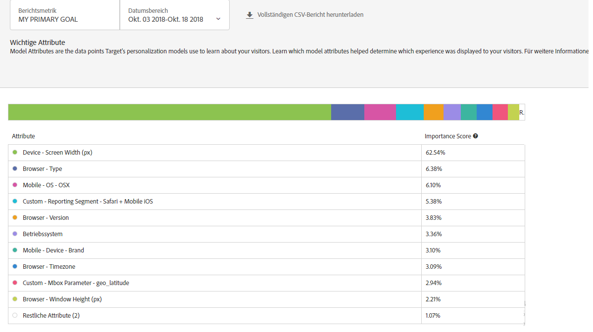

#  Bericht für wichtige Attribute{#important-attributes-report}

Informationen zum Bericht „Wichtige Attribute“, einem der beiden für Benutzer der AP (Automated Personalization)- und AT (Automatisches Targeting)-Aktivitäten verfügbaren speziellen Berichte.

>[!NOTE]
>
>Beachten Sie Folgendes, wenn Sie Personalization Insight-Berichte verwenden:
>
>* AP- und AT-Aktivitäten sind im Rahmen von [!DNL Target Premium] verfügbar. Sie sind nicht mit [!DNL Target Standard]ohne[!DNL Target Premium] Lizenz enthalten.
   >
   >
* [!UICONTROL Personalization Insights-Berichte sind nur für AP- und AT-Aktivitäten verfügbar, die ein Konversionsoptimierungsziel verwenden. ] Auch Aktivitäten, deren Optimierungsziel von Konversion zu Umsatz geändert wurde, nachdem die Aktivität bereits live war, werden nicht unterstützt.
   >
   >
* [!UICONTROL Personalization Insight] -Berichte stehen nur zur Verfügung, wenn das [!UICONTROL Primär Goal] aus der Dropdown-Liste [!UICONTROL Berichtsmetrik] ausgewählt wurde.
   >
   >
* Personalization Insights-Berichte werden nur in der [Standardumgebung](../../administrating-target/hosts.md) unterstützt.
   >
   >
* [!UICONTROL Personalization Insight] -Berichte werden nur für Aktivitäten generiert, die sich im [!UICONTROL Live] -Status befinden und die mindestens 15 Tage lang Traffic erhalten und aktiviert wurden.

In unterschiedlichen Aktivitäten sind Attribute mal mehr, mal weniger wichtig für die Personalisierungsentscheidung des Modells. Dieser Bericht stellt die wichtigsten Attribute, die das Modell beeinflusst haben, und ihre relative Bedeutung dar.

## Zugriff auf den Bericht „Wichtige Attribute“{#section_8E8F997AAAF44A1B9EE06EB6FB652801}

1. Click **[!UICONTROL Activities]**, then click the desired [Automated Personalization](../../c-activities/t-automated-personalization/automated-personalization.md#task_8AAF837796D74CF893CA2F88BA1491C9) or [Auto-Target](../../c-activities/auto-target-to-optimize.md#concept_67779E5B7F67427A97D7EA2A6FB919B3) activity from the list.

   Sollten Ihnen viele Aktivitäten zur Auswahl stehen, können Sie die Liste filtern, indem Sie Optionen aus den Dropdownlisten [!UICONTROL Typ], [!UICONTROL Status], [!UICONTROL Berichtsquelle], [!UICONTROL Experience Composer], [!UICONTROL Metriktyp] und [!UICONTROL Aktivitätsquelle] auswählen.

1. Klicken Sie auf **[!UICONTROL Berichte]**.

   The [Automated Personalization Summary](/help/c-reports/reports-ap.md) or [Auto-Target Summary](/help/c-reports/auto-target-summary-report.md) report displays, which provides information about the performance of your activities, represented by the first screen icon. Die beiden zusätzlichen Symbole stehen für die beiden Personalization Insights-Berichte: „Automatisierte Segmente“ und „Wichtige Attribute“. Beachten Sie, dass das automatische Targeting ein zusätzliches Diagrammsymbol für die grafische Ansicht des Berichts [!UICONTROL „Zusammenfassung“] umfasst.

   

   >[!IMPORTANT]
   >
   >Der Bericht [!UICONTROL Wichtige Attribute] steht erst nach mindestens 15 Tagen nach der Aktivierung Ihrer Aktivität zur Verfügung. Bis dahin können Sie nicht auf diesen Bericht zugreifen und das Symbol für [!UICONTROL „Wichtige Attribute“] ist ausgegraut. Nach 15 Tagen und sofern ausreichend personalisierter Traffic in Ihrer Aktivität verfügbar ist, ist der Bericht [!UICONTROL Wichtige Attribute] verfügbar.

1. 15 Tage nach der Aktivierung der Aktivität können Sie auf das Symbol **[!UICONTROL Wichtige Attribute]** klicken.

   

1. Wählen Sie den gewünschten Datumsbereich aus.

   Im Gegensatz zum Bericht [!UICONTROL „Zusammenfassung“] (Performance-Reporting) sind [!UICONTROL Personalization Insights], einschließlich [!UICONTROL „Wichtige Attribute“], nur für feste Zeiträume verfügbar: 15, 30, 45, 60 oder 90 Tage. Diese festen Datumsbereiche ermöglichen es [!UICONTROL Personalization Insights], ausreichend Daten anzusammeln, um zu verhindern, dass Insights aus kurzfristigen Mustern in Ihrer Aktivität abgeleitet werden. Die beiden Entscheidungen, die Sie beim Datumsbereich treffen können, sind „Enddatum“ und „Dauer“. „Start“ ist ausgegraut. Das Startdatum ändert sich automatisch basierend auf Ihrer Auswahl für Enddatum und Dauer.

   

   Sie können über die Dropdownliste [!UICONTROL „Dauer auswählen“] auf die verfügbaren festen Datumsbereiche zugreifen.

   

1. Überprüfen Sie die Daten des Berichts [!UICONTROL „Wichtige Attribute“].

   

1. (Optional) [Laden Sie den Bericht im CSV-Format herunter](../../c-reports/c-report-settings/report-settings.md#section_77E65C50BAAF4AB79242DB3A8778ADEF), um ihn in Excel und anderen Tools zu analysieren.

   >[!NOTE]
   >
   >Der Bericht „Personalization Insights UI“ enthält Informationen zur Auswahl. Der CSV-Download für den Bericht „Wichtige Attribute“ enthält zusätzliche Details. Der Download des Berichts „Wichtige Attribute“ enthält die vollständige Liste der 100 wichtigsten Attribute, während der UI-Bericht nur die wichtigsten 10 enthält. Wenn Sie im Bericht nach einem bestimmten Attribut suchen, es aber nicht enthalten ist, heißt das nicht, dass das entsprechende Attribut die Aktivität nicht beeinflusst hat. Es heißt nur, dass es nicht unter den 100 wichtigsten Attributen ist.

## Bericht für wichtige Attribute interpretieren

Folgende Tabelle enthält Informationen dazu, wie der Bericht zu interpretieren ist, und beschreibt seine Bestandteile:

| Element | Details |
|--- |--- |
| Balkendiagramm | Das mehrfarbige Balkendiagramm oben auf dem Bildschirm zeigt die relative Wichtigkeit und ordnet sie der Punktfarbe neben den Attributen in der Tabelle zu. Sie können auch mit dem Mauszeiger über eine Farbe im Balkendiagramm fahren, um das Attribut anzuzeigen, für das sie steht.  Die Bewertungen der wichtigsten Attribute ergeben zusammen 100 %. Weitere Informationen zum Hinzufügen zusätzlicher Attribute, die die Target-Personalisierungsmodelle verwenden können, finden Sie unter  [Hochladen von Daten für die Personalisierungsalgorithmen von Target](/help/c-activities/t-automated-personalization/uploading-data-for-the-target-personalization-algorithms.md). |
| Diagramm „Modell-Attribut-Ranking“ | Das Diagramm „Modell-Attribut-Ranking“ enthält die 10 Attribute, die für die Entscheidung des Target-Personalisierungsmodells, welche Inhalte welchem Besucher angezeigt werden sollen, am wichtigsten waren. Die Bewertung zeigt, wie wichtig ein bestimmter Wert (im Verhältnis zu den 100 wichtigsten Attributen) für die Target-Personalisierungsmodelle in dieser Aktivität waren. |

## Häufig gestellte Fragen zu wichtigen Attributen {#section_740910A52FA646B4AC9452F98C2F5719}

**Es sind noch keine Personalization Insights-Berichte für meine Aktivität verfügbar. Woran liegt das?**

Es kann verschiedene Gründe dafür geben, dass die [!UICONTROL Personalization Insights]-Berichte noch nicht für Ihre Aktivität verfügbar sind:

* Es sind noch keine 15 Tage seit Aktivierung der Aktivität vergangen. Die Berichte „Automatisierte Segmente“ und „Wichtige Attribute“ sind erst 15 Tage nach der Aktivierung der Aktivität verfügbar. Bis dahin können Sie nicht auf diese Berichte zugreifen und die Symbole für „Automatisierte Segmente“ und „Wichtige Attribute“ sind ausgegraut.
* Ihre Aktivität bietet nicht ausreichend Traffic im angegebenen Zeitraum. Nach 15 Tagen und sofern [ausreichend Personalisierungstraffic](/help/c-activities/auto-target-to-optimize.md#section_BA4D83BE40F14A96BE7CBC7C7CF2A8FB) in Ihrer Aktivität verfügbar ist, um die Personalisierungsmodelle zu erstellen, sind die Berichte „Automatisierte Segmente“ und „Wichtige Attribute“ verfügbar.
* Ihre Aktivität verfügt über ein Ziel zur Umsatzoptimierung. Zum jetzigen Zeitpunkt ist [!UICONTROL Personalization Insights] nur für Aktivitäten mit Zielen zur Konversionsoptimierung verfügbar. Wir werden die Unterstützung von Umsatzoptimierungszielen in einer künftigen Version ergänzen.

**Was ist ein Attribut?**

Ein Attribut ist eine Information zu einem Besucher oder seinem spezifischen Besuch, die von den Personalisierungsalgorithmen verwendet wird, um die Traffic-Personalisierung anzupassen. Bei einem Attribut kann es sich beispielsweise um den Browsertyp, den Standort, die Uhrzeit des Besuchs usw. handeln.

Weitere Informationen zu den Attributen, die [!DNL Target] in seinen Personalisierungsmodellen nutzt, finden Sie unter [Datenerfassung für die Personalisierungsalgorithmen von Target](../../c-activities/t-automated-personalization/ap-data.md#reference_255BD3DE7AD04DC9B766E0BC78961058). Weitere Informationen zum Hochladen neuer Attribute in Target für die Verwendung in den Personalisierungsmodellen von Target finden Sie unter [Verfahren für die Datenübernahme in Target](../../c-implementing-target/c-considerations-before-you-implement-target/c-methods-to-get-data-into-target/methods-to-get-data-into-target.md#concept_0069C0EFB56C4700BB33F2F35C2B9B17).

**Entsprechen die Informationen in den Berichten[!UICONTROL „Automatisierte Segmente“]und[!UICONTROL „Wichtige Attribute“]den Informationen im CSV-Download?**

Nein. Der UI-Bericht enthält ausgewählte Informationen. Der CSV-Download enthält zusätzliche Details. Der Download des Insights-Berichts „Automatisierte Segmente“ enthält im Vergleich zu den Segmenten in der Benutzeroberfläche zusätzliche automatisierte Segmente sowie Informationen zu ihrer Performance in Ihren Angeboten oder Erlebnissen. Der Bericht „Wichtige Attribute“ enthält die 100 wichtigsten Besucherattribute und ihre relative Wichtigkeit, während in der UI nur die 10 wichtigsten Besucherattribute angezeigt werden.

**Kann ich Personalization Insights für einen benutzerspezifischen Datumsbereich anzeigen?**

Personalization Insights (sowohl [!UICONTROL „Automatisierte Segmente“] als auch [!UICONTROL „Wichtige Attribute“]) ist nur für feste Zeiträume verfügbar: 15, 30, 45, 60 oder 90 Tage. Diese festen Datumsbereiche ermöglichen es [!UICONTROL Personalization Insights], ausreichend Daten anzusammeln, um zu verhindern, dass Insights aus kurzfristigen Mustern in Ihrer Aktivität abgeleitet werden. Sie können diese Zeiträume mit einem beliebigen Enddatum festlegen (sofern hierfür ausreichend Daten in der Aktivität vorhanden sind).

**Wie wird[!UICONTROL Personalization Insights]erstellt?**

[!UICONTROL Personalization Insights] wird mithilfe der patentierten Adobe-Technik namens MAGIX (Model Agnostic Globally Interpretable Explanations) erstellt. Weitere Informationen über MAGIX finden Sie im veröffentlichten Text des Adobe-Forschungsteams in der [arXiv.org-Website](https://arxiv.org/abs/1706.07160).

**Ist[!UICONTROL Personalization Insights]für umsatzbasierte Modellierungsziele/Primärziele verfügbar?**

Zum jetzigen Zeitpunkt ist [!UICONTROL Personalization Insights] nur für Aktivitäten mit Zielen zur Konversionsoptimierung verfügbar. Wir werden die Unterstützung von Umsatzoptimierungszielen in einer künftigen Version ergänzen.

**Wozu dient die Wichtigkeitsbewertung des Attributs im Bericht „Wichtige Attribute“?**

Die Wichtigkeitsbewertung im Abschnitt „Attribut-Wichtigkeitsbewertung“ des Berichts zeigt, welche Variablen, die der Algorithmus zum Lernen verwendet hat, bei der Aufteilung aller Besucher auf die vom Algorithmus ermittelten Segmente am wichtigsten waren. Den 100 wichtigsten vom Modell verwendeten Attributen wird eine prozentuale Bewertung zugewiesen.

**Warum erhalten in einem bestimmten automatisierten Segment manche Angebote/Erlebnisse mit einer geringeren Konversionsrate mehr Traffic als andere Angebote/Erlebnisse?**

Es kann verschiedene Gründe dafür geben, dass Ihnen in einem automatisierten Segment mehr Besuche für Angebote oder Erlebnisse mit einer geringeren Konversionsrate angezeigt werden:

* Geringe Anzahl von Aufrufen für manche oder alle Angebote/Erlebnisse eines bestimmten automatisierten Segments.
* Aktivitäten mit geringerem Volumen, in denen für bestimmte Angebote oder Erlebnisse keine Modelle erstellt wurden.
* Aktivitäten mit geringerem Volumen, in denen Modelle für einige Angebote/Erlebnisse früher erstellt wurden als andere. Beispiel: Ein zusätzliches Modell wurde am Tag 22 erstellt und Sie sehen sich Daten von den Tagen 10 bis 24 an.
* Targeting-Regeln in einem bestimmten Angebot, die einschränken, welchen Besuchern welche Angebote/Erlebnisse angezeigt werden.
* In den Insight-Berichten gibt es keine Konfidenzintervalle. Wenn jedoch die Konversionsraten nahe genug beieinander liegen, kann das Modell Traffic liefern, dessen punktuelles Volumen zwar höher ist, aber die Zahlen nicht „statistisch voneinander abweichen“.

Es kann hilfreich sein zu wissen, wie das Modell funktioniert, das Traffic bereitstellt. Jede einzelne Person wird auf der Grundlage ihres Gesamtprofils angesprochen. Die Insight-Berichte verallgemeinern dieses Verhalten jedoch, damit es von Menschen besser interpretiert werden kann. Daher schließen sich Segmente nicht gegenseitig aus. Dies kann zu einzelnen Segmenten führen, die dieses Verhalten aufweisen, da eine Person in mehreren Segmenten vorkommen kann.

**Wozu kann ich die Informationen in Personalization Insights nutzen?**

* Entdecken Sie neue Zielgruppen für Ihr Targeting: Wenn Sie ein bestimmtes automatisiertes Segment finden, das besonders gut abschneidet, können Sie hieraus eine Zielgruppe erstellen, die Sie als Segment in anderen Berichten verwenden können.
* Testen Sie Thesen dazu, welche Besuchertypen auf welche Erlebnisse reagieren.
* Ermitteln Sie, welche Inhalte für welche Besuchertypen funktionieren: Welche Angebote waren bei welchen Besuchern erfolgreich?
* Ermitteln Sie Gründe für Inhalte mit schlechter Performance.
* Finden Sie heraus, welche Attribute am wichtigsten für das Lernen des Modells waren.
* Ermitteln Sie, welche Attribute in den Personalisierungsmodellen eingesetzt werden und wie wichtig sie sind.
* Finden Sie Möglichkeiten für zusätzliche Datenpunkte, die Sie an Target übergeben können, um die Personalisierung weiter zu optimieren.