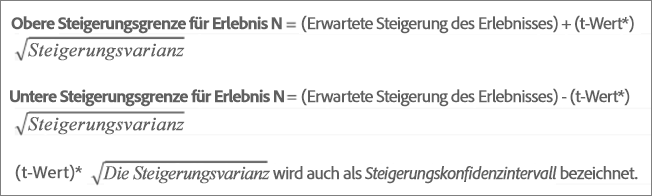
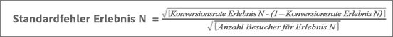
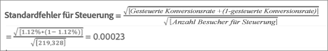
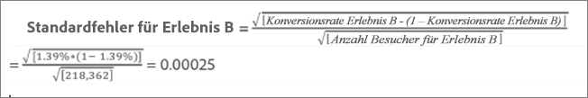
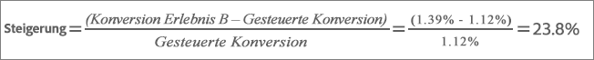
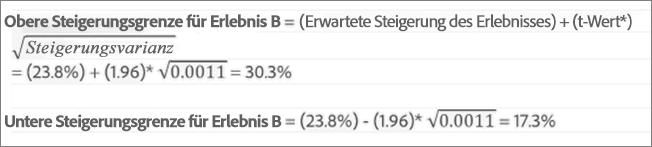

# Durchschnittliche Steigerung, Steigerungsgrenzen und Konfidenzintervall{#average-lift-lift-bounds-and-confidence-interval}

Berichte enthalten verschiedene Datenpunkte und Visualisierungsdarstellungen, anhand derer Sie die Steigerungsgrenzen und das Konfidenzniveau nachvollziehen können, die mit Ihrer Aktivität verbunden sind. Dadurch lässt sich ein Gewinner genauer ermitteln.

## Durchschnittliche Steigerung, Steigerungsgrenzen und Konfidenzintervall {#topic_AFFDC672A8A34D028B100EF6BE5D8129}

Berichte enthalten verschiedene Datenpunkte und Visualisierungsdarstellungen, anhand derer Sie die Steigerungsgrenzen und das Konfidenzniveau nachvollziehen können, die mit Ihrer Aktivität verbunden sind. Dadurch lässt sich ein Gewinner genauer ermitteln.

>[!NOTE]
>
>Diese Funktion ist nur verfügbar, wenn Berichte in der Tabellenansicht angezeigt werden. Diese Funktion steht nicht für Aktivitäten zur Verfügung, die [Analytics als Berichtsquelle verwenden (A4T)](../../c-integrating-target-with-mac/a4t/a4t.md#concept_7540C8C04259434AB6EE33B09F47A1DE).

## Überblick {#section_62C0D7E76F3D49A7B3C371C82AEF27D5}

Die Steigerungsinformationen auf der Benutzeroberfläche für den Target-Bericht enthalten Folgendes:

| Element | Details |
|--- |--- |
| Steigerung | Die große Anzahl und der Pfeil geben den erwarteten Steigerungswert an. Diese Anzahl entspricht dem Mittelpunkt des Bereichs der Steigerungsgrenzen. Der Pfeil für die erwartete Steigerung wird so lange in Grau angezeigt, bis die Konfidenz 95 % passiert. Nach diesem Schwellenwert wird der Pfeil jeweils in Abhängigkeit einer negativen oder positiven Steigerung in Rot oder Grün angezeigt. |
| Steigerungsgrenzen | Hierbei handelt es sich um das 95-%-Konfidenzintervall der Steigerung. Es wird als ein Bereich unterhalb der durchschnittlichen Steigerung angezeigt. Unter „Beispielberechnung“ unten finden Sie ein Beispiel dafür, wie diese Steigerungsgrenzen berechnet werden. |
| Boxplotdiagramm | Das Boxplotdiagramm auf der Target-Oberfläche stellt den erwarteten Wert und das betreffende 95-%-Konfidenzintervall der Erfolgsmetrik dar. Sie können sich dies als eine grafische Methode zum Anzeigen der Informationen zur Steigerung und zu den Steigerungsgrenzen vorstellen. Es gibt einige grundlegende Möglichkeiten, wie Target Sie beim Interpretieren der Konfidenzinformationen unterstützen kann. Eine davon ist Farbe. Das Diagramm zeigt das Konfidenzintervall eines spezifischen Erlebnisses, das sich mit dem Kontrollkonfidenzintervall überschneidet, in Grau an. Zudem zeigt es das Konfidenzintervall eines spezifischen Erlebnisses, das ober- oder unterhalb des Kontrollkonfidenzintervalls liegt, entsprechend in Grün oder Rot an. Die Länge des Boxplotdiagramms gibt leicht nachvollziehbar an, wie groß das Konfidenzintervall ist. Wenn Sie mehr Daten in Ihrer Aktivität sammeln, verlagert und ändert sich der Balken. Das Konfidenzintervall ergibt sich aus der Varianz und dem Stichprobenumfang (Anzahl der Besucher). Je kleiner die Varianz und je größer der Stichprobenumfang, desto enger ist Ihr Konfidenzintervall. |
| Konfidenz | Die Konfidenz eines Erlebnisses oder Angebots steht dafür, wie wahrscheinlich es ist, dass die Steigerung über das Kontrollerlebnis/-angebot des verbundenen Erlebnisses/Angebots „echt“ ist (und nicht durch eine zufällige Chance verursacht wird). In der Regel entsprechen 95 % dem empfohlenen Konfidenzniveau für eine signifikante Steigerung. |

Die folgende Illustration zeigt die Informationen zu den Steigerungsgrenzen und dem Konfidenzniveau:

## Wie werden Steigerungsgrenzen berechnet?  {#section_1D360781D972483693680BE0F07AEAD1}

Die Steigerungsgrenzen stellen 95-%-Konfidenzintervalle der Steigerung dar, die das spezifische Erlebnis oder Angebot gegenüber dem Kontrollerlebnis oder -angebot aufweist. Grob gesagt weist die tatsächliche Steigerung eine etwa 95%ige Chance auf, sich zwischen diesen Steigerungen zu befinden.

Die Steigerungsgrenzen werden mithilfe der folgenden Formel berechnet:

Es gibt einige zusätzliche Berechnungen, um zur Eingabe der Steigerungsgrenzen zu gelangen:

* **t-Wert:** Die kritische Statistik für unser Konfidenzniveau von 95% ist 1,96. Weitere Informationen zu [T-Werten finden Sie unter](https://en.wikipedia.org/wiki/T-statistic).
* **Steigerungsvarianz:** Der Standardfehler der Erfolgsmetrik von Erlebnis N und der Standardfehler der Erfolgsmetrik des Kontrollerlebnisses sind zum Ermitteln der Steigerungsvarianz erforderlich, was mithilfe der folgenden Formel (in der Abbildung ist die Erfolgsmetrik eine Konversion) berechnet wird.

   

* **Konversionsrate/Erfolgsmetrik-Standardfehler:** Der Standardfehler wird mit der folgenden Formel auf die gleiche Weise für Erlebnis N und die Kontrolle berechnet (in der Abbildung ist die Erfolgsmetrik eine Konversion). Informationen über den Standardfehler finden Sie [hier](https://en.wikipedia.org/wiki/Standard_error).

   

   >[!NOTE]
   >
   >Der Standardfehler für Aktivitäten mit Umsatzerfolgsmetriken basiert auf der Stichprobenvarianz des Umsatzes.

## Beispielberechnung {#section_35BD6FB7AFD346E28BA093147C248471}

Im Folgenden finden Sie eine Beispielaktivität mit zwei Erlebnissen und den folgenden Ergebnissen:

| Erlebnis | Besucher | Konversionen | Konversionsrate |
|--- |--- |--- |--- |
| Erlebnis A (Kontrolle) | 219, 328 | 2.466 | 1,12 % |
| Erlebnis B | 218, 362 | 3.040 | 1,39 % |

Anhand unserer Formeln können wir die für die Steigerungsgrenzen erforderlichen Eingaben berechnen.

**Standardfehler für Erlebnis A (Kontrolle)**

**Standardfehler für Erlebnis B**

**Steigerungsvarianz für Erlebnis B**

**Steigerungsgrenzen für Erlebnis B**

Erwartete Steigerung für Erlebnis B:

Daher würden die Steigerungsgrenzen für Erlebnis B wie folgt lauten:

>[!NOTE]
>
>Erwarten Sie geringfügige Abweichungen zwischen manuellen Berechnungen mit den oben genannten Formeln und den im Bericht angezeigten Zahlen. Diese Unterschiede stammen daher, dass die Seitenaufrufe für manuelle Berechnungen abgerundet werden. Der Anstieg im Target-Bericht basiert hingegen auf der exakten Anzahl, die auf der Interaktion insgesamt und der Interaktionsanzahl basiert. Die Interaktionszahlen können über die API des Performanceberichts abgerufen werden.

## Wann werden Steigerungsgrenzen nicht angezeigt? {#section_C5622E1E94684DAD937249B51A9E42CC}

In bestimmten Fällen zeigt Target Steigerungsgrenzen nicht an:

* Für Aktivitäten, wenn die Gesamtanzahl der Besuche oder Besucher niedriger als 30 ist.
* Für Aktivitäten vom Typ „Automatisch zuweisen“ werden die Steigerungsgrenzen erst angezeigt, nachdem ein Erlebnis eine Konfidenz von 60 % erreicht hat.

