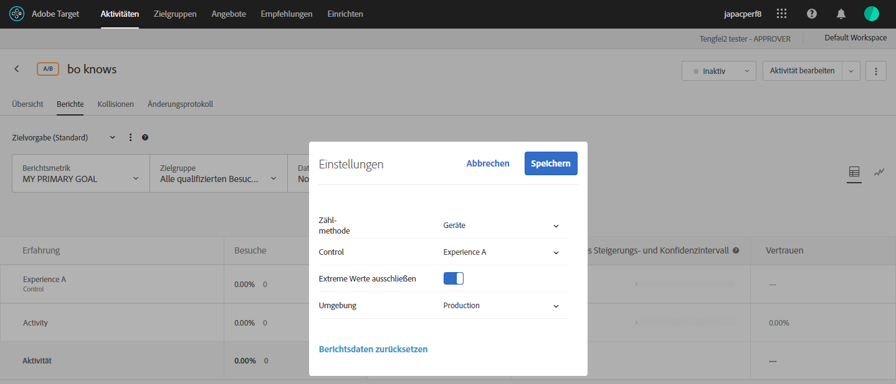

# Ausschließen von Extremwerten

Sie können Extremwerte von Berichten in [!DNL Adobe Target] ausschließen, sodass einige ungewöhnliche Bestellungen Ihre Aktivitäten nicht beeinflussen. Ein Beispiel für eine ungewöhnliche Bestellung ist, wenn ein Trainer Ausrüstungen für eine ganze Mannschaft kauft, anstatt dass einzelne Sportler individuell bestellen.

>[!NOTE]
>
>Die Flagge [!UICONTROL Extreme Werte ausschließen] gilt nur für Aktivitäten mit den Metriktypen Umsatz und Interaktion.

Extremwerte werden automatisch entsprechend den unten beschriebenen Regeln markiert. Sie können einstellen, ob extreme Werte in Ihren Bericht aufgenommen werden sollen oder nicht. Bei einer Aktivität, die seit einer Stunde läuft oder bei der 15 Bestellungen eingegangen sind (je nachdem, was zuerst eintritt), werden die extremen Werte automatisch ausgeschlossen.

Ein Wert wird als extrem betrachtet, wenn in den Daten des letzten Monats mehr als +/- 3 Standardabweichungen vom durchschnittlichen Bestellwert vorliegen (bis zu dem Zeitpunkt, zu dem die Berechnung vorgenommen wurde).

Bei der Verwendung von RPV ist der Filter für extreme Werte häufig nützlich. RPV kombiniert Konversionsraten und den durchschnittlichen Bestellwert und zeigt häufig die Unbeständigkeit dieser Metriken auf. Wenn Sie RPV verwenden und bestimmen, dass Aufträge nicht als normal verteilt angezeigt werden, sehen Sie normalere Ergebnisse, wenn Sie den Filter für extreme Bestellungen anwenden.

Wenn ein Wert als extrem markiert wurde, wird der Bestellwert durch den durchschnittlichen Bestellwert des Erlebnisses des letzten Monats ersetzt, wobei die Extreme ausgespart werden. Die Bestellung wird auch im Bericht [!UICONTROL Bestelldetails] und im CSV-Download für die täglichen Ergebnisse als extrem markiert.

**So schließen Sie extreme Werte aus Ihren Berichten aus:**

1. Öffnen Sie eine Aktivität, die die Metriktypen Umsatz oder Interaktion enthält, und klicken Sie dann auf die Registerkarte **[!UICONTROL Berichte]**.
1. Klicken Sie auf das Zahnradsymbol, um das Dialogfeld **[!UICONTROL Einstellungen]** anzuzeigen.

   

1. Schieben Sie den Umschalter **[!UICONTROL Extreme Werte ausschließen]** nach Bedarf an die Position &quot;Ein&quot;oder &quot;Aus&quot;.
1. Klicken Sie auf **[!UICONTROL Speichern]**.
