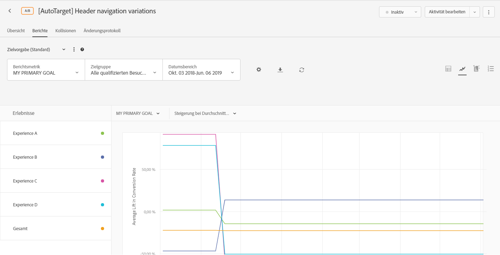
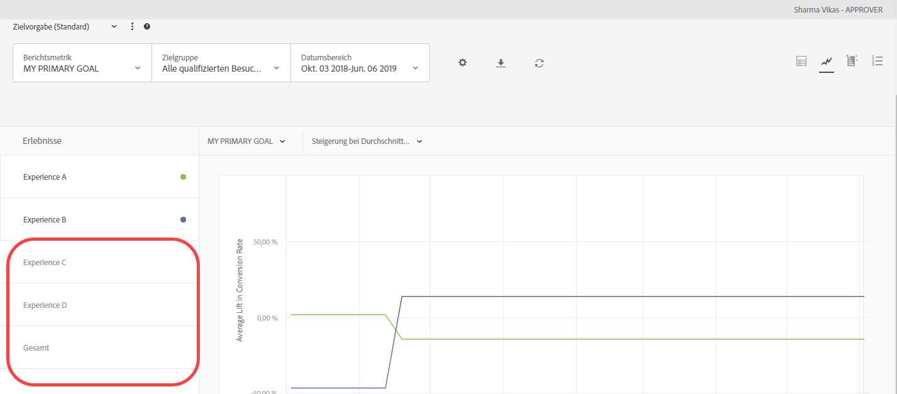
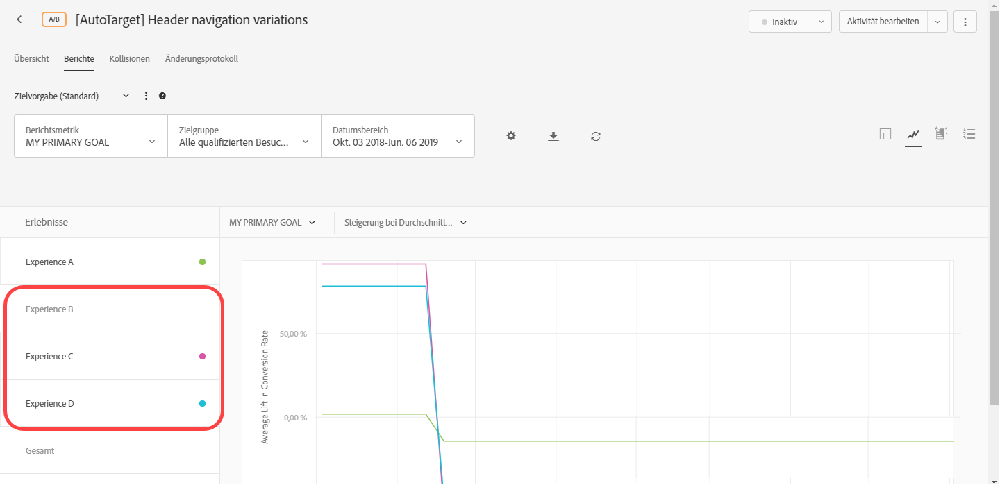

# Berichtseinstellungen{#report-settings}

Informationen dazu, wie Sie die Elemente festlegen können, die in Berichten aufgeführt werden sollen. Berichtseinstellungen können für eine spätere Verwendung gespeichert werden.

Möchten Sie einen Bericht anzeigen, klicken Sie auf **[!UICONTROL Aktivitäten]**, wählen Sie die gewünschte Aktivität aus der Liste aus und klicken Sie auf die Registerkarte **[!UICONTROL Berichte.]**

## Zielvorgabe {#section_51F67341465045BEB4F1A2FB638A8EB1}

Sie können bis zu zehn verschiedene Voreinstellungen für die Berichte der einzelnen Aktivitäten speichern, nachdem Sie sie wie gewünscht konfiguriert haben (Metriken, Zielgruppen, erweiterte Einstellungen usw.). Alle Target-Benutzer können die verschiedenen Voreinstellungen anzeigen, bearbeiten und löschen – unabhängig vom Ersteller.

Sie können auch einzelne Aktivitätsberichte nach Bedarf konfigurieren und als Standardeinstellung oder Favoriten speichern. So wird jedes Mal, wenn Sie den Bericht der entsprechenden Aktivität öffnen, diese Ansicht angezeigt.

### Vorgabe oder Standardvorgabe erstellen

1. Konfigurieren Sie den Bericht der Aktivität nach Bedarf.

   Die verfügbaren Einstellungen, einschließlich Metriken, Datumsbereiche, Audiencen, erweiterte Einstellungen usw., werden nachfolgend erläutert.

1. Klicken Sie neben **[!UICONTROL Target-Vorgabe]** auf das Symbol mit den drei vertikalen Ellipsen und anschließend auf **[!UICONTROL Als neu speichern]**.

   

   Das Dialogfeld für eine neue Voreinstellung wird angezeigt:

   

1. Überprüfen Sie die Informationen in den Abschnitten „Filter“ und „Einstellungen“, um sicherzustellen, dass der Bericht wie gewünscht konfiguriert ist, und geben Sie dann den **[!UICONTROL Vorgabenamen]** (bis zu 50 Zeichen) an.
1. (Optional) Wenn Sie die Berichtsansicht als Standard oder Favoriten festlegen möchten, aktivieren Sie **[!UICONTROL Als Standardeinstellung festlegen]**.
1. Klicken Sie auf **[!UICONTROL Speichern]**.

### Select a different preset

Wählen Sie die gewünschte Voreinstellung aus der Dropdownliste **[!UICONTROL Zielvorgabe]** aus.

### Voreinstellung bearbeiten

1. Wählen Sie die Voreinstellung aus, die Sie bearbeiten möchten.
1. Bearbeiten Sie die Berichtskonfiguration wie gewünscht (Metriken, Datumsbereiche, Zielgruppen, erweiterte Einstellungen usw.).

   Wenn Sie nach der Bearbeitung der Konfiguration auf [!UICONTROL Speichern] klicken, wird ein Sternchen (*) hinter dem Voreinstellungsnamen angezeigt, das angibt, dass die Voreinstellung geändert wurde (siehe unten):

   

1. Klicken Sie auf das Symbol mit den drei vertikalen Ellipsen und anschließend auf **[!UICONTROL Als neu speichern]**, um eine neue Vorgabe zu erstellen.

   Oder

   Klicken Sie auf das Symbol mit den drei vertikalen Ellipsen und anschließend auf **[!UICONTROL Aktualisieren]**, um die aktuelle Vorgabe zu ändern.

   

### Delete a preset

1. Wählen Sie die Voreinstellung aus, die Sie löschen möchten.
1. Klicken Sie auf das Symbol mit den drei vertikalen Ellipsen und anschließend auf **[!UICONTROL Löschen]**.

   

1. Klicken Sie erneut auf **[!UICONTROL Löschen]**, um den Löschvorgang zu bestätigen.

### Vorgabenfehlerverarbeitung

Warnhinweise und Meldungen weisen Sie darauf hin, wenn eine Voreinstellung ungültig ist. Die Hinweise oder Meldungen enthalten Anweisungen zur Auswahl einer anderen Zielgruppe, Metrik oder Hostgruppe oder eines anderen Erlebnisses, um das Problem zu beheben.

Die folgende Liste enthält Beschreibungen zu verschiedenen Situationen, in denen Voreinstellungen ungültig sein können:

* Eine Berichtsgruppe wurde aus der Aktivität entfernt, ist jedoch noch in der Definition der Voreinstellung enthalten.
* Mindestens eine Metrik wurde gelöscht, ist jedoch noch in der Definition der Voreinstellung enthalten (wenn Sie beispielsweise eine oder mehrere Metriken aus der Aktivität löschen und anschließend neue Metriken hinzufügen).
* Mindestens eine Hostgruppe wurde gelöscht, ist jedoch noch in der Definition der Voreinstellung enthalten.
* Mindestens ein Erlebnis wurde gelöscht, ist jedoch noch in der Definition der Voreinstellung enthalten.
* Eine Voreinstellung weist eine fehlerhafte Semantik auf, da referenzierte Elemente zwar vorhanden sind, aber auf eine Weise aktualisiert wurden, die sich auf die Semantik der Einstellungsdefinition ausgewirkt hat. Gehen Sie beispielsweise von einer Voreinstellung namens „Umsätze über Chrome“ aus. Nach Erstellung der Voreinstellung ändern Sie die Aktivität, damit sie die Konversions- statt der Umsatzmetrik misst. Durch dieses Update der Definition der Aktivität wird die voreingestellte Definition semantisch ungültig.

## Berichtsmetrik {#section_894ABD7148244806B7CE556EBBA2AD62}

Klicken Sie auf die Dropdown-Liste **[!UICONTROL Berichtsmetrik]**, um eine andere [Erfolgsmetrik](../../c-activities/r-success-metrics/success-metrics.md#reference_D011575C85DA48E989A244593D9B9924) oder mehrere Metriken auszuwählen, die im Graph und Diagramm angezeigt werden sollen.

Standardmäßig wird die primäre Metrik in der Einrichtung der Erfolgsmetriken beim Erstellen der Aktivität bestimmt. Wenn Sie die Einrichtung ändern und die Aktivität erneut speichern, wird die primäre Metrik für die Berichterstattung aktualisiert.

Weitere Informationen zum Auswählen mehrerer Metriken für die Anzeige in Berichten finden Sie unter  [Mehrere Metriken in einem Bericht anzeigen](../../c-reports/c-report-settings/view-multiple-metrics.md#concept_9E3C3F6F3EC1412FAF252975AC0720B7).

## Zielgruppe {#section_70926EB4618945D9AFF2B0564FF3717B}

Klicken Sie auf die Dropdown-Liste [!UICONTROL Zielgruppe], um die angezeigte Zielgruppe für den Bericht zu ändern.

Weitere Informationen finden Sie unter [Zielgruppen](../../c-target/target.md#concept_A782F8481A5041EBA75103CB26376522).

## Datumsbereich {#section_A410A768403C4E01891F95CB357E63ED}

Im Feld Datumsbereich wird der aktuelle Datumsbereich des Berichts angezeigt. Klicken Sie auf das Dropdownsymbol, um einen Kalender anzuzeigen, in dem Sie den Datumsbereich des Berichts ändern können.

Wählen Sie neue **[!UICONTROL Start-]** und **[!UICONTROL Enddaten]** für den Bericht aus. Sie können auch die Kontrollkästchen **[!UICONTROL Vom Start der Aktivität]** und **[!UICONTROL Bis Ende von Aktivität]** verwenden.

Klicken Sie auf **[!UICONTROL Benutzerdefinierte Daten]**, um die vordefinierten Datumsbereiche auszuwählen: Letzte 7 Tage, Letzte 15 Tage oder Letzte 30 Tage. Diese vordefinierten Datumsbereiche werden automatisch weiterverschoben. Wenn das Startdatum weniger als die ausgewählte Anzahl von Tagen zurückliegt, zeigt der Kalender den Bereich ab dem Startdatum an, bewegt sich jedoch weiter, sobald das Startdatum mehr als die ausgewählte Anzahl von Tagen zurückliegt, während sich die Dauer der Aktivität erhöht..

Für Berichte gelten folgende Datenbeschränkungen:

* Das Startdatum des Berichts muss innerhalb der letzten beiden Jahre liegen.
* Tägliche Berichte sind auf 100 Tage beschränkt.
* Stündliche Berichte sind auf 15 Tage beschränkt.

## Einstellungen {#section_D99CE462107D45CABE0960F820E1E972}

Klicken Sie auf das Zahnradsymbol, um die Berichtseinstellungen zu konfigurieren, und anschließend auf **[!UICONTROL Einstellungen speichern]**, wenn Sie alle gewünschten Änderungen vorgenommen haben.

In der folgenden Illustration ist das Einstellungsdialogfeld für eine A/B-Aktivität dargestellt:

Die Optionen variieren abhängig vom gewählten Aktivitätstyp:

* **Zählmethodik:** Wählen Sie die gewünschte Methodik aus:

   * Besuchern
   * Besuchen
   * Aktivitätsimpressionen

* **Kontrolle:** Wählen Sie das zu verwendende Kontrollerlebnis für Berechnung und Vergleich der Steigerung.
* **Umgebung:** Wählen Sie die Umgebung (Hostgruppe), die für den Bericht verwendet werden soll.  Weitere Informationen finden Sie unter [Hosts](../../administrating-target/hosts.md#concept_516BB01EBFBD4449AB03940D31AEB66E).
* **Berichtsdaten zurücksetzen:** Berichtsdaten zurücksetzen, um alte Daten zu löschen. Aktuelle Besucher bleiben Teil der Aktivität.  Diese Option ist nur für Benutzer mit Genehmigerberechtigungen verfügbar.

   >[!IMPORTANT]
   >
   >Dies ist eine dauerhafte Aktion und kann nicht rückgängig gemacht werden.

* **Extreme Werte ausschließen:** Die Einstellung [!UICONTROL „Extreme Werte ausschließen“] gilt ausschließlich für Aktivitäten mit den Metriktypen Umsatz und Interaktion. Weitere Informationen finden Sie unter [Ausschließen extremer Bestellungen](../../c-reports/c-report-settings/excluding-extreme-orders.md#task_2AE7743FFCDD466DAEEB720BE5F33DAA).

## Download {#section_77E65C50BAAF4AB79242DB3A8778ADEF}

Klicken Sie auf das Symbol „Herunterladen“, um Berichtsdaten in einem [!DNL .csv] Format herunterzuladen, mit dem schnell in Excel, Access oder andere Datenanalyseprogramme importiert werden kann. Weitere Informationen finden Sie unter [Herunterladen von Daten in einer CSV-Datei](../../c-reports/downloading-data-in-csv-file.md#concept_3F276FF2BBB2499388F97451D6DE2E75).

## Aktualisieren {#section_E203729F2F314DF3856D2EE67C60B370}

Klicken Sie auf das Aktualisierungssymbol, um die Tabellen- und Diagrammansicht eines Berichts zu aktualisieren, ohne dass die gesamte Seite, die Konfiguration oder der Datumsbereich aktualisiert werden muss.

## More options {#section_AB1B5C695D7045A0A0AC0E2698D2E7DE}

Klicken Sie auf das Symbol für weitere Optionen (drei vertikale Ellipsen), um auf die Optionen [!UICONTROL „Aktivität bearbeiten“] und [!UICONTROL „Erlebnis-URLs anzeigen“] zuzugreifen.

## Optionen für Ansichten

Der Bericht kann je nach Aktivität in verschiedenen Formaten Ansicht werden. Wählen Sie die gewünschte Option aus.

* **Ansicht** der Tabelle: Klicken Sie auf das Symbol **[!UICONTROL Tabellenansicht]** , um den Bericht als Tabelle Ansicht.
* **Graph View**: Click the **[!UICONTROL Graph View]** icon to view the report as a graph.
* **Automatisierte Segmente**:(Nur für Aktivitäten mit Automated Personalization (AP) und Auto-Zielgruppe (AT) verfügbar.) Klicken Sie auf das Symbol **[!UICONTROL Automatisierte Segmente] , um den Bericht [&quot;](/help/c-reports/c-personalization-insights-reports/automated-segments-report.md)Automatisierte Segmente&quot;Ansicht.
* **Wichtige Attribute**: (Nur für Aktivitäten mit Automated Personalization (AP) und Auto-Zielgruppe (AT) verfügbar.) Klicken Sie auf das Symbol **[!UICONTROL Wichtige Attribute] , um den Bericht &quot; [Wichtige Attribute&quot;Ansicht](/help/c-reports/c-personalization-insights-reports/important-attributes-report.md).

## Durchschnittliche Steigerung, Steigerungsgrenzen und Konfidenzintervall {#section_0D87615B1D3344B3858BA494EEBC16FB}

Berichte enthalten verschiedene Datenpunkte und Visualisierungsdarstellungen, anhand derer Sie die Steigerungsgrenzen und das Konfidenzniveau nachvollziehen können, die mit Ihrer Aktivität verbunden sind. Dadurch lässt sich ein Gewinner genauer ermitteln.

Weitere Informationen finden Sie unter [Durchschnittliche Steigerung, Steigerungsgrenzen und Konfidenzintervall](../../c-reports/c-report-settings/average-lift-bounds-and-confidence-interval.md#topic_AFFDC672A8A34D028B100EF6BE5D8129).

Beachten Sie Folgendes:

* Nur verfügbar, wenn Berichte in der Tabellenansicht angezeigt werden.
* Diese Funktion steht nicht für Aktivitäten zur Verfügung, die [Analytics als Berichtsquelle verwenden (A4T)](/help/c-integrating-target-with-mac/a4t/a4t.md).

## Ortsbeschränkung  {#section_5832F126AC114AE1ABFFF4D9B904393B}

Klicken Sie auf das Symbol **[!UICONTROL Location Contribution]**, um den Bericht zu wechseln, sodass der Beitrag nach Standort angezeigt wird.

## Erlebnisse {#section_3A450DE1FA7E43F0AAB73165EC3D1C34}

(Nur verfügbar, wenn der Bericht in Grafikansicht dargestellt wird)

Wählen Sie auf der linken Seite des Diagramms Erlebnisse aus oder heben Sie die Auswahl auf, um die entsprechenden Erlebnisse in das Diagramm ein- oder aus dem Diagramm auszublenden.

In der folgenden Abbildung werden nur die Erlebnisse Default, Mid-East und Total im Bericht angezeigt. Das Asien-Erlebnis wird im Diagramm ausgeblendet.

## Gleitendes Mittel {#section_59066693158C4433B87D07402C2BC6CD}

(Nur verfügbar, wenn der Bericht in Grafikansicht dargestellt wird)

&quot;Running Average&quot;spiegelt die kumulativen Konvertierungen (vom Beginn des Berichte-Fensters bis zum im Diagramm dargestellten Datum) dividiert durch die kumulativen Besucher wider.

Wählen Sie die gewünschte Grafikansicht:

* Gleitendes Mittel
* Gleitendes Mittel der Steigerung
* Täglich Control
* Tägliches Targeting
* Tägliche Steigerung

>[!NOTE]
>
>Der Name dieser Dropdown-Liste hängt von der ausgewählten Ansicht ab, es handelt sich jedoch um eine der oben aufgeführten Ansichten.

## Zählmethodik {#section_01B0ED5665C74AE1AE97259800190C3E}

(Nur verfügbar, wenn der Bericht in Grafikansicht dargestellt wird)

Sie können die Zählmethodologie für Diagramme in Berichten wählen. Beachten Sie, dass dies für Aktivitäten zur automatisierten Personalisierung (AP) nicht unterstützt wird.

Wenn Sie auf die Option „Zählmethodologie“ zugreifen möchten, während Sie einen Bericht im Diagrammmodus anzeigen, klicken Sie auf das Dropdown-Menü **[!UICONTROL Mein primäres Ziel]** und wählen Sie dann die Zählmethodologie aus.

Die Zählmethodologie ist identisch mit der Auswahl im Dialogfeld [!UICONTROL Einstellungen], wie zuvor beschrieben.

Standardmäßig wird das Diagramm im Modus [!UICONTROL Täglich] gezeichnet.

You can change the mode by clicking the [!UICONTROL Daily] drop-down list, then selecting a cumulative option.

>[!NOTE]
>
>Der Name dieser Dropdown-Liste hängt vom ausgewählten Modus ab.

Für Aktivitäten zum automatischen Targeting existieren vier Modi: tägliche Kontrolle, tägliches Targeting, kumulative Kontrolle und kumulatives Targeting.

Die Standardreihenfolge, in der das Diagramm gezeichnet wird, lautet wie folgt:

* **A/B Tests (including Auto-Allocate and Automated Personalization)**: Order of experience creation, in descending order.
* **Experience Targeting (XT)**: Order of experiences in the activity.
* **Multivarianz-Test (MVT)**: Alphabetisch nach Erlebnisname.
* **Recommendations**: Reihenfolge der Erlebniserstellung in absteigender Reihenfolge.

Beachten Sie beim Arbeiten mit den Optionen zur Zählmethodologie die folgenden Widersprüche:

* For [Auto-Target activities](/help/c-activities/auto-target-to-optimize.md), there is no option for selecting &quot;Visitors&quot; as the counting methodology. Das automatische Targeting ist der einzige Aktivitätstyp, der nicht basierend auf Besuchern dargestellt werden kann.
* For activities that use [Analytics as the reporting source (A4T)](/help/c-integrating-target-with-mac/a4t/a4t.md), you cannot plot Visitor, Visit, or Impression cumulatively.

## Working with graphs that have more than 16 experiences in the activity

Wenn eine Aktivität weniger als 16 Erlebnisse umfasst, wird jedes Erlebnis im Diagramm mit einer anderen Farbe gezeichnet.

Hat eine Aktivität mehr als 16 Erlebnisse, werden die farbigen Linien für die ersten 16 Erlebnisse im Diagramm angezeigt. Die restlichen Erlebnisse werden im Bereich „Erlebnisse“ auf der linken Seite ausgegraut, und im Diagramm werden keine entsprechenden Darstellungslinien angezeigt. Es können jeweils nur die Linien für 16 Erlebnisse angezeigt werden.

Wenn Sie die Maus über eines der ausgegrauten Erlebnisse bewegen, wird im Diagramm vorübergehend eine neue graue Darstellungslinie angezeigt, die dem jeweiligen Erlebnis entspricht. Wenn Sie die Darstellungslinie eines ausgegrauten Erlebnisses in einer Farbe anzeigen möchten, können Sie ein farbig angezeigtes Erlebnis deaktivieren, indem Sie zunächst auf den zugehörigen Namen klicken und dann das gewünschte ausgegraute Erlebnis auswählen, indem Sie auf den zugehörigen Namen klicken.

Die folgende Abbildung zeigt als Beispiel das Diagramm einer Aktivität mit 26 Erlebnissen:

In dem Diagramm werden die Linien für die ersten 16 Erlebnisse angezeigt (es liegen einige Überschneidungen vor, daher sind scheinbar weniger als 16 Linien vorhanden). Der farbige Punkt im Bereich „Erlebnisse“ auf der linken Seite neben den einzelnen Erlebnisnamen gibt an, dass die Darstellungslinie des Erlebnisses in der entsprechenden Farbe angezeigt wird.

Wenn Sie im Bereich „Erlebnisse“ einen Bildlauf nach unten durchführen, werden Sie feststellen, dass die Namen für das 17. bis 26. Erlebnis ausgegraut sind, wie in der folgenden Abbildung dargestellt:

Wenn Sie die Maus über eines der ausgegrauten Erlebnisse bewegen, wird im Diagramm vorübergehend eine neue graue Darstellungslinie angezeigt, die dem jeweiligen Erlebnis entspricht.

Angenommen, Sie möchten die Darstellungslinie für Erlebnis R anzeigen, während die Line für Erlebnis P nicht angezeigt werden soll. Sie können auf den Namen von Erlebnis P klicken, um dessen Auswahl aufzuheben, und Sie können dann auf den Namen von Erlebnis R klicken, um es auszuwählen, wie unten dargestellt:

