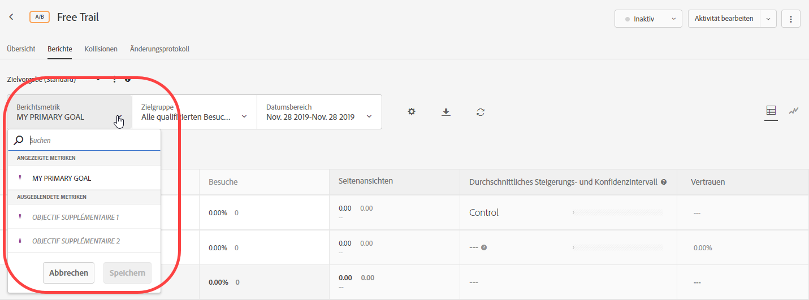
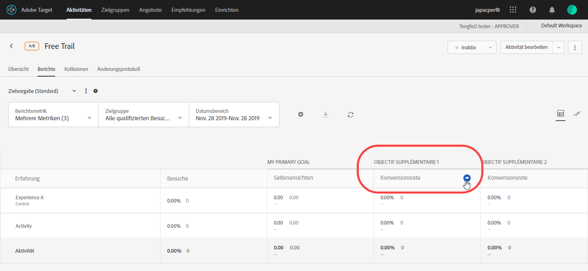
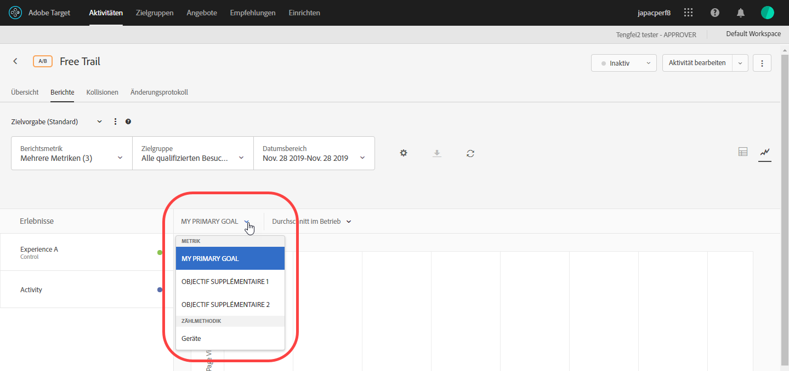

# Anzeigen mehrerer Metriken in einem Bericht{#view-multiple-metrics-in-a-report}

Sie können mehrere zu Ansicht Metriken in einem [!DNL Adobe Target]-Bericht auswählen.

Beachten Sie beim Arbeiten mit mehreren Metriken in Berichten die folgenden Informationen:

* Die Möglichkeit zur Ansicht mehrerer Metriken ist nur für die Aktivitäten [A/B-Test](/help/c-activities/t-test-ab/test-ab.md), [Automatisierte Zuordnung](/help/c-activities/automated-traffic-allocation/automated-traffic-allocation.md), [Automatische Zielgruppe](/help/c-activities/auto-target/auto-target-to-optimize.md) und [Erlebnis-Targeting](/help/c-activities/t-experience-target/experience-target.md) (XT) verfügbar.
* Sie können einem Bericht nicht mehr als 20 Metriken für eine Aktivität hinzufügen, die [Analytics für Zielgruppe](/help/c-integrating-target-with-mac/a4t/a4t.md) (A4T) verwendet. Sie können für Aktivitäten, die A4T verwenden, so viele Metriken wie in Ihrer Aktivität hinzufügen, die *nicht* verwenden.
* Wenn Sie mehrere Metriken ausgewählt haben, können Sie die Option Download nicht zum Herunterladen von Berichten in CSV verwenden. Zum Aktivieren der Option [!UICONTROL Download] dürfen Sie nur eine einzelne Metrik auswählen.
* Für Aktivitäten, die vor der [!DNL Target]-Version vom Juli 2015 (30. Juli 2015) erstellt wurden, können nicht mehrere Metriken Ansicht werden.

**So wählen Sie mehrere Metriken für die Anzeige im Bericht aus:**

1. Möchten Sie einen Bericht anzeigen, klicken Sie auf **[!UICONTROL Aktivitäten]**, wählen Sie die gewünschte Aktivität aus der Liste aus und klicken Sie auf die Registerkarte **[!UICONTROL Berichte.]**
1. Klicken Sie auf die Dropdownliste **[!UICONTROL Berichtsmetrik]**, um die Listen [!UICONTROL Angezeigte Metriken] und [!UICONTROL Ausgeblendete Metriken] anzuzeigen.

   

   Mithilfe des Feldes [!UICONTROL Suche] können Sie schnell verfügbare Metriken finden, die der Liste [!UICONTROL Angezeigte Metriken] hinzugefügt werden sollen.

   Beachten Sie, dass Sie in den beiden Modi [!UICONTROL Tabellenansicht] und [!UICONTROL Diagrammansicht] des Berichts mehrere Metriken auswählen können.

1. Bewegen Sie den Mauszeiger über die gewünschten Metriken in der Liste [!UICONTROL Ausgeblendete Metriken] und klicken Sie dann auf **[!UICONTROL Auswählen]**, um sie in die Liste [!UICONTROL Angezeigte Metriken] zu verschieben.

   Oder

   Verschieben Sie die gewünschten Metriken per Drag-and-drop von der Liste [!UICONTROL Ausgeblendete Metriken] in die Liste [!UICONTROL Angezeigte Metriken].

   Die Liste [!UICONTROL Angezeigte Metriken] muss mindestens eine Metrik enthalten.

   Sie können die Metriken neu anordnen, indem Sie sie per Drag-and-drop in der Liste [!UICONTROL Angezeigte Metriken] in die gewünschte Reihenfolge bringen. Die ausgewählte Reihenfolge wird in der [!UICONTROL Ansicht] und [!UICONTROL Grafik-Ansicht] angezeigt. Wenn Sie eine Metrik aus der Liste [!UICONTROL Angezeigte Metriken] entfernen möchten, bewegen Sie Ihren Mauszeiger über die Metrik und klicken Sie dann auf das **X**-Symbol.

1. Klicken Sie auf **[!UICONTROL Speichern]**, wenn Sie fertig sind.
1. (Bedingt) Bewegen Sie beim Anzeigen des Berichts in der Ansicht [!UICONTROL Tabelle] den Mauszeiger auf die Spaltenüberschrift einer Metrik, um einen blauen Pfeil anzuzeigen. Klicken Sie auf den Pfeil, um die Tabelle zu erweitern und [!UICONTROL Lift] und [!UICONTROL Vertrauen] für die jeweilige Metrik anzuzeigen.

   

   Sie können nur jeweils eine Metrik/Spalte erweitern. Klicken Sie erneut auf den Pfeil, um die Spalten zu reduzieren.

1. (Bedingt) Beim Anzeigen des Berichts in der Ansicht &quot;Diagramm&quot;können Sie die einzelnen Metriken auswählen, die in der Dropdown-Liste angezeigt werden sollen:

   

