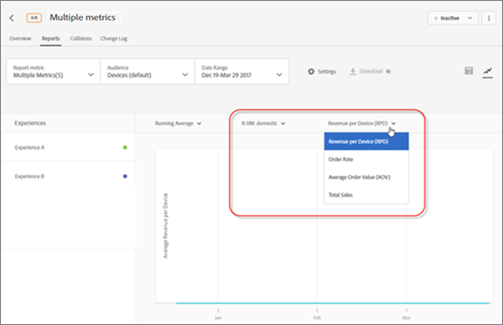

# Anzeigen mehrerer Metriken in einem Bericht{#view-multiple-metrics-in-a-report}

Auswählen mehrerer Metriken für die Anzeige in einem Bericht.

Beachten Sie beim Arbeiten mit mehreren Metriken in Berichten die folgenden Informationen:

* Die Möglichkeit, mehrere Metriken anzuzeigen, ist nur für A/B- und Experience Targeting (XT)-Aktivitäten verfügbar.
* Sie können für eine Aktivität, bei der Analytics for Target (A4T) verwendet wird, einem Bericht maximal 20 Metriken hinzufügen. Berichten für Aktivitäten, die A4T nicht verwenden, können Sie so viele Metriken hinzufügen, wie in Ihrer Aktivität vorhanden sind.
* Wenn Sie mehrere Metriken ausgewählt haben, können Sie die Option [!UICONTROL Download] nicht zum Herunterladen von Berichten in CSV verwenden. Zum Aktivieren der Option [!UICONTROL Download] dürfen Sie nur eine einzelne Metrik auswählen.
* Für Aktivitäten, die vor der Target-Version vom Juli 2015 erstellt wurden (30. Juli 2015), können Sie nicht mehrere Metriken anzeigen.

**So wählen Sie mehrere Metriken für die Anzeige im Bericht aus:**

1. Möchten Sie einen Bericht anzeigen, klicken Sie auf **[!UICONTROL Aktivitäten]**, wählen Sie die gewünschte Aktivität aus der Liste aus und klicken Sie auf die Registerkarte **Berichte[!UICONTROL .]**
1. Klicken Sie auf die Dropdownliste **[!UICONTROL Berichtsmetrik]**, um die Listen [!UICONTROL Angezeigte Metriken] und [!UICONTROL Ausgeblendete Metriken] anzuzeigen.

   

   Mithilfe des Feldes [!UICONTROL Suche] können Sie schnell verfügbare Metriken finden, die der Liste [!UICONTROL Angezeigte Metriken] hinzugefügt werden sollen.

   Beachten Sie, dass Sie in den beiden Modi [!UICONTROL Tabellenansicht] und [!UICONTROL Diagrammansicht] des Berichts mehrere Metriken auswählen können.

1. Bewegen Sie den Mauszeiger über die gewünschten Metriken in der Liste [!UICONTROL Ausgeblendete Metriken] und klicken Sie dann auf **[!UICONTROL Auswählen]**, um sie in die Liste [!UICONTROL Angezeigte Metriken] zu verschieben.

   Oder

   Verschieben Sie die gewünschten Metriken per Drag-and-drop von der Liste [!UICONTROL Ausgeblendete Metriken] in die Liste [!UICONTROL Angezeigte Metriken].

   Die Liste [!UICONTROL Angezeigte Metriken] muss mindestens eine Metrik enthalten.

   Sie können die Metriken neu anordnen, indem Sie sie per Drag-and-drop in der Liste [!UICONTROL Angezeigte Metriken] in die gewünschte Reihenfolge bringen. Die ausgewählte Reihenfolge spiegelt sich in der Tabellenansicht und der Diagrammansicht wider. Wenn Sie eine Metrik aus der Liste [!UICONTROL Angezeigte Metriken] entfernen möchten, bewegen Sie Ihren Mauszeiger über die Metrik und klicken Sie dann auf das **X**-Symbol.

1. Klicken Sie auf **[!UICONTROL Speichern], wenn Sie fertig sind.**
1. Während Sie den Bericht in der Tabellenansicht anzeigen, bewegen Sie Ihren Mauszeiger auf die Spaltenüberschrift einer beliebigen Metrik, um einen blauen Pfeil anzuzeigen. Klicken Sie auf den Pfeil, um die Tabelle zu erweitern und [!UICONTROL Lift] und [!UICONTROL Vertrauen] für die jeweilige Metrik anzuzeigen.

   

   Sie können nur jeweils eine Metrik/Spalte erweitern. Klicken Sie erneut auf den Pfeil, um die Spalten zu reduzieren.

1. Beim Anzeigen des Berichts in der Diagrammansicht können Sie in der Dropdownliste einzelne Metriken für die Anzeige auswählen:

   

   Gleichermaßen erscheint beim Anzeigen des Berichts in der Diagrammansicht die Umsatzdimension als Dropdownliste:

   

