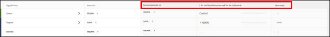
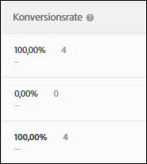
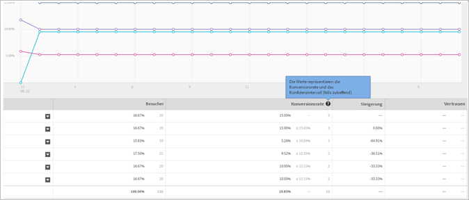
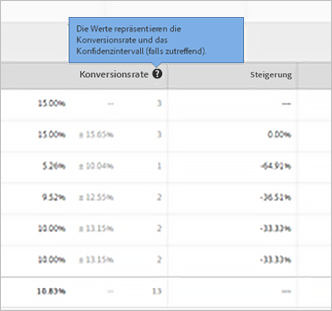
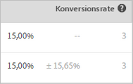

# Konversionsrate

Für jedes Erlebnis werden Konversionsrate, Steigerung, Konfidenz (statistische Bedeutung) und Konfidenzintervall in einem Bericht festgehalten.

In der folgenden Illustration wird die Diagrammüberschrift für eine Beispielaktivität in dargestellt, wobei die Überschriften [!UICONTROL Konversionsrate], [!UICONTROL Lift] und [!UICONTROL Konfidenz] hervorgehoben wurden.

>[!NOTE]
>
>Duplizierte Bestellungen werden in allen Daten ignoriert, wenn ein `orderID` übergeben wird. Im Audit-Bericht werden die ignorierten duplizierten Bestellungen aufgelistet.

## Konversionsrate {#section_07A36846C4E84D0881906809B9CE5A74}

Zeigt die mittlere Konversionsrate, die Konfidenz, das Intervall und die Anzahl der Konversionen an.

Betrachten Sie zum Beispiel die folgende Berichtsspalte „Konversionsrate“:

Die erste Zeile ist das Kontrollerlebnis. Es zeigt eine Konversion von 15 Prozent mit drei Konversionen. Die zweite Zeile, Erlebnis B, zeigt eine Konversionsrate von 15 Prozent mit einem Konfidenzintervall von plus oder minus 15,65 Prozent und drei Konversionen an.

>[!NOTE]
>
>Derzeit wird das Konfidenzintervall nur für binäre Metriken berechnet.

## Steigerung {#section_0F409572C720433D9378092ABC999982}

Vergleicht für jedes Erlebnis die Konversionsrate mit dem Kontrollerlebnis.

Steigerung = (Erlebnis-CR - Kontroll-CR) / Kontroll-CR

Wenn die Kontrollinstanz 0 ist, gibt es keine prozentuale Steigerung.

## Konfidenz (statistische Bedeutung)   {#section_35DB6724813D40C7B0808DE18FE595C1}

Diese Zahl zeigt die Wahrscheinlichkeit, dass sich die Ergebnisse bei einem erneut durchgeführten Test verdoppeln würden. Das Vertrauen wird auf 100 % aufgerundet, wenn es größer oder gleich 99,995 % ist.

Siehe [Konfidenzniveau und Konfidenzintervall](/help/c-reports/conversion-rate.md#concept_0D0002A1EBDF420E9C50E2A46F36629B).

## Verkaufsdaten {#section_30A674731BA6440E9BB93C421BE990EE}

AOV-, RPV- und Absatzdaten werden für jedes Erlebnis dargestellt, wenn Sie eine Mbox des Typs [Bestellung](/help/c-implementing-target/c-implementing-target-for-client-side-web/t-mbox-download/orderconfirm-create.md) (`orderConfirmPage`) eingefügt und sie als Konversions-Mbox festgelegt haben.

## Konfidenzniveau und Konfidenzintervall {#concept_0D0002A1EBDF420E9C50E2A46F36629B}

Für jedes Erlebnis werden das Konfidenzniveau und das Konfidenzintervall angezeigt.

Konversionen und kontinuierliche Variablen für Target-basierte Metriken wie Umsatz- und Interaktionsmetriken werden wie folgt berechnet:

* **Konversion:** entweder ja oder nein
* **Alle anderen:** Werte innerhalb eines bestimmten Bereichs

Sie können Offlineberechnungen für for Target (A4T) durchführen. Dazu ist jedoch ein Schritt mit Datenexporten in [!DNL Analytics]Analytics erforderlich. Weitere Informationen dazu finden Sie weiter unten unter „Durchführen von Offline-Berechnungen für Analytics for Target (A4T)“.

### Konfidenzniveau {#section_26FE5E44BDD5478792A65FCFD83DCCDC}

Das *Konfidenzniveau* wird durch den dunkleren Prozentsatz in der Spalte „Konversionsrate“ zu jedem Erlebnis dargestellt.

  

Das Konfidenzniveau bzw. die statistische Bedeutung zeigt an, wie wahrscheinlich es ist, dass der Erfolg eines Erlebnisses nicht purer Zufall war. Ein höheres Konfidenzniveau zeigt Folgendes:

* Das Erlebnis verhält sich deutlich anders als das Kontrollerlebnis.
* Die Erlebnis-Performance kommt nicht nur durch Verzerrungen zustande.
* Wenn Sie diesen Test erneut ausführen würden, wäre es wahrscheinlich, dass am Ende dieselben Ergebnisse stehen.

Liegt das Konfidenzniveau über 90 oder 95 %, kann das Ergebnis als statistisch bedeutend angesehen werden. Bevor Sie jedoch eine geschäftliche Entscheidung treffen, sollten Sie warten, bis der Umfang der Proben groß genug ist und für ein oder mehrere Erlebnisse über einen längeren Zeitraum vier Vertrauensbalken angezeigt werden. So können Sie sicher sein, dass die Ergebnisse stabil sind.

>[!NOTE]
>
>Das Vertrauen wird auf 100 % aufgerundet, wenn es größer oder gleich 99,995 % ist.

### Konfidenzintervall {#section_F582738DFE1648C78B93D81EBC6CACF7}

>[!NOTE]
>
>Derzeit wird das Konfidenzintervall nur für binäre Metriken berechnet.

Das *Konfidenzintervall* ist ein Bereich, in dem der wahre Wert auf einer bestimmten Konfidenzniveau gefunden werden kann. Das Konfidenzintervall wird als hellgrauer +/–-Prozentsatz in der Spalte „Konversionsrate“ angezeigt. Im folgenden Beispiel beträgt das Konfidenzintervall für die Steigerung von Erlebnis B plus bzw. minus 15,65 Prozent.

**Beispiel:** Der RPV eines Erlebnisses liegt bei 10 USD, das Konfidenzniveau bei 95 % und das **Konfidenzintervall** zwischen 5 und 15 USD. Wenn dieser Test mehrfach durchgeführt würde, läge der RPV in 95 % der Fälle zwischen 5 und 15 USD.

**Was beeinflusst das Konfidenzintervall?** Die Formel folgt statistischen Standardmethoden zur Berechnung der Konfidenzintervalle.

* **Probengröße:** Wenn die Probengröße steigt, wird das Intervall kleiner. Das wird bevorzugt, da es bedeutet, dass Ihre Berichte näher an den wahren Wert der Erfolgsmetrik herankommen.
* **Standardabweichung geringer:** Weitere ähnliche Ergebnisse, z. B. ähnliche AOVs oder ähnliche Besucher-Konversionszahlen pro Tag, führen zu einer Reduzierung der Standardabweichung.

## Berechnung der Konfidenz und Anleitung zur Offline-Berechnung   {#section_86F7C231943043A5B8B6BFE67B706E3B}

Der [heruntergeladene CSV-Bericht](/help/c-reports/downloading-data-in-csv-file.md#concept_3F276FF2BBB2499388F97451D6DE2E75) enthält nur Rohdaten und keine berechneten Metriken wie Umsatz pro Besucher, Steigerung oder Konfidenz, die für A/B-Tests verwendet werden.

Um diese berechneten Metriken zu berechnen, laden Sie die Excel-Zielgruppe [Complete Confidence Calculator](/help/assets/complete_confidence_calculator.xlsx) herunter, um den Wert der Aktivität einzugeben, oder überprüfen Sie die [statistischen Berechnungen, die von Zielgruppe](/help/assets/statistical-calculations.pdf) verwendet werden.

>[!NOTE]
>
>Dieser Rechner dient für Target-basierte Berichte und nicht für A4T-Berichte.

## Durchführen von Offlineberechnungen für Analytics for Target (A4T) {#section_B34BD016C8274C97AC9564F426B9607E}

Sie können Offlineberechnungen für A4T durchführen. Dazu ist jedoch ein Schritt mit Datenexporten in [!DNL Analytics] erforderlich.

Für A4T wird eine Student-T-Testberechnung für kontinuierliche Variablen verwendet (anstelle einer Binärmetrik). In Analytics werden Besucher immer verfolgt und jede durchgeführte Aktion wird gezählt. Wenn ein Besucher mehrfach einkauft oder eine Erfolgsmetrik mehrfach besucht, werden diese zusätzlichen Treffer also gezählt. Daher ist die Metrik eine kontinuierliche Variable. Zur Durchführung der Student t-Test Berechnung ist die &quot;Summe der Quadrate&quot; erforderlich, um die Varianz zu berechnen, die im Nenner der t-Statistik verwendet wird. [In diesem Dokument werden die ](/help/assets/statistical-calculations.pdf) Einzelheiten der verwendeten mathematischen Formeln erläutert. Die Summe der Quadrate kann von [!DNL Analytics] abgerufen werden. Zum Abrufen der Summe aus Quadratdaten müssen Sie für einen Testzeitraum einen Export auf Besucherebene für die zu optimierende Metrik durchführen.

Wenn Sie beispielsweise eine Optimierung für Seitenansichten pro Besucher durchführen, würden Sie ein Beispiel für die Gesamtzahl Seitenansichten auf Benutzerbasis für einen angegebenen Zeitraum exportieren, möglicherweise für ein paar Tage (dazu benötigen Sie lediglich ein paar tausend Datenpunkte). Anschließend quadrieren Sie die einzelnen Werte und bilden die Summe der Gesamtwerte (die Reihenfolge der Vorgänge muss hier unbedingt beachtet werden). Dieser „Quadratsummen“-Wert wird anschließend im Complete Confidence Calculator verwendet. Verwenden Sie für diese Werte den Bereich „Umsatz“ dieses Arbeitsblatts.

**So verwenden Sie die [!DNL Analytics]-Datenexportfunktion:**

1. Melden Sie sich bei [!DNL Adobe Analytics] an.
1. Klicken Sie auf **[!UICONTROL Werkzeuge]** > **[!UICONTROL Data Warehouse]**.
1. Füllen Sie auf der Registerkarte **[!UICONTROL Data Warehouse-Anforderung]** die Felder aus.

   Weitere Informationen zu den einzelnen Feldern finden Sie unter „Data Warehouse-Beschreibungen“ in [Data Warehouse](https://experienceleague.adobe.com/docs/analytics/export/data-warehouse/data-warehouse.html).

   | Feld | Anleitung |
   |--- |--- |
   | Anforderungsname | Geben Sie einen Namen für Ihre Anforderung ein. |
   | Berichtsdatum | Geben Sie einen Zeitraum und eine Granularität an. Es hat sich bewährt, für die erste Anforderung maximal eine Stunde oder einen Tag mit Daten auszuwählen.  Die Verarbeitung von Data Warehouse-Dateien dauert umso länger, je länger der angeforderte Zeitraum ist. Daher ist es immer am besten, zunächst Daten für einen kleineren Zeitraum anzufordern, um sicherzustellen, dass die Datei das erwartete Ergebnis zurückgibt. Rufen Sie anschließend Request Manager auf, duplizieren Sie die Anforderung und fragen Sie beim zweiten Durchlauf mehr Daten an. Wenn Sie zudem die Granularität auf eine andere Einstellung als „Keine“ festlegen, steigt die Dateigröße drastisch.  |
   | Verfügbare Segmente | Wenden Sie bei Bedarf ein Segment an. |
   | Aufschlüsselung | Wählen Sie die gewünschten Dimensionen aus:   Die Standardeinstellung ist Out-Of-The-Box (OOTB), während die benutzerdefinierte Einstellung eVars und Eigenschaften umfasst. Es wird empfohlen, anstelle von „Experience Cloud-Besucher-ID“ die „Besucher-ID“ zu verwenden, wenn Informationen zur Besucher-ID-Stufe benötigt werden.<ul><li>Die Besucher-ID ist die finale ID, die von Analytics verwendet wird. Sie lautet entweder AID (wenn es sich um einen bestehenden Kunden handelt) oder MID (wenn der Kunde neu ist oder nach dem Start des MC-Besucher-ID-Diensts Cookies gelöscht hat).</li><li>Die Experience Cloud-Besucher-ID wird nur für Kunden festgelegt, die neu sind oder nach dem Start des MC-Besucher-ID-Service Cookies gelöscht haben.</li></ul> |
   | Metriken | Wählen Sie die gewünschten Metriken aus. Die Standardeinstellung lautet OOTB, während die benutzerdefinierte Einstellung benutzerdefinierte Ereignisse einschließt. |
   | Berichtvorschau | Überprüfen Sie vor dem Planen des Berichts Ihre Einstellungen.  |
   | Auslieferung planen | Geben Sie eine E-Mail-Adresse ein, an den die Datei gesendet wird. Benennen Sie die Datei und wählen Sie dann [!UICONTROL Sofort senden] aus. Hinweis: Die Datei kann über FTP unter [!UICONTROL Erweiterte Auslieferungsoptionen]  ausgegeben werden. |

1. Klicken Sie auf **[!UICONTROL Diesen Bericht anfordern]**.

   Die Dateibereitstellung kann je nach Umfang der angeforderten Daten bis zu 72 Stunden in Anspruch nehmen. Sie können den Fortschritt Ihrer Anforderung jederzeit überprüfen, indem Sie auf [!UICONTROL Werkzeuge] > [!UICONTROL Data Warehouse] > [!UICONTROL Request Manager] klicken.

   Wenn Sie in der Vergangenheit angeforderte Daten erneut anfordern möchten, können Sie eine alte Anforderung über den [!UICONTROL Request Manager] bei Bedarf duplizieren.

Weitere Informationen über [!DNL Data Warehouse] finden Sie in der [!DNL Analytics]-Hilfsdokumentation unter den folgenden Links:

* [Erstellen einer Data Warehouse-Anforderung](https://experienceleague.adobe.com/docs/analytics/export/data-warehouse/t-dw-create-request.html)
* [Best Practices für Data Warehousen](https://experienceleague.adobe.com/docs/analytics/export/data-warehouse/data-warehouse-bp.html)

## Zählmethodik {#concept_EC19BC897D66411BABAF2FA27BCE89AA}

Sie können sich Berichte nach verschiedenen Zählmethodiken anzeigen lassen, um besser zu verstehen, wie Ihre Aktivitäten im Laufe der Zeit oder während einer einzelnen Sitzung bei den Benutzern ankommen.

Die Zählmethodik wird von folgenden Aktivitätstypen unterstützt:

* A/B-Test

   Eine Ausnahme stellen automatische Target-A/B-Aktivitäten dar, die lediglich die Standardzählmethodik „Besuch“ unterstützen.

* Erlebnis-Targeting (XT)
* Multivarianz-Tests (MVT)

   Target unterstützt für den Beitragsbericht der MVT-Elemente keine Aktivitätsimpressionen als Umsatzmetriktypen.

* Recommendations

Derzeit wird von Aktivitäten mit automatisierter Personalisierung (AP) nur die Standardzählmethodik (Besuche) unterstützt.

Berichte können nach folgenden Zählmethodiken angezeigt werden:

* **Teilnehmer:** Ein eindeutig identifizierbarer Teilnehmer an der Aktivität (während der gesamten Aktivitätsdauer).

   Eine Person wird als neuer Teilnehmer gezählt, wenn der Besuch über einen anderen Computer oder Browser erfolgt, wenn das entsprechende Cookie gelöscht wurde oder wenn der Besucher konvertiert und mit demselben Cookie zur Aktivität zurückkehrt. Ein Teilnehmer wird mithilfe der PCID im Mbox-Cookie des Besuchers identifiziert. Ändert sich die PCID, wird die Person als neuer Besucher betrachtet.

* **Besuch:** Ein eindeutig identifizierbarer Teilnehmer eines Erlebnisses während einer einzelnen 30-minütigen Browsersitzung

   Wenn eine Konversion erreicht wird oder ein Besucher nach einer Abwesenheit von mindestens 30 Minuten die Site erneut aufruft, zählt auch ein wiederkehrender Besucher als neuer Besuch. Ein Besucher wird mithilfe der `sessionID` im Mbox-Cookie des Besuchers gekennzeichnet. Ändert sich die `sessionID`, wird der Besuch als neuer Besuch angesehen.

* **Impression/Seitenansicht:** Hier wird jedes Laden einer beliebigen Seite der Aktivität durch einen Besucher gezählt.

   Ein einzelner Besuch kann diverse Impressionen, z. B. Ihrer Startseite, beinhalten.

>[!NOTE]
>
>In der Regel werden Zählungen durch Cookies und Sitzungsaktivitäten bestimmt. Wenn Sie jedoch den End-Konversionspunkt einer Aktivität erreichen und die Aktivität dann erneut aufrufen, werden Sie als neuer Teilnehmer und neuer Aktivitätsbesuch gezählt. Dies trifft auch dann zu, wenn sich die Werte Ihrer PCID und der `sessionID` nicht geändert haben.

## Warum empfiehlt Zielgruppe die Verwendung von Student-T-Tests? {#t-test}

A/B-Tests sind Experimente zum Vergleich des Mittelwerts einer bestimmten Geschäftsmetrik in einer Kontrollvariante (auch als Erlebnis bezeichnet) mit dem Mittelwert derselben Metrik in einem oder mehreren alternativen Erlebnissen.

[!DNL Target] empfiehlt die Verwendung von zwei T-Tests [ der ](https://en.wikipedia.org/wiki/Student%27s_t-test#:~:text=The%20t%2Dtest%20is%20any,the%20test%20statistic%20were%20known.)Studierenden, da diese weniger Annahmen als Alternativen wie z-Tests erfordern und der geeignete statistische Test für paarweisen Vergleich von (quantitativen) Geschäftsmetriken zwischen Kontrollerlebnissen und alternativen Erlebnissen sind.

### Weitere Einzelheiten

Beim Ausführen von Online-A/B-Tests wird jedem Benutzer/Besucher zufällig eine Variante zugewiesen. Anschließend messen wir die Geschäftsmetrik(en) von Interesse (z.B. Konversionen, Bestellungen, Umsatz usw.) für Besucher in jeder Variante. Der von uns verwendete statistische Test testet dann die Hypothese, dass die mittlere Geschäftsmetrik (z. B. Konversionsrat, Bestellungen pro Benutzer, Umsatz pro Benutzer usw.) ist gleich für die Kontrolle und eine bestimmte alternative Variante.

Obwohl die Geschäftsmetrik selbst nach einer beliebigen Verteilung verteilt werden kann, sollte die Verteilung des Mittelwerts dieser Metrik (innerhalb jeder Variante) über das [Central Limit Theorem](https://en.wikipedia.org/wiki/Central_limit_theorem) in eine normale Verteilung konvertiert werden. Beachten Sie, dass es zwar keine Gewähr dafür gibt, wie schnell sich diese Stichprobenverteilung des Mittelwerts auf den Normalwert annähert, diese Bedingung jedoch in Anbetracht der Größenordnung der Besucher bei Online-Tests in der Regel erfüllt wird.

Angesichts dieser Normalität des Mittelwerts kann nachgewiesen werden, dass die zu verwendende Teststatistik einer t-Verteilung folgt, da sie das Verhältnis eines normal verteilten Werts (der Differenz der Mittelwerte der Geschäftsmetrik) zu einem Skalierungsbegriff auf der Grundlage einer Schätzung aus den Daten (der Standardfehler der Differenz der Mittelwerte) darstellt. Der t-Test **des Studenten** ist dann der geeignete Test für die Hypothese, da die Teststatistik einer t-Distribution folgt.

### Warum keine anderen Tests verwendet werden

Ein **z-Test** ist unangemessen, da im typischen A/B-Testszenario der Nenner der Teststatistik nicht aus einer bekannten Varianz abgeleitet ist und stattdessen anhand der Daten geschätzt werden muss.

**Chi-squared-** Tests werden nicht verwendet, da sie geeignet sind, um zu bestimmen, ob eine qualitative Beziehung zwischen zwei Varianten besteht (d. h. eine Null-Hypothese, dass es keinen Unterschied zwischen Varianten gibt). T-Tests eignen sich besser für das Szenario des Vergleichs von Metriken _quantitativ_.

Der **Mann-Whitney U-Test** ist ein nicht parametrischer Test, der geeignet ist, wenn die Stichprobenverteilung der mittleren Geschäftsmetrik (für jede Variante) normalerweise nicht verteilt wird. Wie bereits erwähnt, gilt das zentrale Limit-Theorem jedoch in Anbetracht der Größenordnung des Traffics, der mit Online-Tests verbunden ist, in der Regel, sodass der t-Test sicher angewendet werden kann.

Komplexere Methoden wie **ANOVA** (die T-Tests auf mehr als zwei Varianten verallgemeinern) können angewendet werden, wenn ein Test mehr als zwei Erlebnisse aufweist (&quot;A/Bn-Tests&quot;). ANOVA beantwortet jedoch die Frage &quot;ob alle Varianten denselben Mittelwert haben&quot;, während wir im typischen A/Bn-Test mehr daran interessiert sind, welche Variante _am besten ist._ In [!DNL Target] wenden wir daher regelmäßige T-Tests an, bei denen jede Variante mit einer Kontrolle verglichen wird, mit einer Bonferroni-Korrektur, um mehrere Vergleiche zu berücksichtigen.
