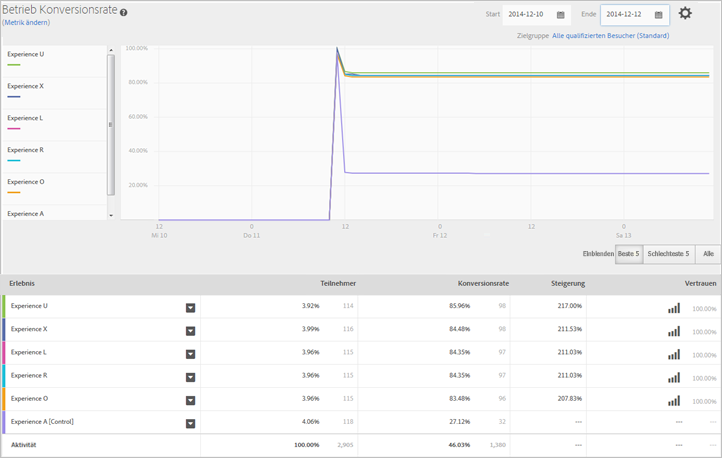

# Experience Performance-Bericht (MVT){#experience-performance-report-mvt}

Der Experience Performance-Bericht zeigt, wie die einzelnen Erlebnisse in der Aktivität funktionieren. Dieser Bericht enthält Informationen über die Anzahl der Teilnehmer, die Konversionsrate, die Steigerung und die Konfidenz.

Sie können ein Erlebnis oder mehrere Erlebnisse zum Vergleich auswählen. Klicken Sie auf ein Erlebnis und wählen Sie **[!UICONTROL Vorschau], um das Erlebnis in einer Registerkarte des Browsers zu öffnen.**

Oben im Bericht werden Metrik, Beginn- und Enddatum sowie die Zielgruppe angezeigt, die in dem Bericht verwendet werden. Sie können jeden dieser Faktoren ändern.

>[!NOTE]
>
>Die Auswahl der Zielgruppe und Metriken steht nur zur Verfügung, wenn Analytics als Berichtsquelle verwendet wird.

Danach ermöglicht ein Liniendiagramm einen visuellen Vergleich der einzelnen Erlebnisse zu bestimmten Zeitintervallen. Mithilfe dieses Diagramms können Sie sehen, wie die einzelnen Erlebnisse abschneiden und welchen Einfluss die Tageszeit auf die Leistung hat.

Sie können jeweils die besten oder die schlechtesten fünf bzw. alle Erlebnisse einblenden. Die besten und schlechtesten fünf Erlebnisse werden durch die Steigerung ermittelt und enthalten zu Kontroll- und Vergleichszwecken ein sechstes Erlebnis. Es wird empfohlen, jeweils die besten und die schlechtesten fünf Erlebnisse anzuzeigen, um den Erfolg Ihrer Erlebnisse zu ermitteln. Die Anzeige aller Erlebnisse erschwert die Gewinnung der gewünschten Information und es ist nicht möglich, alle Erlebnisse im Diagramm anzuzeigen. Verwenden Sie „Alle Anzeigen“, wenn Sie ein spezifisches Erlebnis betrachten möchten, das nicht zu den besten oder schlechtesten fünf zählt.

>[!NOTE]
>
>Berichte mit Multivarianz-Tests zeigen keine ausgeschlossenen Erlebnisse an, wenn der Filter „Beste fünf“ oder „Schlechteste fünf“ ausgewählt ist.

Unter dem Diagramm zeigt eine Tabelle an, wie viele Teilnehmer die einzelnen Erlebnisse angesehen haben. Außerdem werden weitere Informationen angezeigt, die für Ihre Erfolgsmetrik relevant sind.

## Schulungsvideo: Erstellen eines Multivarianz-Tests

In diesem Video wird gezeigt, wie mithilfe des geleiteten Target-Arbeitsablaufs mit drei Schritten ein Multivarianz-Test erstellt wird. Der Experience Performance-Bericht wird ab 8:20 beschrieben.

>[!VIDEO](https://video.tv.adobe.com/v/17395)