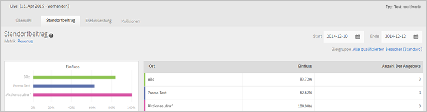
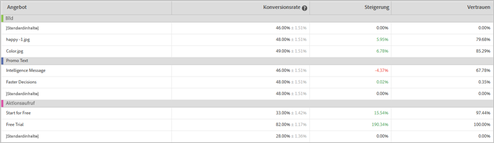

# Location Contribution-Bericht (MVT){#location-contribution-report-mvt}

Der Location Contribution-Bericht zeigt die Leistung jedes einzelnen Elements und jedes einzelnen Angebots an.

Oben im Bericht werden Metrik, Beginn- und Enddatum sowie die Zielgruppe angezeigt, die in dem Bericht verwendet werden. Sie können jeden dieser Faktoren ändern.

>[!NOTE]
>
>Die Auswahl der Zielgruppe und Metriken steht nur zur Verfügung, wenn Analytics als Berichtsquelle verwendet wird.

Der Location Contribution-Bericht umfasst zwei Tabellen.

Die erste Tabelle zeigt den relativen Einfluss jedes einzelnen Elements an. Dadurch wird veranschaulicht, welches der Elemente, zu denen Sie Angebote hinzugefügt haben, zu den meisten Konversionen führt.

Die zweite Tabelle liefert einen Bericht auf Angebotsebene. Sie zeigt die Konversionsrate, die Steigerung und die Konfidenz für jedes Angebot in jedem Element. Dies hilft Ihnen dabei zu ermitteln, welche Angebote am erfolgreichsten sind. Die zweite Spalte zeigt die Werte für die ausgewählte Metrik (Konversionsrate, RPV, AOV, Bestellungen oder Interaktionsmetriken) des Angebotes und eine Standardisierung.

## Schulungsvideo: Erstellen eines Multivarianz-Tests  

In diesem Video wird gezeigt, wie mithilfe des geleiteten Target-Arbeitsablaufs mit drei Schritten ein Multivarianz-Test erstellt wird. Der Location Contribution-Bericht wird ab 8:45 beschrieben.

>[!VIDEO](https://video.tv.adobe.com/v/17395)