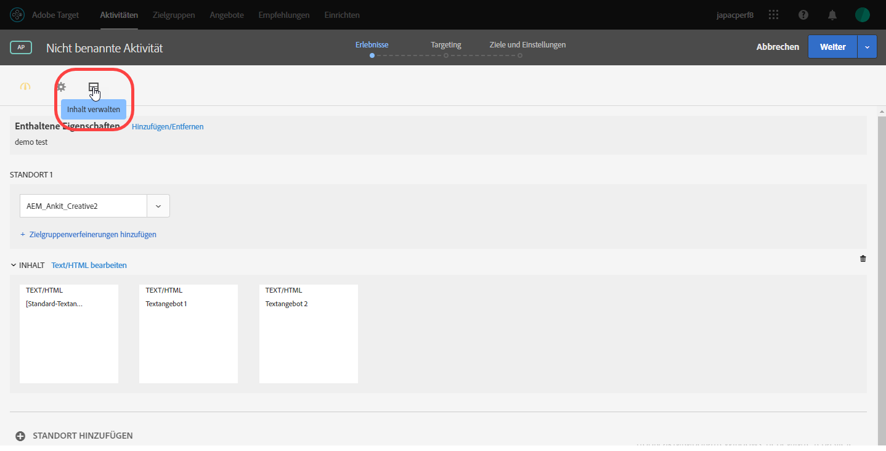
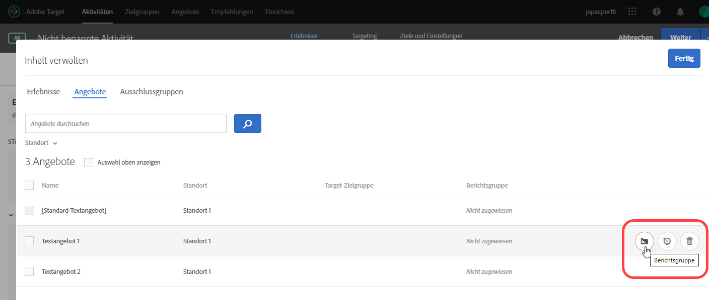
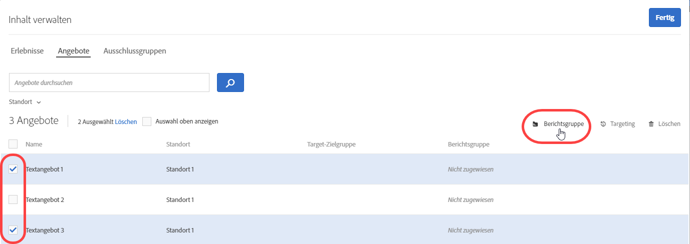
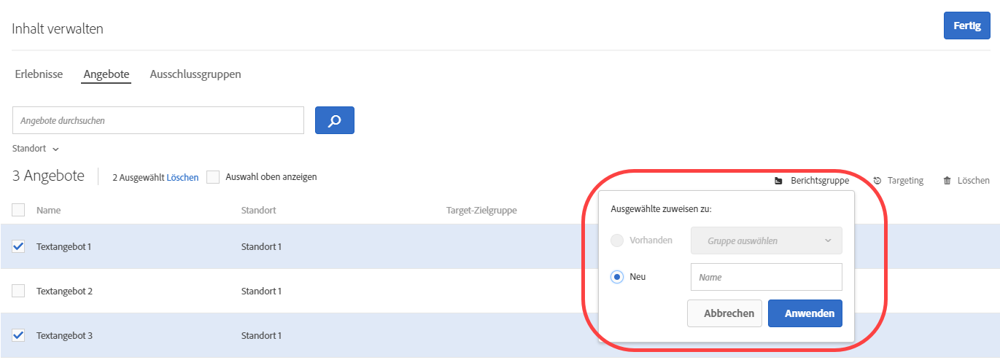

#  Angebotsberichtsgruppen in der automatisierten Personalisierung{#offer-reporting-groups-in-automated-personalization}

Informationen zur Verwendung von Berichten in [Automated Personalization](/help/c-activities/t-automated-personalization/automated-personalization.md) (AP)-Aktivitäten.

Berichtsgruppen erfüllen zwei grundlegende Funktionen:

* Über sie können Sie Angebote gruppiert in AP-Aktivitätsberichten anzeigen.
* Sie spielen eine Schlüsselrolle bei der Funktionsweise der Personalisierungsmodelle [!DNL Target].

Wenn Sie Berichte-Gruppen verwenden, erstellt [!DNL Target] nur ein Personalisierungsmodell für jede Berichte-Gruppe und nicht jedes Angebot in Ihrer AP-Aktivität, wobei die Daten aus allen Angeboten dieser Gruppe verwendet werden.

Wenn Ihr Aktivitäts-Setup nicht genügend Daten für die Erstellung eines Personalisierungsmodells pro Angebot bietet, können Berichtsgruppen die Datenanforderungen für die Verwendung von Automated Personalization reduzieren. Berichtsgruppen können auch das Problem des „Kaltstarts“ für neue Angebote beheben, indem ähnliche Angebote gruppiert werden, damit jedes Modell mit mehr Daten arbeiten kann. Modellierungsgruppen können auch für Aktivitäten verwendet werden, in denen regelmäßig neue Angebote in Ihre AP-Aktivität eingeführt werden.

Dieser Ansatz funktioniert gut, wenn Besucher auf alle Angebote in einer Gruppe gleich reagieren. Best Practice ist es, Angebote zu gruppieren, auf die ähnliche Besuchergruppen auf ähnliche Weise reagieren. Anders ausgedrückt: Gruppieren Sie Angebote mit ähnlichen Konversionsraten. Sie sollten niemals alle Angebote in eine einzelne Berichtsgruppe verschieben. Die Gruppierung aller Angebot oder die Gruppierung von Angeboten mit sehr unterschiedlichen Konversionsraten verringert wahrscheinlich die Effektivität der Personalisierungsmodelle von [!DNL Target].

>[!NOTE]
>
>Wenn ein Angebot aus einer bestimmten Modellgruppe entfernt oder ersetzt wird, wird der historische Traffic mit diesem spezifischen Angebot auch aus der Modellgruppe gelöscht. Mit anderen Worten, gelöschte Angebot tragen nicht dazu bei, welche Daten für die zu lernenden Personalisierungsmodelle verwendet werden.[!DNL Target]

**So richten Sie Berichtsgruppen ein:**

1. Klicken Sie auf der Seite [!UICONTROL Erlebnisse] einer AP-Aktivität auf das Symbol **[!UICONTROL Inhalt verwalten]**.

   

1. Klicken Sie auf die Registerkarte **[!UICONTROL Angebote]** oben im Dialogfeld [!UICONTROL Inhalt verwalten].
1. (Optional) Fügen Sie bestimmte Erlebnisse zu einer Berichtsgruppe hinzu, indem Sie mit dem Mauszeiger über das gewünschte Angebot fahren und auf das Ordnersymbol **[!UICONTROL Berichtsgruppe]** klicken.

   

1. (Optional) Fügen Sie Erlebnisse stapelweise zu einer Berichtsgruppe hinzu, indem Sie das Kontrollkästchen für die entsprechenden Erlebnisse aktivieren und dann oben rechts im Dialogfeld auf das Ordnersymbol **[!UICONTROL Berichtsgruppe]** klicken.

   

1. (Bedingt) Um das ausgewählte Angebot einer vorhandenen Berichte-Gruppe zuzuweisen, wählen Sie **[!UICONTROL Vorhandene]**, wählen Sie die gewünschte Berichte-Gruppe aus der Dropdown-Liste und klicken Sie dann auf **[!UICONTROL Anwenden]**.

   Oder

   Um eine neue Berichtsgruppe zu erstellen, der Sie das ausgewählte Angebot zuweisen können, wählen Sie **[!UICONTROL Neu]** aus, geben Sie den Namen der neuen Berichtsgruppe ein und klicken Sie auf **[!UICONTROL Übernehmen]**.

   

