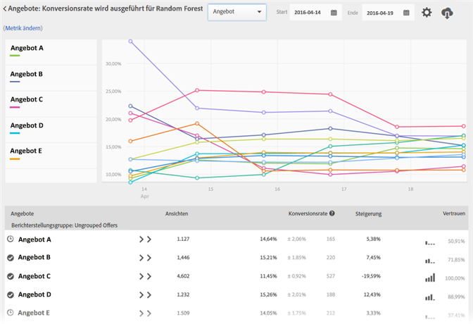

#  Berichte zur automatisierten Personalisierung{#automated-personalization-summary-reports}

Für Benutzer der automatisierten Personalisierung stehen spezialisierte Berichte zur Verfügung.

>[!NOTE]
>
>Automatisierte Personalisierung ist als Teil der [!DNL Target Premium]-Lösung verfügbar. Sie ist nicht in [!DNL Target Standard] ohne [Target Premium-Lizenz enthalten](/help/c-intro/intro.md#premium).

1. Klicken Sie auf **[!UICONTROL Aktivitäten]**, wählen Sie die gewünschte [!UICONTROL automatisierte Personalisierung] aus der Liste aus und klicken Sie auf die Registerkarte **[!UICONTROL Berichte.]**

   Wenn Sie viele Aktivitäten haben, können Sie die Liste filtern, indem Sie [!UICONTROL Automatisierte Personalisierung] in der Dropdownliste [!UICONTROL Typ] auswählen.

1. (Optional) Klicken Sie auf das Symbol zum [!UICONTROL Herunterladen], um die Zusammenfassungsansicht herunterzuladen (etwa zum Vergleichen von Kontroll- und Targeting-Traffic), aufgeschlüsselt nach allen verfügbaren Erfolgsmetriken.

[!UICONTROL Automatisierte Personalisierung] liefert die folgenden Berichte:

## Aktivitätsstufenbericht {#section_6F72FC5C790B4492B3DCECBFFA971337}

Der Bericht [!UICONTROL Aktivitätsebene] vergleicht die Gesamtleistung beim Einsatz eines „[!UICONTROL Automatisierte Personalisierung]“-Algorithmus mit zufällig bereitgestellten Inhalten (Kontrolle).

Die Standardregeln für die Auswertung von A/B-Testergebnissen gelten weiterhin, einschließlich Steigerung, Konfidenz, Trends, Dauer und so weiter. Weitere Informationen zur Ergebnisauswertung finden Sie in  [Über die Konversionsrate](../c-reports/conversion-rate.md#concept_2D9FEDE8F94A485DAC86D611BFBDC844)

## Angebotsstufenbericht {#section_CAA6409879E349C6906E2BE8156D87A1}

Der Bericht [!UICONTROL Angebotsebene] für das „Random Forest“-Erlebnis vergleicht die Leistung der einzelnen durch Algorithmen bereitgestellten Angebote mit demselben, zufällig bereitgestellten Angebot (Kontrolle). Aus diesem Grund sollten Angebote in dieser Ansicht nicht miteinander verglichen werden.

Klicken Sie auf den Erlebnisalgorithmus (Random Forest oder Kontrolle), um den Bericht „Angebotsebene“ aufzurufen.

Angebote können innerhalb von Berichtsgruppen angezeigt werden. Diese Berichtsgruppen können minimiert und maximiert werden. Wählen Sie in der Dropdownliste [!UICONTROL Berichterstellungsgruppe] aus, um sich Details nach Berichtsgruppen und nicht nach Angeboten anzeigen zu lassen.

>[!NOTE]
>
>Das Uhrsymbol zeigt an, dass das Algorithmusmodell noch erstellt wird. Das Häkchen zeigt an, dass der Basisalgorithmus eingerichtet wurde.
