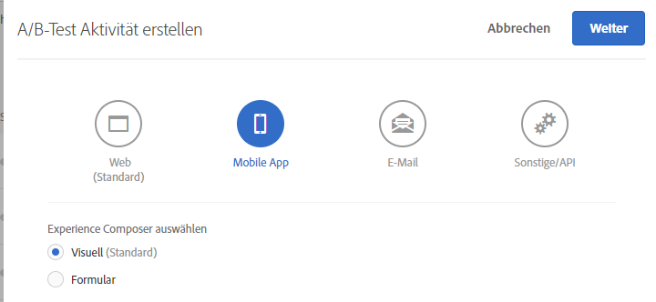
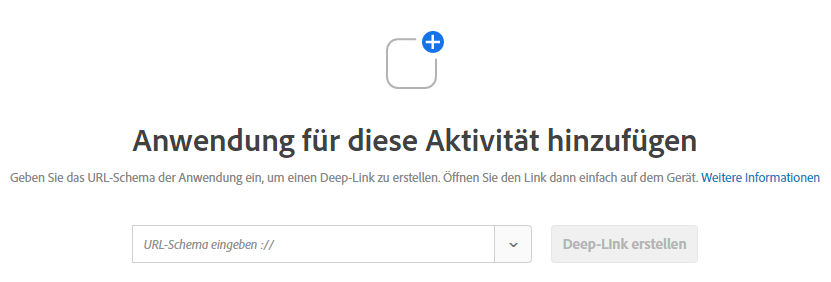

# Visual Experience Composer für mobile Apps{#mobile-app-visual-experience-composer}

Mit dem Visual Experience Composer (VEC) für native Apps können Sie Aktivitäten und personalisierte Inhalte in nativen Apps selbstständig erstellen, ohne von der kontinuierlichen Weiterentwicklung und den App-Release-Zyklen abhängig zu sein.

Der bestehende [Visual Experience Composer](../../c-experiences/experiences.md#section_34265986611B4AB8A0E4D6ACC25EF91D) bietet Ihnen Funktionen, mit denen Sie selbstständig Aktivitäten erstellen und Erlebnisse personalisieren können, die dynamisch über die globale Mbox von Target ohne Eingriff von Entwicklern auf Ihren Webseiten bereitgestellt werden. Jetzt können Sie den VEC auch für native Apps verwenden. Der auf [AEP SDK v 5](https://aep-sdks.gitbook.io/docs/using-mobile-extensions/adobe-target-vec)verfügbare Mobile App VEC kann verwendet werden, um Aktivitäten mit [A/B-Test](/help/c-activities/t-test-ab/test-ab.md) und [Erlebnis-Targeting (XT)](/help/c-activities/t-experience-target/experience-target.md) für Apps zu erstellen. Unterstützung für weitere Aktivitätstypen ist geplant.

Der Mobile App VEC unterstützt die in [Unterstützte Browser](../../c-implementing-target/c-considerations-before-you-implement-target/supported-browsers.md#reference_01B4BF99E7D545A7998773202A2F6100) aufgeführten Browser.

## Verwenden von Visual Experience Composer für native Apps {#using-the-mobile-vec}

Die folgende Illustration stellt den Prozess der Verwendung des Mobile App VEC dar:


| Prozess | Details |
|--- |--- |
| Kopplung | Sichere Autorisierung Ihrer mobilen App und des Geräts zur Verwendung von Target Dieser Schritt ist nur einmal für ein Gerät erforderlich. |
| Erstellung | Erstellen Sie eine [Target-Aktivität](/help/c-activities/activities.md) mit einer Echtzeitvorschau der Aktionen, die in der Target-UI ausgeführt werden. |
| Bereitstellung | Target stellt automatisch Aktivitäten in Ihrer nativen mobilen App bereit. |

**Kopplung:**

Der Mobile App VEC stellt eine Verbindung mobilen App des Marketingexperten in Echtzeit her, um Target-Aktivitäten zu erstellen. Dazu müssen das mobile Gerät und die App zunächst sicher mit Target gekoppelt werden (Autorisierung).

1. Wählen Sie beim Erstellen einer A/B-Test-Aktivität beispielsweise **[!UICONTROL Mobile App]** aus, wählen Sie **[!UICONTROL Visual (Standard)]** und klicken Sie auf **[!UICONTROL Weiter]**.

   

1. Geben Sie die URL der App ein und klicken Sie dann auf **[!UICONTROL Create Deep Link]**.

   

Der Kopplungsvorgang umfasst die folgenden Schritte:

1. Geben Sie das URL-Schema der App ein, mit dem ein Deep Link generiert werden kann. Beispiel für einen typischen Deep Link:

   `mymobileapp://path?params`

1. Dieser Deep Link ist als QR-Code oder URL verfügbar. Benutzer können den QR-Code per Telefon oder durch Senden der URL per E-Mail/Text an sich selbst überprüfen. Die Deep Link-URL enthält ein Autorisierungstoken, das zur sicheren Kopplung der mobilen App und des Geräts mit Target verwendet wird.
1. Öffnen Sie die Deep Link-URL auf Ihrem Mobilgerät. Hierdurch wird die App gestartet. Das SDK stellt fest, dass die App zur Kopplung und Erstellung in VEC gestartet wurde.

   Das SDK sendet eine Anfrage an den Target-Server und registriert sich. Der Target-Server autorisiert das Token und stellt eine Echtzeitverbindung mit dem Gerät her (zurzeit unter Verwendung von Websockets).

   Nachdem die Verbindung hergestellt wurde, wird eine Echtzeitansicht der App auf der Target-Oberfläche angezeigt. Die rote Umrandung der App gibt an, dass die App mit Target verbunden ist (siehe Abbildung unten).

   

   Bereits gekoppelte Geräte können durch Starten der App und Öffnen der Erstellungsoberfläche erneut verbunden werden.

**Erstellung:**

Wenn die App verbunden ist und eine Echtzeitansicht der App in VEC angezeigt wird, können Sie mit der Erstellung Ihrer Aktivität beginnen. Gegenwärtig werden die folgenden Aktionen unterstützt:

| Aktion | Details |
|--- |--- |
| Bild tauschen | Tauschen Sie ein Bild durch ein anderes aus, indem Sie ein anderes Bildangebot auswählen oder die CDN-URL eines Bilds direkt festlegen. Bildangebote in Target werden über [Adobe Scene7](/help/administrating-target/scene7-settings.md) bereitgestellt. |
| Text ändern | Ändern von Textinhalt, Farbe oder Schriftgröße in einem Textelement, einer Schaltfläche oder einer Beschriftung. |
| Hintergrund ändern | Ändern des Inhalts oder des Elementhintergrunds für einen Textbereich oder eine Schaltfläche. |

Die in VEC durchgeführten Aktionen sind in Echtzeit in der App sichtbar, sodass während der Erstellung eine Echtzeitvorschau zur Verfügung steht. Mit mobilen Bildschirmen oder Ansichten verbundene Aktionen werden entsprechend zugeordnet.


**Verwalten mehrerer App-Versionen**

Wenn eine neue App-Version erkannt wird, werden Sie darüber informiert, dass die App-Version zur Liste der Zielversionen hinzugefügt wurde.


Multiple mobile app versions can be added and removed manually from the [!UICONTROL Manage Versions] dialog box.


## Fehlerbehebung {#troubleshooting}

**Der Mobile App VEC meldet, dass die Verbindung zu meiner App getrennt wurde.**

Möglicherweise wurde Ihre Internetverbindung unterbrochen. Starten Sie die Applikation erneut, sobald das Internet wieder verfügbar ist, um eine neue Verbindung herzustellen. Es wird empfohlen, eine Mobile App VEC-Aktivität zu erstellen, während eine WLAN-Verbindung besteht.

**Der Mobile App VEC ist nicht mit meiner App sychronisiert.**

Klicken Sie im VEC auf die Schaltfläche [!UICONTROL Aktualisieren], um die Anzeige zu synchronisieren.

## Target-Ansichten und mobile Apps {#target-views}

Der Mobile App VEC basiert auf einem neuen Konzept für Ansichten: Eine Ansicht entspricht einer logischen Gruppe visueller Elemente, aus denen sich das App-Erlebnis zusammensetzt.

**Einführung in Target-Ansicht**

Sehen wir uns eine Beispiel-App für den Kauf von Blumen an. Die App ermöglicht Benutzern Folgendes:

* Verfügbare Blumen und Blumensträuße auflisten
* Details anzeigen
* Blumen bestellen
* Einstellungen festlegen, beispielsweise Zahlungsoptionen und Adressen

Jede dieser Aufgaben wird in der mobilen App über einen eigenen Bildschirm ausgeführt. Diese Bildschirme werden angezeigt, während Benutzer durch die App navigieren, und ermöglichen die Ausführung einer der genannten Aufgaben. Als Android-Entwickler erstellen Sie wahrscheinlich vier verschiedene Android-Aktivitätsklassen, von denen jede mit einer dieser Aufgaben verbunden ist.

In diesem Fall kann jede dieser Aufgaben als Ansicht betrachtet werden, die in Ihrer mobilen App angezeigt wird. Nachstehend werden sie als Target-Ansichten bezeichnet und jede von ihnen verfügt über eindeutige Merkmale. Eine Target-Ansicht, auch kurz als Ansicht bezeichnet, ist ein logischer Container für die visuellen Elemente, die auf dem Bildschirm des mobilen Geräts angezeigt werden. Beispiele für eine Ansicht sind ein Bildschirm oder eine Aktivitätsklasse in Android.

Mobile Apps sind jedoch selten so einfach aufgebaut. Sehen wir uns ein etwas realistischeres Beispiel an. Erweitern wir die erste Aufgabe zur Auflistung der verfügbaren Blumen und Blumensträuße um die Möglichkeit, verschiedene Layouts und somit auch verschiedene Bildschirme anzuzeigen. Fügen wir beispielsweise eine Funktion „Sortieren nach“ hinzu, die drei Optionen bietet:

* Nach Beliebtheit
* Nach Preis (absteigend)
* Nach Preis (aufsteigend)

Sobald ein Benutzer in diesem Beispiel eine andere Option für „Sortieren nach“ auswählt, wird ein neuer Bildschirm angezeigt, auch wenn die Aktivitätsklasse die gleiche bleibt. Jeder dieser Bildschirme kann somit als eine andere Target-Ansicht betrachtet werden.

Als Marketing-Experte möchten Sie unterschiedliche Erlebnisse definieren und in jeder dieser Ansichten ein anderes Angebot anzeigen, ohne dass Entwickler hierfür lokale Mboxes einrichten oder einen App-Release-Zyklus durchlaufen müssen.

## Einrichten des Target Mobile App VEC {#setting-up}

Entwickler müssen die folgenden Schritte ausführen, um den Mobile App VEC für eine App zu aktivieren:

* Adobe Target VEC-Erweiterung in Launch konfigurieren
   * Die VEC-Erweiterung hängt von der [Adobe Target-Erweiterung](/help/c-implementing-target/c-implementing-target-for-client-side-web/how-to-deployatjs/cmp-implementing-target-using-adobe-launch.md) ab. Stellen Sie sicher, dass die Adobe Target-Erweiterung bereits konfiguriert und aktiviert ist.
* Fügen Sie Ihrer App die Target VEC-Erweiterung hinzu.
   * [Android – Einrichten der App](/help/c-target-mobile-app/c-mobile-visual-experience-composer/mobile-visual-experience-composer-android.md)
   * [iOS – Einrichten der App](/help/c-target-mobile-app/c-mobile-visual-experience-composer/mobile-visual-experience-composer-ios.md)

## Implementierungsmethoden für den Target VEC

Die Target VEC-Erweiterung ruft die relevanten Target-Erlebnisse für Ihre App über eine Netzwerkanforderung ab. Angebote werden über diesen Netzwerkaufruf abgerufen und automatisch auf den Zielbildschirmen angewendet. Es werden keine nachfolgenden Netzwerkanfragen zum Abrufen von VEC-Erlebnissen ausgeführt, wenn der Benutzer durch mehrere Bildschirme der App navigiert.

Das Standardverhalten der Erweiterung besteht darin, eine synchrone Netzwerkanforderung (Blockierung) zum Zeitpunkt des Anwendungsstarts zu erstellen. Mit Launch können Sie das Verhalten dieser Netzwerkanforderung steuern, um Ihrem App-Verhalten gerecht zu werden.

### Automatisches Abrufen von Target-Aktivitäten

Dies ist das Standardverhalten, bei dem eine Netzwerkanforderung automatisch von der Target VEC-Erweiterung initiiert wird. Sie können eine der folgenden Optionen verwenden, um diese Anforderung zu einem blockierenden Aufruf oder einer asynchronen Anforderung zu machen.

* Einen synchronen Aufruf abrufen (Hintergrund ist AUS)

   Wenn diese Option aktiviert ist, stellt die Target VEC-Erweiterung eine Netzwerkanforderung als blockierenden Aufruf beim Start der App ein. Angebote werden sofort angewendet und in der App gibt es kein Flackern. Dies ist das Standardverhalten der Erweiterung.

* In einem asynchronen Aufruf abholen (Hintergrund ist EIN)

   Wenn diese Option aktiviert ist, stellt die Target VEC-Erweiterung im Hintergrund eine Netzwerkanforderung ein, blockiert die App jedoch nicht. Wenn Ihre Erlebnisse auf dem Startbildschirm Ihrer App verfasst werden, werden die Angebote möglicherweise nicht für den Startbildschirm angewendet, falls der Bildschirm vor Abschluss des Aufrufs gerendert wird. Die Wiedergabe des App-Bildschirms wird normalerweise über die Lebenszyklusereignisse `didFinishLaunchingWithOptions` und `onActivityResumed` unter iOS bzw. Android identifiziert. Angebote werden automatisch auf allen nachfolgenden Bildschirmen angewendet.

### Target-Aktivitäten programmgesteuert abrufen

Sie können die Target VEC-Erweiterung deaktivieren, um die Netzwerkanforderung automatisch zu machen und die Erweiterungs-API programmgesteuert aufzurufen. Auf diese Weise kontrollieren Ihre Entwickler, wie sie Target VEC-Angebote in die App integrieren möchten. Die Target VEC-Erweiterung verfügt über zwei statische Methoden `prefetchOffers` und `prefetchOffersBackground`, die Target VEC-Angebote programmgesteuert abrufen können.

* Die `prefetchOffers`-Methode blendet den aktuellen Bildschirm aus, bis Target VEC-Angebote abgerufen werden. Die Angebote werden automatisch auf den aktuellen Bildschirm angewendet, falls anwendbar, und der Bildschirm wird erneut angezeigt.
* Die `prefetchOffersBackground`-Methode blendet den aktuellen Bildschirm nicht aus und ein Aufruf erfolgt, um die relevanten Target-Angebote abzurufen. Target-Angebote werden *nicht* auf den aktuellen Bildschirm angewendet und es gibt kein Flackern. Wenn der Benutzer zu nachfolgenden Bildschirmen navigiert, werden die Angebote ggf. automatisch angewendet.

### Umgang mit den Einschränkungen des Arbeitsbereichs von Target

Sie können den `at_property`-Wert für Ihren Arbeitsbereich über die Oberfläche von Launch festlegen. Dadurch wird sichergestellt, dass für Ihre App nur Aktivitäten in diesem Arbeitsbereich bereitgestellt werden.

## Allgemeine Richtlinien für Target-API-Aufrufe {#section_C7276795F02540DCA230AEEDF882A833}

Damit Sie Target-Ansichten für Android richtig hinzufügen können, sind in der folgenden einfachen Tabelle die Positionen zum Einfügen von `targetView`-Aufrufen aufgeführt:

| Gültige TargetView-Position | Anmerkungen zur korrekten Einfügung |
|--- |--- |
| Am Ende von `Activity::onStart`, `Activity::onResume` | Es liegt im Ermessen des Entwicklers, für `OnStart` und `OnResume` die gleichen oder unterschiedliche `targetViews` zu verwenden. Wenn die gleichen Ansichten angezeigt werden sollen, verwenden Sie den gleichen `viewName`. Falls verschieden, verwenden Sie andere `viewNames`. Diese Ereignisse werden automatisch durch das SDK hinzugefügt. |
| Unmittelbar nach einem `Activity::SetContent`-Aufruf | Wenn sich die UI nicht ändert, kann ein `targetView`-Aufruf eingefügt werden. |
| Innerhalb von `View::willAppear` | Wenn die ausgewählte Ansicht nur einmal einer bestimmten Ansichtshierarchie angezeigt wird. |
| Unmittelbar nach einem `Activity::SetContentView`-Aufruf | Wenn die Aktivität ihren Inhalt im nachfolgenden Code nicht ändert. |

Die folgende Tabelle zeigt, wo `targetView`-Aufrufe in Android nicht platziert werden dürfen:

| Ungültige TargetView-Position | Grund |
|--- |--- |
| Innerhalb von `Activity::onCreate` | Die Aktivität wurde erstellt, es kann jedoch nicht garantiert werden, dass die mit der Aktivität verbundene Ansicht vollständig und/oder mit dem Fenster verknüpft ist. Diese Platzierung kann dazu führen, dass das Sampling für den erstellten Bildschirm unvollständig oder gar nicht ausgeführt wird und/oder Angebote wahllos angewendet werden. |
| Innerhalb von `View::didAppear` | Die Ansicht wurde bereits angezeigt und die Applikation des Angebots führt zu einem mangelhaften UI-Erlebnis mit Flimmern. |
| Innerhalb von `View::didLoad` | Die Ansicht ist nicht mit der Hauptansichtshierarchie verbunden und wird möglicherweise instantiiert. Es kann jedoch nicht garantiert werden, dass sie wirklich auf der UI der App angezeigt wird. |

## Bereitstellung {#delivery}

Mit Mobile App VEC erstellte Target-Aktivitäten werden automatisch in Apps bereitgestellt. Diese Aktivitäten werden vorab beim Start der App abgerufen (basierend auf der Startkonfiguration) und angewendet, während der Benutzer durch verschiedene Target-Ansichten navigiert. Oft sind die Aktivitäten den Bildschirmen direkt zugeordnet.

Beim Aufrufen der `TargetVEC.prefetchOffersBackground()`-API-Methode werden Target-Angebote aus Target Edge abgerufen und lokal zwischengespeichert. Dies ermöglicht eine reibungslosere Benutzererfahrung, da Target-Angebote sofort aus dem Cache angewendet werden, wenn Target-Ansichten mit `targetView()`-Aufrufen ausgelöst werden, anstatt über das Netzwerk abgerufen zu werden.

Für zusätzliche Flexibilität können Sie auch die `TargetVEC.prefetchOffers()`-API aufrufen, die das aktuelle Layout vor der Anzeige von Target-Angeboten ausblendet und angewendet wird, um die Target-Ansicht anzuzeigen (möglicherweise entsteht Flackern).

`TargetVEC.prefetchOffersBackground()` kann auch wiederholt aufgerufen werden, während der Benutzer durch eine benutzerspezifische App navigiert, um den lokalen Target-Angebots-Cache mit dem erforderlichen Inhalt zu aktualisieren (abhängig von den neuesten Änderungen im Target-Profil des aktuellen Benutzers).

Beachten Sie, dass jedes Mal, wenn Target-Angebote vorabgerufen werden, die Angebote für die zuletzt mit `AdobeTargetMobile.targetView()` ausgelöste Target-Ansicht ebenfalls angewendet werden, wenn möglich.

## Fehlerbehebung {#ts}

**Ich habe eine Fehlermeldung erhalten, dass mein &quot;context. application. name&quot; -Wert unzulässige Zeichen enthält. What characters are allowed in mobile app names?**

Zulässige Zeichen in mobilen App-Namen sind:

| Zulässige Zeichen | Beschreibung |
| --- | --- |
| Briefe |  |
| Zahlen |  |
| `-` | Bindestrich |
| `.` | Zeitraum |
| `,` | Komma |
| `:` | Doppelpunkt |
| `#` | Raute |
| `(` | Öffnen von Klammern |
| `)` | Schließende Klammer |
| `&` | Kaufmännisches Und |
| `+` | Pluszeichen |

Using a character that is not allowed, for example, an apostrophe ( `'` ) causes you to receive the following error message:

```
Target Response was received : {"status":400,"message":"Errors: field - [context.application.name] - Value contains prohibited chars;"}
```

## Bekannte Einschränkungen {#limitations}

* Der Mobile App VEC kann derzeit verwendet werden, um Aktivitäten des Typs [A/B-Test](/help/c-activities/t-test-ab/test-ab.md) und [Erlebnis-Targeting (XT)](/help/c-activities/t-experience-target/experience-target.md) für mobile Apps zu erstellen. Unterstützung für weitere Aktivitätstypen ist geplant.
* Die Vorschaufunktion wird noch nicht unterstützt. Sie wird in einer kommenden Version bereitgestellt werden.
* Wenn Sie versuchen, die App erneut mit der Mobile App VEC zu verbinden, müssen Sie die App vollständig beenden und neu starten.

   Wenn die App in einem der unten aufgeführten Szenarien bereits geöffnet ist, müssen Sie sie schließen und erneut öffnen. Sie *müssen* die App jedoch über die kürzlich verwendeten Apps und *nicht* über die Zurück-Taste schließen. Wenn die App über die Zurück-Taste geschlossen wird, können temporäre Verbindungsprobleme auftreten.

   Es gibt verschiedene Situationen, in denen Sie die App neu starten müssen, um die Verbindung zum Mobile App VEC herzustellen, wenn die App bereits geöffnet ist:

   * Beim Erstellen einer neuen Aktivität wird nach Auswählen der App ein Dialogfeld mit einer Geräteliste angezeigt. Wenn die App bereits geöffnet ist, müssen Sie sie schließen und erneut öffnen, damit das Gerät zur Auswahl verfügbar ist.
   * Das Geräte-Dialogfeld wird angezeigt, wenn Sie mit dem Bearbeiten einer Aktivität beginnen. Wenn die App bereits geöffnet ist, müssen Sie sie schließen und erneut öffnen, damit das Gerät zur Auswahl verfügbar ist.
   * Das Geräte-Dialogfeld wird angezeigt, wenn Sie vom Schritt „Ziele und Einstellungen“ zum Schritt „Erstellen“ (Schritt 1) zurückkehren. Wenn die App bereits geöffnet ist, müssen Sie sie schließen und erneut öffnen, um die Verbindung mit dem Mobile App VEC wiederherzustellen.
   Sie müssen die App über die Liste der kürzlich verwendeten Apps und nicht über die Schaltfläche [!UICONTROL Zurück] schließen.

## Training video: Adobe Target Mobile App Visual Experience Composer (3:33) {#video}

>[!VIDEO](https://video.tv.adobe.com/v/27528?captions=ger)