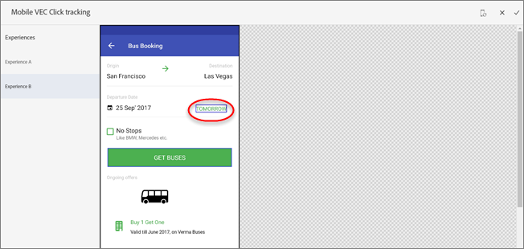

# Einrichten der Klick-Verfolgung in der mobilen App-VEC{#set-up-click-tracking-in-the-mobile-vec}

Die Mobile App VEC unterstützt die Einrichtung von Klickverfolgungszielen für [!DNL Target] Aktivitäten.

1. Wenn Sie die Ziele für Ihre Aktivität auf der Seite Ziele und Einstellungen festlegen, wählen Sie die Erfolgsmetrik [!UICONTROL Konversion] aus.

   

1. Wählen Sie als Aktion **[!UICONTROL Klicks auf ein Element]** aus und klicken Sie anschließend auf **[!UICONTROL Elemente auswählen]**.

   Ihre App wird im Mobile Visual Experience Composer (VEC) geöffnet.

   

1. Wählen Sie die Elemente aus, die Sie verfolgen möchten.

   Tipps zur Auswahl von Elementen finden Sie unten im Abschnitt [!UICONTROL Zu beachten].

   

1. Klicken Sie auf das Häkchen oben auf dem Bildschirm, um Ihre Auswahl zu speichern.

Sie können die Klickauswahl bearbeiten oder löschen, wenn Sie neu beginnen wollen.

Wenn ein Aktivitätsteilnehmer auf ein ausgewähltes Element klickt, wird dieser Klick als Konversion gezählt.

## Zu beachten {#considerations}

Beachten Sie Folgendes, wenn Sie Elemente auswählen:

* Wenn mehr als ein Element ausgewählt ist und ein Besucher auf eines dieser Elemente klickt, wird der Klick gezählt. Um jeden Klick einzeln zu zählen, richten Sie einzelne Erfolgsmetriken für jedes Element ein.
* Klickereignisse werden an Target gesendet, sobald der Benutzer auf das entsprechende Element klickt.
* In der mobilen App-VEC dürfen nur Elemente ausgewählt werden, bei denen ein Klick-Handler angehängt ist.
* Sie können zu jedem Bereich der App navigieren, Sie sollten jedoch sicherstellen, dass [Ansichten](/help/c-target-mobile-app/c-mobile-visual-experience-composer/mobile-visual-experience-composer.md#target-views) für den Bereich definiert sind, in dem Sie Elemente für das Klick-Tracking auswählen.
* Wenn bei der Bearbeitung einer Aktivität das Gerät bereits in Schritt 1 ausgewählt wurde, müssen Sie das Gerät nicht erneut auswählen. Wenn Sie jedoch direkt auf der Clicktrack-Seite landen, wird Ihnen der Bildschirm zur Geräteauswahl angezeigt, um ein autorisiertes Gerät auszuwählen.
