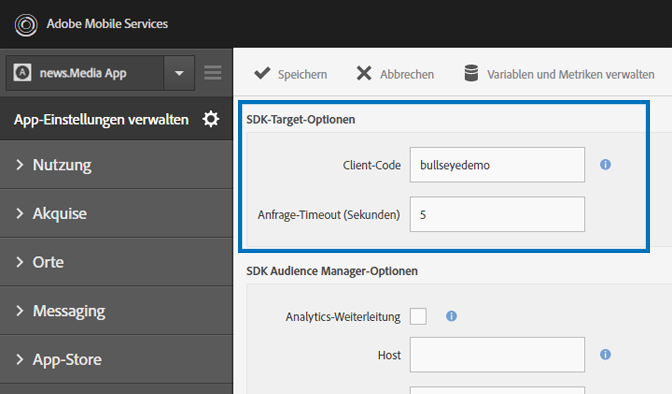
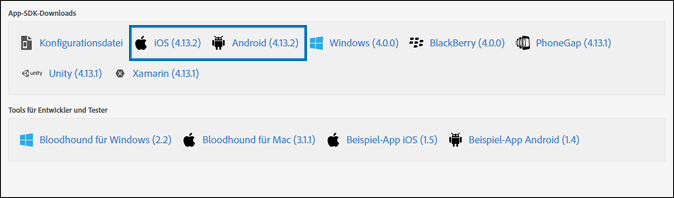

# Aktivieren Sie Target im SDK{#enable-target-in-the-sdk}

Fügen Sie Ihrer Anwendung das Adobe Mobile Services SDK hinzu.

1. Wenn Sie das Adobe Mobile Services SDK nicht in Ihrer App installiert haben, verwenden Sie Ihre Analytics- oder Experience Cloud-Anmeldeinformationen und laden Sie das SDK von der [Adobe Mobile Services](https://mobilemarketing.adobe.com)-Website herunter.

1. Fügen Sie Ihrer Anwendung das Adobe Mobile Services SDK hinzu.

   Anweisungen hierzu finden Sie unter [Kernimplementierung und Lebenszyklus](https://experienceleague.adobe.com/docs/mobile-services/ios/getting-started-ios/dev-qs.html).

1. Fügen Sie Kunden-Code und Zeitüberschreitung hinzu und aktivieren Sie SSL.

   Öffnen Sie „Mobile Services“ in der Experience Cloud und navigieren Sie zu **[!UICONTROL App-Einstellungen verwalten]** > **[!UICONTROL SDK-Target-Optionen]**.

   Fügen Sie Kunden-Code und Zeitüberschreitung für Target hinzu. Der Kunden-Code ist ein eindeutiger Code für Ihr Konto oder Unternehmen. Die Zeitüberschreitung ist die Dauer in Anzahl der Sekunden, die Target auf eine Antwort wartet, bevor der Standardinhalt angezeigt wird. Stellen Sie sicher, dass Sie die Option **[!UICONTROL HTTPS verwenden]** auf der Seite „App-Einstellungen verwalten“ in Adobe Mobile Services aktiviert haben. Wenn HTTPS nicht aktiviert ist, werden alle Aufrufe in iOS9+ blockiert, es sei denn, Sie führen eine Zulassungsliste des Zielgruppe-Servers durch.

   

1. Haben Sie Ihre App erstellt/gefunden, suchen Sie die Anwendungseinstellungen und laden Sie das gewünschte SDK herunter.

   

>[!IMPORTANT]
>
> Wenn Sie keinen Zugriff auf die mobile Marketing-Oberfläche haben, können Sie Änderungen direkt in der Konfigurationsdatei in Ihrem App-Code vornehmen. Dies wird jedoch nicht mit der Einstellungsseite in der Benutzeroberfläche synchronisiert.

