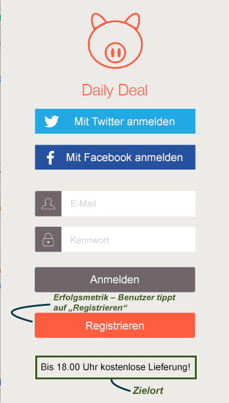
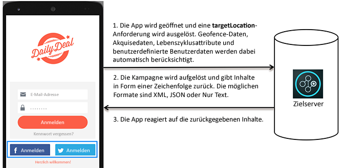

# Funktionsweise von Target in Apps{#how-target-works-in-mobile-apps}

Das Adobe SDK ruft den Target-Server auf, um den Inhalt sowie weitere Datenpunkte abzurufen und dem Benutzer das richtige Erlebnis anzuzeigen.

## Zielorte und Erfolgsmetriken  {#section_A08AAB0ABA9C4568A5AFD4D27EF1CE74}

Ein *Zielort* wird auch wie folgt genannt:  mbox. Ein in der Anwendung identifizierter Ort wird für Tests oder Personalisierung aktiviert (beispielsweise die Willkommensnachricht auf dem Starbildschirm). Diese Orte werden während der Testerstellung festgelegt.

A *[Erfolgsmetrik](../c-activities/r-success-metrics/success-metrics.md#reference_D011575C85DA48E989A244593D9B9924)*ist eine Aktion, die vom Benutzer ausgeführt wird und zeigt, dass eine bestimmte Aktivität von Erfolg gekrönt war (beispielsweise Registrierung, Absenden einer Bestellung, Buchung eines Tickets usw.).

* **Zielort:** Der Inhalt, der unterhalb der Registrierungsschaltfläche angezeigt wird

   Diesem Benutzer wird beispielsweise kostenloser Versand bis 18:00 Uhr angeboten. Dieser Ort kann für mehrere Target-Aktivitäten verwendet werden, für die Personalisierung und A/B-Tests ausgeführt werden sollen.

* **Erfolgsmetrik:** Die vom Benutzer vorgenommene Aktion, wenn auf die Registrierungsschaltfläche getippt wird

**Erklärung der Funktionsweise von Target im SDK**

