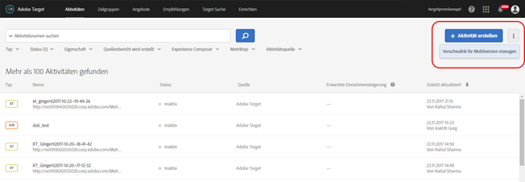
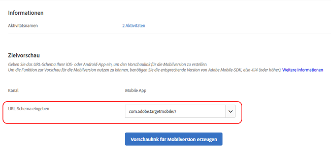
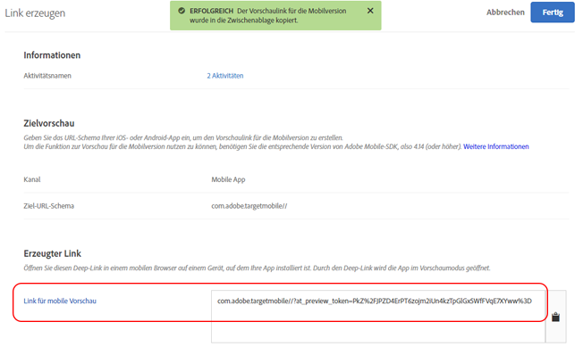

# Mobile Target-Vorschau{#target-mobile-preview}

Verwenden Sie die Vorschau für mobile Apps, um mühelos eine ganzheitliche Qualitätssicherung für Aktivitäten von mobilen Apps durchzuführen und sich ohne spezielle Prüfmittel direkt auf Ihrem Gerät für verschiedene Erlebnisse anzumelden.

>[!NOTE]
>
>Für die Vorschaufunktion für die Mobilversion ist es erforderlich, dass Sie die entsprechende Version 4.14 (oder später) des Adobe Mobile-SDK herunterladen und installieren.

## Überblick {#section_981D6FA4AEE64098809EA606E89E4A5E}

Mit der mobilen Vorschaufunktionalität können Sie Aktivitäten in Ihrer mobilen App vollständig testen, bevor Sie sie live schalten.

## Voraussetzungen   {#section_A763C564C9E84B0EB448237B5B1E4068}

1. **Verwenden Sie eine unterstützte Version des SDK:** Für die mobile Vorschaufunktion ist es erforderlich, dass Sie die entsprechende Version 4.14 (oder später) des Adobe Mobile-SDK in Ihren jeweiligen Apps herunterladen.

   Eine Anleitung zum Herunterladen des erforderlichen SDK finden Sie unter:

   * **iOS:** [Bevor Sie die ](https://experienceleague.adobe.com/docs/mobile-services/ios/getting-started-ios/requirements.html) iOS-Hilfe für  *Mobile Services starten*.
   * **Android:** [Bevor Sie ](https://experienceleague.adobe.com/docs/mobile-services/android/getting-started-android/requirements.html) die  *Mobile Services-Hilfe starten*.

1. **URL-Schema einrichten:** Der Vorschau-Link öffnet Ihre App über ein URL-Schema. Sie müssen ein einzigartiges URL-Schema für die Vorschau festlegen.

   Die folgende Illustration stellt ein Beispiel unter iOS dar:

   

   Die folgende Illustration stellt ein Beispiel unter Android dar:

   

1. **Adobe DeepLink verfolgen**

   **iOS:** Rufen Sie in App Delegate `[ADBMobile trackAdobeDeepLink:url` auf, wenn der Delegate dazu aufgefordert wird, die Ressource mit dem URL-Schema zu öffnen, das im vorherigen Schritt angegeben wurde.

   Das folgende Code-Snippet dient als Beispiel:

   ```javascript
   - (BOOL) application:(UIApplication *)app openURL:(NSURL *)url 
                options:(NSDictionary<NSString *,id> *)options { 
   
       if ([[url scheme] isEqualToString:@"com.adobe.targetmobile"]) { 
           [ADBMobile trackAdobeDeepLink:url]; 
           return YES; 
       } 
       return NO; 
   } 
   ```

   **Android:** Rufen Sie in der App `Config.trackAdobeDeepLink(URL);` auf, wenn der Aufrufende dazu aufgefordert wird, die Ressource mit dem URL-Schema zu öffnen, das im vorherigen Schritt angegeben wurde.

   ```javascript
    private Boolean shouldOpenDeeplinkUrl() { 
        Intent appLinkIntent = getIntent(); 
        String appLinkAction = appLinkIntent.getAction(); 
        Uri appLinkData = appLinkIntent.getData; 
        if (appLinkData.toString().startsWith("com.adobe.targetmobile")) { 
            Config.trackAdobeDeepLink(appLinkData); 
            return true; 
        } 
        return false; 
     }
   ```

   Damit die Vorschau für die Mobilversion funktioniert, müssen Sie außerdem das folgende Code-Snippet in [!DNL AndroidManifest.xml] hinzufügen:

   ```javascript
   <activity android:name="com.adobe.marketing.mobile.FullscreenMessageActivity" />
   ```

## Einen Vorschau-Link erstellen {#section_D9D58173FFF34E9BB75EBF357273F128}

1. Klicken Sie in der Target-Benutzeroberfläche auf das Symbol **[!UICONTROL Weitere Optionen]** (drei vertikale Ellipsen) und wählen Sie dann **[!UICONTROL Vorschau für Mobilversion erzeugen]**.

   

1. Wählen Sie die Aktivitäten aus, für die Sie eine Vorschau anzeigen möchten, und klicken Sie dann auf **[!UICONTROL Vorschaulink für Mobilversion erzeugen]**.

   >[!NOTE]
   >
   >Es können nur formularbasierte AB- und XT-Aktivitäten ausgewählt werden.

   

1. Legen Sie das URL-Schema Ihrer App fest.

   Dieses muss dem Schema in Ihrer iOS- oder Android-App entsprechen. Wiederholen Sie diesen Vorgang bei Bedarf einzeln für iOS und Android.

   

1. Klicken Sie auf **[!UICONTROL Vorschaulink für Mobilversion erzeugen]** und kopieren Sie den Link.

   

## Vorschau auf Ihrem Gerät {#section_521F0D46F3DE4A2A98283A1B73FF69F6}

Öffnen Sie den Link in einem mobilen Browser auf einem Gerät, auf dem Ihre App installiert ist. Bei dieser App kann es sich um die aus dem Apple App Store oder dem Google Play Store heruntergeladene Produktions-App handeln. Es muss keine speziell erstellte Version sein. Wenn Sie einen aktiven Vorschaulink haben, können Sie über das Gerät auf die Erlebnisse zugreifen.

1. Öffnen Sie den Link in Ihrem mobilen Browser.

   Geben Sie den Link, den Sie im vorangegangenen Schritt aus der Target-Benutzeroberfläche kopiert haben, auf Ihrem mobilen Gerät frei. Nutzen Sie dazu eine beliebige bequeme Möglichkeit, beispielsweise eine SMS, eine E-Mail oder Slack.

   |||

   Ihre App wird geöffnet und führt den mobilen Vorschau-Modus von Target aus.

1. Wählen Sie die Kombination aus Erlebnissen aus, die Sie sehen möchten, und klicken Sie auf **[!UICONTROL Erlebnisse starten]**.

   ||||
||||

## Einschränkungen {#section_4E9BDED0F718485292527EFB508305BD}

* Die Ansicht muss erneut laden, damit der neue Inhalt angezeigt werden kann, nachdem die Schaltfläche [!UICONTROL Erlebnisse starten] aktiviert wurde. Die einfachste Möglichkeit ist, zu einem anderen Bildschirm zu wechseln und danach zu dem Bildschirm zurückzukehren, auf dem die Änderung bewirkt werden soll.
* Die mobile Vorschau wird nicht für frühere Android-Versionen als API-19 (KitKat) unterstützt.