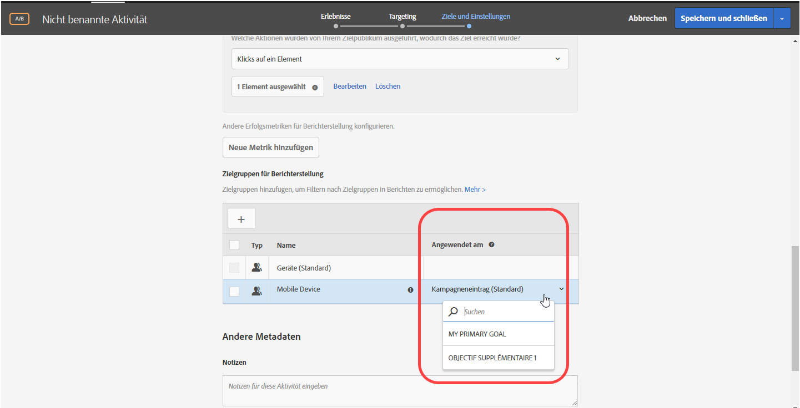
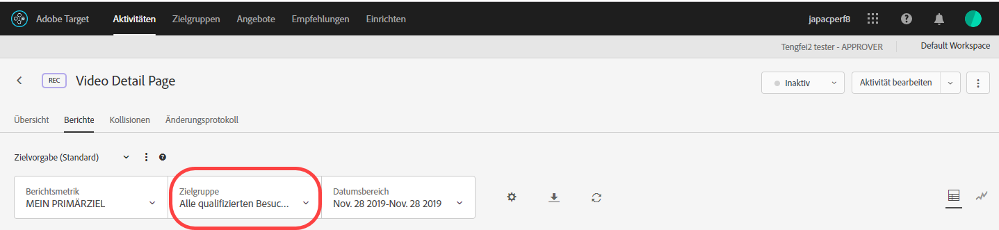

# Anwenden einer Reporting-Zielgruppe auf eine Erfolgsmetrik{#apply-a-reporting-audience-to-a-success-metric}

Wählen Sie eine Erfolgsmetrik aus, die den Benutzer für die Berichterstellungszielgruppe qualifiziert.

Mit der Dropdownliste [!UICONTROL Angewendet am] können Sie Zielgruppen bei allen Aktivitäten Erfolgsmetriken zuordnen. Somit können Sie die Berichtszahlen anzeigen, nachdem die Metrik erreicht wurde. Dasselbe gilt auch für nachfolgende Aktionen.

Ein Beispiel: Angenommen, Sie haben eine Aktivität für alle Besucher erstellt, die über Ihre Homepage die Konversionsseite erreichen, aber Sie möchten sich auch stärker auf Besucher konzentrieren, die im Vorfeld ihrer Konversion einen Wert von mehr als 50 $ zum Warenkorb hinzugefügt haben.

Die Dropdownliste „Angewendet am“ bietet potentiell drei Kategorien: alle Besucher der Aktivität, nur Besucher, die einen bestimmten Schritt in der Aktivität erreichen oder nur Besucher, bei denen es zu einer Konversion kommt. Oder, anders gesagt, Sie können festlegen, dass ein Besucher eine Mbox auf der Entrypage der Aktivität, eine mbox, die einen bestimmten Punkt in der Mitte der Aktivität definiert, oder die Konversions-Mbox am Ende der Aktivität erreichen muss.

[Erfolgsmetriken](/help/c-activities/r-success-metrics/success-metrics.md#reference_D011575C85DA48E989A244593D9B9924) sind nur verfügbar, wenn Sie sie für Ihre Aktivität konfiguriert haben. Wenn Sie keine Erfolgsmetriken definiert haben, werden Ihnen in der Dropdownliste nur zwei Optionen angezeigt: Kampagneneintrag und Konversion.

Bedenken Sie folgende Informationen, wenn Sie einer Erfolgsmetrik eine Berichterstellungszielgruppe zuweisen:

* Bei Aktionen vor der Aktion, der die Erfolgsmetrik zugewiesen ist, wendet Target keine segmentierte Zielgruppe an.
* Bei Aktionen nach der Aktion, der die Erfolgsmetrik zugewiesen ist, wendet Target eine segmentierte Zielgruppe an.

Um die Segmentierung in der Berichterstellung zu sehen, wählen Sie die gewünschte Zielgruppe aus der Dropdownliste „Zielgruppe“ im Bericht der Aktivität aus.

