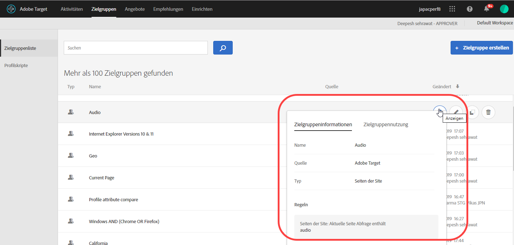
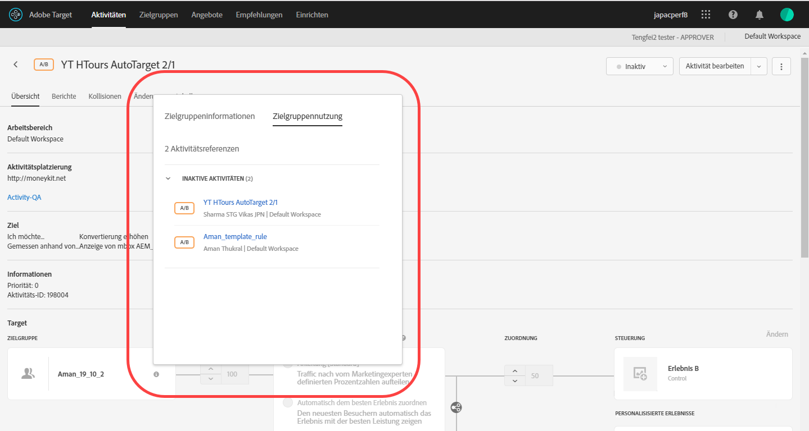
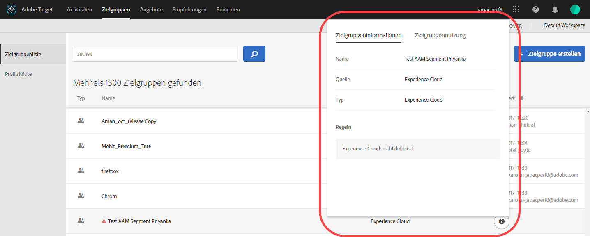

# Erstellen von Zielgruppen

Mithilfe von Zielgruppen in Adobe Target wird bestimmt, wer Inhalte und Erlebnisse in einer Target-Aktivität anzeigen kann.

Zielgruppen werden überall dort eingesetzt, wo Targeting zur Verfügung steht. Beim Targeting einer Aktivität können Sie entweder eine wiederverwendbare Zielgruppe aus der [!UICONTROL Zielgruppenliste] auswählen, [eine aktivitätsspezifische Zielgruppe erstellen](/help/c-target/creating-activity-only-audience.md) und verwenden oder [mehrere Zielgruppen kombinieren](/help/c-target/combining-multiple-audiences.md#concept_A7386F1EA4394BD2AB72399C225981E5), um eine Ad-hoc-Zielgruppe zu erstellen.

Sie können auch Zielgruppendaten verwenden, die von [!DNL Analytics] für Echtzeit-Targeting und Personalisierung in [!DNL Adobe Target] und anderen [!DNL Experience Cloud]-Lösungen erfasst wurden. Siehe [Audiencen](https://experienceleague.adobe.com/docs/core-services/interface/audiences/audience-library.html) im *Core Services-Benutzerhandbuch*.

In [!DNL Target] stehen zwei Zielgruppentypen zur Verfügung:

* **Target-Zielgruppen:** Dieser Typ wird verwendet, um verschiedenen Besuchertypen unterschiedliche Inhalte bereitzustellen.
* **Berichtszielgruppen:** Dieser Typ wird verwendet, um zu bestimmen, wie verschiedene Benutzertypen auf den gleichen Inhalt reagieren, und unterstützt Sie bei der Analyse Ihrer Testergebnisse.

   In [!DNL Target] können Sie Berichtszielgruppen nur dann konfigurieren, wenn Sie [!DNL Target] als Berichtsquelle verwenden. Wenn Sie [ Adobe Analytics als Berichtsquelle](/help/c-integrating-target-with-mac/a4t/a4t.md) (A4T) verwenden, müssen Sie Ihre Berichterstellungszielgruppen in [!DNL Analytics] konfigurieren.

## Verwenden der Zielgruppenliste

Wenn Sie auf die Liste [!UICONTROL Zielgruppen] zugreifen möchten, klicken Sie in der oberen Menüzeile auf **[!UICONTROL Zielgruppen]**:

Die [!UICONTROL Zielgruppenliste] enthält alle Zielgruppen, die Sie in Ihren Aktivitäten verwenden können. Verwenden Sie die [!UICONTROL Zielgruppenliste], um Zielgruppen zu erstellen, zu bearbeiten, zu löschen, zu kopieren oder miteinander zu kombinieren. Die Liste zeigt auch die Quelle an, an der die Zielgruppe erstellt wurde ([!DNL Target], [!DNL Target Classic], [!DNL Adobe Audience Manager (AAM),], [!DNL Experience Cloud] usw.). Vordefinierte Zielgruppen wie „Neue Besucher“ und „Wiederkehrende Besucher“ lassen sich nicht umbenennen.

Bei der Arbeit mit Zielgruppen, die ursprünglich in AAM erstellt wurden, werden Sie von Target benachrichtigt, wenn Sie in Target-Aktivitäten auf eine Zielgruppe verweisen, die in AAM gelöscht wurde.

* Wenn eine Zielgruppe in AAM gelöscht wurde, wird sowohl in der Liste [!UICONTROL „Zielgruppe“] als auch in der Zielgruppenauswahl ein Warnsymbol angezeigt. Darüber hinaus gibt eine QuickInfo an, dass die Zielgruppe in AAM gelöscht wurde.
* Wenn Sie versuchen, mehrere Zielgruppen mit einer gelöschten Zielgruppe zu kombinieren oder eine Aktivität zu speichern, die auf eine gelöschte Zielgruppe verweist, wird eine Warnmeldung angezeigt.

Sie können auch benutzerdefinierte Profilparameter und `user.`-Parameter als Ziel auswählen. Klicken Sie beim Hinzufügen einer Audience auf **[!UICONTROL Hinzufügen Regel]** > **[!UICONTROL Besucher-Profil]** und wählen Sie dann den Parameter, den Sie zur Zielgruppe Ihrer Aktivität verwenden möchten. Wird der gewünschte Parameter nicht angezeigt, wurde er nicht von einer Mbox ausgelöst. In der Dropdownliste [!UICONTROL Benutzerdefinierte Parameter] sind weitere benutzerdefinierte Mbox-Parameter verfügbar.

Durchsuchen Sie die [!UICONTROL Zielgruppenliste] über das Suchfeld. Sie können nach einem beliebigen Teil des Zielgruppennamens suchen oder eine bestimmte Zeichenfolge in Anführungszeichen setzen.

Sie können die [!UICONTROL Zielgruppenliste] nach Zielgruppennamen oder dem Datum der letzten Änderung sortieren. Wenn Sie eine Sortierung nach Name oder Datum vornehmen möchten, klicken Sie auf die Spaltenüberschrift und wählen Sie dann die Anzeige der Zielgruppen in aufsteigender oder absteigender Reihenfolge aus.

## Anzeigen von Zielgruppendefinitionen {#section_11B9C4A777E14D36BA1E925021945780}

Sie können Details zur Zielgruppendefinition auf einer Pop-up-Karte an verschiedenen Stellen der Target-Benutzeroberfläche anzeigen, ohne die Zielgruppe öffnen zu müssen. Diese Funktionalität gilt für in Target Standard/Premium erstellte Zielgruppen und für aus Target Classic oder via API erstellte Zielgruppen.

Der Zugriff auf die folgende Zielgruppendefinitionskarte erfolgt beispielsweise durch Bewegen des Mauszeigers über eine Zielgruppe in der Zielgruppenliste und anschließendes Klicken auf das Ansichtssymbol:

Der Zugriff auf die folgende Zielgruppendefinition erfolgt durch Klicken auf das Ansichtssymbol auf der Übersichtsseite einer Aktivität:

Klicken Sie auf die Registerkarte [!UICONTROL Zielgruppennutzung], um andere Aktivitäten anzuzeigen, die ggf. auf diese Zielgruppe verweisen. So können Sie beim Bearbeiten von Zielgruppen nicht beabsichtigte Auswirkungen auf andere Aktivitäten verhindern. Zu „Informationen“ zählen „Live-Aktivitäten“, „Inaktive Aktivitäten“, „Archivierte Aktivitäten“ und „Aktivitätssynchronisierung“. Diese Funktion ist für alle Zielgruppen (Bibliothekszielgruppen und  [Zielgruppen vom Typ „Nur Aktivität“](/help/c-target/creating-activity-only-audience.md#concept_A6BADCF530ED4AE1852E677FEBE68483)) verfügbar.

Wenn eine Zielgruppe mit einer anderen Zielgruppe kombiniert und die kombinierte Zielgruppe zum Erstellen einer Aktivität verwendet wird, findet sich in den Nutzungsinformationen für beide Zielgruppen die neu erstellte Aktivität.

Die folgende Zielgruppendefinitionskarte ist für eine aus der Adobe Experience Cloud importierte Zielgruppe vorgesehen. In dieser Instanz wurde die Zielgruppe aus Adobe Audience Manager (AAM) importiert.

Für diese importierten Zielgruppentypen sind die folgenden Details verfügbar:

| Zielgruppentyp | Details |
|--- |--- |
| Mobile Zielgruppe | Marketing-Name, Hersteller und Modell. Der `matches | does not match`-Operator wird anstelle `equals | does not equal`  angezeigt. |
| Besucherverhalten-Zielgruppe | **user.categoryAffinity:** `categoryAffinity` mit `FAVORITE`-Parameter.  **-Überwachung:** Überwachungsdienst ist True. **Kein Überwachungsdienst:**&#x200B;Überwachungsdienst ist False.  |
| Zielgruppen mit dem Operator NOT | **Einzelregel:** Target zeigt die Zielgruppe im Format `[All Visitor AND [NOT [rule]` an. Einzelne NOT-Regel wird mit UND mit `AllVisitor`-Zielgruppe angezeigt.  |

Berücksichtigen Sie beim Arbeiten mit importierten Zielgruppen Folgendes:

* Ausdrucksziel-Zielgruppen werden in Target Standard/Premium nicht mehr unterstützt.
* Target Standard/Premium unterstützt einige veraltete Zielgruppen nicht oder verfügt über verbesserte Operatoren zur einfachen Nutzung. Daher bedeutet die Definition einer importierten Zielgruppe trotz definitionsgemäßer Funktion nicht zwingendermaßen, dass dieselbe nun für die Erstellung in der Standard/Premium-Schnittstelle verfügbar ist. Beispielsweise sind soziale Zielgruppen zwar mit den zugehörigen Regeln sichtbar, aber Target Standard/Premium lässt die Erstellung sozialer Zielgruppen nicht zu.

## Schulungsvideo: Verwenden von Zielgruppen  

Dieses Video enthält Informationen zur Verwendung von Zielgruppen.

* Erläuterung des Begriffs „Zielgruppe“
* Erläuterung der beiden Arten, auf die Zielgruppen zur Optimierung eingesetzt werden
* Auffinden von Zielgruppen in der Zielgruppenliste
* Zuordnung einer Aktivität zu einer Zielgruppe
* Verwenden von Zielgruppen für die passive Berichterstattung zu einer Aktivität

>[!VIDEO](https://video.tv.adobe.com/v/17398)
