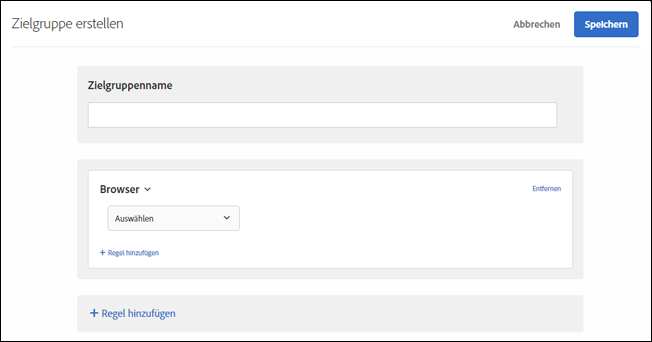

# Browser

Sie können Benutzer, die einen speziellen Browser oder spezielle Browseroptionen beim Besuch Ihrer Seite verwenden, als Ziel auswählen.

Die folgenden Browser können als Ziel ausgewählt werden:

* Chrome
* Microsoft Edge
* Firefox
* Opera
* Safari
* iPad
* Internet Explorer
* iPhone|

Es gibt zwei Möglichkeiten, Browser auszurichten:

**Vordefinierte Zielgruppe:** Verwenden Sie diesen Typ, wenn Sie nur Besucher ansprechen möchten, die für den Besuch auf Ihrer Site einen speziellen Browser verwenden. Wenn Sie zum Beispiel eine Chrome-Erweiterung anbieten, würden Sie nur Chrome-Benutzer ansprechen.

1. Wählen Sie beim Einrichten Ihrer Aktivität den Browser aus der Dropdownliste „Zielgruppe“ aus.

   Diese Option richtet die Aktivität nur auf Besucher aus, die den angegebenen Browser verwenden.

**Benutzerdefinierte Browser-Zielgruppenregel:** Mit einer benutzerdefinierten Zielgruppe können Sie mehrere Browser als Ziel definieren oder Regeln bzw. Ausschlüsse für spezielle Browser, Browserversionen oder Browsersprachen festlegen. Dies bietet eine erhebliche Flexibilität bei der Ausrichtung einer Kampagne auf der Grundlage von Browserattributen.

1. Klicken Sie in der [!DNL Target]-Oberfläche auf **[!UICONTROL Zielgruppe]** > **[!UICONTROL Zielgruppe erstellen]**.
1. Nennen Sie die Zielgruppe.
1. Klicken Sie auf **[!UICONTROL Regel hinzufügen]** > **[!UICONTROL Browser]**.

   

1. Klicken Sie auf **[!UICONTROL Auswählen]** und wählen Sie anschließend eine der folgenden Optionen aus:

   * **Typ:** Schließen Sie einen bestimmten Browser ein oder aus. Weitere Informationen finden Sie unter [Typ](/help/c-target/c-audiences/c-target-rules/browser.md#section_6ADC758F23F145B3A310151546D83D56).
   * **Sprache:** Schließen Sie bestimmte Browserversionen, die spezifische Sprachen verwenden, ein oder aus. Weitere Informationen finden Sie unter [Sprache](/help/c-target/c-audiences/c-target-rules/browser.md#section_7520D1AA464A45A6843EABE2D2B431A1).
   * **Version:** Schließen Sie bestimmte Browserversionen ein oder aus. Weitere Informationen finden Sie unter [Version](/help/c-target/c-audiences/c-target-rules/browser.md#section_37CC8CE45DA04E8682AE6388321BA6EF).

1. (Optional) Klicken Sie auf **[!UICONTROL Regel hinzufügen]** und legen Sie zusätzliche Regeln für die Zielgruppe fest.
1. Klicken Sie auf **[!UICONTROL Speichern]**.

Das folgende Beispiel zeigt eine Zielgruppe, die Internet Explorer-Benutzer in Version 10 oder 11 umfasst:

## Browseroptionen {#concept_221D8EEF53CC45AEACEB17CF336A3658}

Wählen Sie Aktivitätsteilnehmer basierend auf ihrem Browsertyp, ihrer Sprache oder Version als Zielgruppe aus oder schließen Sie sie aus.

### Typ   {#section_6ADC758F23F145B3A310151546D83D56}

Schließen Sie einen bestimmten Browser als Ziel ein oder aus.

Wählen Sie **[!UICONTROL Typ]** und wählen Sie entweder gleich oder nicht gleich.

* Gleich: Schließt die ausgewählten Browser als Ziel ein.
* Nicht gleich: Schließt die ausgewählten Browser aus.

Wählen Sie einen oder mehrere Browser aus. Mehrfachoptionen sind mit einem ODER verbunden.

### Sprache   {#section_7520D1AA464A45A6843EABE2D2B431A1}

Schließen Sie bestimmte Browserversionen, die spezifische Sprachen verwenden, als Ziel ein oder aus.

Wenn zum Beispiel ein Angebot nur auf Englisch verfügbar ist, können Sie Browser als Ziel einschließen, deren Sprache auf Englisch festgelegt ist. Oder wenn Ihre Seite keine Doppel-Byte-Zeichen unterstützt, können Sie Browser ausschließen, die für asiatische Sprachen eingestellt sind.

In Fällen, in denen die Sprache wichtiger als der Standort ist, bietet das Ein- oder Ausschließen von Browsersprachen eine zielgerichtetere Besucheransprache als die geografisch basierte Kundenansprache. Wenn Sie zum Beispiel einen auf Englisch geschriebenen Artikel anbieten, können Sie entweder englischsprachige Länder oder Länder, deren Sprache auf Englisch festgelegt ist, als Ziel einschließen. Wenn Sie den Browser als Ziel einschließen, steht der Artikel Personen zur Verfügung, die Englisch verstehen, sich jedoch in Ländern befinden, in denen Englisch nicht die Hauptsprache ist.

Wählen Sie **[!UICONTROL Sprache]** und wählen Sie entweder gleich oder nicht gleich.

* Gleich: Schließt die ausgewählten Browsersprachen als Ziel ein.
* Nicht gleich: Schließt die ausgewählten Browsersprachen als Ziel aus.

Wählen Sie eine oder mehrere Sprachen aus. Mehrfachoptionen sind mit einem ODER verbunden.

Folgende Browsersprachen können als Ziel ein- oder ausgeschlossen werden.

* Englisch
* Französisch
* Deutsch
* Japanisch
* Koreanisch
* Portugiesisch
* Russisch
* Spanisch
* Traditionelles Chinesisch

### Version   {#section_37CC8CE45DA04E8682AE6388321BA6EF}

Schließen Sie bestimmte Browserversionen als Ziel ein oder aus.

Wenn Ihre Seite zum Beispiel in Internet Explorer Version 11 oder früher nicht richtig angezeigt wird, können Sie eine Zielgruppe erstellen, die diese Versionen ausschließt. In diesem Fall würden Sie eine Regel aufstellen, bei der der Browsertyp gleich Internet Explorer ist, und eine zweite Regel hinzufügen, bei der die Version kleiner oder gleich 11 lautet.

Wählen Sie **[!UICONTROL Version]** und wählen Sie dann einen Operator:

* Gleich
* Ist nicht gleich
* Größer als
* Größer als oder gleich
* Kleiner als
* Kleiner als oder gleich

Geben Sie die Versionsnummer ein.

Es können nur Hauptversionen in das Textfeld eingegeben werden. Die angegebene Version enthält alle kleineren Versionen dieser Version. Wenn Sie zum Beispiel Version 10 angeben, werden auch Besucher mit Version 10.1 eingeschlossen.

Mehrfachoptionen sind mit einem ODER verbunden.

## Schulungsvideo: Erstellen von Zielgruppen  

Dieses Video enthält Informationen zur Verwendung von Zielgruppenkategorien.

* Erstellen von Zielgruppen
* Festlegen von Zielgruppenkategorien

>[!VIDEO](https://video.tv.adobe.com/v/17392)
