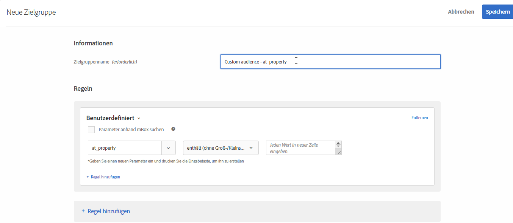

# Benutzerdefinierte Parameter

Benutzerdefinierte Parameter sind Mbox-Parameter in [!DNL Adobe Target]. Wenn Sie Mbox-Parameter an Mboxes übergeben oder die Funktion `targetPageParams` verwenden, werden diese Parameter hier zur Verwendung in Zielgruppen angezeigt.

Weitere Informationen finden Sie unter [Übergeben von Parametern an eine globale Mbox](/help/c-implementing-target/c-implementing-target-for-client-side-web/t-mbox-download/c-understanding-global-mbox/pass-parameters-to-global-mbox.md).

Wenn Sie eine benutzerdefinierte Zielgruppe basierend auf einem erstellen, erhalten Sie von `mboxParameter`mboxParameter keine Aufforderung mehr, `mboxName` einzugeben. Der Mbox-Name ist jetzt optional. Mit dieser Änderung können Sie Parameter aus mehreren Mboxes verwenden oder auf einen Parameter verweisen, der noch nicht am Rand aufgezeichnet wurde.

1. Klicken Sie in der [!DNL Target]-Oberfläche auf **[!UICONTROL Zielgruppe]** > **[!UICONTROL Zielgruppe erstellen]**.
1. Benennen Sie die Zielgruppe und fügen Sie eine optionale Beschreibung hinzu.
1. Ziehen Sie **[!UICONTROL Benutzerdefiniert]** in den Bereich Audience Builder .

   So wählen Sie den gewünschten Parameter aus:

   * Wählen Sie beim Erstellen einer Zielgruppe einen Parameternamen aus der Liste aus, geben Sie die ersten Zeichen des gewünschten Parameternamens ein oder geben Sie den vollständigen Namen des gewünschten Parameternamens ein.
   * Wenn Sie sich den Mbox-Namen, aber nicht den Parameternamen merken, verwenden Sie die Dropdownliste [!UICONTROL Filtern nach] , um nach einer bekannten Mbox zu filtern, die den gewünschten Parameter übergibt.

   Bei keiner der Methoden gibt es eine Verbindung zwischen Mbox und Parameter. Die Zielgruppe basiert auf dem Parameter für alle Mboxes, die diesen Parameter übergeben.

   Wenn Sie eine bestehende Zielgruppe bearbeiten, werden die Filterkriterien mit dem Mbox-Namen angezeigt, der bei der Erstellung angegeben wurde.

1. Wählen Sie einen Auswerter:

   * enthält (nicht von Schreibweise abhängig)
   * enthält nicht (nicht von Schreibweise abhängig)
   * Gleich
   * Ist nicht gleich
   * Größer als
   * Größer als oder gleich
   * Kleiner als
   * Kleiner als oder gleich
   * Parameter ist vorhanden
   * Parameter ist nicht vorhanden
   * Parameterwert ist vorhanden
   * Parameterwert ist nicht vorhanden
   * Parameter oder Wert ist nicht vorhanden
   * Mit
   * Endet mit

   

1. Geben Sie jeden Wert in eine neue Zeile ein.
1. (Optional) Richten Sie zusätzliche Regeln für die Zielgruppe ein.
1. Klicken Sie auf **[!UICONTROL Fertig]**.

Die [Popupkarte mit Definitionsdetails](/help/c-target/c-audiences/audiences.md#section_11B9C4A777E14D36BA1E925021945780) der Zielgruppe enthält den Parameternamen im Abschnitt „Regeln“. Auf die Mbox, die zum Filtern verwendet wird, wird nicht verwiesen.

>[!NOTE]
>
>Bei benutzerdefinierten Zielgruppen, die vor der [!DNL Target] 18.5.1-Version (22. Mai 2018) erstellt wurden, werden Mbox-Namen nicht in der Popup-Karte für die Zielgruppendefinition angezeigt. Speichern Sie die benutzerdefinierte Zielgruppe erneut, um den Mbox-Namen auf der Karte anzuzeigen.

## Zu beachten {#considerations}

* Zielgruppen und Aktivitäten werden für eine spezifische Mbox ausgewertet. Wenn die globale Mbox beispielsweise einen bestimmten Parameter übergibt, die regionale Mbox jedoch nicht, ist die Aktivität/Zielgruppe, die diesen Parameter angibt, für die in der regionalen Mbox nicht qualifiziert.
* Das Targeting wird nicht anhand interner Mbox-Parameter wie mboxPC, mboxSession, mbox3rdPartyId, mboxMCSDID, mboxMCAVID, mboxMCGVID, mboxCount, mboxId und mboxVersion bewertet.

## Schulungsvideo: Erstellen von Zielgruppen 

Dieses Video enthält Informationen zur Verwendung von Zielgruppenkategorien.

* Erstellen von Zielgruppen
* Festlegen von Zielgruppenkategorien

>[!VIDEO](https://video.tv.adobe.com/v/17392)
