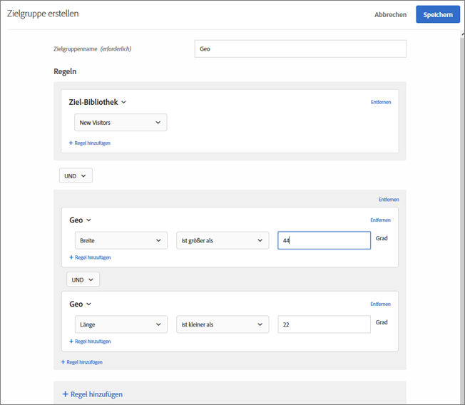

# Geo  

Verwenden Sie die Audiencen in [!DNL Adobe Target], um Benutzer anhand ihres geografischen Standorts, einschließlich ihres Landes, Bundeslandes, ihrer Stadt, Postleitzahl, DMA oder des Mobilnetzbetreibers, Zielgruppe.

Geo-Positionsparameter ermöglichen das Targeting der Aktivitäten und Erlebnisse anhand der geografischen Daten der Besucher. Sie können Besucher anhand ihres Standortes (Land, Bundesland, Stadt, Postleitzahl, Breitengrad, Längengrad, DMA oder Mobilnetzbetreiber) ein- oder ausschließen. Diese Daten werden mit jeder Target-Anfrage gesendet und basieren auf der IP-Adresse des Besuchers. Diese Parameter können wie Targeting-Werte ausgewählt werden.

## Erstellen einer Audience mit Geotargeting {#section_49CBFFAAC8694C4AAD3DE4B2DB7B05DE}

1. Klicken Sie in der [!DNL Target]-Oberfläche auf **[!UICONTROL Zielgruppe]** > **[!UICONTROL Zielgruppe erstellen]**.
1. Nennen Sie die Zielgruppe.
1. Klicken Sie auf **[!UICONTROL Regel hinzufügen]** > **[!UICONTROL Geo]**.

1. Klicken Sie auf **[!UICONTROL Auswählen]** und wählen Sie anschließend eine der folgenden Optionen aus:

   * Land
   * Land
   * Stadt
   * Postleitzahl
   * Breitengrad
   * Längengrad
   * DMA
   * Mobilnetzbetreiber

   Die IP-Adresse eines Besuchers wird mit einer Mbox-Anfrage einmal pro Besuch (Sitzung) übermittelt, um Geotargeting-Parameter für den betreffenden Besucher aufzulösen.

   [!DNL Target] verwendet für Mobilnetzbetreiber die IP-Adressregistrierungsdaten (die Eigentümer des IP-Adressenblocks sind), um den geeigneten Mobilnetzbetreiber mithilfe von [Mobile Country Codes (MCC) und Mobile Network Codes (MNC)](https://www.mcc-mnc.com) zu ermitteln.

1. Geben Sie einen Operator und den entsprechenden Wert an.
1. (Optional) Klicken Sie auf **[!UICONTROL Regel hinzufügen]** und legen Sie zusätzliche Regeln für die Zielgruppe fest.
1. Klicken Sie auf **[!UICONTROL Speichern]**.

Die folgende Abbildung zeigt eine Zielgruppe, die Benutzer auswählt, die auf die Aktivität von einem Breitengrad von über 44 Grad und einem Längengrad von unter 22 Grad zugreifen.

## Genauigkeit {#section_D63D5FFCB49C42F9933AFD0BD7C79DF1}

Die Genauigkeit von Geotargeting hängt von verschiedenen Faktoren ab. WLAN-Verbindungen sind genauer als Mobilfunknetze. Wenn der Besucher eine mobile Datenverbindung nutzt, kann die Genauigkeit der Standortsuche durch den Standort, die Datenbeziehung zwischen dem Anbieter und [DeviceAtlas](https://deviceatlas.com/device-data/user-agent-tester) und anderen Faktoren beeinflusst werden. Durch Mobilfunkmasten gestützte Netzwerkverbindungen sind in der Regel weniger genau als kabelgebundene oder WLAN-Verbindungen. Außerdem könnte die IP-Adresse eines Besuchers dem ISP-Speicherort des Besuchers zugeordnet werden, der möglicherweise nicht mit dem tatsächlichen Speicherort des Besuchers übereinstimmt. Einige Probleme mit der mobilen Geolokation können mit der [Geolocation API](https://developer.mozilla.org/en-US/docs/Web/API/Geolocation_API) gelöst werden.

In der folgenden Tabelle finden Sie Informationen zur Genauigkeit IP-basierter Standortdaten von [DigitalEnvoy](https://www.digitalelement.com/solutions/) für kabelgebundene oder WLAN-Internetverbindungen. DigitalEnvoy bietet die präzisesten Daten in der Branche. Die Gesamtgenauigkeit beläuft sich auf 99,9 % auf Länderebene und auf bis zu 97 % auf Stadtebene. Die Daten zur Genauigkeit sind nicht für durch Mobilfunkmasten gestützte Netzwerke gültig.

| Land | Land | Stadt | Region |
|--- |--- |--- |--- |
| USA | 99,99 % | 96 % | 94 % |
| Kanada | 99,99 % | 96 % | 94 % |
| Europa | 99,99 % |  |  |
| GB | 99,99 % |  | 87 % |
| Deutschland | 99,99 % | 95 % | 93 % |
| Skandinavien | 99 % | ~ 91-93 % | ~ 85 % |
| Spanien | 99,99 % | ~ 90 % | ~ 85-99 % |
| Asien | 99 % | ~ 95 % | ~ 91-93 % |
| Japan | 99,99 % | ~ 95 % | ~ 91-93 % |
| Australien | 99,99 % | 94 % | 91 % |

## Verwenden von Geotargeting in Profilskripts {#section_92C93138542C4A94997E3F4BE3F5DA28}

Sie können Geoinformationen für Profilskripts verwenden.

Beispiele:

* `profile.geolocation.country`
* `profile.geolocation.state`
* `profile.geolocation.city`
* `profile.geolocation.zip`
* `profile.geolocation.dma`
* `profile.geolocation.domainName`
* `profile.geolocation.ispName`
* `profile.geolocation.connectionSpeed`
* `profile.geolocation.mobileCarrier`

Sie können beispielsweise einen Zielausdruck mit der Bezeichnung „From North America“ mit folgendem Code schreiben:

`return profile.geolocation.country == 'united states' || profile.geolocation.country == 'canada' || profile.geolocation.country == 'mexico';`

## Verwenden von Geotargeting-Werten als Token {#section_E7F7FDF62C3B4934A6565D04B24655F6}

Sie können Werte des Typs `profile.geolocation` nun direkt als Token in Angeboten, Plugins und so weiter verwenden.

Beispiele:

* `${profile.geolocation.country}`
* `${profile.geolocation.state}`
* `${profile.geolocation.city}`
* `${profile.geolocation.zip}`
* `${profile.geolocation.dma}`
* `${profile.geolocation.domainName}`
* `${profile.geolocation.ispName}`
* `${profile.geolocation.connectionSpeed}`
* `${profile.geolocation.mobileCarrier}`
* `${profile.geolocation.latitude}`
* `${profile.geolocation.longitude}`

## Geotargeting-FAQ {#section_DD308A53AF0F48FA8C81423580561FE7}

**Wie kann ich den Längen- und Breitengrad festlegen?**

* Der Wert für den Längen- und Breitengrad muss ein numerischer Wert in Grad sein.
* Der Wert für den Längen- und Breitengrad kann eine maximale Genauigkeit von fünf Dezimalstellen haben.
* Der Wert für den Breitengrad muss zwischen -90 und 90 liegen.
* Der Wert für den Längengrad muss zwischen -180 und 180 liegen.

**Wie funktioniert Geotargeting für Mobilgeräte?**

Die meisten Mobilgerätebenutzer greifen über WLAN auf Inhalte zu. Das bedeutet, dass das IP-basierte Geotargeting der Zielgruppe genauso präzise ist wie auf einem Desktop. Funkzellenbasierte Verbindungen können ungenauer sein, da die IP-Adresse des Besuchers auf der Funkzelle basiert, bei der das Signal erfasst wird. Einige Probleme mit der mobilen Geolokation können mit der [Geolocation API](https://developer.mozilla.org/en-US/docs/Web/API/Geolocation_API) gelöst werden.

**Wie geht die Geo-Funktion mit Besuchern von AOL um?**

Aufgrund der Art und Weise, wie AOL seinen Traffic anbietet, kann [!DNL Target] diese nur auf Landesebene Zielgruppe werden. Beispielsweise werden AOL-Nutzer in Frankreich bei einer Kampagne, die auf Frankreich ausgerichtet ist, erfolgreich Zielgruppe. Aber eine auf Paris ausgerichtete Kampagne kann AOL-Nutzer in Paris nicht erfolgreich Zielgruppe werden. Wenn Sie Ihr Targeting speziell auf AOL-Benutzer ausrichten möchten, können Sie das Feld Region auf „aol“ einstellen. Sie können Ihr Targeting auf AOL-Benutzer in den USA ausrichten, indem Sie zwei Targeting-Bedingungen festlegen - das Land muss genau mit „USA“ und die Region genau mit „aol“ übereinstimmen.

**Welche Granularität des Standortes bietet Geotargeting?**

* Land - global
* Bundesland/-staat/Region - global
* Ort - global
* Postleitzahl - USA, Deutschland, Kanada
* DMA/ITV (GB) - USA, GB
* Mobilnetzbetreiber - global

**Wie kann ich meine Aktivitäten als Benutzer von einem anderen Standort testen?**

* **at.js 1.*x***: Sie können Ihre IP-Adresse mit einer IP-Adresse von einem anderen Ort außer Kraft setzen und den  `mboxOverride.browserIp url` Parameter verwenden. Wenn sich Ihr Unternehmen beispielsweise in GB befindet und Ihre globalen Kampagnen auf Besucher in Auckland in Neuseeland abzielen, verwenden Sie folgendes URL-Format (vorausgesetzt, dass es sich bei `60.234.0.39` um eine IP-Adresse in Auckland handelt):

   `https://www.mycompany.com?mboxOverride.browserIp=60.234.0.39`

   Löschen Sie die Cookies, bevor Sie die Aktivität testen.

   >[!NOTE]
   >
   >`mboxOverride.browserIp` wird in at.js 1 unterstützt.*x*, zur Verfügung. Diese Funktion wird in at.js 2 nicht unterstützt.*x*.

* **at.js 1.*x***: So überschreiben Sie Ihre IP-Adresse mit &quot;at.js 2&quot;.*x* installieren Sie eine Browsererweiterung/ein Plugin (z. B. X-Forwarded-For Header für Chrome oder Firefox). Mit dieser Erweiterung können Sie die x-forwarded-for-Kopfzeile in Ihren Seitenanforderungen übergeben.

**Wie werden Gebiete wie Puerto Rico und Hongkong der Geotargeting-Struktur zugeordnet?**

Puerto Rico, Hongkong und andere Gebiete werden als separate Länderwerte verarbeitet.

**Erfasst (und speichert)  [!DNL Target] Informationen wie Postleitzahlen, wenn die Aktivität mit Geolocation-Targeting-Funktionen ins Visier genommen wird?**

Nein, [!DNL Target] verwendet nur während der Sitzung Geodaten, dann werden die Daten verworfen.

## Schulungsvideo: Erstellen von Audiencen 

Dieses Video enthält Informationen zur Verwendung von Zielgruppenkategorien.

* Erstellen von Zielgruppen
* Festlegen von Zielgruppenkategorien

>[!VIDEO](https://video.tv.adobe.com/v/17392)
