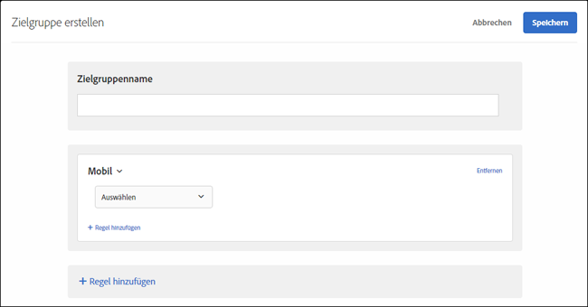

# Mobil{#mobile}

Sie können Zielgruppen erstellen, um Mobilgeräte auf Basis von Parametern wie Mobilgerät, Gerätetyp, Geräteanbieter, Bildschirmmaßen (in Pixeln) usw. auszuwählen.

Zum Beispiel möchten Sie möglicherweise abhängig davon, ob ein Benutzer über ein Telefon oder einen Computer auf Ihre Seite zugreift, unterschiedliche Inhalte anzeigen. In diesem Fall können Sie die Zielgruppe „Mobil“ und anschließend die Option **[!UICONTROL Ist Mobiltelefon]** auswählen und dann für Sie bedeutende spezifische Details wie den Telefontyp, die Bildschirmgröße (in Pixeln) usw. hinzufügen.

Das mobile Targeting wird von [DeviceAtlas](https://deviceatlas.com/device-data/user-agent-tester), einem Service von DotMobi bereitgestellt. DeviceAtlas ist eine umfassende Datenbank mobiler Geräte, die auf Daten beruht, die aus zahlreichen Quellen zusammengefasst wurden, einschließlich von Herstellern und Netzwerkbetreibern. Diese Daten wurden dann geprüft, referenziert und validiert, um eine große, genaue Datenbank der verfügbaren mobilen Geräte zu erstellen.

Für die Geräteerkennung werden die User-Agent-Zeichenfolgen analysiert. Einige Gerätehersteller, z. B. Apple, deaktivieren diese Funktion, indem sie in den User-Agent-Zeichenfolgen keine ausreichenden Informationen bereitstellen.

Apple-Geräte übermitteln beispielsweise in den UA-Daten keine gerätespezifischen Token. Daher können iPhone-Modelle (wie iPhone 5S, iPhone SE, iPhone 6 usw.) nicht mittels eines einfachen Keyword-basierten Verfahrens erkannt werden.

Um dieses Problem zu lösen, erfasst Target zusätzliche Daten, um iPhones und andere Apple-Geräte anhand folgender Parameter präzise zu erkennen:

| Parameter | Typ | Beschreibung |
|--- |--- |--- |
| devicePixelRatio | Zeichenfolge | Ein Verhältnis zwischen physischen Pixeln und geräteunabhängigen Pixeln (Dips) im Browser,  z. B. 1,5 oder 2. |
| screenOrientation | Zeichenfolge | Das Gerät und die JavaScript-Engine des Browsers unterstützen die Bildschirmdrehung. Mögliche Werte: Querformat oder Hochformat. |
| webGLRenderer | Zeichenfolge | Browser-Renderer des Grafiktreibers. |

>[!NOTE]
>
>Bei Kunden, die das Mobile SDK verwenden, ist keine Aktion erforderlich, um diese Funktion zu nutzen. Kunden, die at.js verwenden, müssen auf at.js Version 1.5.0](../../../c-implementing-target/c-implementing-target-for-client-side-web/target-atjs-versions.md#reference_DBB5EDB79EC44E558F9E08D4774A0F7A) (oder höher) [ aufrüsten.

Sie können mehr als eine Geräteeigenschaft auswählen. Mehrfachauswahlen werden mit ODER verbunden.

Kunden, die eine benutzerspezifische Integration (also weder at.js noch das Mobile SDK) verwenden, können diese Parameter selbst erfassen und als Mbox-Parameter übergeben.

1. Klicken Sie in der [!DNL Target]-Oberfläche auf **[!UICONTROL Zielgruppe]** > **[!UICONTROL Zielgruppe erstellen]**.
1. Nennen Sie die Zielgruppe.
1. Klicken Sie auf **[!UICONTROL Regel hinzufügen]** > **[!UICONTROL Mobil]**.
1. Klicken Sie auf **[!UICONTROL Auswählen]** und wählen Sie anschließend eine der folgenden Optionen aus:

   * Gerätemarketingbezeichnung
   * Gerätemodell
   * Gerätehersteller
   * Ist Mobilgerät
   * Ist Mobiltelefon
   * Ist Tablet
   * Betriebssystem
   * Bildschirmhöhe (px)
   * Bildschirmbreite (px)

   >[!NOTE]
   >
   >Aufgrund neuer Änderungen in iOS 12.2 ist die Erstellung einer Zielgruppe mit Regeln beeinträchtigt, die von der Gerätemarketingbezeichnung und vom Gerätemodell definiert werden, die iPhone-Modelle spezifizieren. Benutzer mit iPhones mit iOS 12.2 können nicht mehr als Zielgruppe ausgewählt werden. Wenn diese Benutzer jedoch nicht iOS 12.2 installiert haben, funktioniert das iPhone-Modell-Targeting weiterhin ordnungsgemäß.
   >
   >Das iOS 12.2-Update hat keine Auswirkungen auf die Identifizierung der folgenden Modelle, da diese Modelle das Upgrade auf iOS 12.2 nicht unterstützen: iPhone, iPhone 3G, iPhone 3GS, iPhone 4, iPhone 4s, iPhone 5, iPhone 5c, iPad, iPad 2, iPad / Retina Display, iPad Retina (4th Gen), iPod Touch 4 und iPod Touch 5.

   >[!NOTE]
   >
   >Sie können das Targeting nach Mobilnetzbetreiber mithilfe der [Geo-Einstellungen](../../../c-target/c-audiences/c-target-rules/geo.md#concept_5B4D99DE685348FB877929EE0F942670) vornehmen.

1. (Optional) Klicken Sie auf **[!UICONTROL Regel hinzufügen]** und legen Sie zusätzliche Regeln für die Zielgruppe fest.
1. Klicken Sie auf **[!UICONTROL Speichern]**.

Die folgende Abbildung zeigt eine Zielgruppe bestehend aus Besuchern, die Geräte verwenden, die von Google produziert wurden und Mobilgeräte sind.

## Schulungsvideo: Erstellen von Zielgruppen

Dieses Video enthält Informationen zur Verwendung von Zielgruppenkategorien.

* Erstellen von Zielgruppen
* Festlegen von Zielgruppenkategorien

>[!VIDEO](https://video.tv.adobe.com/v/17392)
