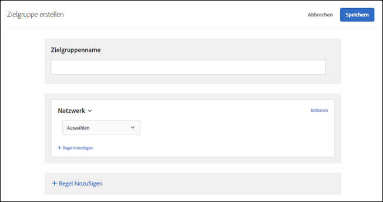

# Netzwerk{#network}

Sie können Zielgruppen auf der Basis von Netzwerkdetails erstellen.

1. Klicken Sie in der [!DNL Target]-Oberfläche auf **[!UICONTROL Zielgruppe]** > **[!UICONTROL Zielgruppe erstellen]**.
1. Nennen Sie die Zielgruppe.
1. Klicken Sie auf **[!UICONTROL Regel hinzufügen]** > **[!UICONTROL Netzwerk]**.
1. Klicken Sie auf **[!UICONTROL Auswählen]** und wählen Sie anschließend eine der folgenden Optionen aus:

   * **ISP:** Ein ISP ist eine Organisation, die ihren Abonnenten Internetzugang ermöglicht, in der Regel gegen eine monatliche oder jährliche Gebühr. Viele ISPs bieten weitere Services, wie Webhosting oder E-Mail. Das ISP-Feld enthält entweder einen kommerziellen ISP (beispielsweise Telekom oder Vodafone) oder eine andere Entität, wie beispielsweise ein Unternehmen oder eine Bildungseinrichtung.

      Die folgenden ISPs sind einige der beliebten ISPs in den USA:

      | Beliebter Name | ISP-Name | Domänenname | Beispiel-IP-Address |
      |---|---|---|---|
      | Cablevision | Cablevision Systems Corp. | *.optonline.net | 68.196.130.239 |
      | CenturyLink | Qwest Communications Company, LLC | *.centurylink.net | 64.40.65.0 |
      | Charter Communications | Charta-Mitteilungen | *.charter.com | 71.85.225.124 |
      | Comcast | Comcast Cable Communications, Inc. | *.comcast.net | 76.27.24.28 |
      | Cox | Cox Communications Inc. | *cox.net | 68.224.174.22 |
      | Speakeasy | MegaPath Corporation | *.speakeasy.net | 66.93.240.0 |
      | Time Warner | Time Warner Cable Internet LLC | *.res.rr.com | 72.229.28.185 |
      | Verizon FiOS | MCI Communications Services, Inc. d/b/a Verizon Business | *.fios.verizon.net | 173.68.112.34 |
      | Vivint | Smartrove Inc. | *.vivintwireless.net | 170.72.26.105 |
      | AT&amp;T Wireless | AT | *.mycingular.net |  |
      | Sprint mobile | Sprint Personal Communications Systems | IP-Adresse |  |
      | T-Mobile | T-Mobile USA, Inc. | IP-Adresse | 208.54.86.0 |
      | Verizon Wireless | Cellco Partnership DBA Verizon Wireless | *.myvzw.com | 70.195.74.199 |

      >[!NOTE]
      >
      >Verwenden Sie beim ISP-basierten Targeting den ISP-Namen, nicht den bekannten Namen. Stellen Sie bei der Erstellung von Regeln sicher, dass sie nicht von der Groß-/Kleinschreibung abhängig sind, oder verwenden Sie nur Kleinbuchstaben.

      Sie können die Werte des ISP und des Domänennamens testen. https://www.whoismyisp.org ist eine gute Ressource für Targeting-Zwecke. Sie können die oben in der Tabelle angegebenen Beispiel-IP-Adressen verwenden oder eine eigene eingeben. Verwenden Sie dann den Parameter `mboxOverride.browserIp= URL`, um diese IP-Adresse zu imitieren.

   * **Domänenname:** Dies ist der Domänenname für die IP-Adresse des Besuchers. Es ist nicht der Domänenname der Website, die Sie für [!DNL Target] verwenden. Dieser Domänenname bezieht sich auf die IP-Adresse des Besuchers und wird manchmal auch als Hostname bezeichnet. Er ist normalerweise dem ISP-Namen sehr ähnlich. Manchmal verweist der Hostname auf ältere Namen des Unternehmens, die zwar ihren ISP-Namen geändert haben, doch nicht den Domänennamen.
   * **Verbindungsgeschwindigkeit:** Dies ist die Geschwindigkeit der Internetverbindung des Besuchers. Es sind unter anderem folgende Optionen verfügbar: Breitband, Kabel, Einwahl, Mobil, OC3, OC12, Satellit, T1, T2 und Drahtlos, xDSL.

      Dieses Feld basiert auf dem Verbindungstyp, nicht auf der tatsächlichen Geschwindigkeit. [!DNL Target] kann die genauen Geschwindigkeiten von Verbindungen nicht ermitteln. Der Breitband-Verbindungstyp wird verwendet, wenn kein Hinweis auf andere Verbindungstypen vorhanden ist und somit keine bestimmte Verbindung gewählt werden kann.

1. (Optional) Klicken Sie auf **[!UICONTROL Regel hinzufügen]** und legen Sie zusätzliche Regeln für die Zielgruppe fest.
1. Klicken Sie auf **[!UICONTROL Speichern]**.

Die folgende Abbildung zeigt eine Zielgruppe, die Besucher auswählt, die AT&amp;T mit einer Verbindungsgeschwindigkeit von [!UICONTROL Mobile] verwenden.

## Schulungsvideo: Erstellen von Zielgruppen

Dieses Video enthält Informationen zur Verwendung von Zielgruppenkategorien.

* Erstellen von Zielgruppen
* Festlegen von Zielgruppenkategorien

>[!VIDEO](https://video.tv.adobe.com/v/17392)