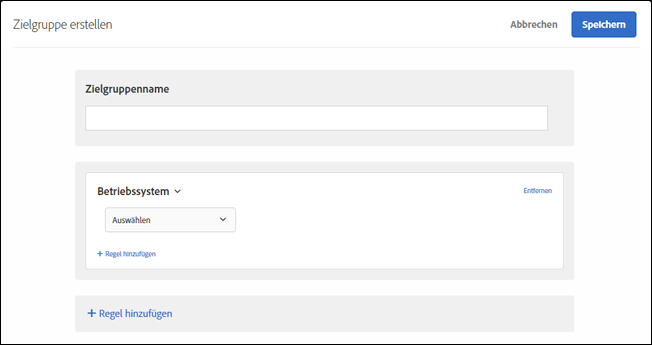

# Betriebssystem{#operating-system}

Sie können Benutzer, die ein bestimmtes Betriebssystem verwenden, als Ziel auswählen.

1. Klicken Sie in der [!DNL Target]-Oberfläche auf **[!UICONTROL Zielgruppe]** > **[!UICONTROL Zielgruppe erstellen]**.
1. Nennen Sie die Zielgruppe.
1. Klicken Sie auf **[!UICONTROL Regel hinzufügen]** > **[!UICONTROL Betriebssystem]**.
1. Klicken Sie auf **[!UICONTROL Auswählen]** und wählen Sie anschließend eine der folgenden Optionen aus:

   * Linux
   * Macintosh
   * Windows

1. (Optional) Klicken Sie auf **[!UICONTROL Regel hinzufügen]** und legen Sie zusätzliche Regeln für die Zielgruppe fest.
1. Klicken Sie auf **[!UICONTROL Speichern]**.

Die folgenden Abbildungen zeigen eine Zielgruppe, die Besucher auswählt, die ein Macintosh-Betriebssystem verwenden.

## Schulungsvideo: Erstellen von Zielgruppen

Dieses Video enthält Informationen zur Verwendung von Zielgruppenkategorien.

* Erstellen von Zielgruppen
* Festlegen von Zielgruppenkategorien

>[!VIDEO](https://video.tv.adobe.com/v/17392)
