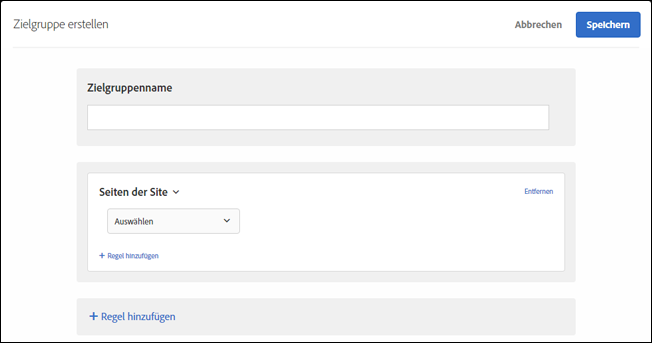
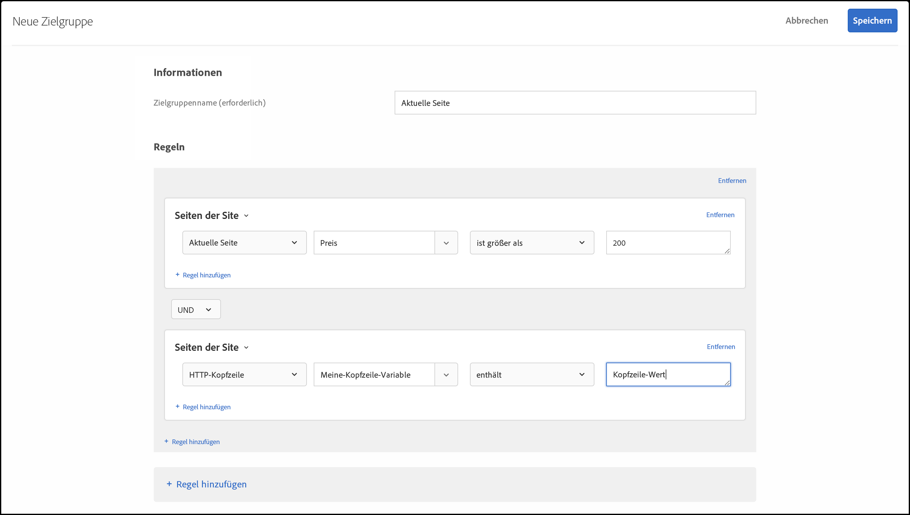

# Seiten der Site{#site-pages}

Sie können Besucher auf einer bestimmten Seite Ihrer Site Zielgruppe werden.

1. Klicken Sie in der [!DNL Target]-Oberfläche auf **[!UICONTROL Zielgruppe]** > **[!UICONTROL Zielgruppe erstellen]**.
1. Nennen Sie die Zielgruppe.
1. Klicken Sie auf **[!UICONTROL Regel hinzufügen]** > **[!UICONTROL Seiten der Site]**.

   

1. Klicken Sie auf die Dropdown-Liste **[!UICONTROL Wählen Sie]**, wählen Sie eine der folgenden Optionen und konfigurieren Sie dann die Regel wie gewünscht.

   Die verfügbaren Optionen und Bewertungsfaktoren in den nachfolgenden Dropdown-Listen in der Regel variieren je nach ausgewählter Option. Die folgende Abbildung zeigt die verfügbaren Optionen, wenn Sie [!UICONTROL Aktuelle Seite] auswählen:

   

   Die folgenden Optionen stehen in der ersten Dropdown-Liste zur Verfügung, wenn Sie [!UICONTROL Select] wählen.

   * **Aktuelle Seite:** Die Seite, auf der sich der Benutzer derzeit befindet.

      Die folgenden Optionen stehen in der zweiten Dropdown-Liste zur Verfügung, wenn Sie diese Option wählen:

      * URL (Weitere Informationen zur Bewertung von URLs durch die Zielgruppe finden Sie unter [Häufig gestellte Fragen zu Zielgruppen und Audiencen](/help/c-target/c-troubleshooting-targets-and-audiences/troubleshooting-targets-and-audiences.md).)
      * Domäne
      * Abfrage
      * Subdomäne
      * Domäne auf oberster Ebene
      * Pfad
      * Hash (#)-Fragment
   * **Vorherige Seite:** Die Seite, die der Benutzer vor dem Anklicken der aktuellen Seite aufgerufen hat. (Der Benutzer muss von der letzten Seite auf die aktuelle Seite klicken, damit die Seite nachverfolgt wird. Die vorherige Seite wird nicht verfolgt, wenn der Benutzer eine neue URL in den Browser eingibt.) Der tatsächliche Inhalt auf dieser Seite hängt vom Design Ihrer Site ab. Wenn beispielsweise auf der aktuellen Seite Informationen zu einem bestimmten Produkt angezeigt werden, kann es sich bei der letzten Seite um eine Kategorieseite, auf der der Benutzer ein bestimmtes Element ausgewählt hat (zum Beispiel eine Seite, auf mehrere Kameras eines bestimmten Typs angezeigt werden) oder eine Homepage mit Verweis auf die Ausstiegsseite handeln.

      Die folgenden Optionen stehen in der zweiten Dropdown-Liste zur Verfügung, wenn Sie diese Option wählen:

      * URL (Weitere Informationen zur Bewertung von URLs durch die Zielgruppe finden Sie unter [Häufig gestellte Fragen zu Zielgruppen und Audiencen](/help/c-target/c-troubleshooting-targets-and-audiences/troubleshooting-targets-and-audiences.md).)
      * Domäne
      * Abfrage
      * Subdomäne
      * Domäne auf oberster Ebene
      * Pfad
   * **Landingpage:** Die Landingpage ist die Seite, die Besuchern beim Zugriff auf Ihre Site zuerst angezeigt wird. Wenn der Besucher z. B. auf einen Link in Google klickt, der zu einer Kategorieseite führt, ist die Kategorieseite die Landingpage. Wenn der Link zu Ihrer Homepage führt, ist die Homepage die Landingpage. Die Landingpage wird während der Benutzersitzung gespeichert. Sie können Ihr Ziel tiefer in die Site richten, je nachdem, welche Seite die Landingpage des Benutzers in dieser Sitzung war.

      Die folgenden Optionen stehen in der zweiten Dropdown-Liste zur Verfügung, wenn Sie diese Option wählen:

      * URL (Weitere Informationen zur Bewertung von URLs durch die Zielgruppe finden Sie unter [Häufig gestellte Fragen zu Zielgruppen und Audiencen](/help/c-target/c-troubleshooting-targets-and-audiences/troubleshooting-targets-and-audiences.md).)
      * Domäne
      * Abfrage
      * Subdomäne
      * Domäne auf oberster Ebene
      * Pfad
      * Hash (#)-Fragment

      >[!NOTE]
      >
      >Das `landing.url`-Objekt wird bei einer Änderung der Subdomäne oder einer direkten URL-Ersetzung zurückgesetzt.

   * **HTTP-Kopfzeile:** Diese Option wertet die Informationen im HTTP-Header der Anforderung &quot;Zielgruppe&quot;aus. Wenn der HTTP-Header beispielsweise Sprachinformationen enthält, können Sie eine Regel erstellen, die die Bedingung `Accept-Language: es` enthält, damit Besucher, die auf die Zielgruppe zugreifen, auf Spanisch zugreifen können.

      Die folgenden Optionen stehen in der zweiten Dropdown-Liste zur Verfügung, wenn Sie diese Option wählen:

      * Accept
      * Accept-Charset
      * Accept-Encoding
      * Accept-Language
      * Genehmigung
      * Cache-Control
      * Verbindung
      * Content-Length
      * Content-MDS
      * Content-Type
      * Datum
      * Erwarten
      * Von
      * Host
      * If-Match
      * If-Modified-Since
      * If-none-match
      * If-Range
      * If-Unchanged-Since
      * Max. Vorwärts
      * Pragma
      * Proxy-Autorisierung
      * Bereich
      * Referer
      * TE
      * Aktualisierung
      * User-Agent
      * Via
      * Warnung

   Wenn Sie [!UICONTROL Aktuelle Seite], [!UICONTROL Vorherige Seite] oder [!UICONTROL Landingpage] auswählen, stehen die Optionen [!UICONTROL Domäne] und [!UICONTROL Abfrage] zur Verfügung. Berücksichtigen Sie bei der Auswahl dieser Optionen Folgendes:

   * **Domäne:** Die vollständige Domäne der Seite Für das Festlegen einer Domäne wird die Versendung von „contains“ empfohlen. Beispiel: „Domain equals facebook.com“ wird `m.facebook.com` oder `www.facebook.com` nicht akzeptieren. „Domain contains facebook.com“ hingegen erfasst alle Varianten von „facebook.com“.
   * **Abfrage:** Der Inhalt der URL nach dem ersten Fragezeichen (?) 

      `foo.html?e0a72cb2a2c7`

1. (Optional) Klicken Sie auf **[!UICONTROL Regel hinzufügen]** und legen Sie zusätzliche Regeln für die Zielgruppe fest.
1. Klicken Sie auf **[!UICONTROL Speichern]**.

Sie können Website-Zielgruppen auch mit einem eigenen „benutzerdefinierten Abfrageparameter“ oder „benutzerdefinierten Header“ erstellen.

Verwenden Sie:

* Abfrageparameter, wenn die vom Benutzer ausgewählte Regel „Aktuelle Seite“, „Landingpage“ oder „Vorherige Seite“ lautet.
* Kopfzeile, wenn die vom Benutzer ausgewählte Regel ein HTTP-Header ist.

Siehe Abbildung unten:

## Fehlerbehebung {#ts}

* Damit Audiencen der Landingpage ordnungsgemäß funktionieren, müssen für Anforderungen der Parameter `mboxReferrer` festgelegt sein (für die Versand-API der Parameter `context.address.referringUrl`), den die JavaScript-Bibliothek at.js mithilfe des Attributs `document.referrer` von der Seite übernimmt. Dieses `HTMLDocument`-Attribut gibt den URI der Seite zurück, von der der Benutzer navigiert hat. Der Wert dieses Attributs ist eine leere Zeichenfolge, wenn der Benutzer direkt zur Seite navigiert (nicht über einen Link, sondern z. B. über ein Lesezeichen).

   Wenn dieses Verhalten nicht Ihren Anforderungen entspricht, führen Sie einen der folgenden Schritte aus:

   * Übergeben Sie [mbox-Parameter](/help/c-implementing-target/c-implementing-target-for-client-side-web/t-mbox-download/c-understanding-global-mbox/pass-parameters-to-global-mbox.md) an [!DNL Target], um sie für Targeting-Zwecke zu verwenden.
   * Verwenden Sie eine [A/B-Test-Aktivität](/help/c-activities/t-test-ab/test-ab.md) anstelle einer Landingpage-Aktivität. A/B-Test-Aktivitäten wechseln die Erlebnisse nicht für denselben Besucher.
   * Verwenden Sie stattdessen ein [Besucher-Profil](/help/c-target/c-audiences/c-target-rules/visitor-profile.md).

* Beachten Sie bei der Verwendung von &quot;Beginns/ends with&quot;-Evaluatoren für Zeichenfolgen mit Kommas, dass diese
werden als Array von Werten ausgewertet, in denen jeder durch Kommas getrennte Wert ausgewertet wird. Beispiel: Wenn wir den Wert für eine Kopfzeile haben: `Accept-Language: en,zh;q=0.9,en-IN;q=0.8,zh-CN;q=0.7` wird für Bedingungen wie:
   * beginn mit Zh,
   * beginn mit en,
   * endet mit 0,7,
   * endet mit 0,8.

## Schulungsvideo: Erstellen von Zielgruppen

Dieses Video enthält Informationen zur Verwendung von Zielgruppenkategorien.

* Erstellen von Zielgruppen
* Festlegen von Zielgruppenkategorien

>[!VIDEO](https://video.tv.adobe.com/v/17392)
