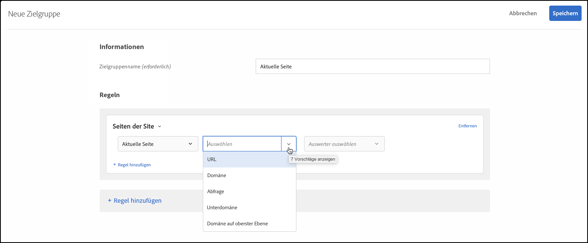

# Seiten der Site

Sie können Besucher mit [!DNL Adobe Target] als Ziel auswählen, die auf eine bestimmte Seite auf Ihrer Site zugreifen.

1. Klicken Sie in der [!DNL Target]-Oberfläche auf **[!UICONTROL Zielgruppe]** > **[!UICONTROL Zielgruppe erstellen]**.
1. Benennen Sie die Zielgruppe und fügen Sie eine optionale Beschreibung hinzu.
1. Ziehen Sie **[!UICONTROL Seiten der Site]** in den Bereich des Zielgruppen-Builders.

   

1. Klicken Sie auf die Dropdownliste **[!UICONTROL Wählen Sie]** aus, wählen Sie eine der folgenden Optionen aus und konfigurieren Sie dann die Regel nach Bedarf.

   Die verfügbaren Optionen und Auswerter in nachfolgenden Dropdownlisten in der Regel variieren je nach ausgewählter Option. Die folgende Abbildung zeigt die verfügbaren Optionen, wenn Sie [!UICONTROL Aktuelle Seite] auswählen:

   

   Die folgenden Optionen sind in der ersten Dropdown-Liste verfügbar, wenn Sie [!UICONTROL Auswählen] auswählen.

   * **[!UICONTROL Aktuelle Seite]:** Die Seite, die der Benutzer anzeigt.

      Die folgenden Optionen stehen in der zweiten Dropdownliste zur Verfügung, wenn Sie diese Option wählen:

      * [!UICONTROL URL]  (Weitere Informationen zur  [!DNL Target] Bewertung von URLs finden Sie in den  [häufig gestellten Fragen zu Zielen und Zielgruppen](/help/c-target/c-troubleshooting-targets-and-audiences/troubleshooting-targets-and-audiences.md).)
      * [!UICONTROL Domäne]
      * [!UICONTROL Abfrage]
      * [!UICONTROL Subdomäne]
      * [!UICONTROL Domäne auf oberster Ebene]
      * [!UICONTROL Pfad]
      * [!UICONTROL Hash (#)-Fragment]
   * **[!UICONTROL Vorherige Seite]:** Die Seite, die der Benutzer vor dem Klicken auf die aktuelle Seite aufgerufen hat. Der Benutzer muss von der vorherigen Seite zur aktuellen Seite klicken, damit die Seite verfolgt werden kann. Die vorherige Seite wird nicht verfolgt, wenn der Benutzer eine neue URL in den Browser eingibt. Der tatsächliche Inhalt auf dieser Seite hängt vom Design Ihrer Site ab. Wenn die aktuelle Seite beispielsweise Informationen zu einem bestimmten Produkt anzeigt, kann die vorherige Seite eine Kategorieseite sein, auf der der Besucher das spezifische Element auswählt. Zum Beispiel eine Seite, die mehrere Kameras eines bestimmten Typs anzeigt, oder es kann die Homepage sein, die zur endgültigen Seite führt.

      Die folgenden Optionen stehen in der zweiten Dropdownliste zur Verfügung, wenn Sie diese Option wählen:

      * [!UICONTROL URL]  (Weitere Informationen zur Bewertung von URLs durch Target finden Sie in den häufig gestellten Fragen zu  [Zielen und Zielgruppen](/help/c-target/c-troubleshooting-targets-and-audiences/troubleshooting-targets-and-audiences.md).)
      * [!UICONTROL Domäne]
      * [!UICONTROL Abfrage]
      * [!UICONTROL Subdomäne]
      * [!UICONTROL Domäne auf oberster Ebene]
      * [!UICONTROL Pfad]
   * **Einstiegsseite:** Die Einstiegsseite ist die Seite, die Besuchern beim Zugriff auf Ihre Site zuerst angezeigt wird. Wenn der Besucher z. B. auf einen Link in Google klickt, der zu einer Kategorieseite führt, ist die Kategorieseite die Landingpage. Wenn der Link zu Ihrer Homepage führt, ist die Homepage die Landingpage. Die Landingpage wird während der Benutzersitzung gespeichert. Sie können Ihr Ziel tiefer in die Site richten, je nachdem, welche Seite die Landingpage des Benutzers in dieser Sitzung war.

      Die folgenden Optionen stehen in der zweiten Dropdownliste zur Verfügung, wenn Sie diese Option wählen:

      * [!UICONTROL URL]  (Weitere Informationen zur Bewertung von URLs durch Target finden Sie in den häufig gestellten Fragen zu  [Zielen und Zielgruppen](/help/c-target/c-troubleshooting-targets-and-audiences/troubleshooting-targets-and-audiences.md).)
      * [!UICONTROL Domäne]
      * [!UICONTROL Abfrage]
      * [!UICONTROL Subdomäne]
      * [!UICONTROL Domäne auf oberster Ebene]
      * [!UICONTROL Pfad]
      * [!UICONTROL Hash (#)-Fragment]

      >[!NOTE]
      >
      >Das `landing.url`-Objekt wird bei einer Änderung der Subdomäne oder einer direkten URL-Ersetzung zurückgesetzt.

   * **[!UICONTROL HTTP-Header]:** Diese Option wertet die Informationen im HTTP-Header der  [!DNL Target] Anforderung aus. Wenn der HTTP-Header beispielsweise Sprachinformationen enthält, können Sie eine Regel erstellen, die die Bedingung `Accept-Language: es` enthält, um Besucher anzusprechen, die auf die Seite auf Spanisch zugreifen.

      Die folgenden Optionen stehen in der zweiten Dropdownliste zur Verfügung, wenn Sie diese Option wählen:

      * [!UICONTROL Accept]
      * [!UICONTROL Accept-Charset]
      * [!UICONTROL Accept-Encoding]
      * [!UICONTROL Accept-Language]
      * [!UICONTROL Genehmigung]
      * [!UICONTROL Cache-Control]
      * [!UICONTROL Verbindung]
      * [!UICONTROL Content-Length]
      * [!UICONTROL Content-MDS]
      * [!UICONTROL Content-Type]
      * [!UICONTROL Date]
      * [!UICONTROL Expect]
      * [!UICONTROL Von]
      * [!UICONTROL Host]
      * [!UICONTROL If-Match]
      * [!UICONTROL If-Modified-Since]
      * [!UICONTROL If-None-Match]
      * [!UICONTROL If-Range]
      * [!UICONTROL If-Unmodified-Since]
      * [!UICONTROL Max-Forwards]
      * [!UICONTROL Pragma]
      * [!UICONTROL Proxy-Authorization]
      * [!UICONTROL Bereich]
      * [!UICONTROL Verweisende Stelle]
      * [!UICONTROL TE]
      * [!UICONTROL Aktualisierung]
      * [!UICONTROL User-Agent]
      * [!UICONTROL Via]
      * [!UICONTROL Warnung]

   Wenn Sie [!UICONTROL Aktuelle Seite], [!UICONTROL Vorherige Seite] oder [!UICONTROL Landingpage] auswählen, sind die Optionen [!UICONTROL Domäne] und [!UICONTROL Abfrage] verfügbar. Beachten Sie bei der Auswahl dieser Optionen Folgendes:

   * **Domäne:** Die vollständige Domäne der Seite Für das Festlegen einer Domäne wird die Versendung von „contains“ empfohlen. Beispielsweise akzeptiert &quot;Domain equals facebook.com&quot;nicht `m.facebook.com` oder `www.facebook.com`. &quot;Domain contains facebook.com&quot;akzeptiert alle Varianten von facebook.com.
   * **Abfrage:** Der Inhalt der URL nach dem ersten Fragezeichen (?) 

      `foo.html?e0a72cb2a2c7`

1. (Optional) Richten Sie zusätzliche Regeln für die Zielgruppe ein.
1. Klicken Sie auf **[!UICONTROL Fertig]**.

Sie können Website-Zielgruppen auch mit einem eigenen „benutzerdefinierten Abfrageparameter“ oder „benutzerdefinierten Header“ erstellen.

Verwenden Sie:

* Abfrageparameter, wenn die vom Benutzer ausgewählte Regel [!UICONTROL Aktuelle Seite], [!UICONTROL Landingpage] oder [!UICONTROL Vorherige Seite] ist
* Kopfzeile, wenn die vom Benutzer ausgewählte Regel eine HTTP-Kopfzeile ist

## Fehlerbehebung {#ts}

* Damit Zielgruppen von Landingpages ordnungsgemäß funktionieren, muss für Anforderungen der Parameter `mboxReferrer` festgelegt sein (für die Bereitstellungs-API der Parameter `context.address.referringUrl` ), den die JavaScript-Bibliothek at.js mithilfe des Attributs `document.referrer` von der Seite nimmt. Dieses `HTMLDocument`-Attribut gibt den URI der Seite zurück, von der der Benutzer navigiert hat. Der Wert dieses Attributs ist eine leere Zeichenfolge, wenn der Benutzer direkt zur Seite navigiert (nicht über einen Link, sondern z. B. über ein Lesezeichen).

   Wenn dieses Verhalten nicht Ihren Anforderungen entspricht, sollten Sie eine der folgenden Aktionen durchführen:

   * Übergeben Sie [mbox-Parameter](/help/c-implementing-target/c-implementing-target-for-client-side-web/t-mbox-download/c-understanding-global-mbox/pass-parameters-to-global-mbox.md) an [!DNL Target] , um sie für Targeting-Zwecke zu verwenden.
   * Verwenden Sie eine [A/B-Test-Aktivität](/help/c-activities/t-test-ab/test-ab.md) anstelle einer Landingpage-Aktivität. A/B-Test-Aktivitäten wechseln nicht zwischen Erlebnissen für denselben Besucher.
   * Verwenden Sie stattdessen ein [Besucherprofil](/help/c-target/c-audiences/c-target-rules/visitor-profile.md) .

* Bei Verwendung von Auswertern für Zeichenfolgen, die Kommas enthalten, werden diese Zeichenfolgen als Array von Werten ausgewertet, in denen jeder durch Kommas getrennte Wert ausgewertet wird. Wenn Sie beispielsweise den Wert für eine Kopfzeile haben: `Accept-Language: en,zh;q=0.9,en-IN;q=0.8,zh-CN;q=0.7` ist qualifiziert für Bedingungen wie:
   * beginnt mit zh,
   * beginnt mit en,
   * endet mit 0,7,
   * endet mit 0,8.

## Schulungsvideo: Erstellen von Zielgruppen

Dieses Video enthält Informationen zur Verwendung von Zielgruppenkategorien.

* Erstellen von Zielgruppen
* Festlegen von Zielgruppenkategorien

>[!VIDEO](https://video.tv.adobe.com/v/17392)
