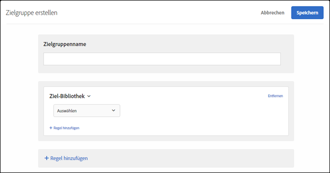

# Ziel-Bibliothek

Verwenden Sie [!DNL Adobe Target], um Benutzer auf der Basis vordefinierter Targeting-Regeln anzusprechen.

Die vordefinierten Zielgruppen in der Kategorie [!UICONTROL Zielbibliothek] sind veraltete Zielgruppen und existieren in anderen Kategorien. Weitere Informationen und Best Practices finden Sie unter [Häufig gestellte Fragen zu Zielen und Zielgruppen](/help/c-target/c-troubleshooting-targets-and-audiences/troubleshooting-targets-and-audiences.md#concept_C4EE4B8F4840430CBD798D579A8F208D).

1. Klicken Sie in der [!DNL Target]-Oberfläche auf **[!UICONTROL Zielgruppe]** > **[!UICONTROL Zielgruppe erstellen]**.
1. Benennen Sie die Zielgruppe und fügen Sie eine optionale Beschreibung hinzu.
1. Ziehen Sie **[!UICONTROL Target Library]** per Drag-and-Drop in den Bereich Audience Builder .

   

1. Klicken Sie auf **[!UICONTROL Auswählen]** und wählen Sie eine vorab erstellte Targeting-Regel aus.

   Zu den vorgefertigten Targeting-Regeln gehören [!UICONTROL Windows-Betriebssystem], [!UICONTROL Tablet-Gerät], [!UICONTROL Safari-Browser], [!UICONTROL Wiederkehrende Besucher], [!UICONTROL Verwiesen von Google] und mehr.

   Die vordefinierte Zielgruppe &quot;[!UICONTROL Tablet-Gerät]&quot;ist bereits qualifiziert, wenn der Benutzeragent eine der folgenden Zeichenfolgen enthält (einige davon sind Modellnummern von Geräten). Sie müssen keine eigenen Targeting-Regeln für diese Geräte erstellen.

   Kindle, Silk, iPad, Sony Tablet, TF101, GT-P1000, GT-P1000R, GT-P1000M, SGH-T849, SHW-M180S, GT-I9000T, BNTV250 und Tablet-PC.

1. (Optional) Richten Sie zusätzliche Regeln für die Zielgruppe ein.
1. Klicken Sie auf **[!UICONTROL Fertig]**.

## Schulungsvideo: Erstellen von Zielgruppen

Dieses Video enthält Informationen zur Verwendung von Zielgruppenkategorien.

* Erstellen von Zielgruppen
* Festlegen von Zielgruppenkategorien

>[!VIDEO](https://video.tv.adobe.com/v/17392)
