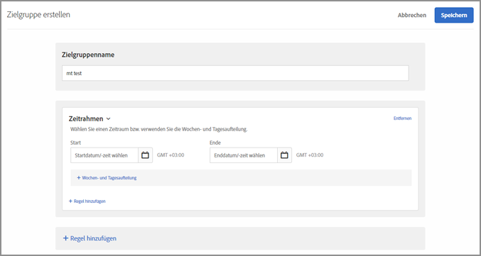
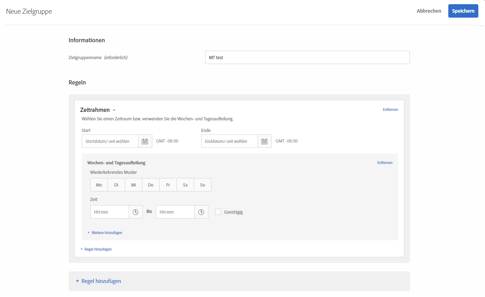

# Zeitrahmen{#time-frame}

Sie können Start-/Enddaten und -zeiten jederzeit hinzufügen, um Benutzer als Ziel festzulegen, die Ihre Seite während eines bestimmten Zeitraums besuchen. Sie können außerdem Optionen für die Wochen- und Tagesaufteilung festlegen, um wiederkehrende Muster für das Zielgruppen-Targeting zu erstellen.

Verwenden Sie beispielsweise die Funktion](/help/c-target/combining-multiple-audiences.md#concept_A7386F1EA4394BD2AB72399C225981E5) [für kombinierte Ad-hoc-Zielgruppen, können Sie in den drei Tagen vor Black Friday spezielle Inhalte gezielt für wenig Geld ausgebende Personen schalten und nach Black Friday andere Inhalte anzeigen.

1. Klicken Sie in der [!DNL Target]-Oberfläche auf **[!UICONTROL Zielgruppe]** > **[!UICONTROL Zielgruppe erstellen]**.
1. Nennen Sie die Zielgruppe.
1. Klicken Sie auf **[!UICONTROL Regel hinzufügen]** > **[!UICONTROL Zeitrahmen]**.

   

1. Geben Sie Start-, Enddatum und -zeit für die Zielgruppe ein.

   Lassen Sie das Startdatum frei, um das Targeting in Einklang mit dem Zeitplan der Aktivität zu beginnen. Lassen Sie das Enddatum frei, um so lange weiter Targeting zu betreiben, bis Enddatum und -zeit der Aktivität erreicht sind.

   Sie können das Start- oder Enddatum auch leer lassen. Auf diese Weise können Sie dieselbe Zielgruppe in mehreren Aktivitäten verwenden, ohne eine Kopie der Zielgruppe zu erstellen, und gleichzeitig das Start- und Enddatum auf Aktivitätsebene steuern.

   >[!NOTE]
   >
   >Die Zeitzone für Start-/Enddatum wird als GMT +/- NN:NN angezeigt, wobei NN: NN den Offset von GMT darstellt und die Zeitzone auf Benutzerkontoebene und nicht die Zeitzone des Besuchers widerspiegelt. Die Zeitzone von Kalifornien wird z. B. als GMT -08:00 angezeigt.

1. (Bedingt) Klicken Sie auf **[!UICONTROL Wochen- und Tagesaufteilung]**, um wiederkehrende Muster festzulegen, wie Wochentage und Uhrzeiten.

   

   Über die Optionen für die Wochen- und Tagesaufteilung können Sie z. B. eine Option „Chat“ nur an den Tagen und während der Stunden anzeigen, in denen Ihr Call-Center besetzt ist.

   Wählen Sie einen oder mehrere Wochentage aus und legen Sie dann die Start- und Endzeiten fest. Klicken Sie gegebenenfalls auf **[!UICONTROL Weitere hinzufügen]**, um weitere Muster festzulegen.

   >[!NOTE]
   >
   >Die Zeitzone für [!UICONTROL Wochen- und Tagesaufteilung] wird als GMT +/- NN:NN angezeigt, wobei NN:NN den Offset von GMT darstellt und die Zeitzone auf Benutzerkontoebene und nicht die Zeitzone des Besuchers widerspiegelt. Die Zeitzone von Kalifornien wird z. B. als GMT -08:00 angezeigt.

1. (Optional) Klicken Sie auf **[!UICONTROL Regel hinzufügen]** und legen Sie zusätzliche Regeln für die Zielgruppe fest.

   Beachten Sie, dass Sie Schritt 5 für jede Regel wiederholen können.

1. Klicken Sie auf **[!UICONTROL Speichern]**.

## Schulungsvideo: Erstellen von Audiencen 

Dieses Video enthält Informationen zur Verwendung von Zielgruppenkategorien.

* Erstellen von Zielgruppen
* Festlegen von Zielgruppenkategorien

>[!VIDEO](https://video.tv.adobe.com/v/17392)
