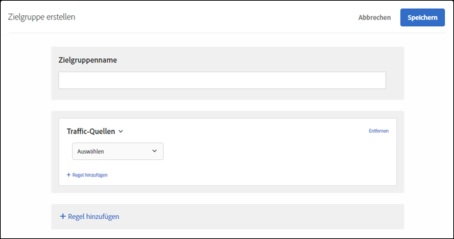

# Traffic-Quellen{#traffic-sources}

Erstellen von Zielgruppen aus Besuchern auf Grundlage der Suchmaschine oder Landingpage, von der sie auf Ihre Site geleitet werden.

Sie können z. B. das Ziel nach dem Browser des Benutzers, der Suchmaschine oder der verweisenden Landingpage bestimmen. Die verweisende Landingpage ist die Seite, von der der Besucher in dieser Sitzung zur aktuellen Site gelangte. (Wenn der Besucher z. B. auf eine Anzeige in Google geklickt hat und diese Sie ihn zur Homepage `adobe.com` führte, ist die verweisende Landingpage `google.com`.)

Sie können mehrere Traffic-Quellen kombinieren, um eine komplexe Targeting-Regel zu erstellen.

1. Klicken Sie in der [!DNL Target]-Oberfläche auf **[!UICONTROL Zielgruppe]** > **[!UICONTROL Zielgruppe erstellen]**.
1. Nennen Sie die Zielgruppe.
1. Klicken Sie auf **[!UICONTROL Regel hinzufügen]** > **[!UICONTROL Traffic-Quellen]**.

   

1. Klicken Sie auf **[!UICONTROL Auswählen]** und wählen Sie anschließend eine der folgenden Optionen aus:

   * Von Baidu
   * Von Bing
   * Von Google
   * Von Yahoo
   * Verweis-Landingpage: URL
   * Verweis-Landingpage: Domäne
   * Verweis-Landingpage: Abfrage

   Je nach Ihrer Auswahl müssen Sie eventuell zusätzliche Informationen bereitstellen (Auswerter und/oder Werte).

1. (Optional) Klicken Sie auf **[!UICONTROL Regel hinzufügen]** und legen Sie zusätzliche Regeln für die Zielgruppe fest.
1. Klicken Sie auf **[!UICONTROL Speichern]**.

Sie können Benutzer, die durch eine bestimmte Suchmaschine oder eine bestimmte Landingpage auf Ihre Site verwiesen werden, als Ziel auswählen.

## Schulungsvideo: Erstellen von Zielgruppen 

Dieses Video enthält Informationen zur Verwendung von Zielgruppenkategorien.

* Erstellen von Zielgruppen
* Festlegen von Zielgruppenkategorien

>[!VIDEO](https://video.tv.adobe.com/v/17392)
