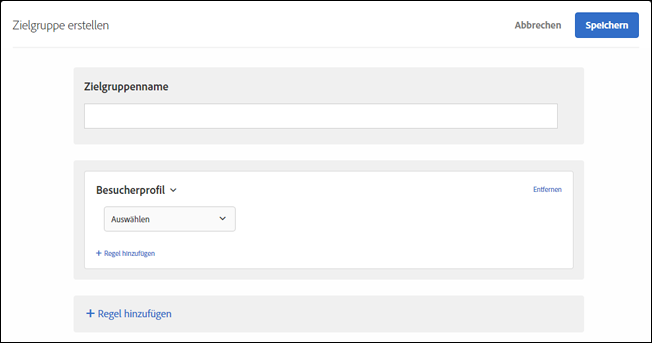

# Besucherprofil{#visitor-profile}

Erstellen Sie Zielgruppen aus Besuchern, die bestimmte Profilparameter erfüllen.

1. Klicken Sie in der [!DNL Target]-Oberfläche auf **[!UICONTROL Zielgruppe]** > **[!UICONTROL Zielgruppe erstellen]**.
1. Nennen Sie die Zielgruppe.
1. Klicken Sie auf **[!UICONTROL Regel hinzufügen]** > **[!UICONTROL Besucherprofil]**.

   

1. Klicken Sie auf **[!UICONTROL Auswählen]** und wählen Sie anschließend eine der folgenden Optionen aus:

   Die Parameter des Besucherprofils werden über die Mbox (Profil) übergeben. Sie können neue oder zurückkehrende Besucher als Ziel auswählen oder alle Benutzer einschließen.

   * Neuer Besucher
   * Wiederkehrender Besucher
   * In anderen Tests
   * Nicht in anderen Tests
   * Erste Seite der Sitzung
   * Nicht die erste Seite der Sitzung
   * Kategorieaffinität

   Für jeden Mbox-Aufruf mit neuem `mboxPC`-Wert wird ein Besucherprofil im lokalen Edge-Speicher erstellt. Nach 30 Minuten Inaktivität wird das Profil in der Target-Datenbank gespeichert und ist für andere Edges zugänglich.

   Wenn sich ein Besucher der Site mitten in einer Sitzung anmeldet und die Kennung `3rdpartyId` erhält, sind alle vorher geladenen Profilattribute, die mit `3rdPartyId` verknüpft sind, sofort verfügbar.

   Sie können benutzerdefinierte Profilparameter und `user.`-Parameter als Ziel auswählen. Wählen Sie den Parameter aus, den Sie für das Targeting Ihrer Aktivität verwenden möchten. Wird der gewünschte Parameter nicht angezeigt, wurde er nicht von einer Mbox ausgelöst.

1. (Optional) Klicken Sie auf **[!UICONTROL Regel hinzufügen]** und legen Sie zusätzliche Regeln für die Zielgruppe fest.
1. Klicken Sie auf **[!UICONTROL Speichern]**.

## Schulungsvideo: Erstellen von Audiencen 

Dieses Video enthält Informationen zur Verwendung von Zielgruppenkategorien.

* Erstellen von Zielgruppen
* Festlegen von Zielgruppenkategorien

>[!VIDEO](https://video.tv.adobe.com/v/17392)
