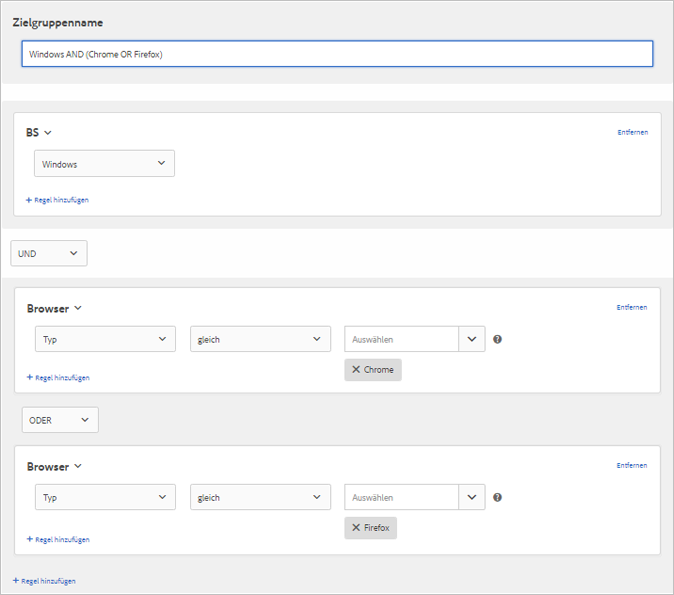

# Erstellen von Zielgruppen in Target{#build-audiences-in-target}

Sie können benutzerdefinierte Zielgruppen erstellen, diese in der Target-Bibliothek speichern und für Ihre Aktivitäten verwenden. Sie können eine bereits bestehende Zielgruppe kopieren und anschließend bearbeiten, um eine ähnliche Zielgruppe zu erstellen und mehrere Zielgruppen miteinander zu kombinieren.

## Zielgruppenüberblick

Zielgruppen werden durch Regeln definiert, die bestimmen, wer in eine [!DNL Target]-Aktivität eingeschlossen und wer davon ausgeschlossen wird. Eine Zielgruppendefinition kann mehrere Regeln enthalten, wobei die einzelnen Regeln wiederum mehrere Parameter aufweisen können. Komplexe Zielgruppendefinitionen greifen auf die booleschen Operatoren „AND“ und „OR“ zurück, um Regeln und Parameter zu kombinieren und Ihnen so weitreichende Kontrolle darüber zu geben, welche Websitebesucher als Aktivitätsteilnehmer gezählt werden.

Wenn Sie Regeln oder Parameter mit „AND“ kombinieren, müssen sämtliche Mitglieder der Zielgruppe *alle* der definierten Bedingungen erfüllen, damit sie als Teilnehmer infrage kommen. Wenn Sie zum Beispiel eine Betriebssystemregel und eine Browserregel definieren, werden nur die Besucher, die sowohl das definierte Betriebssystem *als auch* den definierten Browser verwenden, in die Aktivität aufgenommen.

Wenn Sie Regeln oder Parameter mit „OR“ kombinieren, müssen die Mitglieder der Zielgruppe nur eine der definierten Bedingungen erfüllen, damit sie als Teilnehmer gezählt werden. Wenn Sie zum Beispiel mehrere Regeln für Mobilgeräte definieren, die mit „OR“ verbunden sind, werden Besucher, die *ein beliebiges* Kriterium erfüllen, in die Aktivität eingeschlossen.

Sie können die beiden booleschen Operatoren auch mischen und so komplexe Regeln schaffen, allerdings müssen Operatoren auf derselben Regelebene übereinstimmen. Die Benutzeroberfläche wendet automatisch den richtigen Operator an.

Die folgende Regel nimmt eine Ausrichtung auf Besucher vor, die entweder Chrome *oder* Firefox auf einem Windows-Computer nutzen:

>[!NOTE]
>
>Achten Sie darauf, dass Ihre Regeln nicht alle Mitglieder der Zielgruppe ausschließen. So ist es beispielsweise nicht möglich, dass ein Besucher eine Seite mit Chrome *und* gleichzeitig mit Firefox besucht.

## Neue Zielgruppe erstellen

1. Klicken Sie auf **[!UICONTROL Zielgruppen]** in der oberen Menüleiste.

   

1. Klicken Sie in der Liste [!UICONTROL Zielgruppen] auf **[!UICONTROL + Zielgruppe erstellen]**.

   Oder

   Möchten Sie eine Zielgruppe kopieren, halten Sie in der [!UICONTROL Zielgruppenliste] den Mauszeiger über die gewünschte Zielgruppe und klicken Sie auf das **[!UICONTROL Kopiersymbol]**. Sie können die Zielgruppe anschließend bearbeiten, um eine ähnliche Zielgruppe zu erstellen.

1. Geben Sie einen eindeutigen beschreibenden Namen für die Zielgruppe ein.
1. Klicken Sie auf **[!UICONTROL + Regel hinzufügen]**.

   Regeln ermöglichen es, die Zielgruppe auf eine Untergruppe der Site-Besucher einzuschränken.
1. Wählen Sie einen Regeltyp aus.

   Jeder Regeltyp hat eigene Parameter. Weitere Informationen zum Konfigurieren der einzelnen Typen von Zielgruppenregeln finden Sie unter [Kategorien für Zielgruppen](/help/c-target/c-audiences/c-target-rules/target-rules.md#concept_E3A77E42F1644503A829B5107B20880D).
1. Definieren Sie die Regelparameter.
1. Klicken Sie auf **[!UICONTROL Speichern]**.

   Neu erstellte Zielgruppen werden erst nach einigen Sekunden Verarbeitungszeit in der Liste angezeigt. Falls die Zielgruppe nicht sofort in der Liste angezeigt wird, können Sie danach suchen oder die Liste aktualisieren.

## Schulungsvideo: Erstellen von Zielgruppen  

Dieses Video enthält Informationen zur Erstellung von Zielgruppen.

* Erstellen von Zielgruppen
* Festlegen von Zielgruppenkategorien

>[!VIDEO](https://video.tv.adobe.com/v/17392)