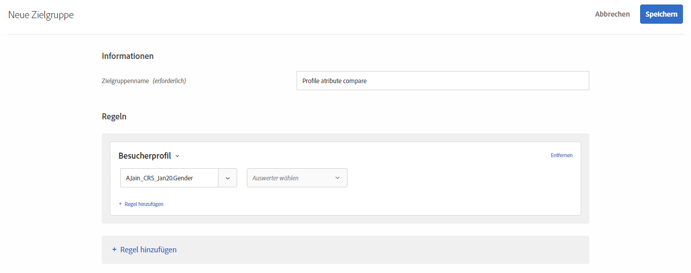
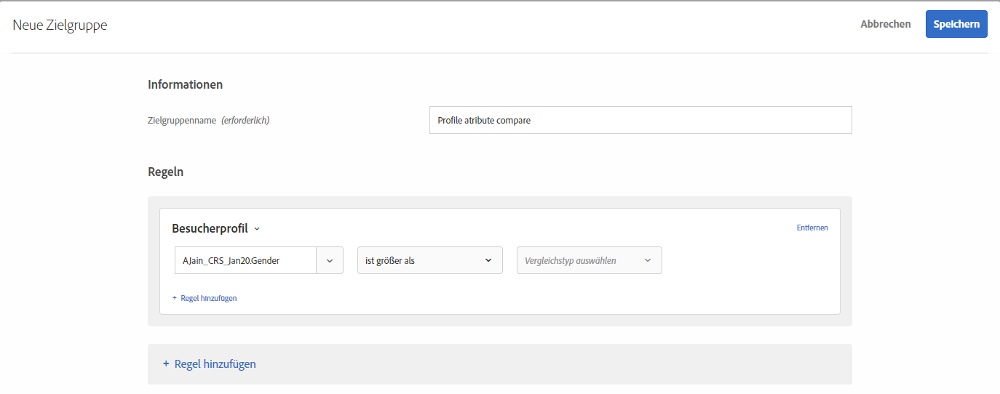
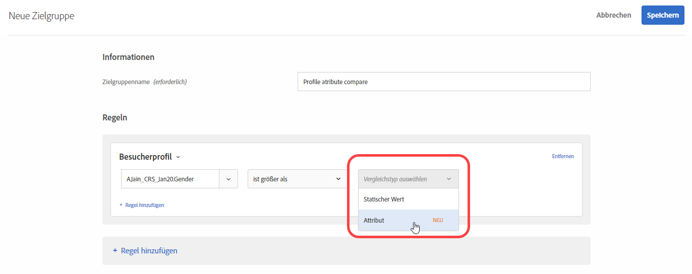
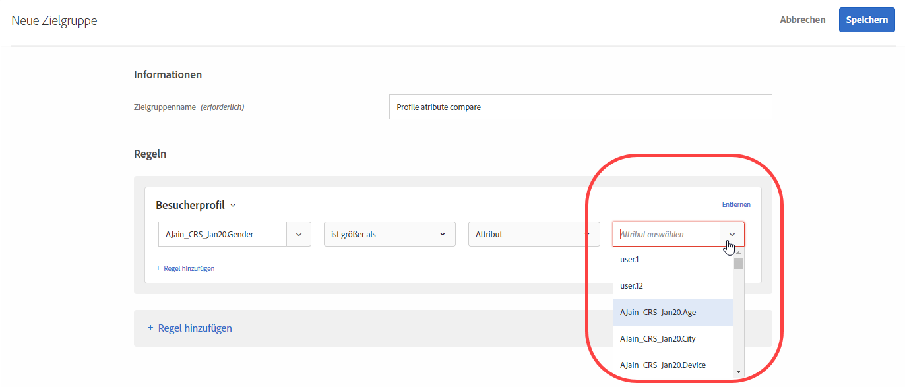

# Erstellen einer Zielgruppe zum Profilattributvergleich 

Definieren Sie eine Zielgruppe, um zwei Profilattribute für Ihre [Zielgruppenbibliothek](/help/c-target/c-audiences/audiences.md) oder in einer [reinen Aktivitätszielgruppe](/help/c-target/creating-activity-only-audience.md) zu vergleichen. Definieren Sie über Operatoren wie „größer als“, „kleiner als“ oder „gleich“ eine Zielgruppe, um die Werte zweier verschiedener Profilattribute dynamisch miteinander zu vergleichen.

>[!NOTE]
>
>Diese Funktion ist nur für die Kategorie [Besucherprofil](/help/c-target/c-audiences/c-target-rules/visitor-profile.md#concept_E972690B9A4C4372A34229FA37EDA38E) verfügbar.

## Überblick {#section_303CBC78194D49A2A004945D425441E1}

Zielgruppen werden durch Regeln definiert, die bestimmen, wer in eine Target-Aktivität eingeschlossen und wer davon ausgeschlossen wird. Eine Zielgruppendefinition kann mehrere Regeln enthalten, wobei die einzelnen Regeln wiederum mehrere Parameter aufweisen können. Wenn eine der hinzugefügten Regeln die Kategorie „Besucherprofil“ verwendet, können Sie eine Regel erstellen, die auf einem bestimmten Wert des Besucherprofilattributs basiert oder den Wert dieses Attributs mit einem anderen Besucherprofilattribut vergleicht.

Gehen wir beispielsweise von einem Möbelunternehmen aus, in dem zwei Propensity Scores von Kunden in Target hochgeladen werden:

* Wahrscheinlichkeit, in den nächsten 90 Tagen Esszimmermöbel zu kaufen
* Wahrscheinlichkeit, in den nächsten 90 Tagen Wohnzimmermöbel zu kaufen

Sie könnten eine Zielgruppe erstellen, die dadurch definiert ist, dass die Neigung zum Kauf von Esszimmermöbeln größer als die Neigung zum Kauf von Wohnzimmermöbeln ist. Target würde daraufhin die Propensity Scores für Ess- bzw. Wohnzimmermöbel des vorliegenden Besuchers dynamisch miteinander vergleichen, um zu bestimmen, ob der Besucher in die entsprechende Zielgruppe fällt.

Weitere Informationen finden Sie unter [Verfahren für die Datenübernahme in Target](/help/c-implementing-target/c-considerations-before-you-implement-target/c-methods-to-get-data-into-target/methods-to-get-data-into-target.md#concept_0069C0EFB56C4700BB33F2F35C2B9B17).

## Erstellen einer Zielgruppe zum Profilattributvergleich {#section_7A62FD47D5C74C3EBC3417ACDBB85013}

1. Klicken Sie auf **[!UICONTROL Zielgruppen]** > **[!UICONTROL Zielgruppe erstellen]** > **[!UICONTROL Regel hinzufügen]** > **[!UICONTROL Besucherprofil]**.
1. Wählen Sie in der Dropdownliste **[!UICONTROL Besucherprofil]** ein Attribut aus:

   

1. Wählen Sie einen Auswerter aus:

   

1. Wählen Sie aus der Dropdown-Liste **[!UICONTROL Vergleichstyp]** die Option **[!UICONTROL Attribut]** aus.

   Mit dem Vergleichstyp „Statischer Wert“ können Sie das Besucherprofilattribut mit spezifischen Werten vergleichen.

   

   >[!NOTE]
   >
   >Wenn Sie in Schritt 1 eine der standardmäßigen Besucherprofilkategorien verwenden (z. B. „Neuer Besucher“ oder „Wiederkehrender Besucher“), können Sie nur die Option für statische Werte auswählen. Die dynamischen Vergleichsoptionen sind nur für Standardkategorien verfügbar. Andere Beispiele, in denen die dynamischen Vergleichsoptionen nicht verfügbar sind, umfassen „Erste Seite der Sitzung“, „Nicht in anderen Tests“, „Nicht die erste Seite der Sitzung“ und „Kategorieaffinität“.

1. Wählen Sie das zusätzliche Attribut aus, das Sie mit dem ursprünglichen Attribut vergleichen wollen.

   

## Schulungsvideo  {#section_3BB8DBF3418F4520B3E274B6F40AF8F3}

Das folgende Video enthält weitere Informationen sowie ein Szenario, in dem Sie diese Funktion einsetzen könnten:

>[!VIDEO](https://video.tv.adobe.com/v/23218/)
