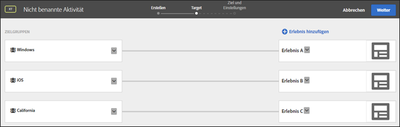

# Häufig gestellte Fragen zu Zielen und Zielgruppen{#targets-and-audiences-faq}

Liste der häufig gestellten Fragen zu Erlebnis-Targeting und Zielgruppen

## Wie bewertet Zielgruppe URLs beim Targeting? {#url}

Zielgruppe bewertet URLs unterschiedlich, je nachdem, ob Sie beim Erstellen einer Aktivität Audiencen-URL-Targeting verwenden oder ob Sie beim Erstellen einer Audience URL-Targeting verwenden.

Betrachten Sie die folgende URL:

`http://www.example.com/path1/path2/path3?queryStringParam1=test123&queryStringParam2=test7`

### Audiencen-URL-Targeting

Um beim Erstellen einer Aktivität das URL-Targeting für Audiencen anzuwenden, klicken Sie auf der Erlebnisse-Seite (Schritt eins des geleiteten Arbeitsablaufs mit drei Schritten) auf das Zahnradsymbol, klicken Sie auf Versand Seite und geben Sie dann die gewünschte URL an.

Audiencen-URL-Targeting sucht nach einer exakten URL-Übereinstimmung. Wenn die URL übereinstimmt, berücksichtigt Zielgruppe keine weitere Logik. Wenn die Aktivität in der obigen URL auf &quot;`www.example.com`&quot;festgelegt ist, stimmt die URL für die folgenden URLs überein, da das Targeting der Audience-URL für Abfragen-agnostisch ist:

* `www.example.com?query=something`
* `www.example.com?query=anything`
* `www.example.com?query=nothing&qa=true&stuff=random&product=shoes&height=superTall`

Neben dem Targeting von Audiencen auf die URL können Sie auch bestimmte Werte angeben, die in der Abfrage enthalten sein können.

### URL-Targeting

Wenn Sie beim Erstellen einer Audience ein URL-Targeting anwenden möchten, klicken Sie auf Hinzufügen Regel, klicken Sie auf &quot;Site-Seiten&quot;, wählen Sie eine Option aus der ersten Dropdown-Liste (Aktuelle Seite, Vorherige Seite oder Landingpage), wählen Sie die URL aus der zweiten Dropdown-Liste aus, geben Sie einen Auswerter an und geben Sie dann die gewünschte URL an.

URL-Targeting wandelt die URL in einen Regelsatz zur Bewertung um:

* URL-Domäne = `example.com`
* Pfad = path1/path2/path3
* queryStringParam1 = test123
* queryStringParam2 = test7

## Prüft [!DNL Target] beim Erstellen komplexer URL-Zeichenfolgen die gesamte URL?

Wenn Sie denselben Parameternamen mehrmals in einer URL-Zeichenfolge verwenden, berücksichtigt HTTP den ersten Parameternamen und ignoriert nachfolgende Parameter mit demselben Namen.

Beispiel: In der folgenden URL-Zeichenfolge:

`https://www.adobe.com/SearchResults.aspx?sc=BM&fi=1&fr=1&ps=0&av=0&Category=C0010438&Category=C000047`

wird die erste Instanz des Parameters `Category` ausgewertet und der zweite Parameter `Category` wird ignoriert.

Es empfiehlt sich, mehrere Werte einer Kategorie zuzuordnen, wie unten dargestellt:

`https://www.adobe.com/SearchResults.aspx?sc=BM&fi=1&fr=1&ps=0&av=0&Category=C0010438,C000047`

## Warum sind voreingestellte Zielgruppen in der Target-Bibliothek beim Erstellen von Zielgruppen unter anderen Kategorien aufgeführt? {#section_9EBF5B0F9DF94168A15B92B905CCF7E0}

Vorab eingestellte Zielgruppen in der Target-Bibliothekskategorie sind veraltete Zielgruppen und bestehen auch in anderen Kategorien. Beispiel: Die veraltete Target-Bibliothek > Zielgruppe „Neue Besucher“ verfügt über ein aktuelleres Gegenstück: Besucherprofil > Neuer Besucher.

Best Practice ist, die neuen Zielgruppen einzusetzen, da diese eine bessere Leistung erzielen. Einigen Kunden verwenden möglicherweise ältere, voreingestellte Zielgruppen, die aus diesem Grund nicht aus der Target-Oberfläche gelöscht wurden.

## Wie erkenne ich, wie Traffic zwischen Zielgruppen aufgeteilt wird?   {#section_067EEFB956E7465CBF77EC86834470AB}

Standardmäßig wird Traffic gleichmäßig zwischen Erlebnissen aufgeteilt. Sie können jedoch  Prozentsatzziele für jedes Erlebnis angeben. In diesem Fall wird eine zufällige Nummer generiert und diese Nummer wird verwendet, um das anzuzeigende Erlebnis auszuwählen. Die sich ergebenden Prozentzahlen entsprechen möglicherweise nicht genau den festgelegten Zielen, allerdings bedeutet mehr Traffic, dass die Erlebnisse enger auf die beabsichtigen Ziele aufgeteilt werden sollten.

## Welches Erlebnis wird angezeigt, wenn sich ein Benutzer für eine Aktivität qualifiziert, in der mehrere Erlebnisse mit verschiedenen qualifizierten Zielgruppen enthalten sind?   {#section_94A60B11212D48FD8AB0803C6C7E7253}

Der Benutzer qualifiziert sich für das erste Erlebnis/die erste Zielgruppe, das/die auf der [!UICONTROL Target]-Seite der Aktivität angezeigt wird.

In der folgenden Darstellung qualifiziert sich ein Benutzer aus Kalifornien mit einem Windows-Gerät sowohl für Erlebnis A (Zielgruppe Windows) als auch für Erlebnis C (Zielgruppe Kalifornien). Dem Benutzer wird in diesem Fall Erlebnis A angezeigt, da es in der Liste auf der Target-Seite vor Erlebnis C aufgeführt wird.

## Warum unterscheiden sich die Namen der gleichen Zielgruppe in Target, Adobe Audience Manager (AAM) und der Zielgruppenbibliothek in den Core Services voneinander? {#section_F67E61A607B6444C8DAA4F99C3E95AED}

Zielgruppennamen in [!DNL Target] sind eindeutig; in [!DNL AAM] und [!DNL Audience Library] können Sie jedoch für mehrere Zielgruppen denselben Namen haben (wenn sie sich in verschiedenen Ordnern befinden). Wenn [!DNL Target] auf einen Zielgruppennamen trifft, der einer [!DNL AAM]- oder [!DNL Audience Library]-Zielgruppe entspricht, hängt [!DNL Target] ein &quot;#&lt;Nummer>&quot; an den Namen an.

So könnten Ihnen beispielsweise folgende Zielgruppen angezeigt werden: „PC-Nutzer“ (in [!DNL AAM]) und „PC-Nutzer #1“ (in [!DNL Target]).

## Warum kann ich eine Zielgruppe nicht umbenennen? {#section_54E420556F534D20836E261E253D8B97}

Einige Zielgruppen wurden vorab eingerichtet, darunter „Neue Besucher“ und „Wiederkehrende Besucher“. Diese voreingestellten Zielgruppen können von Benutzern nicht umbenannt werden.

## Warum werden meine gesamten Profilparameter auf der Benutzeroberfläche von Target nicht angezeigt?   {#section_3CD947D15C984EE9AD19550220E0E8BD}

[!DNL Target] erlaubt pro Mbox-Aufruf maximal 50 eindeutige Profilattribute. Wenn Sie mehr als 50 Profilattribute an [!DNL Target] übergeben müssen, können Sie hierzu die API-Methode [!UICONTROL Profilupdate] nutzen. Weitere Informationen finden Sie unter [Profilupdate](https://developers.adobetarget.com/api/#authentication-tokens) in der Dokumentation zur Adobe Target-API.

## Warum werden Besuchern Erlebnisse für eine AP-Aktivität angezeigt, die sie nicht sehen sollten? {#section_41CECEAE0881446A8D9F3B016857914B}

Aktivitäten vom Typ „Automatisierte Personalisierung“ werden einmal pro Sitzung ausgewertet. Wenn für ein bestimmtes Erlebnis qualifizierte aktive Sitzungen vorhanden waren und diesen nun neue Angebote hinzugefügt werden, wird Benutzern der neue Inhalt zusammen mit den zuvor angezeigten Angeboten angezeigt. Da sie zuvor für diese Erlebnisse qualifiziert wurden, werden sie ihnen weiterhin für die Dauer der Sitzung angezeigt. Wenn dies bei jedem einzelnen Seitenbesuch ausgewertet werden soll, sollten Sie den Erlebnis-Targeting-Aktivitätstyp (XT) ändern.

## Warum werden Änderungen an Zielgruppen, die per API erstellt wurden, nicht in der Target-UI angezeigt?   {#section_6BEB237CAC004A06A290F9644E5BF0FB}

Im Gegensatz zu Angeboten und Profilskripten werden Änderungen, die per API an mit Target Standard erstellten Zielgruppen vorgenommen werden, derzeit nicht mit der Target-UI synchronisiert.

## Zeichenfolgen, die Zahlen darstellen (Fließkommazahlen werden ebenfalls unterstützt), werden als Zahlen verglichen.{#strings-that-represent-numbers}

Wenn der linke und rechte Teil der Gleichheitsausdrücke als eine Zahl analysiert werden kann, werden die beiden Teile als Zahlen und nicht als Zeichenfolgen verglichen.

Beispiel:

| Wert | Targeting-Kriterien | Ergebnis |
| --- | --- | --- |
| 1.0 | gleich 1 | wahr |
| 1 | equalsIgnoreCase 1.0 | wahr |
| 1.230 | gleich 1 | wahr |
| 1.500 | gleich 1,5 | wahr |
| 1.200 | ist kleiner als 2 | wahr |
| 2 | ist größer als 3.0 | false |
| 045 | gleich 45 | wahr |

Zahlen in wissenschaftlicher Schreibweise werden immer als Zeichenfolgen verglichen.

Beispiel:

„4e-2“ entspricht nur „4e-2“. Es wird *nicht* „0,04“ entsprechen.