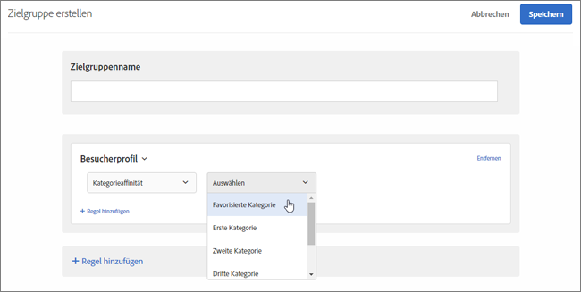

# Kategorieaffinität

Die Kategorieaffinitätsfunktion in [!DNL Adobe Target] erfasst automatisch die Kategorien, die ein Benutzer besucht, und berechnet dann die Affinität des Benutzers für diese Kategorie, sodass diese zielgerichtet und segmentiert eingesetzt werden kann. Die Kategorieaffinität hilft dabei sicherzustellen, dass Inhalte auf Besucher ausgerichtet sind, die mit hoher Wahrscheinlichkeit aufgrund dieser Informationen handeln.

## Übergeben von Kategorieaffinitätsinformationen an [!DNL Target] {#section_B0C8E46EEBAC4549AD90352A47787D04}

Wenn ein Benutzer Ihre Site besucht, werden besucherspezifische Profilparameter in der [!DNL Target]-Datenbank aufgezeichnet. Diese Daten sind an das Cookie des Benutzers gebunden. Ein nützlicher Parameter ist `user.categoryId`, ein auf einer Produktseite zugewiesener Mbox-Parameter. Wenn der Besucher weiter auf der Site surft oder für eine andere Sitzung zurückkehrt, können die Produktkategorien aufgezeichnet werden, die sich ein bestimmter Benutzer ansieht. Kategoriedaten können auch aufgezeichnet werden, indem sie als Mbox-Parameter `user.categoryId` in einer beliebigen Mbox (einschließlich verschachtelter Mboxes), als URL-Parameter `user.categoryId` oder mit globaler Mbox als Target-Seitenparameter übermittelt werden. Weitere Informationen erhalten Sie von Ihrem Kundenbetreuer.

Trennen Sie Kategorien durch ein Komma, um ein Element in mehrere Kategorien einzubeziehen. Beispiel:

* `user.categoryId=clothing,shoes,nike,running,nike clothing,nike shoes,nike running shoes`

Auf Grundlage der Häufigkeit und Neuigkeit der Besuche Ihrer Produktkategorien wird die Kategorieaffinität (falls vorhanden) eines Besuchers erfasst. Kategorieaffinität kann zur zielgerichteten Anwendung auf Zielgruppen für Ihre Aktivitäten verwendet werden.

Sie können `user.categoryAffinities[]` in einem Profilskript benutzen, um ein Array der Präferenzen auszugeben, die ein Besucher ausgefüllt hat.

>[!IMPORTANT]
>
>Das für den Kategorieaffinitätsalgorithmus verwendete Attribut `user.categoryId` unterscheidet sich vom Attribut `entity.categoryId`, das für die Produkt- und Inhaltsempfehlungen von [!DNL Adobe Target Recommendations] verwendet wird. `user.categoryId` ist erforderlich, um die bevorzugte Kategorie eines Benutzers zu verfolgen. `entity.categoryId` ist erforderlich, um Empfehlungen auf der Basis der Kategorie der aktuellen Seite oder des aktuellen Elements zu erhalten. Senden Sie beide Werte an Adobe Target, wenn Sie beide Funktionen verwenden möchten.

## Geschäftsfall für Kategorieaffinität {#section_D6FF913E88E6486B8FBCE117CA8B253B}

Die Besucheraktivität in einer Sitzung, z. B. welche Kategorie sie am häufigsten besuchen, kann bei darauffolgenden Besuchen zum Targeting verwendet werden. Jede Kategorieseite, die sich ein Besucher während seiner Sitzung anzeigen lässt, wird erfasst und seine „Lieblingskategorie“ wird auf Grundlage eines Neuigkeits- und Häufigkeitsmodells berechnet. Anschließend kann bei jedem erneuten Aufrufen der Startseite durch den Besucher der Hero-Image-Bereich angesprochen werden, um Inhalte anzuzeigen, die zu ihrer bevorzugten Kategorie gehören.

## Beispiel für die Verwendung der Kategorieaffinität {#section_A4AC0CA550924CB4875F4F4047554C18}

Stellen Sie sich vor, dass Sie online Musikinstrumente verkaufen und zielgerichtete Verkaufs-Promo-Aktionen für Bassgitarren bei Besuchern durchführen möchten, die bereits in der Vergangenheit Interesse an Gitarren gezeigt haben. Mithilfe der Kategorieaffinität können Sie Angebote erstellen, die ausschließlich Besuchern mit der entsprechenden Kategorieaffinität angezeigt werden.

## Kategorieaffinitätsalgorithmus {#section_8B86C7FF50294208866ABF16F07D5EB9}

Der Algorithmus für die Kategorieaffinität funktioniert wie folgt:

* Zehn Punkte für die erste angezeigte Kategorie
* Fünf Punkte für jede Kategorie, auf die nach der ersten geklickt wurde
* Wenn auf eine neue Kategorie geklickt wird, wird 1 von allen zuvor angeklickten Kategorien subtrahiert
* Wenn bereits auf eine Kategorie geklickt wurde (angezeigt), wird durch erneutes Klicken nicht 1 von allen anderen Kategorien subtrahiert
* Wenn auf eine sechste neue Kategorie geklickt wird, wird die als am niedrigsten eingestufte Kategorie der ersten fünf Kategorien aus der Berechnung entfernt
* Teilen Sie am Ende der Sitzung alle Werte durch 2

### Beispiel: Kategorieaffinitäts-Algorithmus

Wenn jemand z. B. die `mens-clothing`-Kategorie ansieht, dann `accessories`, dann `jewelry`, und dann `accessories` erneut in einer Sitzung aufruft, führt dies zu Affinitäten von:

* `accessories`: 9 (= +5 – 1 + 5)

* `mens-clothing`: 8 (= +10 – 1 – 1)

* `jewelry`: 5 (= +5)

Wenn die Sitzung beendet wird und der Benutzer später zur Site zurückkehrt, werden die Ergebnisse halbiert:

* `accessories`: 4,5 (= 9/2)

* `mens-clothing`: 4 (= 8/2)

* `jewelry`: 2,5 (= 5/2)

Angenommen, der Benutzer sieht sich dann, in dieser Reihenfolge, `jewelry`, `accessories`, `beauty`, `shoes` und `womens-clothing` an:

* `accessories`: 6.5 (= 4.5 + 5 – 1 – 1 – 1)

* `womens-clothing`: 5 (= +5)

* `jewelry`: 4.5 (= 2.5 + 5 – 1 – 1 – 1)

* `shoes`: 4 (= +5 – 1)

* `beauty`: 3 (= +5 – 1 – 1)

* `mens-clothing` wird nach dem letzten Klick auf `womens-clothing` fallengelassen, da es mit einem Wert von 1 (= 4 – 1 – 1 – 1) die Kategorie mit der niedrigsten Bewertung ist

Wenn die Sitzung beendet wird und der Benutzer später zur Site zurückkehrt, werden die Ergebnisse halbiert:

* `accessories`: 3,3 (= 6,5/2)

* `womens-clothing`: 2,5 (= 5/2)

* `jewelry`: 2,3 (= 4,5/2)

* `shoes`: 2 (= 4/2)

* `beauty`: 1,5 (= 3/2)

## Kategorieaffinität für Targeting verwenden {#concept_5750C9E6C97A40F8B062A5C16F2B5FFC}

Die folgenden Abschnitte enthalten Informationen zur Verwendung einer Kategorieaffinitäts-Zielgruppe für das Targeting in einer Aktivität.

### Erstellen einer Zielgruppe zur Verwendung der Kategorieaffinität {#section_A27C600BBA664FE7A74F8FE076B78F40}

1. Klicken Sie in der Liste **[!UICONTROL Zielgruppen]** auf **[!UICONTROL Zielgruppe erstellen]**.

   Oder

   Möchten Sie eine Zielgruppe kopieren, halten Sie in der Zielgruppenliste den Mauszeiger über die gewünschte Zielgruppe und klicken Sie auf das Kopiersymbol. Sie können die Zielgruppe anschließend bearbeiten, um eine ähnliche Zielgruppe zu erstellen.

1. Geben Sie einen beschreibenden Namen für die Zielgruppe ein.
1. Klicken Sie auf **[!UICONTROL + Regel hinzufügen]** > **[!UICONTROL Besucherprofil]**.
1. Wählen Sie aus der Dropdown-Liste **[!UICONTROL Besucherprofil]** **[!UICONTROL die Option Kategorieaffinität]** aus.

   

1. Wählen Sie die gewünschte Kategorie aus:

   

   Zu den Kategorien gehören:

   * Favoritenkategorie
   * Erste Kategorie
   * Zweite Kategorie
   * Dritte Kategorie
   * Vierte Kategorie
   * Fünfte Kategorie

   Die Optionen &quot;Favoritenkategorie&quot;und &quot;Erste Kategorie&quot;sind identisch.

1. Wählen Sie den Auswerter aus:

   * enthält (nicht von Schreibweise abhängig)
   * enthält nicht (nicht von Schreibweise abhängig)
   * Gleich

1. Geben Sie jeden neuen Wert in einer eigenen Zeile an (beispielsweise „Schuhe“).
1. Klicken Sie auf **[!UICONTROL Speichern]**.

### Verwenden der Kategorieaffinität in einer Aktivität {#section_91526B942D1B4AEBB8FCDF4EBFF931CF}

Sie können Zielgruppen mit Kategorieaffinität in jeder Aktivität verwenden. Wählen Sie im geleiteten Arbeitsablauf mit drei Schritten im Schritt [!UICONTROL Target] die gewünschte Zielgruppe aus.
