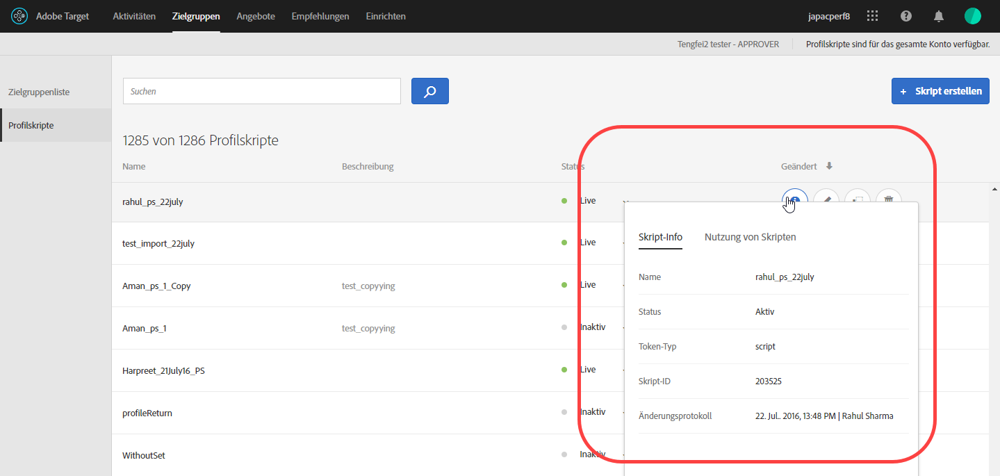
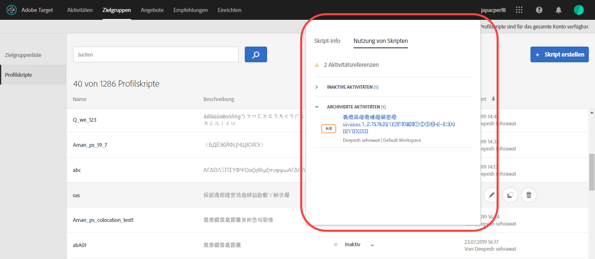
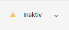

# Profilattribute

Profilattribute in [!DNL Adobe Target] sind Parameter, die speziell für einen Besucher gelten. Diese Attribute werden im Besucherprofil gespeichert, um Informationen über den Besucher bereitzustellen, die in den Aktivitäten verwendet werden können.

Ein Benutzerprofil enthält demografische und Verhaltensinformationen eines Webseitenbesuchers. Diese Informationen können Alter, Geschlecht, gekaufte Produkte, das letzte Mal bei einem Besuch usw. umfassen, die [!DNL Target] verwendet, um den für den Besucher bestimmten Inhalt zu personalisieren.

Wenn ein Besucher auf Ihrer Website surft oder zu einer anderen Sitzung zurückkehrt, können die im Profil gespeicherten Profilattribute verwendet werden, um Zielinhalte festzulegen oder Informationen zur Segmentfilterung zu protokollieren.

So richten Sie Profilattribute ein:

1. Klicken Sie auf **[!UICONTROL Zielgruppen]** > **[!UICONTROL Profilskripte.]**

   

1. Klicken Sie auf **[!UICONTROL Skript]** erstellen.

   

   Die folgenden Typen von Profilattributen sind verfügbar:

   | Parametertyp | Beschreibung |
   |--- |--- |
   | mbox | Direkt über den Seiten-Code beim Erstellen der Mbox weitergegeben Siehe [Übergeben von Parametern an eine globale Mbox](/help/c-implementing-target/c-implementing-target-for-client-side-web/t-mbox-download/c-understanding-global-mbox/pass-parameters-to-global-mbox.md).<br>**** Hinweis:  erlaubt pro Mbox-Aufruf maximal 50 eindeutige Profilattribute. [!DNL Target] Wenn Sie mehr als 50 Profilattribute an [!DNL Target] übergeben müssen, übergeben Sie diese mit der API-Methode Profilaktualisierung . Weitere Informationen finden Sie unter [Profil-Update in der  [!DNL Adobe Target] API-Dokumentation](http://developers.adobetarget.com/api/#updating-profiles). |
   | Profil | Direkt mit einem JavaScript-Codebeispiel definiert. Diese Snippets können laufende Gesamtsummen speichern, z. B. das Gesamtgeld, das der Verbraucher ausgegeben hat, und werden bei jeder Mbox-Anfrage ausgeführt. Siehe Profilskriptattribute unten. |

## Profilskriptattribute {#concept_8C07AEAB0A144FECA8B4FEB091AED4D2}

Definieren Sie ein Profilskriptattribut mit dem zu diesem gehörigen JavaScript-Code-Snippet.

Mithilfe von Profilskripten können Sie Besucherattribute über mehrere Besuche hinweg erfassen. Profilskripte sind Code-Snippets, die in [!DNL Target] mithilfe einer Form von serverseitigem JavaScript definiert werden. Beispielsweise können Sie mit einem Profilskript erfassen, wie oft ein Besucher Ihre Site besucht und wann dieser Besucher die Site zuletzt besucht hat.

Profilskripte sind nicht das Gleiche wie Profilparameter. Profilparameter erfassen Informationen über Besucher mithilfe der Mbox-Code-Implementierung von [!DNL Target].

## Profilskripte erstellen {#section_CB02F8B97CAF407DA84F7591A7504810}

Profilskripte sind in der Registerkarte [!UICONTROL Zielgruppen] in der Oberfläche von [!DNL Target] zu finden.

Um ein Profilskript hinzuzufügen, klicken Sie auf die Registerkarte **[!UICONTROL Profilskripte]**, **[!UICONTROL Skript erstellen]** und schreiben Sie dann Ihr Skript.

Oder

Um ein vorhandenes Profilskript zu kopieren, klicken Sie in der Liste [!UICONTROL Profilskripte] auf das Auslassungssymbol für das gewünschte Skript und klicken Sie dann auf **[!UICONTROL Duplizieren]**.

Sie können die Zielgruppe anschließend bearbeiten, um eine ähnliche Zielgruppe zu erstellen.

Profilskripte führen Profilattribut-„Fänger“ bei jeder Ortsanforderung aus. Wenn eine Ortsanforderung empfangen wird, bestimmt [!DNL Target], welche Aktivität ausgeführt werden soll, und zeigt Inhalte an, die für diese Aktivität und dieses Erlebnis geeignet sind. [!DNL Target] verfolgt auch den Erfolg der Aktivität und führt relevante Profilskripte aus. Auf diese Weise können Sie Informationen zum Besuch verfolgen, z. B. Ort, Tageszeit, Anzahl der Besuche auf der Site, frühere Käufe usw. Diese Informationen werden dann zum Benutzerprofil hinzugefügt, sodass Sie die Besucheraktivitäten auf Ihrer Site besser verfolgen können.

Profilskriptattribute haben das `user.`-Tag vor dem Attributnamen eingefügt. Beispiel:

```
if (mbox.name == 'Track_Interest') { 
    if (profile.get('model') == "A5" &&; profile.get('subcat') == "KS6") { 
        return (user.get('A5KS6') || 0) + 1; 
    } 
}
```

Beachten Sie die folgenden Informationen:

* Siehe Profilskriptattribute (auch das im Code enthaltene) im Code mit `user.get('parameterName')`.
* Speichern Sie Variablen, die beim nächsten Ausführen des Skripts (bei der nächsten Mbox-Anfrage) aufgerufen werden können, mit `user.setLocal('variable_name', 'value')`. Verweisen Sie auf die Variable mit `user.getLocal('variable_name')`. Dieser Prozess ist nützlich in Situationen, in denen Sie auf das Datum und die Uhrzeit der letzten Anfrage verweisen möchten.
* Bei Parametern und Werten wird zwischen Groß- und Kleinschreibung unterschieden. Prüfen Sie die Groß-/Kleinschreibung der Parameter und Werte, die Sie während der Aktivität oder dem Test erhalten.
* Weitere JavaScript-Syntax finden Sie im Abschnitt „JavaScript-Referenz für Skript-Profilparameter“.
* Der Parameter bleibt im Profil, nachdem das Skript deaktiviert wurde. Benutzer, deren Profile bereits einen Parameter enthalten, der in der Audience einer Aktivität verwendet wird, qualifizieren sich für diese Aktivität.
* Profilskripte können nicht gelöscht werden, während sie in einer Aktivität verwendet werden.
* Es wird nicht empfohlen, abhängige Profilskripte zu erstellen, die das Ergebnis eines Profilskripts in einem anderen Profilskript verwenden. Die Reihenfolge der Ausführung von Profilskripten ist nicht garantiert.

## Anzeigen der Karten mit Profilskriptinformationen {#section_18EA3B919A8E49BBB09AA9215E1E3F17}

Sie können Popupkarten mit Profilskriptinformationen (ähnlich den Karten mit Angebotsinformationen) anzeigen. Auf diesen Karten mit Profilskriptinformationen können Sie die Liste der Aktivitäten, die auf das ausgewählte Profilskript verweisen, sowie weitere nützliche Metadaten anzeigen.

Beispielsweise können Sie auf die folgende Profilskriptinformationskarte zugreifen, indem Sie in der Liste auf das Symbol [!UICONTROL Info] für das gewünschte Profilskript klicken ([!UICONTROL Zielgruppen] > [!UICONTROL Profilskripte]).

Die Registerkarte [!UICONTROL Script Info] enthält die folgenden Informationen: Name, Beschreibung und Skriptcode.



Klicken Sie auf **[!UICONTROL Vollständige Details anzeigen]**, um die Zielgruppen und Aktivitäten anzuzeigen, die auf das ausgewählte Profilskript verweisen.



>[!NOTE]
>
>Auf der Registerkarte [!UICONTROL Script Usage] werden keine Aktivitäten angezeigt, die auf das ausgewählte Profilskript verweisen, und zwar in folgenden Situationen:
>
> * Die Aktivität befindet sich im Status [!UICONTROL Entwurf].
> * Die in der Aktivität verwendeten Inhalte oder Angebote verwenden Skriptvariablen (entweder ein Inline-Angebot innerhalb der Aktivität oder ein Angebot in der Angebotsbibliothek).


## Target deaktiviert in bestimmten Situationen Profilskripte {#section_C0FCB702E60D4576AD1174D39FBBE1A7}

[!DNL Target] deaktiviert in bestimmten Situationen automatisch Profilskripte, z. B. wenn diese für die Ausführung zu lang sind oder über zu viele Anweisungen verfügen.

Wird ein Profilskript deaktiviert, erscheint in der Target-Benutzeroberfläche neben dem betroffenen Skript ein gelbes Warnsymbol, wie unten dargestellt:



Halten Sie den Mauszeiger darüber, werden Fehlerdetails angezeigt, wie unten dargestellt:


Typische Gründe für die Deaktivierung von Profilskripten durch das System sind unter anderem folgende:

* Es wird eine nicht definierte Variable referenziert.
* Ein ungültiger Wert wird referenziert. Dieser Fehler wird häufig durch Verweise auf URL-Werte und andere vom Benutzer eingegebene Daten ohne ordnungsgemäße Validierung verursacht.
* Zu viele JavaScript-Anweisungen wurden verwendet. [!DNL Target] hat eine Beschränkung von 2.000 JavaScript-Anweisungen pro Skript, diese Begrenzung kann jedoch nicht einfach durch manuelles Lesen des JavaScripts berechnet werden. Rhino beispielsweise behandelt alle Funktionsaufrufe und „neuen“ Aufrufe als 100 Anweisungen. Jeder Aufruf einer Funktion nutzt 100 Anweisungen. Außerdem kann sich die Größe der eingegebenen Daten (beispielsweise der URL-Werte) auf die Anzahl der Anweisungen auswirken.
* Nichtbefolgen der unten beschriebenen [Best Practices](/help/c-target/c-visitor-profile/profile-parameters.md#section_64AFE5D2B0C8408A912FC2A832B3AAE0).

## Best Practices. {#best}

Die folgenden Richtlinien helfen Ihnen dabei, vereinfachte Profilskripte zu verfassen, die möglichst fehlerfrei sind. Sie können Code schreiben, der so fehlschlägt, dass die Skripts ohne erzwungenes Beenden des Skripts durch das System verarbeitet werden. Diese Leitlinien sind das Ergebnis der Best Practices, die für eine effiziente Funktionsweise nachgewiesen wurden. Diese Richtlinien gelten neben den Grundsätzen und Empfehlungen der Rhino-Entwicklungsgemeinde.

* Setzen Sie den aktuellen Skriptwert auf eine lokale Variable im Benutzerskript und legen Sie ein Failover auf eine leere Zeichenfolge fest.
* Validieren Sie die lokale Variable, indem Sie sicherstellen, dass sie kein leerer String ist.
* Verwenden Sie stringbasierte Manipulationsfunktionen im Vergleich zu regulären Ausdrücken.
* Verwenden Sie limited for- bzw. open ended for-Schleifen oder while-Schleifen.
* Halten Sie die Vorgabe von maximal 1.300 Zeichen bzw. 50 Schleifeniterationen ein.
* Überschreiten Sie nicht die Maximalzahl von 2.000 JavaScript-Anweisungen. [!DNL Target] hat eine Beschränkung von 2.000 JavaScript-Anweisungen pro Skript, diese Begrenzung kann jedoch nicht einfach durch manuelles Lesen des JavaScripts berechnet werden. Rhino beispielsweise behandelt alle Funktionsaufrufe und „neuen“ Aufrufe als 100 Anweisungen. Außerdem kann sich die Größe der eingegebenen Daten (beispielsweise der URL-Werte) auf die Anzahl der Anweisungen auswirken.
* Berücksichtigen Sie nicht nur die individuelle Skriptperformance, sondern auch die Performance aller Skripte. Als Best Practice empfiehlt [!DNL Adobe] insgesamt weniger als 5.000 Anweisungen. Die Anzahl der Anweisungen ist nicht offensichtlich, aber wichtig ist, dass Skripte mit mehr als 2.000 Anweisungen automatisch deaktiviert werden. Die Anzahl der aktiven Profilskripte darf 300 nicht überschreiten. Jedes Skript wird mit jedem einzelnen Mbox-Aufruf ausgeführt. Führen Sie also nur so viele Skripte aus wie nötig.
* In einem Regex mit Punkt-Stern am Anfang (z. B.: `/.*match/`, `/a|.*b/`) wird fast nie benötigt. Die Regex-Suche beginnt auf allen Positionen in einer Zeichenfolge (außer wenn durch `^` begrenzt), sodass Punkt-Stern bereits vorausgesetzt wird. Die Skriptausführung kann unterbrochen werden, wenn ein solcher Regex mit langen Eingabedaten abgeglichen wird (kann auch mehrere hundert Zeichen lang sein).
* Schlägt alles fehl, verpacken Sie das Skript in einer try/catch-Anweisung.
* Die folgenden Empfehlungen helfen Ihnen dabei, die Komplexität von Profilskripten zu begrenzen. Profilskripte können eine begrenzte Anzahl von Anweisungen ausführen.

   Best Practice:

   * Halten Sie Profilskripte klein und so einfach wie möglich.
   * Vermeiden Sie reguläre Ausdrücke oder verwenden Sie nur einfache reguläre Ausdrücke. Sogar einfache Ausdrücke können viele Anweisungen zur Auswertung benötigen.
   * Rekursion vermeiden.
   * Profilskripte sollten vor dem Hinzufügen zu [!DNL Target] auf ihre Leistung getestet werden. Alle Profilskripte werden bei jeder Mbox-Anfrage ausgeführt. Wenn Profilskripte nicht ordnungsgemäß ausgeführt werden, dauert die Ausführung von Mbox-Anfragen länger, was sich auf Traffic und Konversion auswirken kann.
   * Wenn Profilskripte zu komplex werden, sollten Sie stattdessen [Antwort-Token](/help/administrating-target/response-tokens.md) verwenden.

* Weitere Informationen finden Sie in der Dokumentation zur JS Rhino Engine .

## Profilskripte debuggen {#section_E9F933DE47EC4B4E9AF2463B181CE2DA}

Folgende Methoden können Sie zum Debugging von Profilskripten verwenden:

>[!NOTE]
>
>Wenn Sie [!DNL console.log] in einem Profilskript verwenden, wird der Profilwert nicht ausgegeben, da Profilskripte serverseitig ausgeführt werden.

* **Fügen Sie Profilskripte als Antwort-Token zum Debuggen von Profilskripten hinzu:**

   Klicken Sie in [!DNL Target] auf **[!UICONTROL Administration]**, klicken Sie auf **[!UICONTROL Antwort-Token]** und aktivieren Sie dann das Profilskript, das Sie debuggen möchten.

   Jedes Mal, wenn Sie eine Seite für Ihre Site mit [!DNL Target] laden, enthält ein Teil der Antwort von [!DNL Target] Ihren Wert für das angegebene Profilskript, wie unten dargestellt:

   

* **Debugging-Tool mboxTrace verwenden, um Profilskripte zu debuggen.**

   Für diese Methode ist ein Autorisierungstoken erforderlich, das Sie generieren können, indem Sie auf **[!UICONTROL Target]** > **[!UICONTROL Administration]** > **[!UICONTROL Implementierung]** > **[!UICONTROL Autorisierungstoken]** im Abschnitt [!UICONTROL Debugger-Tools] klicken.

   Fügen Sie dann diese beiden Parameter Ihrer Seiten-URL nach dem &quot;?&quot; hinzu: `mboxTrace=window&authorization=YOURTOKEN`.

   Das Hinzufügen dieser Parameter ist ein wenig informativer als das Antwort-Token, da Sie einen vor-ausgeführten Schnappschuss und einen Nachschuss Ihres Profils erhalten. Es werden auch alle verfügbaren Profile angezeigt.

   

## Häufig gestellte Fragen zu Profilskripten {#section_1389497BB6D84FC38958AE43AAA6E712}

**Kann ich mit Profilskripten Informationen von einer Seite erfassen, die sich im Daten-Layer befindet?**

Profilskripte können die Seite nicht direkt lesen, da sie serverseitig ausgeführt werden. Die Daten müssen über eine Mbox-Anfrage oder andere  [Verfahren für die Datenübernahme in Target](/help/c-implementing-target/c-considerations-before-you-implement-target/c-methods-to-get-data-into-target/methods-to-get-data-into-target.md#concept_0069C0EFB56C4700BB33F2F35C2B9B17) übergeben werden. Sobald sich die Daten in [!DNL Target] befinden, können Profilskripte die Daten als Mbox-Parameter oder Profilparameter lesen.

## JavaScript-Referenz für Skript-Profilparameter

Einfache JavaScript-Kenntnisse sind erforderlich, um Skriptprofile effektiv zu verwenden
Parameter. Dieser Abschnitt dient als kurze Referenz, um Sie in wenigen Minuten mit dieser Funktionalität vertraut zu machen.

Skript-Profilparameter befinden sich auf der Registerkarte „mboxes/profile“. Sie können Javascript-Programme schreiben, die einen beliebigen Javascript-Typ (Zeichenfolge, Ganzzahl, Array usw.) zurückgeben.

### Beispiele für Skript-Profilparameter {#examples}

**Name:***user.recency*

```
var dayInMillis = 3600 * 24 * 1000;
if (mbox.name == 'orderThankyouPage') {
    user.setLocal('lastPurchaseTime', new Date().getTime());
}
var lastPurchaseTime = user.getLocal('lastPurchaseTime');
if (lastPurchaseTime) {
    return ((new Date()).getTime() - lastPurchaseTime) / dayInMillis;
}
```

Erstellt eine Variable für den Tag in Millisekunden. Wenn der Mbox-Name `orderThankyouPage` lautet, legen Sie ein lokales (unsichtbares) Benutzerprofilattribut mit dem Namen `lastPurchaseTime` fest, um den Wert des aktuellen Datums und der aktuellen Uhrzeit anzuzeigen. Der Wert der letzten Kaufzeit wird gelesen und, falls definiert, gibt [!DNL Target] die Zeit zurück, die seit der letzten Kaufzeit vergangen ist, dividiert durch die Anzahl der Millisekunden an einem Tag (was zu der Anzahl der Tage seit dem letzten Kauf führt).

**Name:** *user.frequency*

```
var frequency = user.get('frequency') || 0;
if (mbox.name == 'orderThankyouPage') {
    return frequency + 1;
}
```

Erstellt eine Variable mit dem Namen `frequency` und initialisiert sie entweder auf den vorherigen Wert oder auf 0, wenn kein vorheriger Wert vorhanden war. Wenn der mbox-Name `orderThankyouPage` lautet, wird der inkrementierte Wert zurückgegeben.

**Name:***user.monetaryvalue*

```
var monetaryValue = user.get('monetaryValue') || 0;
if (mbox.name == 'orderThankyouPage') {
    return monetaryValue + parseInt(mbox.param('orderTotal'));
}
```

Erstellt eine Variable namens `monetaryValue`, die den aktuellen Wert für einen bestimmten Besucher ermittelt (oder auf 0 setzt, wenn kein vorheriger Wert vorhanden war). Wenn der mbox-Name `orderThankyouPage` lautet, wird der neue Geldwert zurückgegeben, indem der vorherige und der Wert des an die Mbox übergebenen `orderTotal` Parameters hinzugefügt werden.

**Name:** adobeQA

```
if (page.param("adobeQA"))
     return page.param("adobeQA");
else if (page.param("adobeqa"))
     return page.param("adobeqa");
else if (mbox.param("adobeQA"))
     return mbox.param("adobeQA");
```

Erstellt eine Variable namens `adobeQA` zur Verfolgung eines Benutzers für [Aktivitäts-QA](/help/c-activities/c-activity-qa/activity-qa.md).

### Objekte und Methoden

Die folgenden Eigenschaften und Methoden können durch Skript-Profilparameter referenziert werden:

| Objekt oder Methode | Details |
| --- | --- |
| `page.url` | Die aktuelle URL |
| `page.protocol` | Das für die Seite verwendete Protokoll (http oder https). |
| `page.domain` | Die aktuelle URL-Domäne (alles vor dem ersten Schrägstrich). Zum Beispiel `www.acme.com` in `http://www.acme.com/categories/men_jeans?color=blu e&size=small`. |
| `page.query` | Die Abfragezeichenfolge für die aktuelle Seite. Alles nach dem „?“. Zum Beispiel `blue&size=small` in `http://www.acme.com/categories/mens_jeans?color=blue&size=small` |
| `page.param(‘<par_name>’)` | Der durch `<par_name>` angegebene Wert des Parameters. Wenn Ihre aktuelle URL die Google-Suchseite ist und Sie `page.param('hl')` eingegeben haben, erhalten Sie „en“ für die URL `http://www.google.com/search?hl=en& q=what+is+asdf&btnG=Google+Search`. |
| `page.referrer` | Derselbe Satz von Vorgängen wie oben gilt für Referrer und Landingpage (d. h. referrer.url ist die URL-Adresse des Referrers). |
| `landing.url`, `landing.protocol`, `landing.query`, und `landing.param` | Ähnlich wie die Seite, aber für die Landingpage. |
| `mbox.name` | Der Name der aktiven Mbox. |
| `mbox.param(‘<par_name>’)` | Ein mbox-Parameter nach dem angegebenen Namen in der aktiven Mbox. |
| `profile.get(‘<par_name>’)` | Der vom Kunden erstellte Benutzerprofilparameter durch den Namen `<par_name>`. Wenn der Benutzer z. B. einen Profilparameter namens „Gender“ festgelegt hat, kann der Wert mit „profile.gender“ extrahiert werden. Gibt den Wert des Werts „`profile.<par_name>`“ für den aktuellen Besucher zurück; gibt null zurück, wenn kein Wert festgelegt wurde. Beachten Sie, dass `profile.get(<par_name>)` als Funktionsaufruf qualifiziert ist. |
| `user.get(‘<par_name>’)` | Gibt den Wert des Werts „`user.<par_name>`“ für den aktuellen Besucher zurück; gibt null zurück, wenn kein Wert festgelegt wurde. |
| `user.categoryAffinity` | Gibt den Namen der besten Kategorie zurück. |
| `user.categoryAffinities` | Gibt ein Array mit den besten Kategorien zurück. |
| `user.isFirstSession` | Gibt „true“ zurück, wenn es die erste Sitzung des Besuchers ist. |
| `user.browser` | Gibt den Benutzeragenten im HTTP-Header zurück. Beispielsweise können Sie ein Ausdrucksziel erstellen, um nur Safari-Benutzer als Ziel auszuwählen: `if (user.browser != null && user.browser.indexOf('Safari') != -1) { return true; }` |

### Allgemeine Operatoren


Alle standardmäßigen JavaScript-Operatoren sind vorhanden und können verwendet werden. JavaScript-Operatoren können für Zeichenfolgen und Zahlen (und andere Datentypen) verwendet werden. Ein schnelles Briefing:

| Operator | Beschreibung |
| --- | --- |
| `==` | Gibt Gleichheit an. Behält den Wert „true“ bei, wenn Operanden auf beiden Seiten gleich sind. |
| `!=` | Gibt Ungleichheit an. Behält den Wert „true“ bei, wenn Operanden auf beiden Seiten nicht gleich sind. |
| `<` | Gibt an, dass die Variable auf der linken Seite kleiner als die Variable auf der rechten Seite ist. Wird als false ausgewertet, wenn die Variablen gleich sind. |
| `>` | Gibt an, dass die Variable auf der linken Seite größer als die Variable auf der rechten Seite ist. Wird als false ausgewertet, wenn die Variablen gleich sind. |
| `<=` | Wie `<` außer wenn die Variablen gleich sind, wird sie als &quot;true&quot;ausgewertet. |
| `>=` | Wie `>` außer wenn die Variablen gleich sind, wird sie als &quot;true&quot;ausgewertet. |
| `&&` | Fügt die Ausdrücke links und rechts daneben logisch mit „ANDs“ zusammen, nur „true“, wenn beide Seiten true sind (andernfalls „false“). |
| `||` | Fügt die Ausdrücke links und rechts daneben logisch mit „ORs“ zusammen, nur „true“, wenn beide Seiten true sind (andernfalls „false“). |
| `//` | Prüft, ob die Quelle alle Elemente aus dem Booleschen Zielwert enthält (Array-Quelle, Array-Ziel).<br>`//` extrahiert Unterzeichenfolge aus dem Ziel (entspricht regexp) und dekodiert sie`Array/*String*/ decode(String encoding, String regexp, String target)`.<br>Die Funktion unterstützt auch die Verwendung konstanter Zeichenfolgenwerte, Gruppierung (`condition1 || condition2) && condition3` und reguläre Ausdrücke `/[^a-z]$/.test(landing.referring.url)`). |

## Schulungsvideo: Profilskripte 

In diesem Video erfahren Sie, wie Profilskripte erstellt und verwendet werden.

* Erläuterung von Profilskripten
* Erläuterung der Unterschiede zwischen Profilskripten und Profilparametern
* Erstellen eines einfachen Profilskripts
* Verwenden des Menüs „Verfügbare Token“ für den Zugriff auf verfügbare Optionen
* Aktivieren und Deaktivieren von Profilskripten

>[!VIDEO](https://video.tv.adobe.com/v/17394)
