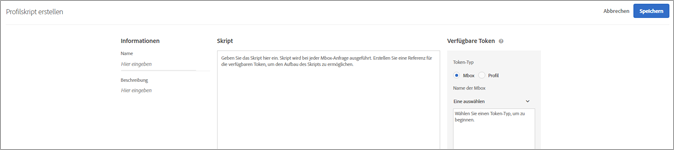

# Profilattribute{#profile-attributes}

Profilattribute sind Parameter, die für einen Besucher spezifisch sind. Diese Attribute werden im Besucherprofil gespeichert, um Informationen über den Besucher bereitzustellen, der in Ihren Aktivitäten verwendet werden kann.

Wenn ein Besucher Ihre Website durchsucht oder wenn der Besucher zu einer weiteren Sitzung zurückkehrt, können die gespeicherten Profilattribute verwendet werden, um Inhalte oder Protokollinformationen für die Segmentfilterung abzuzielen.

Klicken Sie zum Einrichten von Profilattributen auf **[!UICONTROL Zielgruppen]** &gt; **[!UICONTROL Profilskripte]**.


Die folgenden Typen von Profilattributen sind verfügbar:

| Parametertyp | Beschreibung |
|--- |--- |
| mbox | Direkt über den Seiten-Code beim Erstellen der Mbox weitergegeben Siehe [Übergeben von Parametern an eine globale Mbox](/help/c-implementing-target/c-implementing-target-for-client-side-web/t-mbox-download/c-understanding-global-mbox/pass-parameters-to-global-mbox.md).<br>**** Hinweis: Target erlaubt pro Mbox-Aufruf maximal 50 eindeutige Profilattribute. Wenn Sie mehr als 50 Profilattribute an Target übergeben müssen, können Sie hierzu die API-Methode Profilupdate nutzen. Weitere Informationen finden Sie unter [Profilupdate in der Dokumentation zur Adobe Target-API](http://developers.adobetarget.com/api/#updating-profiles). |
| Skript | Direkt mit einem JavaScript-Codebeispiel definiert. Mit diesen können laufende Gesamtsummen wie das insgesamt vom Kunden ausgegebene Geld gespeichert werden. Die Skripte können bei jeder Mbox-Anfrage ausgeführt werden. Siehe Profilskriptattribute unten. |

## Profilskriptattribute {#concept_8C07AEAB0A144FECA8B4FEB091AED4D2}

Definieren Sie ein Profilskriptattribut mit dem zu diesem gehörigen JavaScript-Code-Snippet.

Mithilfe von Profilskripten können Sie Besucherattribute über mehrere Besuche hinweg erfassen. Profilskripte sind Code-Snippets, die in Target festgelegt werden und eine Form serverseitigen JavaScript verwenden. Beispielsweise könnten Sie ein Profilskript verwenden, um aufzuzeichnen, wie oft ein Besucher auf Ihre Seite kommt und wann er sie zuletzt aufgerufen hat.

Profilskripte sind nicht das Gleiche wie Profilparameter. Profilparameter zeichnen mit der Implementierung des Mbox-Codes von Target Benutzerdaten auf.

>[!NOTE]
>
>[!DNL Target] hat maximal 1.000 Profilskripte pro Konto.

## Profilskripte erstellen {#section_CB02F8B97CAF407DA84F7591A7504810}

Profilskripte sind in der Registerkarte [!UICONTROL Zielgruppen] in der Oberfläche von [!DNL Target] zu finden.

Um ein neues Profilskript hinzuzufügen, klicken Sie auf die Registerkarte **[!UICONTROL Profilskripte]**, **[!UICONTROL Skript erstellen]** und schreiben Sie dann das Skript.

Oder

Um ein vorhandenes Profilskript zu kopieren, halten Sie in der Liste [!UICONTROL Profilskripte] den Mauszeiger über das gewünschte Skript und klicken Sie dann auf das **[!UICONTROL Kopiersymbol]**: (assets/icon_copy.png)

Sie können die Zielgruppe anschließend bearbeiten, um eine ähnliche Zielgruppe zu erstellen.



Profilskripte führen Profilattribut-„Fänger“ bei jeder Ortsanforderung aus. Beim Empfang einer Ortsanforderung bestimmt Target, welche Aktivität ausgeführt werden soll, und zeigt den für diese Aktivität und das Erlebnis geeigneten Inhalt an. Das Programm verfolgt den Erfolg der Aktivität und führt relevante Profilskripte aus. Auf diese Weise können Sie Informationen über den Besuch erfassen, z. B. Ort, Tageszeit und Anzahl der Besuche auf der Site, ob zuvor ein Kauf getätigt wurde usw. Diese Informationen werden dann zum Benutzerprofil hinzugefügt, sodass Sie die Besucheraktivitäten auf Ihrer Site besser verfolgen können.

Profilskriptattribute haben das `user.`-Tag vor dem Attributnamen eingefügt. Beispiel:

```
if (mbox.name == 'Track_Interest') { 
    if (profile.get('model') == "A5" &&; profile.get('subcat') == "KS6") { 
        return (user.get('A5KS6') || 0) + 1; 
    } 
}
```

* Siehe Profilskriptattribute (auch das im Code enthaltene) im Code mit `user.get('parameterName')`.
* Speichern Sie Variablen, die beim nächsten Ausführen des Skripts (bei der nächsten mbox-Anfrage) aufgerufen werden könnten, mit `user.setLocal('variable_name', 'value')`. Verweisen Sie auf die Variable mit `user.getLocal('variable_name')`. Dies ist hilfreich in Situationen, in denen Sie einen Verweis für Datum und Uhrzeit der letzten Anfrage setzen möchten.
* Bei Parametern und Werten wird zwischen Groß- und Kleinschreibung unterschieden. Berücksichtigen Sie den Fall der Parameter und Werte, die Sie während der Aktivität oder des Tests empfangen werden.
* Weitere JavaScript-Syntax finden Sie im Abschnitt „JavaScript-Referenz für Skript-Profilparameter“.

## Anzeigen der Karten mit Profilskriptinformationen {#section_18EA3B919A8E49BBB09AA9215E1E3F17}

Sie können Popupkarten mit Profilskriptinformationen (ähnlich den Karten mit Angebotsinformationen) anzeigen. Auf diesen Karten mit Profilskriptinformationen können Sie die Liste der Aktivitäten, die auf das ausgewählte Profilskript verweisen, sowie weitere nützliche Metadaten anzeigen.

Sie können beispielsweise auf folgende Karte mit Profilskriptinformationen zugreifen, indem Sie in der Liste mit Profilskripten (Zielgruppen &gt; Profilskripte) mit dem Mauszeiger über ein Profilskript fahren und auf das Informationssymbol klicken.

Die Registerkarte [!UICONTROL Skriptinformationen] enthält folgende Informationen: Name, Status, Token-Typ, Skript-ID, Änderungsprotokoll und Beschreibung.


Die Registerkarte [!UICONTROL Nutzung von Skripten] enthält die Aktivitäten (und ihre Arbeitsbereiche), die auf das ausgewählte Profilskript verweisen.


>[!Note]
>
>Auf der Registerkarte „Skriptnutzung“ werden keine Aktivitäten angezeigt, die auf das ausgewählte Profilskript in den folgenden Situationen verweisen:
> * Die Aktivität befindet sich im Entwurfsstatus.
> * Die in der Aktivität verwendeten Inhalte oder Angebote verwenden Skriptvariablen (entweder ein Inline-Angebot innerhalb der Aktivität oder ein Angebot in der Angebotsbibliothek).


## Target deaktiviert in bestimmten Situationen Profilskripte {#section_C0FCB702E60D4576AD1174D39FBBE1A7}

[!DNL Target] deaktiviert in bestimmten Situationen automatisch Profilskripte, beispielsweise wenn diese für die Ausführung zu lang sind oder über zu viele Anweisungen verfügen.

Wird ein Profilskript deaktiviert, erscheint in der Target-Benutzeroberfläche neben dem betroffenen Skript ein gelbes Warnsymbol, wie unten dargestellt:


Halten Sie den Mauszeiger darüber, werden Fehlerdetails angezeigt, wie unten dargestellt:


Typische Gründe für die Deaktivierung von Profilskripten durch das System sind unter anderem folgende:

* Es wird eine nicht definierte Variable referenziert.
* Ein ungültiger Wert wird referenziert. Dies geschieht häufig aufgrund des Bezugs auf URL-Werte und andere vom Benutzer eingegebene Daten, die nicht ordnungsgemäß validiert wurden.
* Zu viele JavaScript-Anweisungen wurden verwendet. Target verfügt über einen Maximalwert von 2.000 JavaScript-Anweisungen pro Skript, die Anzahl kann jedoch nicht einfach durch manuelles Lesen des JavaScript bestimmt werden. Rhino beispielsweise behandelt alle Funktionsaufrufe und „neuen“ Aufrufe als 100 Anweisungen. Außerdem kann sich die Größe der eingegebenen Daten (beispielsweise der URL-Werte) auf die Anzahl der Anweisungen auswirken.
* Nichtbefolgen der unten beschriebenen [Best Practices](../../c-target/c-visitor-profile/profile-parameters.md#section_64AFE5D2B0C8408A912FC2A832B3AAE0).

## Best Practices{#section_64AFE5D2B0C8408A912FC2A832B3AAE0}.

Die folgenden Richtlinien helfen Ihnen dabei, vereinfachte Profilskripte zu verfassen, die möglichst fehlerfrei sind. Sie können Code schreiben, der so fehlschlägt, dass die Skripts ohne erzwungenes Beenden des Skripts durch das System verarbeitet werden. Diese Leitlinien sind das Ergebnis der Best Practices, die für eine effiziente Funktionsweise nachgewiesen wurden. Diese Richtlinien gelten neben den Grundsätzen und Empfehlungen der Rhino-Entwicklungsgemeinde.

* Setzen Sie den aktuellen Skriptwert auf eine lokale Variable im Benutzerskript, und legen Sie einen Failover im leeren String fest.
* Validieren Sie die lokale Variable, indem Sie sicherstellen, dass sie kein leerer String ist.
* Verwenden Sie die stringbasierten Manipulationsfunktionen oder regulären Ausdrücke.
* Verwenden Sie limited for- bzw. open ended for-Schleifen oder while-Schleifen.
* Halten Sie die Vorgabe von maximal 1.300 Zeichen bzw. 50 Schleifeniterationen ein.
* Überschreiten Sie nicht die Maximalzahl von 2.000 JavaScript-Anweisungen. Target verfügt über einen Maximalwert von 2.000 JavaScript-Anweisungen pro Skript, die Anzahl kann jedoch nicht einfach durch manuelles Lesen des JavaScript bestimmt werden. Rhino beispielsweise behandelt alle Funktionsaufrufe und „neuen“ Aufrufe als 100 Anweisungen. Außerdem kann sich die Größe der eingegebenen Daten (beispielsweise der URL-Werte) auf die Anzahl der Anweisungen auswirken.
* Berücksichtigen Sie nicht nur die individuelle Skriptperformance, sondern auch die Performance aller Skripte. Als Best Practice empfehlen wir insgesamt weniger als 5.000 Anweisungen. Sie müssen jedoch nicht die einzelnen Anweisungen zählen, sondern nur beachten, dass Skripte mit einer Größe von über 2 KB automatisch deaktiviert werden. Es gibt keine feste Grenze für die Anzahl ausgeführter Skripte, jedoch wird jedes Skript mit jedem einzelnen Mbox-Aufruf ausgeführt. Führen Sie also nur so viele Skripte aus wie nötig.
* Schlägt alles fehl, verpacken Sie das Skript in einer try/catch-Anweisung.
* Weitere Informationen finden Sie in der JS Rhino Engine-Dokumentation: [https://www.mozilla.org/rhino/doc.html](https://www.mozilla.org/rhino/doc.html).

## Profilskripte zum Testen von sich gegenseitig ausschließenden Aktivitäten {#section_FEFE50ACA6694DE7BF1893F2EFA96C01}

Mithilfe von Profilattributen können Sie Tests zum Vergleich mehrerer Aktivitäten einrichten, an denen jeweils unterschiedliche Besucher teilnehmen.

Hierdurch wird verhindert, dass ein Besucher einer Aktivität die Testergebnisse der anderen Aktivitäten beeinflusst. Wenn ein Besucher an mehreren Aktivitäten teilnimmt, ist es oft schwierig festzustellen, ob die positiven oder negativen Änderungen auf das Erlebnis des Besuchers in einer Aktivität zurückzuführen sind oder ob die Ergebnisse einer oder mehrerer Aktivitäten durch die Interaktionen zwischen den Aktivitäten beeinflusst wurden.

So können Sie zum Beispiel zwei Bereiche Ihres E-Commerce-Systems testen. Vielleicht möchten Sie testen, welche Auswirkungen die Änderung der Farbe der Schaltfläche „Zum Warenkorb hinzufügen“ von blau auf rot hat. Vielleicht möchten Sie einen neuen Checkout-Prozess testen, der anstelle von fünf nur noch aus zwei Schritten besteht. Wenn bei beiden Aktivitäten das Erfolgserlebnis gleich ist (ein getätigter Kauf), ist es womöglich schwierig festzustellen, ob die Konversionsverbesserungen auf die rote Schaltfläche oder den optimierten Checkout-Prozess zurückzuführen sind. Durch Trennung der Tests in zwei sich gegenseitig ausschließende Aktivitäten können Sie jede Veränderung einzeln prüfen.

Beachten Sie die folgenden Informationen, wenn Sie eines der folgenden Profilskripte verwenden:

* Das Profilskript muss ausgeführt werden, bevor die Aktivität gestartet wird, und das Skript muss unverändert bleiben, während die Aktivität ausgeführt wird.
* Durch diese Methode wird die Traffic-Menge in der Aktivität reduziert, wodurch die Aktivität möglicherweise länger ausgeführt wird. Sie müssen diesen Umstand berücksichtigen, wenn Sie die Dauer der Aktivität schätzen.

### Einrichten von zwei Aktivitäten

Zur Einteilung von Besuchern in Gruppen, denen unterschiedliche Aktivitäten angezeigt werden, müssen Sie ein Profilattribut erstellen. Mit einem Profilattribut lassen sich Besucher auf mehrere Gruppen verteilen. Zur Einrichtung des Profilattributs „twogroups“ erstellen Sie folgendes Skript:

```
if (!user.get('twogroups')) { 
    var ran_number = Math.floor(Math.random() * 99); 
    if (ran_number < = 49) { 
        return 'GroupA'; 
    } else { 
        return 'GroupB'; 
    } 
}
```

`if (!user.get('twogroups'))` bestimmt, ob das Profilattribut *twogroups* für den aktuellen Besucher eingerichtet ist. Falls ja, sind keine weiteren Aktionen erforderlich.

`var ran_number=Math.floor(Math.random() *99)` bezeichnet eine neue Variable namens „ran_number“, legt ihren Wert auf eine Zufallsdezimalzahl zwischen 0 und 1 fest, multipliziert diese mit 99 und rundet sie ab, um einen Bereich von 100 (0–99) zu erstellen. Dies ist nützlich zur Angabe des Prozentsatzes von Besuchern, welche die Aktivität sehen.

`if (ran_number <= 49)` beginnt mit einer Routine, die bestimmt, zu welcher Gruppe der Besucher gehört. Wird eine Zahl zwischen 0 und 49 ausgegeben, wird der Besucher Gruppe A zugewiesen. Wird eine Zahl zwischen 50 und 99 ausgegeben, wird der Besucher Gruppe B zugewiesen. Welche Aktivität der Besucher angezeigt bekommt, wird durch seine Gruppenzugehörigkeit bestimmt.

Nachdem Sie das Profilattribut erstellt haben, richten Sie das Targeting der ersten Aktivität auf die gewünschte Population aus, indem Sie die Anforderung aufstellen, dass der Benutzerprofilparameter „user.twogroups“ dem für Gruppe A festgelegten Wert entspricht.

>[!NOTE]
>
>Wählen Sie am Seitenanfang eine Mbox aus. Durch den Code wird festgelegt, ob einem Benutzer die Kampagne angezeigt wird. Solange zuerst beim Browser eine Mbox auftritt, kann sie zum Festlegen dieses Werts verwendet werden.

Richten Sie die zweite Kampagne so ein, dass der Benutzerprofilparameter `user.twogroups` dem für Gruppe B festgelegten Wert entspricht.

### Einrichten von drei oder mehr Aktivitäten

Die Einrichtung von drei oder mehr Aktivitäten unterscheidet sich nicht wesentlich von der Einrichtung zweier Aktivitäten. Sie müssen jedoch das Profilattribut „JavaScript“ ändern, um eine separate Gruppe für jede Aktivität einzurichten und festzulegen, wem eine Aktivität angezeigt wird. Die Erzeugung von Zufallszahlen ist unterschiedlich. Sie hängt davon ab, ob Sie eine gerade oder ungerade Zahl an Gruppen erstellen.

Zum Erstellen von vier Gruppen verwenden Sie z. B. folgendes JavaScript:

```
if (!user.get('fourgroups')) { 
    var ran_number = Math.floor​(Math.random() * 99); 
    if (ran_number < = 24) { 
        return 'GroupA'; 
    } else if (ran_number < = 49) { 
        return 'GroupB'; 
    } else if (ran_number < = 74) { 
        return 'GroupC'; 
    } else { 
        return 'GroupD'; 
    } 
}
```

In diesen Beispiel wird die Zufallszahl, nach der ein Besucher einer Gruppe zugewiesen wird, nach dem gleichen Prinzip berechnet wie bei zwei Gruppen: Es wird eine Zufallszahl erzeugt, die dann auf eine Ganzzahl abgerundet wird.

Wenn Sie eine ungerade Anzahl an Gruppen erstellen, oder wenn 100 geteilt durch die Anzahl keine Ganzzahl ergibt, sollten Sie die Dezimalstellen nicht auf eine Ganzzahl runden. Durch das Nichtrunden der Dezimalstellen können Sie auch nicht ganzzahlige Bereiche festlegen. Sie können dies durch Änderung folgender Zeile erreichen:

`var ran_number=Math.floor(Math.random()*99);`

an:

`var ran_number=Math.random()*99;`

Zur Aufteilung der Besucher in drei gleiche Gruppen verwenden Sie beispielsweise folgenden Code:

```
if (!user.get('threegroups')) { 
    var ran_number = Math.random() * 99; 
    if (ran_number < = 32.33) { 
        return 'GroupA'; 
    } else if (ran_number < = 65.66) { 
        return 'GroupB'; 
    } else { 
        return 'GroupC'; 
    } 
}
```

## Profilskripte debuggen {#section_E9F933DE47EC4B4E9AF2463B181CE2DA}

Folgende Methoden können Sie zum Debugging von Profilskripten verwenden:

>[!NOTE]
>
>Die Verwendung von [!DNL console.log] in einem Profilskript gibt den Profilwert nicht aus, da Profilskripte serverseitig ausgeführt werden.

* **Profilskripte als Antworttoken hinzufügen, um Profilskripte zu debuggen:**

   Klicken Sie in Target auf **[!UICONTROL Einstellungen]**, klicken Sie auf **[!UICONTROL Antworttoken]** und aktivieren Sie dann das Profilskript, das Sie debuggen möchten.

   Jedes Mal, wenn Sie eine Seite Ihrer Site laden, die Target enthält, enthält die Antwort von Target wie unten gezeigt Ihren Wert für das entsprechende Profilskript:

   

* **mboxTrace-Debugging-Tool verwenden, um Profilskripte zu debuggen:**

   Diese Methode erfordert ein Autorisierungstoken, das Sie durch Klicken auf **[!UICONTROL Target]** &gt; **[!UICONTROL Einstellungen]** &gt; **[!UICONTROL Implementierung]** &gt; **[!UICONTROL Autorisierungstoken generieren]** erstellen können.

   Fügen Sie anschließend diese beiden Parameter Ihrer Seiten-URL nach dem „?“ hinzu: `mboxTrace=window&authorization=YOURTOKEN`.

   Dieses Token enthält etwas mehr Informationen als das Antworttoken, da Sie hiermit einen Snapshot Ihres Profils vor und nach der Ausführung erhalten. Darüber hinaus enthält es all Ihre verfügbaren Profile.

   

## Häufig gestellte Fragen zu Profilskripten {#section_1389497BB6D84FC38958AE43AAA6E712}

**Kann ich mit Profilskripten Informationen von einer Seite erfassen, die sich im Daten-Layer befindet?**

Profilskripte können die Seite nicht direkt lesen, da sie serverseitig ausgeführt werden. Die Daten müssen über eine Mbox-Anfrage oder andere [Verfahren für die Datenübernahme in Target](../../c-implementing-target/c-considerations-before-you-implement-target/c-methods-to-get-data-into-target/methods-to-get-data-into-target.md#concept_0069C0EFB56C4700BB33F2F35C2B9B17) übergeben werden. Sobald die Daten in Target verfügbar sind, können sie von Profilskripten als Mbox- oder Profil-Parameter ausgelesen werden.

## JavaScript-Referenz für Skript-Profilparameter

Einfache JavaScript-Kenntnisse sind erforderlich, um Skript-Profilparameter effektiv
zu verwenden. Dieser Abschnitt dient als kurze Referenz, um Sie in wenigen Minuten mit dieser Funktionalität vertraut zu machen.

Skript-Profilparameter befinden sich auf der Registerkarte „mboxes/profile“. Sie können Javascript-Programme schreiben, die einen beliebigen Javascript-Typ (Zeichenfolge, Ganzzahl, Array usw.) zurückgeben.

### Beispiele für Skript-Profilparameter

**Name:***user.recency*

```
var dayInMillis = 3600 * 24 * 1000;
if (mbox.name == 'orderThankyouPage') {
    user.setLocal('lastPurchaseTime', new Date().getTime());
}
var lastPurchaseTime = user.getLocal('lastPurchaseTime');
if (lastPurchaseTime) {
    return ((new Date()).getTime() - lastPurchaseTime) / dayInMillis;
}
```

Erstellt eine Variable für den Tag in Millisekunden. Wenn der mbox-Name `orderThankyouPage` lautet, legen Sie ein lokales (unsichtbares) Benutzerprofilattribut mit dem Namen `lastPurchaseTime` des aktuellen Datums und der aktuellen Uhrzeit fest. Der Wert der letzten Kaufzeit wird gelesen. Wenn definiert, geben wir die Zeit zurück, die seit der letzten Kaufzeit vergangen ist, dividiert durch die Anzahl der Millisekunden an einem Tag (was zu der Anzahl der Tage seit dem letzten Kauf führt).

**Name:** *user.frequency*

```
var frequency = user.get('frequency') || 0;
if (mbox.name == 'orderThankyouPage') {
    return frequency + 1;
}
```

Erstellt eine Variable namens „frequency“ und initialisiert sie entweder für den vorherigen Wert oder 0, wenn kein vorheriger Wert vorhanden war. Wenn der mbox-Name `orderThankyouPage` lautet, wird der inkrementierte Wert zurückgegeben.

**Name:***user.monetaryvalue*

```
var monetaryValue = user.get('monetaryValue') || 0;
if (mbox.name == 'orderThankyouPage') {
    return monetaryValue + parseInt(mbox.param('orderTotal'));
}
```

Erstellt eine Variable namens `monetaryValue`, die den aktuellen Wert für einen bestimmten Besucher ermittelt (oder auf 0 setzt, wenn kein vorheriger Wert vorhanden war). Wenn der mbox-Name `orderThankyouPage` lautet, wird der neue Geldwert zurückgegeben, indem der vorherige und der Wert des an die Mbox übergebenen `orderTotal` Parameters hinzugefügt werden.

### Objekte und Methoden

Die folgenden Eigenschaften und Methoden können durch Skript-Profilparameter referenziert werden:

| Objekt oder Methode | Details |
| --- | --- |
| `page.url` | Die aktuelle URL |
| `page.protocol` | Das für die Seite verwendete Protokoll (http oder https). |
| page.domain | Die aktuelle URL-Domäne (alles vor dem ersten Schrägstrich). Zum Beispiel `www.acme.com` in `http://www.acme.com/categories/men_jeans?color=blu e&size=small`. |
| `page.query` | Die Abfragezeichenfolge für die aktuelle Seite. Alles nach dem „?“. Zum Beispiel `blue&size=small` in `http://www.acme.com/categories/mens_jeans?color=blue&size=small` |
| `page.param(‘<par_name>’)` | Der durch `<par_name>` angegebene Wert des Parameters. Wenn Ihre aktuelle URL die Google-Suchseite ist und Sie `page.param('hl')` eingegeben haben, erhalten Sie „en“ für die URL `http://www.google.com/search?hl=en& q=what+is+asdf&btnG=Google+Search`. |
| `page.referrer` | Derselbe Satz an Vorgängen wie oben wird für Referrer und Landingpage angewendet (d. h. referrer.url ist die URL-Adresse des Referrers). |
| `landing.url`, `landing.protocol`, `landing.query`, und `landing.param` | Ähnlich wie die Seite, aber für die Landingpage. |
| `mbox.name` | Der Name der aktiven Mbox. |
| `mbox.param(‘<par_name>’)` | Ein mbox-Parameter nach dem angegebenen Namen in der aktiven Mbox. |
| `profile.get(‘<par_name>’)` | Der vom Kunden erstellte Benutzerprofilparameter durch den Namen `<par_name>`. Wenn der Benutzer z. B. einen Profilparameter namens „Gender“ festgelegt hat, kann der Wert mit „profile.gender“ extrahiert werden. Gibt den Wert des Werts „`profile.<par_name>`“ für den aktuellen Besucher zurück; gibt null zurück, wenn kein Wert festgelegt wurde. |
| `user.get(‘<par_name>’)` | Gibt den Wert des Werts „`user.<par_name>`“ für den aktuellen Besucher zurück; gibt null zurück, wenn kein Wert festgelegt wurde. |
| `user.categoryAffinity` | Gibt den Namen der besten Kategorie zurück. |
| `user.categoryAffinities` | Gibt ein Array mit den besten Kategorien zurück. |
| `user.isFirstSession` | Gibt „true“ zurück, wenn es die erste Sitzung des Besuchers ist. |
| `user.browser` | Gibt den Benutzeragenten im HTTP-Header zurück. Beispielsweise können Sie ein Ausdrucksziel erstellen, um nur Safari-Benutzer als Ziel auszuwählen: `if (user.browser != null && user.browser.indexOf('Safari') != -1) { return true; }` |

### Allgemeine Operatoren


Alle standardmäßigen JavaScript-Operatoren sind vorhanden und können verwendet werden. JavaScript-Operatoren können für Zeichenfolgen und Zahlen (sowie andere Datentypen) verwendet werden. Ein schnelles Briefing:

| Operator | Beschreibung |
| --- | --- |
| `==` | Gibt Gleichheit an. Behält den Wert „true“ bei, wenn Operanden auf beiden Seiten gleich sind. |
| `!=` | Gibt Ungleichheit an. Behält den Wert „true“ bei, wenn Operanden auf beiden Seiten nicht gleich sind. |
| `<` | Gibt an, dass die Variable auf der linken Seite kleiner als die Variable auf der rechten Seite ist. Wird als „falsch“ bewertet, wenn die Variablen gleich sind. |
| `>` | Gibt an, dass die Variable auf der linken Seite größer als die Variable auf der rechten Seite ist. Wird als „falsch“ bewertet, wenn die Variablen gleich sind. |
| `<=` | Gleich `<`, außer wenn die Variablen gleich sind, dann wird sie als „true“ ausgewertet. |
| `>=` | Gleich `>`, außer wenn die Variablen gleich sind, dann wird sie als „true“ ausgewertet. |
| `&&` | Fügt die Ausdrücke links und rechts daneben logisch mit „ANDs“ zusammen, nur „true“, wenn beide Seiten true sind (andernfalls „false“). |
| `||` | Fügt die Ausdrücke links und rechts daneben logisch mit „ORs“ zusammen, nur „true“, wenn beide Seiten true sind (andernfalls „false“). |
| `//` | Prüft, ob die Quelle alle Elemente aus dem Booleschen Zielwert enthält (Array-Quelle, Array-Ziel).<br>`//` extrahiert Unterzeichenfolge aus dem Ziel (entspricht regexp) und dekodiert sie`Array/*String*/ decode(String encoding, String regexp, String target)`.<br>Die Funktion unterstützt auch die Verwendung konstanter Zeichenfolgenwerte, Gruppierung (`condition1 || condition2) && condition3` und reguläre Ausdrücke `/[^a-z]$/.test(landing.referring.url)`). |

## Schulungsvideo: Profilskripte

In diesem Video erfahren Sie, wie Profilskripte erstellt und verwendet werden.

* Erläuterung von Profilskripten
* Erläuterung der Unterschiede zwischen Profilskripten und Profilparametern
* Erstellen eines einfachen Profilskripts
* Verwenden des Menüs „Verfügbare Token“ für den Zugriff auf verfügbare Optionen
* Aktivieren und Deaktivieren von Profilskripten

>[!VIDEO](https://video.tv.adobe.com/v/17394?captions=ger)