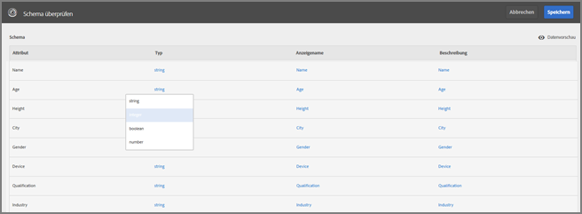
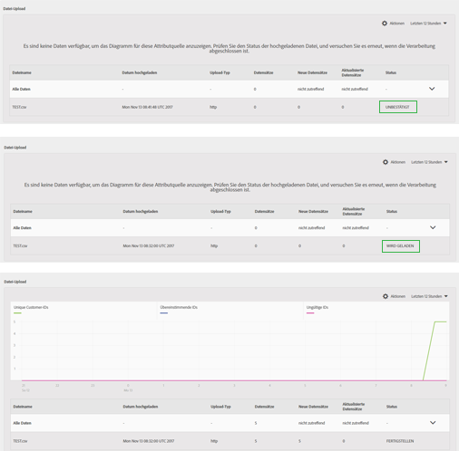
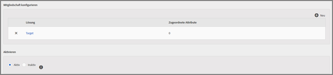

# Kundenattribute{#customer-attributes}

Informationen zum Verwenden von Unternehmenskundendaten aus einer Customer Relationship Management-Datenbank für das Targeting von Inhalten in Adobe Target mithilfe von Kundenattributen im Adobe Core-Service „Profile und Zielgruppen“.

Über mehrere Quellen gesammelte und in einer CRM-Datenbank gespeicherte Unternehmenskundendaten können in [!DNL Target] verwendet werden, um die relevantesten Inhalte strategisch für Kunden bereitzustellen, insbesondere mit dem Schwerpunkt auf Bestandskunden. Im Core-Service [!DNL People] (früher „Profile und Zielgruppen“) kommen zu Erfassung und Analyse von Daten Tests und Optimierung hinzu, um die Umsetzbarkeit von Daten und Insights zu gewährleisten.

## Übersicht über Kundenattribute {#section_B4099971FA4B48598294C56EAE86B45A}

Der Hauptdienst „People“ ist Teil von [!DNL Adobe Experience Cloud] und bietet Unternehmen ein Tool, um ihre Kundendaten auf die [!DNL Experience Cloud]-Plattform zu übertragen. In [!DNL Experience Cloud] integrierte Daten sind für alle [!DNL Experience Cloud]-Workflows verfügbar. [!DNL Adobe Target] nutzt diese Daten für das Targeting von Bestandskunden basierend auf Attributen. [!DNL Adobe Analytics] verwendet diese Attribute, und sie können für die Analyse und Segmentierung herangezogen werden.


Beachten Sie beim Arbeiten mit Kundenattributen und Target die folgenden Informationen:

* Sie müssen einige Voraussetzungen erfüllen, bevor Sie die Funktion [!UICONTROL Kundenattribute] im Core-Service [!DNL People] verwenden können. Weitere Informationen finden Sie unter „Voraussetzungen zum Hochladen von Kundenattributen“ im Thema [Kundenattribute](https://marketing.adobe.com/resources/help/en_US/mcloud/attributes.html) der *Produktdokumentation zu Experience Cloud und zu Core Services*. Beachten Sie, dass [!DNL at.js] (beliebige Version) oder [!DNL mbox.js], Version 58 oder neuer erforderlich ist.
* Adobe kann nicht garantieren, dass 100 % der Kundenattribut (Besucherprofil)-Daten aus CRM-Datenbanken in die Experience Cloud integriert werden und somit für die Targeting-Verwendung in Target verfügbar sind. In unserem aktuellen Design besteht die Möglichkeit, dass ein geringer Prozentsatz der Daten nicht integriert wird.
* Die Lebensdauer der aus der Experience Cloud in Target importierten Kundenattributdaten ist von der Lebensdauer des Besucherprofils abhängig, die standardmäßig 14 Tage beträgt. Weitere Informationen finden Sie unter [Lebensdauer des Besucherprofils](../../c-target/c-visitor-profile/visitor-profile-lifetime.md#concept_D9F21B416F1F49159F03036BA2DD54FD).
* Wenn die `vst.*`-Parameter das Einzige sind, was den Benutzer identifiziert, wird das vorhandene „authentifizierte“ Profil nicht abgerufen, solange `authState` UNAUTHENTICATED (0) ist. Das Profil kommt nur ins Spiel, wenn `authState` in UNAUTHENTICATED (1) geändert wird.

   Wenn beispielsweise der Parameter `vst.myDataSource.id` verwendet wird, um den Benutzer zu identifizieren (wobei `myDataSource` der Aliasname für die Datenquelle ist), und es keine MCID oder Drittanbieter-ID gibt, ruft die Verwendung des Parameters `vst.myDataSource.authState=0` nicht das Profil auf, das möglicherweise durch einen Kundenattribut-Import erstellt wurde. Wenn das gewünschte Verhalten darin bestehen soll, das authentifizierte Profil aufzurufen, muss `vst.myDataSource.authState` den Wert 1 (AUTHENTICATED) haben.

* Folgende Zeichen können nicht gesendet `mbox3rdPartyID`werden: Plus-Zeichen (+) und Schrägstrich (/).

## Kundenattribut-Arbeitsablauf für Target {#section_00DAE94DA9BA41398B6FD170BC7D38A3}

Führen Sie die folgenden Schritte aus, um CRM-Daten in [!DNL Target] zu verwenden, wie unten dargestellt:


Detaillierte Anweisungen zum Ausführen der einzelnen Aufgaben finden Sie unter [Erstellen einer Kundenattributquelle und Hochladen der Datendatei](https://marketing.adobe.com/resources/help/en_US/mcloud/t_crs_usecase.html) in der *Produktdokumentation zu Experience Cloud und zu Core Services*.

1. Erstellen einer Datendatei.

   Exportieren Sie Kundendaten aus Ihrem CRM-System in das CSV-Format, um eine [!DNL .csv]-Datei zu erstellen. Alternativ kann eine ZIP- oder GZIP-Datei für den Upload erstellt werden. Stellen Sie sicher, dass die erste Zeile der CSV-Daten dem Header entspricht und dass für alle Zeilen (Kundendaten) dieselbe Anzahl Einträge vorliegt.

   

   

1. Erstellen der Attributquelle und Hochladen der Datendatei.

   Geben Sie einen Namen und eine Beschreibung der Datenquelle und die Alias-ID an. Die Alias-ID ist eine eindeutige ID, die im Kundenattribut-Code in VisitorAPI.js verwendet wird.

   >[!IMPORTANT]
   >
   >Der Name der Datenquelle und der Attributname dürfen keinen Punkt enthalten.

   Mithilfe der HTTP-Methode können Datendateien mit einer Größe von bis zu 100 MB hochgeladen werden. Größere Dateien zwischen 100 MB und 4 GB können per FTP hochgeladen werden.

   * **HTTPS:** Sie können die [!DNL .csv] Datendatei per Drag &amp; Drop verschieben oder auf [!UICONTROL Durchsuchen] klicken, um sie aus Ihrem Dateisystem hochzuladen.
   * **FTP:** Klicken Sie auf den FTP-Link, um die [Datei per FTP hochzuladen](https://marketing.adobe.com/resources/help/en_US/mcloud/t_upload_attributes_ftp.html). Der erste Schritt besteht darin, ein Kennwort für den von Adobe bereitgestellten FTP-Server anzugeben. Geben Sie das Kennwort ein und klicken Sie dann auf [!UICONTROL Fertig].

      Übertragen Sie nun Ihre CSV-/ZIP-/GZIP-Datei auf den FTP-Server. Sobald diese Dateiübertragung erfolgreich ist, erstellen Sie eine neue Datei mit demselben Namen und derselben [!DNL .fin]-Erweiterung. Übertragen Sie diese leere Datei auf den Server. Dies gibt das Ende der Übertragung an, und die Experience Cloud beginnt mit dem Verarbeiten der Datendatei.

1. Prüfen des Schemas.

   Der Prüfungsprozess ermöglicht die Zuordnung von Anzeigenamen und Beschreibungen zu den hochgeladenen Attributen (Zeichenfolgen, Ganzzahlen, Zahlen usw.). Ordnen Sie die einzelnen Attribute dem jeweils korrekten Datentyp und Anzeigenamen und der korrekten Beschreibung zu.

   Klicken Sie nach Abschluss der Schemavalidierung auf [!UICONTROL Speichern]. Die Zeit für den Datei-Upload variiert je nach Größe.

   

   

1. Konfigurieren von Abonnements und Aktivieren der Attributquelle.

   Klicken Sie auf **[!UICONTROL Abonnement hinzufügen]** und wählen Sie die Lösung zum Abonnieren dieser Attribute aus. Der Datenfluss zwischen der Experience Cloud und Lösungen wird durch die [Konfiguration eines Abonnements](https://marketing.adobe.com/resources/help/en_US/mcloud/subscription.html) eingerichtet. Durch die Aktivierung der Attributquelle können die Daten an die abonnierten Lösungen übertragen werden. Die von Ihnen hochgeladenen Kundendatensätze werden mit den von Ihrer Website oder Anwendung eingehenden ID-Signalen abgeglichen.

   

   

   Beachten Sie beim Ausführen dieses Schritts die folgenden Einschränkungen:

   * Die maximale Dateigröße pro Upload mithilfe der HTTP-Methode beträgt 100 MB.
   * Die maximale Dateigröße pro Upload mithilfe der FTP-Methode beträgt 4 GB.
   * Die Anzahl der zum Abonnieren zulässigen Attribute: 5 für [!DNL Target Standard] und 200 für [!DNL Target Premium].

## Verwenden von Kundenattributen in Target {#section_107E3A0F0EC7478E82E6DBD17B30B756}

Sie können Kundenattribute in [!DNL Target] wie folgt verwenden:

### Erstellen von Targeting-Zielgruppen

In [!DNL Target] können Sie beim Erstellen einer Zielgruppe im Bereich Besucherprofil ein Kundenattribut auswählen. Alle Kundenattribute haben das Präfix &lt; data_ source_ name &gt; in der Liste. Sie können die Attribute beim Aufbau von Zielgruppen beliebig mit anderen Datenattributen kombinieren.


### Erstellen von Profilskripten mithilfe von Token

Kundenattribute können in Profilskripten mithilfe des Formats `crs.get('<Datasource Name>.<Attribute name>')` referenziert werden.

Dieses Profilskript kann direkt in Angeboten verwendet werden, um Attribute bereitzustellen, die zum aktuellen Besucher gehören.

### Verwenden von mbox3rdPartyID auf Ihrer Website für eine erfolgreiche Implementierung und Verwendung

Geben Sie Mbox3rdPartyID als Parameter an die globale Mbox innerhalb der Methode `targetPageParams()` weiter. Der Wert von mbox3rdPartyId sollte auf die Kunden-ID in der CSV-Datendatei festgelegt werden.

```
<script type="text/javascript">
            function targetPageParams() {
               return 'mbox3rdPartyId=2000578';
            }
</script>
```

### Verwenden des Experience Cloud ID-Service

Wenn Sie den Experience Cloud ID-Service verwenden, müssen Sie eine Kunden-ID und einen Authentifizierungsstatus festlegen, um Kundenattribute im Targeting zu verwenden. Weitere Informationen finden Sie im Abschnitt zu [Kunden-IDs und Authentifizierungsstatus](https://marketing.adobe.com/resources/help/en_US/mcvid/mcvid-authenticated-state.html) in der *Dokumentation zum Experience Cloud ID-Service*.

Weitere Informationen zum Verwenden von Kundenattributen in [!DNL Target] finden Sie unter den folgenden Ressourcen:

* [Erstellen einer Kundenattributquelle und Hochladen der Datendatei](https://marketing.adobe.com/resources/help/en_US/mcloud/t_crs_usecase.html) in der *Produktdokumentation zu Experience Cloud und zu Core Services*
* [Kundenattribute: Je mehr Details, desto besser die Verbindung](https://blogs.adobe.com/digitalmarketing/analytics/customer-attributes-know-better-connect/) im *Digital Marketing-Blog*

## Häufig von Kunden erkannte Probleme {#section_BE0F70E563F64294B17087DE2BC1E74C}

Beim Arbeiten mit Kundenattributen und [!DNL Target] stoßen Sie möglicherweise auf die folgenden Probleme:

| Fehler | Details |
|--- |--- |
| Kundenattribute werden entfernt, weil das Profil zu groß ist | Es gibt zwar keine Zeichenbeschränkung für ein bestimmtes Feld im Profil des Benutzers, wenn das Profil jedoch umfangreicher als 64 K ist, wird es durch Entfernen der ältesten Attribute so lange abgeschnitten, bis das Profil wieder kleiner als 64 K ist. |
| Attribute werden nicht in der Zielgruppenbibliothek in [!DNL Target] aufgelistet, selbst nach mehreren Tagen nicht | Dies ist normalerweise ein Pipeline-Verbindungsproblem. Bitten Sie zur Lösung das Kundenattribute-Team, den Feed erneut zu veröffentlichen. |
| Auf dem Attribut basierende Bereitstellung funktioniert nicht | Das Profil wurde in Edge noch nicht aktualisiert. Bitten Sie zur Lösung das Kundenattribute-Team, den Feed erneut zu veröffentlichen. |
| Implementierungsprobleme | Beachten Sie die folgenden Implementierungsprobleme:<ul><li>Die Besucher-ID wurde nicht korrekt übergeben. Die ID wurde in mboxMCGVID statt in `setCustomerId` übergeben.</li><li>Die Besucher-ID wurde korrekt übergeben, aber der Status der AUTHENTIFIZIERUNG wurde nicht auf „Authentifiziert“ festgelegt.</li><li>`mbox3rdPartyId` wurde nicht korrekt weitergeleitet.</li> |
| `mboxUpdate` wurde nicht ordnungsgemäß durchgeführt | mboxUpdate wurde nicht ordnungsgemäß mit `mbox3rdPartyId` ausgeführt. |
| Kundenattribute werden nicht in Target importiert. | Wenn in Target keine Kundenattributdaten gefunden werden können, stellen Sie sicher, dass der Import innerhalb der letzten x Tage erfolgte, wobei x der Wert für den [Lebenszyklusprofilwert](/help/c-target/c-visitor-profile/visitor-profile-lifetime.md) von Target (standardmäßig 14 Tage) ist. |

Probleme in den Zeilen 1 und 2 oben verursachen ca. 60 % der Probleme in diesem Bereich. Probleme in Zeile 3 verursachen ca. 30 % der Probleme. Das Problem in Zeile 4 ist die Ursache für ca. 5 % der Probleme. Die restlichen 5 % werden durch verschiedene andere Ursachen hervorgerufen.

## Schulungsvideo: Hochladen von Offline-Daten mithilfe von Kundenattributen {#section_9A4E0FA0D0934D06BD8D5BFA673E9BD8}

Dieses Video zeigt, wie Sie Offline-CRM-, Helpdesk-, Point-of-Sale- und andere Marketingdaten in den People-Service der Experience Cloud importieren und sie Besuchern anhand ihrer IDs zuordnen können.

>[!VIDEO](https://video.tv.adobe.com/v/17802t1/)
